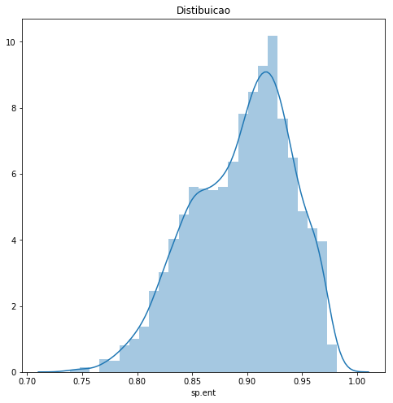
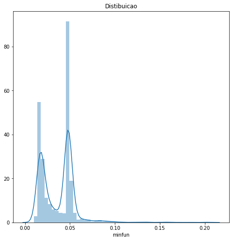
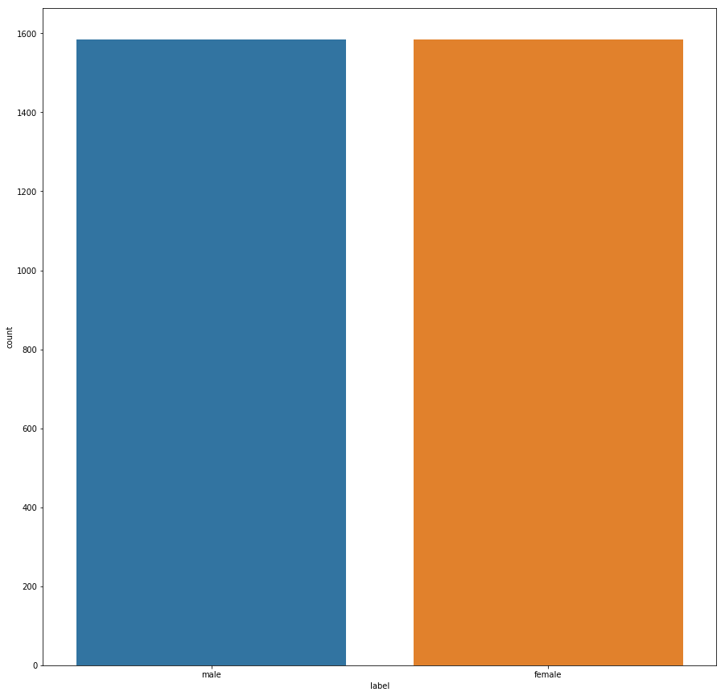

# Analise exploratória.
### Introdução.
Este Jupyter Notebook investiga a base de dados de  propriedades acústicas disponíveis no site  http://www.primaryobjects.com/2016/06/22/identifying-the-gender-of-a-voice-using-machine-learning/   
Objetivo da investigação é determinar as chances de algum algoritmo para detecção de gênero, seja por estatística tradicional ou por meio técnicas machine learning e redes neurais, possibilitando a implantação em dispositivos embarcados de baixo custo de memória e processamento restrito. 

# Propriedades acústicas medidas

As seguintes propriedades acústicas de cada voz são medidas:

- **meanfreq**  : frequência média (em kHz) sobre as amostras compostas no sinal de arquivo de voz;
- **sd**  : desvio padrão da frequência, sobre as amostras compostas no sinal de arquivo de voz;
- **mediana**  : frequência mediana (em kHz) sobre as amostras compostas no sinal de arquivo de voz;
- **Q25**  : primeiro quantil (em kHz) sobre as amostras compostas no sinal de arquivo de voz;
- **Q75**  : terceiro quantil (em kHz) sobre as amostras compostas no sinal de arquivo de voz;
- **IQR**  : intervalo interquartil (em kHz)sobre as amostras compostas no sinal de arquivo de voz;
- **skew**  : média de assimetria da distribuição das frequências de vocal perdominante;
- **kurt**  : curtose distribuição espectral da voz, domínio da frequência;
- **sp.ent**  : entropia espectral, pureza da distribuição da voz em relação ao nível de ruído; 
- **sfm**  : nivelamento espectral,  estima a planaridade de um espectro de frequência;
- **modo**  : frequência de modo, ou seja, frequência dominante da voz;
- **centrod**  : frequência central máxima visto no domínio da frequência;
- **meanfun**  : média da frequência fundamental medida através do sinal acústico (Tonalidade base da voz);
- **minfun**  : frequência fundamental mínima medida no sinal acústico  (Tonalidade base da voz);
- **maxfun**  : frequência fundamental máxima medida através do sinal acústico (Tonalidade base da voz);
- **meandom**  : média da frequência dominante medida através do sinal acústico  (média total das notas  musicais mais graves da voz em relação ao sinal gravado);
- **mindom**  : mínimo de frequência dominante medido através do sinal acústico;
- **maxdom**  : máxima da frequência dominante medida através do sinal acústico;
- **dfrange**  : faixa de frequência dominante medida através do sinal acústico;
- **modindx**  : índice de modulação. Calculado como a diferença absoluta acumulada entre medições adjacentes de frequências fundamentais divididas pela faixa de frequência.
- **label**  : rotulo de identificador da amostra em relação ao sexo, adicionado durante a gravação "male" ou "female".


# Analise em python da base de propriedades acústicas.


```python
%matplotlib inline
```


```python
# Importa as bibliotecas
import pandas
import matplotlib.pyplot as plt
import numpy 
#from pandas.tools.plotting import scatter_matrix
from  pandas.plotting  import scatter_matrix
import seaborn as sb
```


```python
# Carrega os dados
url = ".\\baseDados\\voice.csv"
colunas = ["meanfreq","sd","median","Q25","Q75","IQR","skew","kurt","sp.ent","sfm","mode","centroid","meanfun","minfun","maxfun","meandom","mindom","maxdom","dfrange","modindx","label"]
dataset = pandas.read_csv(url, names=colunas, sep = ",")
```


```python
# PANDAS: Verificando alguns dados
exemplos = dataset.head(2)
print(exemplos)


```

       meanfreq        sd    median       Q25       Q75       IQR       skew  \
    0  0.059781  0.064241  0.032027  0.015071  0.090193  0.075122  12.863462   
    1  0.066009  0.067310  0.040229  0.019414  0.092666  0.073252  22.423285   
    
             kurt    sp.ent       sfm  ...    centroid   meanfun    minfun  \
    0  274.402906  0.893369  0.491918  ...    0.059781  0.084279  0.015702   
    1  634.613855  0.892193  0.513724  ...    0.066009  0.107937  0.015826   
    
         maxfun   meandom    mindom    maxdom   dfrange   modindx  label  
    0  0.275862  0.007812  0.007812  0.007812  0.000000  0.000000   male  
    1  0.250000  0.009014  0.007812  0.054688  0.046875  0.052632   male  
    
    [2 rows x 21 columns]


```python
dataset.head()
```


<div>
<style scoped>
    .dataframe tbody tr th:only-of-type {
        vertical-align: middle;
    }

    .dataframe tbody tr th {
        vertical-align: top;
    }
    
    .dataframe thead th {
        text-align: right;
    }
</style>
<table border="1" class="dataframe">
  <thead>
    <tr style="text-align: right;">
      <th></th>
      <th>meanfreq</th>
      <th>sd</th>
      <th>median</th>
      <th>Q25</th>
      <th>Q75</th>
      <th>IQR</th>
      <th>skew</th>
      <th>kurt</th>
      <th>sp.ent</th>
      <th>sfm</th>
      <th>...</th>
      <th>centroid</th>
      <th>meanfun</th>
      <th>minfun</th>
      <th>maxfun</th>
      <th>meandom</th>
      <th>mindom</th>
      <th>maxdom</th>
      <th>dfrange</th>
      <th>modindx</th>
      <th>label</th>
    </tr>
  </thead>
  <tbody>
    <tr>
      <th>0</th>
      <td>0.059781</td>
      <td>0.064241</td>
      <td>0.032027</td>
      <td>0.015071</td>
      <td>0.090193</td>
      <td>0.075122</td>
      <td>12.863462</td>
      <td>274.402906</td>
      <td>0.893369</td>
      <td>0.491918</td>
      <td>...</td>
      <td>0.059781</td>
      <td>0.084279</td>
      <td>0.015702</td>
      <td>0.275862</td>
      <td>0.007812</td>
      <td>0.007812</td>
      <td>0.007812</td>
      <td>0.000000</td>
      <td>0.000000</td>
      <td>male</td>
    </tr>
    <tr>
      <th>1</th>
      <td>0.066009</td>
      <td>0.067310</td>
      <td>0.040229</td>
      <td>0.019414</td>
      <td>0.092666</td>
      <td>0.073252</td>
      <td>22.423285</td>
      <td>634.613855</td>
      <td>0.892193</td>
      <td>0.513724</td>
      <td>...</td>
      <td>0.066009</td>
      <td>0.107937</td>
      <td>0.015826</td>
      <td>0.250000</td>
      <td>0.009014</td>
      <td>0.007812</td>
      <td>0.054688</td>
      <td>0.046875</td>
      <td>0.052632</td>
      <td>male</td>
    </tr>
    <tr>
      <th>2</th>
      <td>0.077316</td>
      <td>0.083829</td>
      <td>0.036718</td>
      <td>0.008701</td>
      <td>0.131908</td>
      <td>0.123207</td>
      <td>30.757155</td>
      <td>1024.927705</td>
      <td>0.846389</td>
      <td>0.478905</td>
      <td>...</td>
      <td>0.077316</td>
      <td>0.098706</td>
      <td>0.015656</td>
      <td>0.271186</td>
      <td>0.007990</td>
      <td>0.007812</td>
      <td>0.015625</td>
      <td>0.007812</td>
      <td>0.046512</td>
      <td>male</td>
    </tr>
    <tr>
      <th>3</th>
      <td>0.151228</td>
      <td>0.072111</td>
      <td>0.158011</td>
      <td>0.096582</td>
      <td>0.207955</td>
      <td>0.111374</td>
      <td>1.232831</td>
      <td>4.177296</td>
      <td>0.963322</td>
      <td>0.727232</td>
      <td>...</td>
      <td>0.151228</td>
      <td>0.088965</td>
      <td>0.017798</td>
      <td>0.250000</td>
      <td>0.201497</td>
      <td>0.007812</td>
      <td>0.562500</td>
      <td>0.554688</td>
      <td>0.247119</td>
      <td>male</td>
    </tr>
    <tr>
      <th>4</th>
      <td>0.135120</td>
      <td>0.079146</td>
      <td>0.124656</td>
      <td>0.078720</td>
      <td>0.206045</td>
      <td>0.127325</td>
      <td>1.101174</td>
      <td>4.333713</td>
      <td>0.971955</td>
      <td>0.783568</td>
      <td>...</td>
      <td>0.135120</td>
      <td>0.106398</td>
      <td>0.016931</td>
      <td>0.266667</td>
      <td>0.712812</td>
      <td>0.007812</td>
      <td>5.484375</td>
      <td>5.476562</td>
      <td>0.208274</td>
      <td>male</td>
    </tr>
  </tbody>
</table>
<p>5 rows × 21 columns</p>
</div>


```python
dataset.tail()
exemplos = dataset.tail(2)
print(exemplos)

```

          meanfreq        sd    median       Q25       Q75       IQR      skew  \
    3166  0.143659  0.090628  0.184976  0.043508  0.219943  0.176435  1.591065   
    3167  0.165509  0.092884  0.183044  0.070072  0.250827  0.180756  1.705029   
    
              kurt    sp.ent       sfm   ...    centroid   meanfun    minfun  \
    3166  5.388298  0.950436  0.675470   ...    0.143659  0.172375  0.034483   
    3167  5.769115  0.938829  0.601529   ...    0.165509  0.185607  0.062257   
    
            maxfun   meandom    mindom    maxdom   dfrange   modindx   label  
    3166  0.250000  0.791360  0.007812  3.593750  3.585938  0.311002  female  
    3167  0.271186  0.227022  0.007812  0.554688  0.546875  0.350000  female  
    
    [2 rows x 21 columns]


# Verifica valores nulos.


```python
dfnull = dataset.isnull()
```


```python
dfnull.head(3)
```


<div>
<style scoped>
    .dataframe tbody tr th:only-of-type {
        vertical-align: middle;
    }

    .dataframe tbody tr th {
        vertical-align: top;
    }
    
    .dataframe thead th {
        text-align: right;
    }
</style>
<table border="1" class="dataframe">
  <thead>
    <tr style="text-align: right;">
      <th></th>
      <th>meanfreq</th>
      <th>sd</th>
      <th>median</th>
      <th>Q25</th>
      <th>Q75</th>
      <th>IQR</th>
      <th>skew</th>
      <th>kurt</th>
      <th>sp.ent</th>
      <th>sfm</th>
      <th>...</th>
      <th>centroid</th>
      <th>meanfun</th>
      <th>minfun</th>
      <th>maxfun</th>
      <th>meandom</th>
      <th>mindom</th>
      <th>maxdom</th>
      <th>dfrange</th>
      <th>modindx</th>
      <th>label</th>
    </tr>
  </thead>
  <tbody>
    <tr>
      <th>0</th>
      <td>False</td>
      <td>False</td>
      <td>False</td>
      <td>False</td>
      <td>False</td>
      <td>False</td>
      <td>False</td>
      <td>False</td>
      <td>False</td>
      <td>False</td>
      <td>...</td>
      <td>False</td>
      <td>False</td>
      <td>False</td>
      <td>False</td>
      <td>False</td>
      <td>False</td>
      <td>False</td>
      <td>False</td>
      <td>False</td>
      <td>False</td>
    </tr>
    <tr>
      <th>1</th>
      <td>False</td>
      <td>False</td>
      <td>False</td>
      <td>False</td>
      <td>False</td>
      <td>False</td>
      <td>False</td>
      <td>False</td>
      <td>False</td>
      <td>False</td>
      <td>...</td>
      <td>False</td>
      <td>False</td>
      <td>False</td>
      <td>False</td>
      <td>False</td>
      <td>False</td>
      <td>False</td>
      <td>False</td>
      <td>False</td>
      <td>False</td>
    </tr>
    <tr>
      <th>2</th>
      <td>False</td>
      <td>False</td>
      <td>False</td>
      <td>False</td>
      <td>False</td>
      <td>False</td>
      <td>False</td>
      <td>False</td>
      <td>False</td>
      <td>False</td>
      <td>...</td>
      <td>False</td>
      <td>False</td>
      <td>False</td>
      <td>False</td>
      <td>False</td>
      <td>False</td>
      <td>False</td>
      <td>False</td>
      <td>False</td>
      <td>False</td>
    </tr>
  </tbody>
</table>
<p>3 rows × 21 columns</p>
</div>


```python
dfnull.isnull().sum()
```


    meanfreq    0
    sd          0
    median      0
    Q25         0
    Q75         0
    IQR         0
    skew        0
    kurt        0
    sp.ent      0
    sfm         0
    mode        0
    centroid    0
    meanfun     0
    minfun      0
    maxfun      0
    meandom     0
    mindom      0
    maxdom      0
    dfrange     0
    modindx     0
    label       0
    dtype: int64


## Gerando gráfico com valores nulos.


```python
#!pip install missingno
#!pip3 install missingno


import missingno as msno
msno.matrix(dataset,figsize=(12,5))
```


    <matplotlib.axes._subplots.AxesSubplot at 0x13a93730>


## Compara a dimensão da tabela original com nova tabela onde foi removidos os elementos nulos.


```python
dfnull.dropna()
print(dfnull.shape)
```

    (3168, 21)


```python
# PANDAS: Verifica a dimensão dos dados (linhas, colunas)
dim = dataset.shape
print(dim)
```

    (3168, 21)


### Tabela sem elementos nulos tem  a mesma dimenssão da tabela original, portanto a base não possui valores nulos.

# Verifica os tipos de dados de cada atributo


```python
dataset.info()
```

    <class 'pandas.core.frame.DataFrame'>
    RangeIndex: 3168 entries, 0 to 3167
    Data columns (total 21 columns):
    meanfreq    3168 non-null float64
    sd          3168 non-null float64
    median      3168 non-null float64
    Q25         3168 non-null float64
    Q75         3168 non-null float64
    IQR         3168 non-null float64
    skew        3168 non-null float64
    kurt        3168 non-null float64
    sp.ent      3168 non-null float64
    sfm         3168 non-null float64
    mode        3168 non-null float64
    centroid    3168 non-null float64
    meanfun     3168 non-null float64
    minfun      3168 non-null float64
    maxfun      3168 non-null float64
    meandom     3168 non-null float64
    mindom      3168 non-null float64
    maxdom      3168 non-null float64
    dfrange     3168 non-null float64
    modindx     3168 non-null float64
    label       3168 non-null object
    dtypes: float64(20), object(1)
    memory usage: 507.4+ KB


## PANDAS: Verifica os tipos de dados de cada atributo.


```python
tipos = dataset.dtypes
print(tipos)

```

    meanfreq    float64
    sd          float64
    median      float64
    Q25         float64
    Q75         float64
    IQR         float64
    skew        float64
    kurt        float64
    sp.ent      float64
    sfm         float64
    mode        float64
    centroid    float64
    meanfun     float64
    minfun      float64
    maxfun      float64
    meandom     float64
    mindom      float64
    maxdom      float64
    dfrange     float64
    modindx     float64
    label        object
    dtype: object


# Estatística descritiva


```python
dataset.describe()
```


<div>
<style scoped>
    .dataframe tbody tr th:only-of-type {
        vertical-align: middle;
    }

    .dataframe tbody tr th {
        vertical-align: top;
    }
    
    .dataframe thead th {
        text-align: right;
    }
</style>
<table border="1" class="dataframe">
  <thead>
    <tr style="text-align: right;">
      <th></th>
      <th>meanfreq</th>
      <th>sd</th>
      <th>median</th>
      <th>Q25</th>
      <th>Q75</th>
      <th>IQR</th>
      <th>skew</th>
      <th>kurt</th>
      <th>sp.ent</th>
      <th>sfm</th>
      <th>mode</th>
      <th>centroid</th>
      <th>meanfun</th>
      <th>minfun</th>
      <th>maxfun</th>
      <th>meandom</th>
      <th>mindom</th>
      <th>maxdom</th>
      <th>dfrange</th>
      <th>modindx</th>
    </tr>
  </thead>
  <tbody>
    <tr>
      <th>count</th>
      <td>3168.000000</td>
      <td>3168.000000</td>
      <td>3168.000000</td>
      <td>3168.000000</td>
      <td>3168.000000</td>
      <td>3168.000000</td>
      <td>3168.000000</td>
      <td>3168.000000</td>
      <td>3168.000000</td>
      <td>3168.000000</td>
      <td>3168.000000</td>
      <td>3168.000000</td>
      <td>3168.000000</td>
      <td>3168.000000</td>
      <td>3168.000000</td>
      <td>3168.000000</td>
      <td>3168.000000</td>
      <td>3168.000000</td>
      <td>3168.000000</td>
      <td>3168.000000</td>
    </tr>
    <tr>
      <th>mean</th>
      <td>0.180907</td>
      <td>0.057126</td>
      <td>0.185621</td>
      <td>0.140456</td>
      <td>0.224765</td>
      <td>0.084309</td>
      <td>3.140168</td>
      <td>36.568461</td>
      <td>0.895127</td>
      <td>0.408216</td>
      <td>0.165282</td>
      <td>0.180907</td>
      <td>0.142807</td>
      <td>0.036802</td>
      <td>0.258842</td>
      <td>0.829211</td>
      <td>0.052647</td>
      <td>5.047277</td>
      <td>4.994630</td>
      <td>0.173752</td>
    </tr>
    <tr>
      <th>std</th>
      <td>0.029918</td>
      <td>0.016652</td>
      <td>0.036360</td>
      <td>0.048680</td>
      <td>0.023639</td>
      <td>0.042783</td>
      <td>4.240529</td>
      <td>134.928661</td>
      <td>0.044980</td>
      <td>0.177521</td>
      <td>0.077203</td>
      <td>0.029918</td>
      <td>0.032304</td>
      <td>0.019220</td>
      <td>0.030077</td>
      <td>0.525205</td>
      <td>0.063299</td>
      <td>3.521157</td>
      <td>3.520039</td>
      <td>0.119454</td>
    </tr>
    <tr>
      <th>min</th>
      <td>0.039363</td>
      <td>0.018363</td>
      <td>0.010975</td>
      <td>0.000229</td>
      <td>0.042946</td>
      <td>0.014558</td>
      <td>0.141735</td>
      <td>2.068455</td>
      <td>0.738651</td>
      <td>0.036876</td>
      <td>0.000000</td>
      <td>0.039363</td>
      <td>0.055565</td>
      <td>0.009775</td>
      <td>0.103093</td>
      <td>0.007812</td>
      <td>0.004883</td>
      <td>0.007812</td>
      <td>0.000000</td>
      <td>0.000000</td>
    </tr>
    <tr>
      <th>25%</th>
      <td>0.163662</td>
      <td>0.041954</td>
      <td>0.169593</td>
      <td>0.111087</td>
      <td>0.208747</td>
      <td>0.042560</td>
      <td>1.649569</td>
      <td>5.669547</td>
      <td>0.861811</td>
      <td>0.258041</td>
      <td>0.118016</td>
      <td>0.163662</td>
      <td>0.116998</td>
      <td>0.018223</td>
      <td>0.253968</td>
      <td>0.419828</td>
      <td>0.007812</td>
      <td>2.070312</td>
      <td>2.044922</td>
      <td>0.099766</td>
    </tr>
    <tr>
      <th>50%</th>
      <td>0.184838</td>
      <td>0.059155</td>
      <td>0.190032</td>
      <td>0.140286</td>
      <td>0.225684</td>
      <td>0.094280</td>
      <td>2.197101</td>
      <td>8.318463</td>
      <td>0.901767</td>
      <td>0.396335</td>
      <td>0.186599</td>
      <td>0.184838</td>
      <td>0.140519</td>
      <td>0.046110</td>
      <td>0.271186</td>
      <td>0.765795</td>
      <td>0.023438</td>
      <td>4.992188</td>
      <td>4.945312</td>
      <td>0.139357</td>
    </tr>
    <tr>
      <th>75%</th>
      <td>0.199146</td>
      <td>0.067020</td>
      <td>0.210618</td>
      <td>0.175939</td>
      <td>0.243660</td>
      <td>0.114175</td>
      <td>2.931694</td>
      <td>13.648905</td>
      <td>0.928713</td>
      <td>0.533676</td>
      <td>0.221104</td>
      <td>0.199146</td>
      <td>0.169581</td>
      <td>0.047904</td>
      <td>0.277457</td>
      <td>1.177166</td>
      <td>0.070312</td>
      <td>7.007812</td>
      <td>6.992188</td>
      <td>0.209183</td>
    </tr>
    <tr>
      <th>max</th>
      <td>0.251124</td>
      <td>0.115273</td>
      <td>0.261224</td>
      <td>0.247347</td>
      <td>0.273469</td>
      <td>0.252225</td>
      <td>34.725453</td>
      <td>1309.612887</td>
      <td>0.981997</td>
      <td>0.842936</td>
      <td>0.280000</td>
      <td>0.251124</td>
      <td>0.237636</td>
      <td>0.204082</td>
      <td>0.279114</td>
      <td>2.957682</td>
      <td>0.458984</td>
      <td>21.867188</td>
      <td>21.843750</td>
      <td>0.932374</td>
    </tr>
  </tbody>
</table>
</div>


## Pandas: Estatística descritiva


```python

pandas.set_option('display.width', 100)
pandas.set_option('precision', 3)
resultado = dataset.describe()
print(resultado)
```

           meanfreq        sd    median        Q25       Q75       IQR      skew      kurt    sp.ent  \
    count  3168.000  3168.000  3168.000  3.168e+03  3168.000  3168.000  3168.000  3168.000  3168.000   
    mean      0.181     0.057     0.186  1.405e-01     0.225     0.084     3.140    36.568     0.895   
    std       0.030     0.017     0.036  4.868e-02     0.024     0.043     4.241   134.929     0.045   
    min       0.039     0.018     0.011  2.288e-04     0.043     0.015     0.142     2.068     0.739   
    25%       0.164     0.042     0.170  1.111e-01     0.209     0.043     1.650     5.670     0.862   
    50%       0.185     0.059     0.190  1.403e-01     0.226     0.094     2.197     8.318     0.902   
    75%       0.199     0.067     0.211  1.759e-01     0.244     0.114     2.932    13.649     0.929   
    max       0.251     0.115     0.261  2.473e-01     0.273     0.252    34.725  1309.613     0.982   
    
                sfm      mode  centroid   meanfun    minfun    maxfun   meandom    mindom    maxdom  \
    count  3168.000  3168.000  3168.000  3168.000  3168.000  3168.000  3168.000  3168.000  3168.000   
    mean      0.408     0.165     0.181     0.143     0.037     0.259     0.829     0.053     5.047   
    std       0.178     0.077     0.030     0.032     0.019     0.030     0.525     0.063     3.521   
    min       0.037     0.000     0.039     0.056     0.010     0.103     0.008     0.005     0.008   
    25%       0.258     0.118     0.164     0.117     0.018     0.254     0.420     0.008     2.070   
    50%       0.396     0.187     0.185     0.141     0.046     0.271     0.766     0.023     4.992   
    75%       0.534     0.221     0.199     0.170     0.048     0.277     1.177     0.070     7.008   
    max       0.843     0.280     0.251     0.238     0.204     0.279     2.958     0.459    21.867   
    
            dfrange   modindx  
    count  3168.000  3168.000  
    mean      4.995     0.174  
    std       3.520     0.119  
    min       0.000     0.000  
    25%       2.045     0.100  
    50%       4.945     0.139  
    75%       6.992     0.209  
    max      21.844     0.932  


```python
dataset.describe().transpose()

```


<div>
<style scoped>
    .dataframe tbody tr th:only-of-type {
        vertical-align: middle;
    }

    .dataframe tbody tr th {
        vertical-align: top;
    }
    
    .dataframe thead th {
        text-align: right;
    }
</style>
<table border="1" class="dataframe">
  <thead>
    <tr style="text-align: right;">
      <th></th>
      <th>count</th>
      <th>mean</th>
      <th>std</th>
      <th>min</th>
      <th>25%</th>
      <th>50%</th>
      <th>75%</th>
      <th>max</th>
    </tr>
  </thead>
  <tbody>
    <tr>
      <th>meanfreq</th>
      <td>3168.0</td>
      <td>0.181</td>
      <td>0.030</td>
      <td>3.936e-02</td>
      <td>0.164</td>
      <td>0.185</td>
      <td>0.199</td>
      <td>0.251</td>
    </tr>
    <tr>
      <th>sd</th>
      <td>3168.0</td>
      <td>0.057</td>
      <td>0.017</td>
      <td>1.836e-02</td>
      <td>0.042</td>
      <td>0.059</td>
      <td>0.067</td>
      <td>0.115</td>
    </tr>
    <tr>
      <th>median</th>
      <td>3168.0</td>
      <td>0.186</td>
      <td>0.036</td>
      <td>1.097e-02</td>
      <td>0.170</td>
      <td>0.190</td>
      <td>0.211</td>
      <td>0.261</td>
    </tr>
    <tr>
      <th>Q25</th>
      <td>3168.0</td>
      <td>0.140</td>
      <td>0.049</td>
      <td>2.288e-04</td>
      <td>0.111</td>
      <td>0.140</td>
      <td>0.176</td>
      <td>0.247</td>
    </tr>
    <tr>
      <th>Q75</th>
      <td>3168.0</td>
      <td>0.225</td>
      <td>0.024</td>
      <td>4.295e-02</td>
      <td>0.209</td>
      <td>0.226</td>
      <td>0.244</td>
      <td>0.273</td>
    </tr>
    <tr>
      <th>IQR</th>
      <td>3168.0</td>
      <td>0.084</td>
      <td>0.043</td>
      <td>1.456e-02</td>
      <td>0.043</td>
      <td>0.094</td>
      <td>0.114</td>
      <td>0.252</td>
    </tr>
    <tr>
      <th>skew</th>
      <td>3168.0</td>
      <td>3.140</td>
      <td>4.241</td>
      <td>1.417e-01</td>
      <td>1.650</td>
      <td>2.197</td>
      <td>2.932</td>
      <td>34.725</td>
    </tr>
    <tr>
      <th>kurt</th>
      <td>3168.0</td>
      <td>36.568</td>
      <td>134.929</td>
      <td>2.068e+00</td>
      <td>5.670</td>
      <td>8.318</td>
      <td>13.649</td>
      <td>1309.613</td>
    </tr>
    <tr>
      <th>sp.ent</th>
      <td>3168.0</td>
      <td>0.895</td>
      <td>0.045</td>
      <td>7.387e-01</td>
      <td>0.862</td>
      <td>0.902</td>
      <td>0.929</td>
      <td>0.982</td>
    </tr>
    <tr>
      <th>sfm</th>
      <td>3168.0</td>
      <td>0.408</td>
      <td>0.178</td>
      <td>3.688e-02</td>
      <td>0.258</td>
      <td>0.396</td>
      <td>0.534</td>
      <td>0.843</td>
    </tr>
    <tr>
      <th>mode</th>
      <td>3168.0</td>
      <td>0.165</td>
      <td>0.077</td>
      <td>0.000e+00</td>
      <td>0.118</td>
      <td>0.187</td>
      <td>0.221</td>
      <td>0.280</td>
    </tr>
    <tr>
      <th>centroid</th>
      <td>3168.0</td>
      <td>0.181</td>
      <td>0.030</td>
      <td>3.936e-02</td>
      <td>0.164</td>
      <td>0.185</td>
      <td>0.199</td>
      <td>0.251</td>
    </tr>
    <tr>
      <th>meanfun</th>
      <td>3168.0</td>
      <td>0.143</td>
      <td>0.032</td>
      <td>5.557e-02</td>
      <td>0.117</td>
      <td>0.141</td>
      <td>0.170</td>
      <td>0.238</td>
    </tr>
    <tr>
      <th>minfun</th>
      <td>3168.0</td>
      <td>0.037</td>
      <td>0.019</td>
      <td>9.775e-03</td>
      <td>0.018</td>
      <td>0.046</td>
      <td>0.048</td>
      <td>0.204</td>
    </tr>
    <tr>
      <th>maxfun</th>
      <td>3168.0</td>
      <td>0.259</td>
      <td>0.030</td>
      <td>1.031e-01</td>
      <td>0.254</td>
      <td>0.271</td>
      <td>0.277</td>
      <td>0.279</td>
    </tr>
    <tr>
      <th>meandom</th>
      <td>3168.0</td>
      <td>0.829</td>
      <td>0.525</td>
      <td>7.812e-03</td>
      <td>0.420</td>
      <td>0.766</td>
      <td>1.177</td>
      <td>2.958</td>
    </tr>
    <tr>
      <th>mindom</th>
      <td>3168.0</td>
      <td>0.053</td>
      <td>0.063</td>
      <td>4.883e-03</td>
      <td>0.008</td>
      <td>0.023</td>
      <td>0.070</td>
      <td>0.459</td>
    </tr>
    <tr>
      <th>maxdom</th>
      <td>3168.0</td>
      <td>5.047</td>
      <td>3.521</td>
      <td>7.812e-03</td>
      <td>2.070</td>
      <td>4.992</td>
      <td>7.008</td>
      <td>21.867</td>
    </tr>
    <tr>
      <th>dfrange</th>
      <td>3168.0</td>
      <td>4.995</td>
      <td>3.520</td>
      <td>0.000e+00</td>
      <td>2.045</td>
      <td>4.945</td>
      <td>6.992</td>
      <td>21.844</td>
    </tr>
    <tr>
      <th>modindx</th>
      <td>3168.0</td>
      <td>0.174</td>
      <td>0.119</td>
      <td>0.000e+00</td>
      <td>0.100</td>
      <td>0.139</td>
      <td>0.209</td>
      <td>0.932</td>
    </tr>
  </tbody>
</table>
</div>


```python
print(dataset.describe().transpose())
```

               count    mean      std        min    25%    50%     75%       max
    meanfreq  3168.0   0.181    0.030  3.936e-02  0.164  0.185   0.199     0.251
    sd        3168.0   0.057    0.017  1.836e-02  0.042  0.059   0.067     0.115
    median    3168.0   0.186    0.036  1.097e-02  0.170  0.190   0.211     0.261
    Q25       3168.0   0.140    0.049  2.288e-04  0.111  0.140   0.176     0.247
    Q75       3168.0   0.225    0.024  4.295e-02  0.209  0.226   0.244     0.273
    IQR       3168.0   0.084    0.043  1.456e-02  0.043  0.094   0.114     0.252
    skew      3168.0   3.140    4.241  1.417e-01  1.650  2.197   2.932    34.725
    kurt      3168.0  36.568  134.929  2.068e+00  5.670  8.318  13.649  1309.613
    sp.ent    3168.0   0.895    0.045  7.387e-01  0.862  0.902   0.929     0.982
    sfm       3168.0   0.408    0.178  3.688e-02  0.258  0.396   0.534     0.843
    mode      3168.0   0.165    0.077  0.000e+00  0.118  0.187   0.221     0.280
    centroid  3168.0   0.181    0.030  3.936e-02  0.164  0.185   0.199     0.251
    meanfun   3168.0   0.143    0.032  5.557e-02  0.117  0.141   0.170     0.238
    minfun    3168.0   0.037    0.019  9.775e-03  0.018  0.046   0.048     0.204
    maxfun    3168.0   0.259    0.030  1.031e-01  0.254  0.271   0.277     0.279
    meandom   3168.0   0.829    0.525  7.812e-03  0.420  0.766   1.177     2.958
    mindom    3168.0   0.053    0.063  4.883e-03  0.008  0.023   0.070     0.459
    maxdom    3168.0   5.047    3.521  7.812e-03  2.070  4.992   7.008    21.867
    dfrange   3168.0   4.995    3.520  0.000e+00  2.045  4.945   6.992    21.844
    modindx   3168.0   0.174    0.119  0.000e+00  0.100  0.139   0.209     0.932


# Variáveis Categóricas


```python
contagem = dataset.groupby('label').size()
print(contagem)
```

    label
    female    1584
    male      1584
    dtype: int64


```python
sb.countplot('label',data=dataset)
plt.rcParams['figure.figsize'] = (10,5)
plt.show()
```


### Em nossos dados exitem apenas um variável *label* que é  Qualitativa Nominal sendo que demais são do tipo Quantitativa Contínua


```python
dataset.dtypes
A = str(tipos)
A = A.replace('float64',"Qualitativa Nominal")
A = A.replace('object',"Quantitativa Contínua")

print(A)
```

    meanfreq    Qualitativa Nominal
    sd          Qualitativa Nominal
    median      Qualitativa Nominal
    Q25         Qualitativa Nominal
    Q75         Qualitativa Nominal
    IQR         Qualitativa Nominal
    skew        Qualitativa Nominal
    kurt        Qualitativa Nominal
    sp.ent      Qualitativa Nominal
    sfm         Qualitativa Nominal
    mode        Qualitativa Nominal
    centroid    Qualitativa Nominal
    meanfun     Qualitativa Nominal
    minfun      Qualitativa Nominal
    maxfun      Qualitativa Nominal
    meandom     Qualitativa Nominal
    mindom      Qualitativa Nominal
    maxdom      Qualitativa Nominal
    dfrange     Qualitativa Nominal
    modindx     Qualitativa Nominal
    label        Quantitativa Contínua
    dtype: Quantitativa Contínua


# Medidas Resumo Variáveis Quantitativas:

## MEDIDAS DE POSIÇÃO: Moda, Média, Mediana, Percentís, Quartis.

##### Voltado na tabela  temos:
##### MEDIDAS DE POSIÇÃO, já  estão calculados na tabelas *describe* Media , Percentís, Quartis 
##### Faltando calcular  a Moda e  Mediana  sabendo  a Mediana e a mesma medias Na colunaE o valor da coluna  **50%** da tabela.

A média é uma medida de tendência central que indica o valor onde estão concentrados os dados de um conjunto de valores, representando um valor significativo para o mesmo.

A mediana é o valor que separa a metade superior da metade inferior de uma distribuição de dados, ou o valor no centro da distribuição.

A moda é simples. Nada mais é que o valor que mais se repete dentro de um conjunto.


```python
dataset.describe().transpose()
```


<div>
<style scoped>
    .dataframe tbody tr th:only-of-type {
        vertical-align: middle;
    }

    .dataframe tbody tr th {
        vertical-align: top;
    }
    
    .dataframe thead th {
        text-align: right;
    }
</style>
<table border="1" class="dataframe">
  <thead>
    <tr style="text-align: right;">
      <th></th>
      <th>count</th>
      <th>mean</th>
      <th>std</th>
      <th>min</th>
      <th>25%</th>
      <th>50%</th>
      <th>75%</th>
      <th>max</th>
    </tr>
  </thead>
  <tbody>
    <tr>
      <th>meanfreq</th>
      <td>3168.0</td>
      <td>0.181</td>
      <td>0.030</td>
      <td>3.936e-02</td>
      <td>0.164</td>
      <td>0.185</td>
      <td>0.199</td>
      <td>0.251</td>
    </tr>
    <tr>
      <th>sd</th>
      <td>3168.0</td>
      <td>0.057</td>
      <td>0.017</td>
      <td>1.836e-02</td>
      <td>0.042</td>
      <td>0.059</td>
      <td>0.067</td>
      <td>0.115</td>
    </tr>
    <tr>
      <th>median</th>
      <td>3168.0</td>
      <td>0.186</td>
      <td>0.036</td>
      <td>1.097e-02</td>
      <td>0.170</td>
      <td>0.190</td>
      <td>0.211</td>
      <td>0.261</td>
    </tr>
    <tr>
      <th>Q25</th>
      <td>3168.0</td>
      <td>0.140</td>
      <td>0.049</td>
      <td>2.288e-04</td>
      <td>0.111</td>
      <td>0.140</td>
      <td>0.176</td>
      <td>0.247</td>
    </tr>
    <tr>
      <th>Q75</th>
      <td>3168.0</td>
      <td>0.225</td>
      <td>0.024</td>
      <td>4.295e-02</td>
      <td>0.209</td>
      <td>0.226</td>
      <td>0.244</td>
      <td>0.273</td>
    </tr>
    <tr>
      <th>IQR</th>
      <td>3168.0</td>
      <td>0.084</td>
      <td>0.043</td>
      <td>1.456e-02</td>
      <td>0.043</td>
      <td>0.094</td>
      <td>0.114</td>
      <td>0.252</td>
    </tr>
    <tr>
      <th>skew</th>
      <td>3168.0</td>
      <td>3.140</td>
      <td>4.241</td>
      <td>1.417e-01</td>
      <td>1.650</td>
      <td>2.197</td>
      <td>2.932</td>
      <td>34.725</td>
    </tr>
    <tr>
      <th>kurt</th>
      <td>3168.0</td>
      <td>36.568</td>
      <td>134.929</td>
      <td>2.068e+00</td>
      <td>5.670</td>
      <td>8.318</td>
      <td>13.649</td>
      <td>1309.613</td>
    </tr>
    <tr>
      <th>sp.ent</th>
      <td>3168.0</td>
      <td>0.895</td>
      <td>0.045</td>
      <td>7.387e-01</td>
      <td>0.862</td>
      <td>0.902</td>
      <td>0.929</td>
      <td>0.982</td>
    </tr>
    <tr>
      <th>sfm</th>
      <td>3168.0</td>
      <td>0.408</td>
      <td>0.178</td>
      <td>3.688e-02</td>
      <td>0.258</td>
      <td>0.396</td>
      <td>0.534</td>
      <td>0.843</td>
    </tr>
    <tr>
      <th>mode</th>
      <td>3168.0</td>
      <td>0.165</td>
      <td>0.077</td>
      <td>0.000e+00</td>
      <td>0.118</td>
      <td>0.187</td>
      <td>0.221</td>
      <td>0.280</td>
    </tr>
    <tr>
      <th>centroid</th>
      <td>3168.0</td>
      <td>0.181</td>
      <td>0.030</td>
      <td>3.936e-02</td>
      <td>0.164</td>
      <td>0.185</td>
      <td>0.199</td>
      <td>0.251</td>
    </tr>
    <tr>
      <th>meanfun</th>
      <td>3168.0</td>
      <td>0.143</td>
      <td>0.032</td>
      <td>5.557e-02</td>
      <td>0.117</td>
      <td>0.141</td>
      <td>0.170</td>
      <td>0.238</td>
    </tr>
    <tr>
      <th>minfun</th>
      <td>3168.0</td>
      <td>0.037</td>
      <td>0.019</td>
      <td>9.775e-03</td>
      <td>0.018</td>
      <td>0.046</td>
      <td>0.048</td>
      <td>0.204</td>
    </tr>
    <tr>
      <th>maxfun</th>
      <td>3168.0</td>
      <td>0.259</td>
      <td>0.030</td>
      <td>1.031e-01</td>
      <td>0.254</td>
      <td>0.271</td>
      <td>0.277</td>
      <td>0.279</td>
    </tr>
    <tr>
      <th>meandom</th>
      <td>3168.0</td>
      <td>0.829</td>
      <td>0.525</td>
      <td>7.812e-03</td>
      <td>0.420</td>
      <td>0.766</td>
      <td>1.177</td>
      <td>2.958</td>
    </tr>
    <tr>
      <th>mindom</th>
      <td>3168.0</td>
      <td>0.053</td>
      <td>0.063</td>
      <td>4.883e-03</td>
      <td>0.008</td>
      <td>0.023</td>
      <td>0.070</td>
      <td>0.459</td>
    </tr>
    <tr>
      <th>maxdom</th>
      <td>3168.0</td>
      <td>5.047</td>
      <td>3.521</td>
      <td>7.812e-03</td>
      <td>2.070</td>
      <td>4.992</td>
      <td>7.008</td>
      <td>21.867</td>
    </tr>
    <tr>
      <th>dfrange</th>
      <td>3168.0</td>
      <td>4.995</td>
      <td>3.520</td>
      <td>0.000e+00</td>
      <td>2.045</td>
      <td>4.945</td>
      <td>6.992</td>
      <td>21.844</td>
    </tr>
    <tr>
      <th>modindx</th>
      <td>3168.0</td>
      <td>0.174</td>
      <td>0.119</td>
      <td>0.000e+00</td>
      <td>0.100</td>
      <td>0.139</td>
      <td>0.209</td>
      <td>0.932</td>
    </tr>
  </tbody>
</table>
</div>


## Vamos calcular Moda e Mediana que faltam na tabela.

### Moda


```python
Modadic = {}
Medianaadic = {}
for x in colunas:
    if x == "label":
        continue
    Modadic[x]=dataset[x].mode()[0]
    Medianaadic[x]=dataset[x].median()
    
    

```

### Calculado a moda  e mediana e colocando em dicionário.


```python
print(Modadic)
```

    {'meanfreq': 0.212189914901046, 'sd': 0.0431904308902847, 'median': 0.18666666666666698, 'Q25': 0.14, 'Q75': 0.24, 'IQR': 0.035, 'skew': 1.8625728085862199, 'kurt': 6.10979028593433, 'sp.ent': 0.8597123484255591, 'sfm': 0.0849343635514977, 'mode': 0.0, 'centroid': 0.212189914901046, 'meanfun': 0.133667302572349, 'minfun': 0.0469208211143695, 'maxfun': 0.27906976744186, 'meandom': 0.0078125, 'mindom': 0.0234375, 'maxdom': 0.0078125, 'dfrange': 0.0, 'modindx': 0.0}


```python
print(Medianaadic)
```

    {'meanfreq': 0.18483840942471752, 'sd': 0.05915511912795825, 'median': 0.19003237922971, 'Q25': 0.1402864183481785, 'Q75': 0.22568421491103252, 'IQR': 0.09427995391705071, 'skew': 2.197100657225325, 'kurt': 8.31846328859801, 'sp.ent': 0.9017668303293546, 'sfm': 0.396335156832049, 'mode': 0.18659863945578248, 'centroid': 0.18483840942471752, 'meanfun': 0.14051851802812348, 'minfun': 0.0461095100864553, 'maxfun': 0.271186440677966, 'meandom': 0.7657948369565215, 'mindom': 0.0234375, 'maxdom': 4.9921875, 'dfrange': 4.9453125, 'modindx': 0.13935702262536853}


### Transformando  os resultados em data frame.


```python
dfModa = pandas.DataFrame.from_dict(Modadic, orient="index").reset_index()
dfModa.columns = ["quantitativas","moda"]
dfModa.head()
```


<div>
<style scoped>
    .dataframe tbody tr th:only-of-type {
        vertical-align: middle;
    }

    .dataframe tbody tr th {
        vertical-align: top;
    }
    
    .dataframe thead th {
        text-align: right;
    }
</style>
<table border="1" class="dataframe">
  <thead>
    <tr style="text-align: right;">
      <th></th>
      <th>quantitativas</th>
      <th>moda</th>
    </tr>
  </thead>
  <tbody>
    <tr>
      <th>0</th>
      <td>meanfreq</td>
      <td>0.212</td>
    </tr>
    <tr>
      <th>1</th>
      <td>sd</td>
      <td>0.043</td>
    </tr>
    <tr>
      <th>2</th>
      <td>median</td>
      <td>0.187</td>
    </tr>
    <tr>
      <th>3</th>
      <td>Q25</td>
      <td>0.140</td>
    </tr>
    <tr>
      <th>4</th>
      <td>Q75</td>
      <td>0.240</td>
    </tr>
  </tbody>
</table>
</div>


```python
dfmediana = pandas.DataFrame.from_dict(Medianaadic, orient="index").reset_index()
dfmediana.columns = ["quantitativas","mediana"]
dfmediana.head()


```


<div>
<style scoped>
    .dataframe tbody tr th:only-of-type {
        vertical-align: middle;
    }

    .dataframe tbody tr th {
        vertical-align: top;
    }
    
    .dataframe thead th {
        text-align: right;
    }
</style>
<table border="1" class="dataframe">
  <thead>
    <tr style="text-align: right;">
      <th></th>
      <th>quantitativas</th>
      <th>mediana</th>
    </tr>
  </thead>
  <tbody>
    <tr>
      <th>0</th>
      <td>meanfreq</td>
      <td>0.185</td>
    </tr>
    <tr>
      <th>1</th>
      <td>sd</td>
      <td>0.059</td>
    </tr>
    <tr>
      <th>2</th>
      <td>median</td>
      <td>0.190</td>
    </tr>
    <tr>
      <th>3</th>
      <td>Q25</td>
      <td>0.140</td>
    </tr>
    <tr>
      <th>4</th>
      <td>Q75</td>
      <td>0.226</td>
    </tr>
  </tbody>
</table>
</div>


```python
### usado para unir os dataframes.
df50porcento = pandas.DataFrame.from_dict(Medianaadic, orient="index").reset_index()
df50porcento.columns = ["quantitativas","50%"]
df50porcento.head()
```


<div>
<style scoped>
    .dataframe tbody tr th:only-of-type {
        vertical-align: middle;
    }

    .dataframe tbody tr th {
        vertical-align: top;
    }
    
    .dataframe thead th {
        text-align: right;
    }
</style>
<table border="1" class="dataframe">
  <thead>
    <tr style="text-align: right;">
      <th></th>
      <th>quantitativas</th>
      <th>50%</th>
    </tr>
  </thead>
  <tbody>
    <tr>
      <th>0</th>
      <td>meanfreq</td>
      <td>0.185</td>
    </tr>
    <tr>
      <th>1</th>
      <td>sd</td>
      <td>0.059</td>
    </tr>
    <tr>
      <th>2</th>
      <td>median</td>
      <td>0.190</td>
    </tr>
    <tr>
      <th>3</th>
      <td>Q25</td>
      <td>0.140</td>
    </tr>
    <tr>
      <th>4</th>
      <td>Q75</td>
      <td>0.226</td>
    </tr>
  </tbody>
</table>
</div>


### Montado em um único data frame.


```python
dfmediaModa=pandas.merge(dfModa,dfmediana,how='left',on='quantitativas')
dfmediaModa=pandas.merge(dfmediaModa,df50porcento,how='left',on='quantitativas')

```


```python
print(dfmediaModa)
```

       quantitativas   moda  mediana    50%
    0       meanfreq  0.212    0.185  0.185
    1             sd  0.043    0.059  0.059
    2         median  0.187    0.190  0.190
    3            Q25  0.140    0.140  0.140
    4            Q75  0.240    0.226  0.226
    5            IQR  0.035    0.094  0.094
    6           skew  1.863    2.197  2.197
    7           kurt  6.110    8.318  8.318
    8         sp.ent  0.860    0.902  0.902
    9            sfm  0.085    0.396  0.396
    10          mode  0.000    0.187  0.187
    11      centroid  0.212    0.185  0.185
    12       meanfun  0.134    0.141  0.141
    13        minfun  0.047    0.046  0.046
    14        maxfun  0.279    0.271  0.271
    15       meandom  0.008    0.766  0.766
    16        mindom  0.023    0.023  0.023
    17        maxdom  0.008    4.992  4.992
    18       dfrange  0.000    4.945  4.945
    19       modindx  0.000    0.139  0.139


## MEDIDAS DE DISPERSÃO: Amplitude, Intervalo-Interquartil, Variância, Desvio Padrão, Coeficiente de Variação.

## Finalidade: encontrar um valor que resuma a variabilidade de um conjunto de dados 


A amplitude nada mais é do que a diferença entre o maior e o menor valor de um conjunto de dados.
A variância é uma medida que expressa quanto os dados de um conjunto estão afastados de seu valor esperado.
O desvio padrão também é uma medida de dispersão, que indica quanto os dados estão afastados da média.

O coeficiente de varição é usado para expressar a variabilidade dos dados estatísticos excluindo a influência da ordem de grandeza da variável.

### Montar a tabela com todos dados estatísticos até agora.


```python
dados_estatisticos = dataset.describe().transpose()
dados_estatisticos=pandas.merge(dfmediaModa,dados_estatisticos,how='right',on='50%')
print(dados_estatisticos)
dados_estatisticos
```

       quantitativas   moda  mediana    50%   count    mean      std        min    25%     75%  \
    0       meanfreq  0.212    0.185  0.185  3168.0   0.181    0.030  3.936e-02  0.164   0.199   
    1       centroid  0.212    0.185  0.185  3168.0   0.181    0.030  3.936e-02  0.164   0.199   
    2       meanfreq  0.212    0.185  0.185  3168.0   0.181    0.030  3.936e-02  0.164   0.199   
    3       centroid  0.212    0.185  0.185  3168.0   0.181    0.030  3.936e-02  0.164   0.199   
    4             sd  0.043    0.059  0.059  3168.0   0.057    0.017  1.836e-02  0.042   0.067   
    5         median  0.187    0.190  0.190  3168.0   0.186    0.036  1.097e-02  0.170   0.211   
    6            Q25  0.140    0.140  0.140  3168.0   0.140    0.049  2.288e-04  0.111   0.176   
    7            Q75  0.240    0.226  0.226  3168.0   0.225    0.024  4.295e-02  0.209   0.244   
    8            IQR  0.035    0.094  0.094  3168.0   0.084    0.043  1.456e-02  0.043   0.114   
    9           skew  1.863    2.197  2.197  3168.0   3.140    4.241  1.417e-01  1.650   2.932   
    10          kurt  6.110    8.318  8.318  3168.0  36.568  134.929  2.068e+00  5.670  13.649   
    11        sp.ent  0.860    0.902  0.902  3168.0   0.895    0.045  7.387e-01  0.862   0.929   
    12           sfm  0.085    0.396  0.396  3168.0   0.408    0.178  3.688e-02  0.258   0.534   
    13          mode  0.000    0.187  0.187  3168.0   0.165    0.077  0.000e+00  0.118   0.221   
    14       meanfun  0.134    0.141  0.141  3168.0   0.143    0.032  5.557e-02  0.117   0.170   
    15        minfun  0.047    0.046  0.046  3168.0   0.037    0.019  9.775e-03  0.018   0.048   
    16        maxfun  0.279    0.271  0.271  3168.0   0.259    0.030  1.031e-01  0.254   0.277   
    17       meandom  0.008    0.766  0.766  3168.0   0.829    0.525  7.812e-03  0.420   1.177   
    18        mindom  0.023    0.023  0.023  3168.0   0.053    0.063  4.883e-03  0.008   0.070   
    19        maxdom  0.008    4.992  4.992  3168.0   5.047    3.521  7.812e-03  2.070   7.008   
    20       dfrange  0.000    4.945  4.945  3168.0   4.995    3.520  0.000e+00  2.045   6.992   
    21       modindx  0.000    0.139  0.139  3168.0   0.174    0.119  0.000e+00  0.100   0.209   
    
             max  
    0      0.251  
    1      0.251  
    2      0.251  
    3      0.251  
    4      0.115  
    5      0.261  
    6      0.247  
    7      0.273  
    8      0.252  
    9     34.725  
    10  1309.613  
    11     0.982  
    12     0.843  
    13     0.280  
    14     0.238  
    15     0.204  
    16     0.279  
    17     2.958  
    18     0.459  
    19    21.867  
    20    21.844  
    21     0.932  


<div>
<style scoped>
    .dataframe tbody tr th:only-of-type {
        vertical-align: middle;
    }

    .dataframe tbody tr th {
        vertical-align: top;
    }
    
    .dataframe thead th {
        text-align: right;
    }
</style>
<table border="1" class="dataframe">
  <thead>
    <tr style="text-align: right;">
      <th></th>
      <th>quantitativas</th>
      <th>moda</th>
      <th>mediana</th>
      <th>50%</th>
      <th>count</th>
      <th>mean</th>
      <th>std</th>
      <th>min</th>
      <th>25%</th>
      <th>75%</th>
      <th>max</th>
    </tr>
  </thead>
  <tbody>
    <tr>
      <th>0</th>
      <td>meanfreq</td>
      <td>0.212</td>
      <td>0.185</td>
      <td>0.185</td>
      <td>3168.0</td>
      <td>0.181</td>
      <td>0.030</td>
      <td>3.936e-02</td>
      <td>0.164</td>
      <td>0.199</td>
      <td>0.251</td>
    </tr>
    <tr>
      <th>1</th>
      <td>centroid</td>
      <td>0.212</td>
      <td>0.185</td>
      <td>0.185</td>
      <td>3168.0</td>
      <td>0.181</td>
      <td>0.030</td>
      <td>3.936e-02</td>
      <td>0.164</td>
      <td>0.199</td>
      <td>0.251</td>
    </tr>
    <tr>
      <th>2</th>
      <td>meanfreq</td>
      <td>0.212</td>
      <td>0.185</td>
      <td>0.185</td>
      <td>3168.0</td>
      <td>0.181</td>
      <td>0.030</td>
      <td>3.936e-02</td>
      <td>0.164</td>
      <td>0.199</td>
      <td>0.251</td>
    </tr>
    <tr>
      <th>3</th>
      <td>centroid</td>
      <td>0.212</td>
      <td>0.185</td>
      <td>0.185</td>
      <td>3168.0</td>
      <td>0.181</td>
      <td>0.030</td>
      <td>3.936e-02</td>
      <td>0.164</td>
      <td>0.199</td>
      <td>0.251</td>
    </tr>
    <tr>
      <th>4</th>
      <td>sd</td>
      <td>0.043</td>
      <td>0.059</td>
      <td>0.059</td>
      <td>3168.0</td>
      <td>0.057</td>
      <td>0.017</td>
      <td>1.836e-02</td>
      <td>0.042</td>
      <td>0.067</td>
      <td>0.115</td>
    </tr>
    <tr>
      <th>5</th>
      <td>median</td>
      <td>0.187</td>
      <td>0.190</td>
      <td>0.190</td>
      <td>3168.0</td>
      <td>0.186</td>
      <td>0.036</td>
      <td>1.097e-02</td>
      <td>0.170</td>
      <td>0.211</td>
      <td>0.261</td>
    </tr>
    <tr>
      <th>6</th>
      <td>Q25</td>
      <td>0.140</td>
      <td>0.140</td>
      <td>0.140</td>
      <td>3168.0</td>
      <td>0.140</td>
      <td>0.049</td>
      <td>2.288e-04</td>
      <td>0.111</td>
      <td>0.176</td>
      <td>0.247</td>
    </tr>
    <tr>
      <th>7</th>
      <td>Q75</td>
      <td>0.240</td>
      <td>0.226</td>
      <td>0.226</td>
      <td>3168.0</td>
      <td>0.225</td>
      <td>0.024</td>
      <td>4.295e-02</td>
      <td>0.209</td>
      <td>0.244</td>
      <td>0.273</td>
    </tr>
    <tr>
      <th>8</th>
      <td>IQR</td>
      <td>0.035</td>
      <td>0.094</td>
      <td>0.094</td>
      <td>3168.0</td>
      <td>0.084</td>
      <td>0.043</td>
      <td>1.456e-02</td>
      <td>0.043</td>
      <td>0.114</td>
      <td>0.252</td>
    </tr>
    <tr>
      <th>9</th>
      <td>skew</td>
      <td>1.863</td>
      <td>2.197</td>
      <td>2.197</td>
      <td>3168.0</td>
      <td>3.140</td>
      <td>4.241</td>
      <td>1.417e-01</td>
      <td>1.650</td>
      <td>2.932</td>
      <td>34.725</td>
    </tr>
    <tr>
      <th>10</th>
      <td>kurt</td>
      <td>6.110</td>
      <td>8.318</td>
      <td>8.318</td>
      <td>3168.0</td>
      <td>36.568</td>
      <td>134.929</td>
      <td>2.068e+00</td>
      <td>5.670</td>
      <td>13.649</td>
      <td>1309.613</td>
    </tr>
    <tr>
      <th>11</th>
      <td>sp.ent</td>
      <td>0.860</td>
      <td>0.902</td>
      <td>0.902</td>
      <td>3168.0</td>
      <td>0.895</td>
      <td>0.045</td>
      <td>7.387e-01</td>
      <td>0.862</td>
      <td>0.929</td>
      <td>0.982</td>
    </tr>
    <tr>
      <th>12</th>
      <td>sfm</td>
      <td>0.085</td>
      <td>0.396</td>
      <td>0.396</td>
      <td>3168.0</td>
      <td>0.408</td>
      <td>0.178</td>
      <td>3.688e-02</td>
      <td>0.258</td>
      <td>0.534</td>
      <td>0.843</td>
    </tr>
    <tr>
      <th>13</th>
      <td>mode</td>
      <td>0.000</td>
      <td>0.187</td>
      <td>0.187</td>
      <td>3168.0</td>
      <td>0.165</td>
      <td>0.077</td>
      <td>0.000e+00</td>
      <td>0.118</td>
      <td>0.221</td>
      <td>0.280</td>
    </tr>
    <tr>
      <th>14</th>
      <td>meanfun</td>
      <td>0.134</td>
      <td>0.141</td>
      <td>0.141</td>
      <td>3168.0</td>
      <td>0.143</td>
      <td>0.032</td>
      <td>5.557e-02</td>
      <td>0.117</td>
      <td>0.170</td>
      <td>0.238</td>
    </tr>
    <tr>
      <th>15</th>
      <td>minfun</td>
      <td>0.047</td>
      <td>0.046</td>
      <td>0.046</td>
      <td>3168.0</td>
      <td>0.037</td>
      <td>0.019</td>
      <td>9.775e-03</td>
      <td>0.018</td>
      <td>0.048</td>
      <td>0.204</td>
    </tr>
    <tr>
      <th>16</th>
      <td>maxfun</td>
      <td>0.279</td>
      <td>0.271</td>
      <td>0.271</td>
      <td>3168.0</td>
      <td>0.259</td>
      <td>0.030</td>
      <td>1.031e-01</td>
      <td>0.254</td>
      <td>0.277</td>
      <td>0.279</td>
    </tr>
    <tr>
      <th>17</th>
      <td>meandom</td>
      <td>0.008</td>
      <td>0.766</td>
      <td>0.766</td>
      <td>3168.0</td>
      <td>0.829</td>
      <td>0.525</td>
      <td>7.812e-03</td>
      <td>0.420</td>
      <td>1.177</td>
      <td>2.958</td>
    </tr>
    <tr>
      <th>18</th>
      <td>mindom</td>
      <td>0.023</td>
      <td>0.023</td>
      <td>0.023</td>
      <td>3168.0</td>
      <td>0.053</td>
      <td>0.063</td>
      <td>4.883e-03</td>
      <td>0.008</td>
      <td>0.070</td>
      <td>0.459</td>
    </tr>
    <tr>
      <th>19</th>
      <td>maxdom</td>
      <td>0.008</td>
      <td>4.992</td>
      <td>4.992</td>
      <td>3168.0</td>
      <td>5.047</td>
      <td>3.521</td>
      <td>7.812e-03</td>
      <td>2.070</td>
      <td>7.008</td>
      <td>21.867</td>
    </tr>
    <tr>
      <th>20</th>
      <td>dfrange</td>
      <td>0.000</td>
      <td>4.945</td>
      <td>4.945</td>
      <td>3168.0</td>
      <td>4.995</td>
      <td>3.520</td>
      <td>0.000e+00</td>
      <td>2.045</td>
      <td>6.992</td>
      <td>21.844</td>
    </tr>
    <tr>
      <th>21</th>
      <td>modindx</td>
      <td>0.000</td>
      <td>0.139</td>
      <td>0.139</td>
      <td>3168.0</td>
      <td>0.174</td>
      <td>0.119</td>
      <td>0.000e+00</td>
      <td>0.100</td>
      <td>0.209</td>
      <td>0.932</td>
    </tr>
  </tbody>
</table>
</div>


## Na tabela já temos os valores para Intervalo-Interquartil e Desvio Padrão , Resta calcularmos a Amplitude , Variância e, Coeficiente de Variação e Intervalo-Interquartil.

## Amplitude.


```python
print(dataset['meanfreq'].max() - dataset['meanfreq'].min())
```

    0.21176041613672117


```python

```

## Variância.


```python
print(dataset['meanfreq'].var())
```

    0.0008950770245104506


O cálculo do coeficiente de variação é feito através da fórmula:

 cv/


Onde,
 s → é o desvio padrão
X ? → é a média dos dados
CV → é o coeficiente de variação


## Coeficiente de Variação.


```python
print(   (dataset['meanfreq'].std()/dataset['meanfreq'].mean()) *  100      )
```

    16.537725093072137


## Intervalo-Interquartil.
É a diferença entre o terceiro quartil e o primeiro
quartil, ou seja,
d= Q3-Q1


```python
print(dataset['meanfreq'].quantile(q=0.75))
```

    0.19914605089620624


```python
print(dataset['meanfreq'].quantile(q=0.25))
```

    0.1636621363172535


```python
print(dataset['meanfreq'].quantile(q=0.75) - dataset['meanfreq'].quantile(q=0.25))
```

    0.03548391457895275


### Operando todos cálculos: Amplitude,Variância, Coeficiente de Variação e Intervalo-Interquartil.


```python
Amplitudedic = {}
Varianciadic = {}
CoeficienteVardic = {}
IntervaloInterquartildic = {}
for x in colunas:
    if x == "label":
        continue
    Amplitudedic[x]=dataset[x].max() - dataset[x].min()
    Varianciadic[x] = dataset[x].var()
    CoeficienteVardic[x] = (dataset[x].std()/dataset[x].mean()) *  100
    IntervaloInterquartildic[x] = dataset[x].quantile(q=0.75) - dataset[x].quantile(q=0.25)
    

```

### Transfomando os resultados em dataframe.


```python
dfAmplitude = pandas.DataFrame.from_dict(Amplitudedic, orient="index").reset_index()
dfAmplitude.columns = ["quantitativas","Amplitude"]
dfAmplitude.head()
```


<div>
<style scoped>
    .dataframe tbody tr th:only-of-type {
        vertical-align: middle;
    }

    .dataframe tbody tr th {
        vertical-align: top;
    }
    
    .dataframe thead th {
        text-align: right;
    }
</style>
<table border="1" class="dataframe">
  <thead>
    <tr style="text-align: right;">
      <th></th>
      <th>quantitativas</th>
      <th>Amplitude</th>
    </tr>
  </thead>
  <tbody>
    <tr>
      <th>0</th>
      <td>meanfreq</td>
      <td>0.212</td>
    </tr>
    <tr>
      <th>1</th>
      <td>sd</td>
      <td>0.097</td>
    </tr>
    <tr>
      <th>2</th>
      <td>median</td>
      <td>0.250</td>
    </tr>
    <tr>
      <th>3</th>
      <td>Q25</td>
      <td>0.247</td>
    </tr>
    <tr>
      <th>4</th>
      <td>Q75</td>
      <td>0.231</td>
    </tr>
  </tbody>
</table>
</div>


```python
dfVariancia = pandas.DataFrame.from_dict(Varianciadic, orient="index").reset_index()
dfVariancia.columns = ["quantitativas","Variancia"]
dfVariancia.head()
```


<div>
<style scoped>
    .dataframe tbody tr th:only-of-type {
        vertical-align: middle;
    }

    .dataframe tbody tr th {
        vertical-align: top;
    }
    
    .dataframe thead th {
        text-align: right;
    }
</style>
<table border="1" class="dataframe">
  <thead>
    <tr style="text-align: right;">
      <th></th>
      <th>quantitativas</th>
      <th>Variancia</th>
    </tr>
  </thead>
  <tbody>
    <tr>
      <th>0</th>
      <td>meanfreq</td>
      <td>8.951e-04</td>
    </tr>
    <tr>
      <th>1</th>
      <td>sd</td>
      <td>2.773e-04</td>
    </tr>
    <tr>
      <th>2</th>
      <td>median</td>
      <td>1.322e-03</td>
    </tr>
    <tr>
      <th>3</th>
      <td>Q25</td>
      <td>2.370e-03</td>
    </tr>
    <tr>
      <th>4</th>
      <td>Q75</td>
      <td>5.588e-04</td>
    </tr>
  </tbody>
</table>
</div>


```python
dfCoeficiente = pandas.DataFrame.from_dict(CoeficienteVardic, orient="index").reset_index()
dfCoeficiente.columns = ["quantitativas","Coef_Var_%"]
dfCoeficiente.head()
```


<div>
<style scoped>
    .dataframe tbody tr th:only-of-type {
        vertical-align: middle;
    }

    .dataframe tbody tr th {
        vertical-align: top;
    }
    
    .dataframe thead th {
        text-align: right;
    }
</style>
<table border="1" class="dataframe">
  <thead>
    <tr style="text-align: right;">
      <th></th>
      <th>quantitativas</th>
      <th>Coef_Var_%</th>
    </tr>
  </thead>
  <tbody>
    <tr>
      <th>0</th>
      <td>meanfreq</td>
      <td>16.538</td>
    </tr>
    <tr>
      <th>1</th>
      <td>sd</td>
      <td>29.150</td>
    </tr>
    <tr>
      <th>2</th>
      <td>median</td>
      <td>19.588</td>
    </tr>
    <tr>
      <th>3</th>
      <td>Q25</td>
      <td>34.658</td>
    </tr>
    <tr>
      <th>4</th>
      <td>Q75</td>
      <td>10.517</td>
    </tr>
  </tbody>
</table>
</div>


```python
IntervaloInterquartil = pandas.DataFrame.from_dict(IntervaloInterquartildic, orient="index").reset_index()
IntervaloInterquartil.columns = ["quantitativas","Intervalo_Interquartil"]
IntervaloInterquartil.head()
```


<div>
<style scoped>
    .dataframe tbody tr th:only-of-type {
        vertical-align: middle;
    }

    .dataframe tbody tr th {
        vertical-align: top;
    }
    
    .dataframe thead th {
        text-align: right;
    }
</style>
<table border="1" class="dataframe">
  <thead>
    <tr style="text-align: right;">
      <th></th>
      <th>quantitativas</th>
      <th>Intervalo_Interquartil</th>
    </tr>
  </thead>
  <tbody>
    <tr>
      <th>0</th>
      <td>meanfreq</td>
      <td>0.035</td>
    </tr>
    <tr>
      <th>1</th>
      <td>sd</td>
      <td>0.025</td>
    </tr>
    <tr>
      <th>2</th>
      <td>median</td>
      <td>0.041</td>
    </tr>
    <tr>
      <th>3</th>
      <td>Q25</td>
      <td>0.065</td>
    </tr>
    <tr>
      <th>4</th>
      <td>Q75</td>
      <td>0.035</td>
    </tr>
  </tbody>
</table>
</div>


## Mesclando os resultados.


```python
dfresultado_frame=pandas.merge(dfAmplitude,dfVariancia,how='right',on='quantitativas')
dfresultado_frame=pandas.merge(dfresultado_frame,dfCoeficiente,how='right',on='quantitativas')
dfresultado_frame=pandas.merge(dfresultado_frame,IntervaloInterquartil,how='right',on='quantitativas')
print(dfresultado_frame)
dfresultado_frame
```

       quantitativas  Amplitude  Variancia  Coef_Var_%  Intervalo_Interquartil
    0       meanfreq      0.212  8.951e-04      16.538                   0.035
    1             sd      0.097  2.773e-04      29.150                   0.025
    2         median      0.250  1.322e-03      19.588                   0.041
    3            Q25      0.247  2.370e-03      34.658                   0.065
    4            Q75      0.231  5.588e-04      10.517                   0.035
    5            IQR      0.238  1.830e-03      50.745                   0.072
    6           skew     34.584  1.798e+01     135.041                   1.282
    7           kurt   1307.544  1.821e+04     368.976                   7.979
    8         sp.ent      0.243  2.023e-03       5.025                   0.067
    9            sfm      0.806  3.151e-02      43.487                   0.276
    10          mode      0.280  5.960e-03      46.710                   0.103
    11      centroid      0.212  8.951e-04      16.538                   0.035
    12       meanfun      0.182  1.044e-03      22.621                   0.053
    13        minfun      0.194  3.694e-04      52.226                   0.030
    14        maxfun      0.176  9.046e-04      11.620                   0.023
    15       meandom      2.950  2.758e-01      63.338                   0.757
    16        mindom      0.454  4.007e-03     120.234                   0.062
    17        maxdom     21.859  1.240e+01      69.763                   4.938
    18       dfrange     21.844  1.239e+01      70.476                   4.947
    19       modindx      0.932  1.427e-02      68.750                   0.109


<div>
<style scoped>
    .dataframe tbody tr th:only-of-type {
        vertical-align: middle;
    }

    .dataframe tbody tr th {
        vertical-align: top;
    }
    
    .dataframe thead th {
        text-align: right;
    }
</style>
<table border="1" class="dataframe">
  <thead>
    <tr style="text-align: right;">
      <th></th>
      <th>quantitativas</th>
      <th>Amplitude</th>
      <th>Variancia</th>
      <th>Coef_Var_%</th>
      <th>Intervalo_Interquartil</th>
    </tr>
  </thead>
  <tbody>
    <tr>
      <th>0</th>
      <td>meanfreq</td>
      <td>0.212</td>
      <td>8.951e-04</td>
      <td>16.538</td>
      <td>0.035</td>
    </tr>
    <tr>
      <th>1</th>
      <td>sd</td>
      <td>0.097</td>
      <td>2.773e-04</td>
      <td>29.150</td>
      <td>0.025</td>
    </tr>
    <tr>
      <th>2</th>
      <td>median</td>
      <td>0.250</td>
      <td>1.322e-03</td>
      <td>19.588</td>
      <td>0.041</td>
    </tr>
    <tr>
      <th>3</th>
      <td>Q25</td>
      <td>0.247</td>
      <td>2.370e-03</td>
      <td>34.658</td>
      <td>0.065</td>
    </tr>
    <tr>
      <th>4</th>
      <td>Q75</td>
      <td>0.231</td>
      <td>5.588e-04</td>
      <td>10.517</td>
      <td>0.035</td>
    </tr>
    <tr>
      <th>5</th>
      <td>IQR</td>
      <td>0.238</td>
      <td>1.830e-03</td>
      <td>50.745</td>
      <td>0.072</td>
    </tr>
    <tr>
      <th>6</th>
      <td>skew</td>
      <td>34.584</td>
      <td>1.798e+01</td>
      <td>135.041</td>
      <td>1.282</td>
    </tr>
    <tr>
      <th>7</th>
      <td>kurt</td>
      <td>1307.544</td>
      <td>1.821e+04</td>
      <td>368.976</td>
      <td>7.979</td>
    </tr>
    <tr>
      <th>8</th>
      <td>sp.ent</td>
      <td>0.243</td>
      <td>2.023e-03</td>
      <td>5.025</td>
      <td>0.067</td>
    </tr>
    <tr>
      <th>9</th>
      <td>sfm</td>
      <td>0.806</td>
      <td>3.151e-02</td>
      <td>43.487</td>
      <td>0.276</td>
    </tr>
    <tr>
      <th>10</th>
      <td>mode</td>
      <td>0.280</td>
      <td>5.960e-03</td>
      <td>46.710</td>
      <td>0.103</td>
    </tr>
    <tr>
      <th>11</th>
      <td>centroid</td>
      <td>0.212</td>
      <td>8.951e-04</td>
      <td>16.538</td>
      <td>0.035</td>
    </tr>
    <tr>
      <th>12</th>
      <td>meanfun</td>
      <td>0.182</td>
      <td>1.044e-03</td>
      <td>22.621</td>
      <td>0.053</td>
    </tr>
    <tr>
      <th>13</th>
      <td>minfun</td>
      <td>0.194</td>
      <td>3.694e-04</td>
      <td>52.226</td>
      <td>0.030</td>
    </tr>
    <tr>
      <th>14</th>
      <td>maxfun</td>
      <td>0.176</td>
      <td>9.046e-04</td>
      <td>11.620</td>
      <td>0.023</td>
    </tr>
    <tr>
      <th>15</th>
      <td>meandom</td>
      <td>2.950</td>
      <td>2.758e-01</td>
      <td>63.338</td>
      <td>0.757</td>
    </tr>
    <tr>
      <th>16</th>
      <td>mindom</td>
      <td>0.454</td>
      <td>4.007e-03</td>
      <td>120.234</td>
      <td>0.062</td>
    </tr>
    <tr>
      <th>17</th>
      <td>maxdom</td>
      <td>21.859</td>
      <td>1.240e+01</td>
      <td>69.763</td>
      <td>4.938</td>
    </tr>
    <tr>
      <th>18</th>
      <td>dfrange</td>
      <td>21.844</td>
      <td>1.239e+01</td>
      <td>70.476</td>
      <td>4.947</td>
    </tr>
    <tr>
      <th>19</th>
      <td>modindx</td>
      <td>0.932</td>
      <td>1.427e-02</td>
      <td>68.750</td>
      <td>0.109</td>
    </tr>
  </tbody>
</table>
</div>


## Mesclando os resultados com tabela de resumo estatístico.


```python
dados_estatisticos=pandas.merge(dados_estatisticos,dfresultado_frame,how='right',on='quantitativas')
#dados_estatisticos[[quantitativas]]
#dados_estatisticos = dados_estatisticos.drop_duplicates()
print(dados_estatisticos)
#dados_estatisticos = dados_estatisticos[["quantitativas"]]
#print(dados_estatisticos)
dados_estatisticos
```

       quantitativas   moda  mediana    50%   count    mean      std        min    25%     75%  \
    0       meanfreq  0.212    0.185  0.185  3168.0   0.181    0.030  3.936e-02  0.164   0.199   
    1       meanfreq  0.212    0.185  0.185  3168.0   0.181    0.030  3.936e-02  0.164   0.199   
    2       centroid  0.212    0.185  0.185  3168.0   0.181    0.030  3.936e-02  0.164   0.199   
    3       centroid  0.212    0.185  0.185  3168.0   0.181    0.030  3.936e-02  0.164   0.199   
    4             sd  0.043    0.059  0.059  3168.0   0.057    0.017  1.836e-02  0.042   0.067   
    5         median  0.187    0.190  0.190  3168.0   0.186    0.036  1.097e-02  0.170   0.211   
    6            Q25  0.140    0.140  0.140  3168.0   0.140    0.049  2.288e-04  0.111   0.176   
    7            Q75  0.240    0.226  0.226  3168.0   0.225    0.024  4.295e-02  0.209   0.244   
    8            IQR  0.035    0.094  0.094  3168.0   0.084    0.043  1.456e-02  0.043   0.114   
    9           skew  1.863    2.197  2.197  3168.0   3.140    4.241  1.417e-01  1.650   2.932   
    10          kurt  6.110    8.318  8.318  3168.0  36.568  134.929  2.068e+00  5.670  13.649   
    11        sp.ent  0.860    0.902  0.902  3168.0   0.895    0.045  7.387e-01  0.862   0.929   
    12           sfm  0.085    0.396  0.396  3168.0   0.408    0.178  3.688e-02  0.258   0.534   
    13          mode  0.000    0.187  0.187  3168.0   0.165    0.077  0.000e+00  0.118   0.221   
    14       meanfun  0.134    0.141  0.141  3168.0   0.143    0.032  5.557e-02  0.117   0.170   
    15        minfun  0.047    0.046  0.046  3168.0   0.037    0.019  9.775e-03  0.018   0.048   
    16        maxfun  0.279    0.271  0.271  3168.0   0.259    0.030  1.031e-01  0.254   0.277   
    17       meandom  0.008    0.766  0.766  3168.0   0.829    0.525  7.812e-03  0.420   1.177   
    18        mindom  0.023    0.023  0.023  3168.0   0.053    0.063  4.883e-03  0.008   0.070   
    19        maxdom  0.008    4.992  4.992  3168.0   5.047    3.521  7.812e-03  2.070   7.008   
    20       dfrange  0.000    4.945  4.945  3168.0   4.995    3.520  0.000e+00  2.045   6.992   
    21       modindx  0.000    0.139  0.139  3168.0   0.174    0.119  0.000e+00  0.100   0.209   
    
             max  Amplitude  Variancia  Coef_Var_%  Intervalo_Interquartil  
    0      0.251      0.212  8.951e-04      16.538                   0.035  
    1      0.251      0.212  8.951e-04      16.538                   0.035  
    2      0.251      0.212  8.951e-04      16.538                   0.035  
    3      0.251      0.212  8.951e-04      16.538                   0.035  
    4      0.115      0.097  2.773e-04      29.150                   0.025  
    5      0.261      0.250  1.322e-03      19.588                   0.041  
    6      0.247      0.247  2.370e-03      34.658                   0.065  
    7      0.273      0.231  5.588e-04      10.517                   0.035  
    8      0.252      0.238  1.830e-03      50.745                   0.072  
    9     34.725     34.584  1.798e+01     135.041                   1.282  
    10  1309.613   1307.544  1.821e+04     368.976                   7.979  
    11     0.982      0.243  2.023e-03       5.025                   0.067  
    12     0.843      0.806  3.151e-02      43.487                   0.276  
    13     0.280      0.280  5.960e-03      46.710                   0.103  
    14     0.238      0.182  1.044e-03      22.621                   0.053  
    15     0.204      0.194  3.694e-04      52.226                   0.030  
    16     0.279      0.176  9.046e-04      11.620                   0.023  
    17     2.958      2.950  2.758e-01      63.338                   0.757  
    18     0.459      0.454  4.007e-03     120.234                   0.062  
    19    21.867     21.859  1.240e+01      69.763                   4.938  
    20    21.844     21.844  1.239e+01      70.476                   4.947  
    21     0.932      0.932  1.427e-02      68.750                   0.109  


<div>
<style scoped>
    .dataframe tbody tr th:only-of-type {
        vertical-align: middle;
    }

    .dataframe tbody tr th {
        vertical-align: top;
    }
    
    .dataframe thead th {
        text-align: right;
    }
</style>
<table border="1" class="dataframe">
  <thead>
    <tr style="text-align: right;">
      <th></th>
      <th>quantitativas</th>
      <th>moda</th>
      <th>mediana</th>
      <th>50%</th>
      <th>count</th>
      <th>mean</th>
      <th>std</th>
      <th>min</th>
      <th>25%</th>
      <th>75%</th>
      <th>max</th>
      <th>Amplitude</th>
      <th>Variancia</th>
      <th>Coef_Var_%</th>
      <th>Intervalo_Interquartil</th>
    </tr>
  </thead>
  <tbody>
    <tr>
      <th>0</th>
      <td>meanfreq</td>
      <td>0.212</td>
      <td>0.185</td>
      <td>0.185</td>
      <td>3168.0</td>
      <td>0.181</td>
      <td>0.030</td>
      <td>3.936e-02</td>
      <td>0.164</td>
      <td>0.199</td>
      <td>0.251</td>
      <td>0.212</td>
      <td>8.951e-04</td>
      <td>16.538</td>
      <td>0.035</td>
    </tr>
    <tr>
      <th>1</th>
      <td>meanfreq</td>
      <td>0.212</td>
      <td>0.185</td>
      <td>0.185</td>
      <td>3168.0</td>
      <td>0.181</td>
      <td>0.030</td>
      <td>3.936e-02</td>
      <td>0.164</td>
      <td>0.199</td>
      <td>0.251</td>
      <td>0.212</td>
      <td>8.951e-04</td>
      <td>16.538</td>
      <td>0.035</td>
    </tr>
    <tr>
      <th>2</th>
      <td>centroid</td>
      <td>0.212</td>
      <td>0.185</td>
      <td>0.185</td>
      <td>3168.0</td>
      <td>0.181</td>
      <td>0.030</td>
      <td>3.936e-02</td>
      <td>0.164</td>
      <td>0.199</td>
      <td>0.251</td>
      <td>0.212</td>
      <td>8.951e-04</td>
      <td>16.538</td>
      <td>0.035</td>
    </tr>
    <tr>
      <th>3</th>
      <td>centroid</td>
      <td>0.212</td>
      <td>0.185</td>
      <td>0.185</td>
      <td>3168.0</td>
      <td>0.181</td>
      <td>0.030</td>
      <td>3.936e-02</td>
      <td>0.164</td>
      <td>0.199</td>
      <td>0.251</td>
      <td>0.212</td>
      <td>8.951e-04</td>
      <td>16.538</td>
      <td>0.035</td>
    </tr>
    <tr>
      <th>4</th>
      <td>sd</td>
      <td>0.043</td>
      <td>0.059</td>
      <td>0.059</td>
      <td>3168.0</td>
      <td>0.057</td>
      <td>0.017</td>
      <td>1.836e-02</td>
      <td>0.042</td>
      <td>0.067</td>
      <td>0.115</td>
      <td>0.097</td>
      <td>2.773e-04</td>
      <td>29.150</td>
      <td>0.025</td>
    </tr>
    <tr>
      <th>5</th>
      <td>median</td>
      <td>0.187</td>
      <td>0.190</td>
      <td>0.190</td>
      <td>3168.0</td>
      <td>0.186</td>
      <td>0.036</td>
      <td>1.097e-02</td>
      <td>0.170</td>
      <td>0.211</td>
      <td>0.261</td>
      <td>0.250</td>
      <td>1.322e-03</td>
      <td>19.588</td>
      <td>0.041</td>
    </tr>
    <tr>
      <th>6</th>
      <td>Q25</td>
      <td>0.140</td>
      <td>0.140</td>
      <td>0.140</td>
      <td>3168.0</td>
      <td>0.140</td>
      <td>0.049</td>
      <td>2.288e-04</td>
      <td>0.111</td>
      <td>0.176</td>
      <td>0.247</td>
      <td>0.247</td>
      <td>2.370e-03</td>
      <td>34.658</td>
      <td>0.065</td>
    </tr>
    <tr>
      <th>7</th>
      <td>Q75</td>
      <td>0.240</td>
      <td>0.226</td>
      <td>0.226</td>
      <td>3168.0</td>
      <td>0.225</td>
      <td>0.024</td>
      <td>4.295e-02</td>
      <td>0.209</td>
      <td>0.244</td>
      <td>0.273</td>
      <td>0.231</td>
      <td>5.588e-04</td>
      <td>10.517</td>
      <td>0.035</td>
    </tr>
    <tr>
      <th>8</th>
      <td>IQR</td>
      <td>0.035</td>
      <td>0.094</td>
      <td>0.094</td>
      <td>3168.0</td>
      <td>0.084</td>
      <td>0.043</td>
      <td>1.456e-02</td>
      <td>0.043</td>
      <td>0.114</td>
      <td>0.252</td>
      <td>0.238</td>
      <td>1.830e-03</td>
      <td>50.745</td>
      <td>0.072</td>
    </tr>
    <tr>
      <th>9</th>
      <td>skew</td>
      <td>1.863</td>
      <td>2.197</td>
      <td>2.197</td>
      <td>3168.0</td>
      <td>3.140</td>
      <td>4.241</td>
      <td>1.417e-01</td>
      <td>1.650</td>
      <td>2.932</td>
      <td>34.725</td>
      <td>34.584</td>
      <td>1.798e+01</td>
      <td>135.041</td>
      <td>1.282</td>
    </tr>
    <tr>
      <th>10</th>
      <td>kurt</td>
      <td>6.110</td>
      <td>8.318</td>
      <td>8.318</td>
      <td>3168.0</td>
      <td>36.568</td>
      <td>134.929</td>
      <td>2.068e+00</td>
      <td>5.670</td>
      <td>13.649</td>
      <td>1309.613</td>
      <td>1307.544</td>
      <td>1.821e+04</td>
      <td>368.976</td>
      <td>7.979</td>
    </tr>
    <tr>
      <th>11</th>
      <td>sp.ent</td>
      <td>0.860</td>
      <td>0.902</td>
      <td>0.902</td>
      <td>3168.0</td>
      <td>0.895</td>
      <td>0.045</td>
      <td>7.387e-01</td>
      <td>0.862</td>
      <td>0.929</td>
      <td>0.982</td>
      <td>0.243</td>
      <td>2.023e-03</td>
      <td>5.025</td>
      <td>0.067</td>
    </tr>
    <tr>
      <th>12</th>
      <td>sfm</td>
      <td>0.085</td>
      <td>0.396</td>
      <td>0.396</td>
      <td>3168.0</td>
      <td>0.408</td>
      <td>0.178</td>
      <td>3.688e-02</td>
      <td>0.258</td>
      <td>0.534</td>
      <td>0.843</td>
      <td>0.806</td>
      <td>3.151e-02</td>
      <td>43.487</td>
      <td>0.276</td>
    </tr>
    <tr>
      <th>13</th>
      <td>mode</td>
      <td>0.000</td>
      <td>0.187</td>
      <td>0.187</td>
      <td>3168.0</td>
      <td>0.165</td>
      <td>0.077</td>
      <td>0.000e+00</td>
      <td>0.118</td>
      <td>0.221</td>
      <td>0.280</td>
      <td>0.280</td>
      <td>5.960e-03</td>
      <td>46.710</td>
      <td>0.103</td>
    </tr>
    <tr>
      <th>14</th>
      <td>meanfun</td>
      <td>0.134</td>
      <td>0.141</td>
      <td>0.141</td>
      <td>3168.0</td>
      <td>0.143</td>
      <td>0.032</td>
      <td>5.557e-02</td>
      <td>0.117</td>
      <td>0.170</td>
      <td>0.238</td>
      <td>0.182</td>
      <td>1.044e-03</td>
      <td>22.621</td>
      <td>0.053</td>
    </tr>
    <tr>
      <th>15</th>
      <td>minfun</td>
      <td>0.047</td>
      <td>0.046</td>
      <td>0.046</td>
      <td>3168.0</td>
      <td>0.037</td>
      <td>0.019</td>
      <td>9.775e-03</td>
      <td>0.018</td>
      <td>0.048</td>
      <td>0.204</td>
      <td>0.194</td>
      <td>3.694e-04</td>
      <td>52.226</td>
      <td>0.030</td>
    </tr>
    <tr>
      <th>16</th>
      <td>maxfun</td>
      <td>0.279</td>
      <td>0.271</td>
      <td>0.271</td>
      <td>3168.0</td>
      <td>0.259</td>
      <td>0.030</td>
      <td>1.031e-01</td>
      <td>0.254</td>
      <td>0.277</td>
      <td>0.279</td>
      <td>0.176</td>
      <td>9.046e-04</td>
      <td>11.620</td>
      <td>0.023</td>
    </tr>
    <tr>
      <th>17</th>
      <td>meandom</td>
      <td>0.008</td>
      <td>0.766</td>
      <td>0.766</td>
      <td>3168.0</td>
      <td>0.829</td>
      <td>0.525</td>
      <td>7.812e-03</td>
      <td>0.420</td>
      <td>1.177</td>
      <td>2.958</td>
      <td>2.950</td>
      <td>2.758e-01</td>
      <td>63.338</td>
      <td>0.757</td>
    </tr>
    <tr>
      <th>18</th>
      <td>mindom</td>
      <td>0.023</td>
      <td>0.023</td>
      <td>0.023</td>
      <td>3168.0</td>
      <td>0.053</td>
      <td>0.063</td>
      <td>4.883e-03</td>
      <td>0.008</td>
      <td>0.070</td>
      <td>0.459</td>
      <td>0.454</td>
      <td>4.007e-03</td>
      <td>120.234</td>
      <td>0.062</td>
    </tr>
    <tr>
      <th>19</th>
      <td>maxdom</td>
      <td>0.008</td>
      <td>4.992</td>
      <td>4.992</td>
      <td>3168.0</td>
      <td>5.047</td>
      <td>3.521</td>
      <td>7.812e-03</td>
      <td>2.070</td>
      <td>7.008</td>
      <td>21.867</td>
      <td>21.859</td>
      <td>1.240e+01</td>
      <td>69.763</td>
      <td>4.938</td>
    </tr>
    <tr>
      <th>20</th>
      <td>dfrange</td>
      <td>0.000</td>
      <td>4.945</td>
      <td>4.945</td>
      <td>3168.0</td>
      <td>4.995</td>
      <td>3.520</td>
      <td>0.000e+00</td>
      <td>2.045</td>
      <td>6.992</td>
      <td>21.844</td>
      <td>21.844</td>
      <td>1.239e+01</td>
      <td>70.476</td>
      <td>4.947</td>
    </tr>
    <tr>
      <th>21</th>
      <td>modindx</td>
      <td>0.000</td>
      <td>0.139</td>
      <td>0.139</td>
      <td>3168.0</td>
      <td>0.174</td>
      <td>0.119</td>
      <td>0.000e+00</td>
      <td>0.100</td>
      <td>0.209</td>
      <td>0.932</td>
      <td>0.932</td>
      <td>1.427e-02</td>
      <td>68.750</td>
      <td>0.109</td>
    </tr>
  </tbody>
</table>
</div>


# ORGANIZAÇÃO E REPRESENTAÇÃO DOS DADOS


Tabela de freqüência: relaciona categorias (ou classes) de valores,juntamente com contagem (ou freqüências) do número de valores que
se enquadram em cada categoria ou classe.

## Variáveis qualitativas:

#### Temos apenas uma classe qualitativa a variável *label* fazendo a análise:

Tamanho do dataset.


```python
print(dataset.shape)
```

    (3168, 21)


Agrupar pela variável label.


```python
contagem = dataset.groupby('label').size()
print(contagem)
```

    label
    female    1584
    male      1584
    dtype: int64


Prepara os resultados.


```python
print(contagem[['female']][0])
```

    1584


```python
print(contagem[['male']][0])
```

    1584


```python
total=contagem[['female']][0] + contagem[['male']][0]
```


```python
print(total)
```

    3168


 #### Calculando a frequência relativa. fr =fi / n ou seja contagem por classe sobre total somada dos valores de cada classe.


```python
freqFRsexodic={}
freqFRsexodic['female']=   contagem[['female']][0] / total
freqFRsexodic['male']=    contagem[['male']][0] / total
freqFRsexodic['Total']=   (  contagem[['female']][0] / total ) + (  contagem[['male']][0] / total)
```


```python
freqFRsexodic
```


    {'female': 0.5, 'male': 0.5, 'Total': 1.0}


 #### Calculando a  Frequência relativa percentual da categoria. fri% = fri * 100


```python
freqFRpcsexodic={}
freqFRpcsexodic['female']=   freqFRsexodic['female'] * 100
freqFRpcsexodic['male']=    freqFRsexodic['male']  * 100
freqFRpcsexodic['Total']=  freqFRsexodic['Total']  * 100
```


```python
freqFRpcsexodic
```


    {'female': 50.0, 'male': 50.0, 'Total': 100.0}


```python

```


```python
freqsexodic={}
freqsexodic['female']=contagem[['female']][0]
freqsexodic['male']=contagem[['male']][0]
freqsexodic['Total']=total
```


```python
freqsexodic
```


    {'female': 1584, 'male': 1584, 'Total': 3168}


### Montado o drataframe com os resultados.


```python
dffrequenciaSexo = pandas.DataFrame.from_dict(freqsexodic, orient="index").reset_index()
dffrequenciaSexo.columns = ["qualitivas","contagem"]
```


```python
dffrequenciaSexoFR = pandas.DataFrame.from_dict(freqFRsexodic, orient="index").reset_index()
dffrequenciaSexoFR.columns = ["qualitivas","freqRelativa"]
```


```python
dffrequenciaSexoFRpc = pandas.DataFrame.from_dict(freqFRpcsexodic, orient="index").reset_index()
dffrequenciaSexoFRpc.columns = ["qualitivas","freqRelativa%"]
```


```python
dftabelaFreqQualitativas=pandas.merge(dffrequenciaSexo,dffrequenciaSexoFR,how='right',on='qualitivas')
dftabelaFreqQualitativas=pandas.merge(dftabelaFreqQualitativas,dffrequenciaSexoFRpc,how='right',on='qualitivas')
```


```python
dftabelaFreqQualitativas
```


<div>
<style scoped>
    .dataframe tbody tr th:only-of-type {
        vertical-align: middle;
    }

    .dataframe tbody tr th {
        vertical-align: top;
    }
    
    .dataframe thead th {
        text-align: right;
    }
</style>
<table border="1" class="dataframe">
  <thead>
    <tr style="text-align: right;">
      <th></th>
      <th>qualitivas</th>
      <th>contagem</th>
      <th>freqRelativa</th>
      <th>freqRelativa%</th>
    </tr>
  </thead>
  <tbody>
    <tr>
      <th>0</th>
      <td>female</td>
      <td>1584</td>
      <td>0.5</td>
      <td>50.0</td>
    </tr>
    <tr>
      <th>1</th>
      <td>male</td>
      <td>1584</td>
      <td>0.5</td>
      <td>50.0</td>
    </tr>
    <tr>
      <th>2</th>
      <td>Total</td>
      <td>3168</td>
      <td>1.0</td>
      <td>100.0</td>
    </tr>
  </tbody>
</table>
</div>


```python
print(dftabelaFreqQualitativas)
```

      qualitivas  contagem  freqRelativa  freqRelativa%
    0     female      1584           0.5           50.0
    1       male      1584           0.5           50.0
    2      Total      3168           1.0          100.0


```python
sb.countplot('label',data=dataset)
plt.rcParams['figure.figsize'] = (10,5)
plt.show()
```


## Organização e representação de variáveis quantitativas: Quantitativas continuas:

Procedimento de construção de tabelas de freqüência para
variáveis contínuas:
h = \frac{A}{k}
1. Escolha o número de intervalos de classe (k)
2. Identifique o menor valor (MIN) e o valor máximo (MAX) dos
dados.
3. Calcule a amplitude dos dados (A): A=MAX –MIN
4. Calcule o comprimento de cada intervalo de classe (h):
5. Arredonde o valor de h de forma que seja obtido um número
conveniente.
6. Obtenha os limites de cada intervalo de classe.
7. Construa uma tabela de freqüências, constituída pelas seguintes
colunas:
• Número de ordem de cada intervalo (i)
• Limites de cada intervalo. Os intervalos são fechados á esquerda e aberta à direita: NOTAÇÃO:|----

## Devido à complexidade (Muitas operações) dos cálculos vamos analisar via Histograma.

### Uma forma de calcular via pandas, Tabela muito elevada no resultado.


```python
pandas.DataFrame(dataset['meanfreq'].value_counts(normalize=True)).head()
```


<div>
<style scoped>
    .dataframe tbody tr th:only-of-type {
        vertical-align: middle;
    }

    .dataframe tbody tr th {
        vertical-align: top;
    }
    
    .dataframe thead th {
        text-align: right;
    }
</style>
<table border="1" class="dataframe">
  <thead>
    <tr style="text-align: right;">
      <th></th>
      <th>meanfreq</th>
    </tr>
  </thead>
  <tbody>
    <tr>
      <th>0.212</th>
      <td>6.313e-04</td>
    </tr>
    <tr>
      <th>0.214</th>
      <td>6.313e-04</td>
    </tr>
    <tr>
      <th>0.229</th>
      <td>3.157e-04</td>
    </tr>
    <tr>
      <th>0.100</th>
      <td>3.157e-04</td>
    </tr>
    <tr>
      <th>0.160</th>
      <td>3.157e-04</td>
    </tr>
  </tbody>
</table>
</div>


## Histograma de freqüências relativas.


```python

dataset.hist()
plt.rcParams['figure.figsize'] = (18,18)
plt.show()
```


### Fracionado os histogramas


```python
### Fracionado os histogramas
n=0
```


```python
Part=dataset[colunas[n:n+9]]
n=n+9 -1
Part.hist()
```


    array([[<matplotlib.axes._subplots.AxesSubplot object at 0x1361EDF0>,
            <matplotlib.axes._subplots.AxesSubplot object at 0x13BC5D90>,
            <matplotlib.axes._subplots.AxesSubplot object at 0x150C6A90>],
           [<matplotlib.axes._subplots.AxesSubplot object at 0x150DC9B0>,
            <matplotlib.axes._subplots.AxesSubplot object at 0x14FA98D0>,
            <matplotlib.axes._subplots.AxesSubplot object at 0x14FC47F0>],
           [<matplotlib.axes._subplots.AxesSubplot object at 0x14FE0750>,
            <matplotlib.axes._subplots.AxesSubplot object at 0x14FFA0F0>,
            <matplotlib.axes._subplots.AxesSubplot object at 0x14FFA630>]],
          dtype=object)


```python
plt.rcParams['figure.figsize'] = (15,15)
plt.show()


Part=dataset[colunas[n:n+9]]
n=n+9
Part.hist()

```


    array([[<matplotlib.axes._subplots.AxesSubplot object at 0x138EB430>,
            <matplotlib.axes._subplots.AxesSubplot object at 0x13612030>,
            <matplotlib.axes._subplots.AxesSubplot object at 0x13629410>],
           [<matplotlib.axes._subplots.AxesSubplot object at 0x13AD8150>,
            <matplotlib.axes._subplots.AxesSubplot object at 0x13AB6E70>,
            <matplotlib.axes._subplots.AxesSubplot object at 0x13AAC9F0>],
           [<matplotlib.axes._subplots.AxesSubplot object at 0x13AE4930>,
            <matplotlib.axes._subplots.AxesSubplot object at 0x13B146D0>,
            <matplotlib.axes._subplots.AxesSubplot object at 0x13AB8F50>]],
          dtype=object)


```python
Part=dataset[colunas[n:n+9]]
plt.rcParams['figure.figsize'] = (10,10)
plt.show()
Part.hist()
```


    array([[<matplotlib.axes._subplots.AxesSubplot object at 0x136CE650>,
            <matplotlib.axes._subplots.AxesSubplot object at 0x13693250>],
           [<matplotlib.axes._subplots.AxesSubplot object at 0x136B4A90>,
            <matplotlib.axes._subplots.AxesSubplot object at 0x13681B70>]],
          dtype=object)


# Histograma usando densidade de frequência e Assimetria da distribuição.

## Assimetria da distribuição.

As = \frac{\mu3}{\sigma^{2}}

Dessa forma podemos classificar o coeficiente de assimetria da seguinte forma:

- Se As=0, distribuição é simétrica
- Se As>0, distribuição assimétrica a direita (positiva)
- Se As<0, distribuição assimétrica a esquerda (negativa)
Fonte: Ferreira, D. F. Estatística Básica. Ed. UFLA, 2005. 664 p.


```python
# PANDAS: Skew Assiemetria da distribuição
skew = dataset.skew()
print(skew)
```

    meanfreq   -0.617
    sd          0.137
    median     -1.013
    Q25        -0.491
    Q75        -0.900
    IQR         0.295
    skew        4.933
    kurt        5.873
    sp.ent     -0.431
    sfm         0.340
    mode       -0.837
    centroid   -0.617
    meanfun     0.039
    minfun      1.878
    maxfun     -2.239
    meandom     0.611
    mindom      1.661
    maxdom      0.726
    dfrange     0.728
    modindx     2.064
    dtype: float64


```python

```


```python

for y in colunas:
    if y == "label":
        continue
    Income = sb.distplot(dataset[y])
    plt.title("Distibuicao")
    plt.rcParams['figure.figsize'] = (8,8)
    plt.show(y)
```








# MATPLOTLIB: Gráfico de densidade (univariado)


```python

plt.rcParams['figure.figsize'] = (20,20)
dataset[colunas[0:10]].plot(kind='density', subplots=True, layout=(5,2), sharex=False)
plt.show()
```


```python
# MATPLOTLIB: Gráfico de densidade (univariado)
plt.rcParams['figure.figsize'] = (20,20)
dataset[colunas[10:20]].plot(kind='density', subplots=True, layout=(5,2), sharex=False)
plt.show()
```


## Calculando a curtose não-tendenciosa sobre o eixo solicitado usando a definição de curtose de Fisher (curtose de normal == 0,0). Normalizado por N-1:


A medida de curtose pode ser calculada da seguinte maneira:

k = \frac{\mu4}{\sigma^{4}}

De acordo com esta medida temos a seguinte classificação:

- k < 0, distribuição Platicúrtica
- k = 0, distribuição Mesocúrtica
- k > 0, distribuição Leptocúrtica

Fonte: Ferreira, D. F. Estatística Básica. Ed. UFLA, 2005. 664 p.


```python
dataset.kurtosis()
```


    meanfreq     0.805
    sd          -0.522
    median       1.630
    Q25          0.018
    Q75          2.982
    IQR         -0.448
    skew        25.363
    kurt        35.932
    sp.ent      -0.424
    sfm         -0.836
    mode        -0.256
    centroid     0.805
    meanfun     -0.860
    minfun      10.758
    maxfun       5.204
    meandom     -0.055
    mindom       2.188
    maxdom       1.315
    dfrange      1.318
    modindx      5.925
    dtype: float64


Interpretação: A assimetria da   variável *meanfun* é 0.039. Este valor implica que a distribuição dos dados é levemente assimétrica a direita ou positivamente assimétrica. É assimétrica a direita, pois o coeficiente é positivo, e levemente, pois está próximo de zero. Para a curtose, o valor é -0.860, implicando que a distribuição dos dados é Platicúrtica, pois o valor de curtose é menor que 0.

https://biostatistics-uem.github.io/Bio/figuras/curtose.png

## Classifcações das distribuiçoes.


```python
skew = dataset.skew()
curtose=dataset.kurtosis()
type(skew)
```


    pandas.core.series.Series


### Classifcações do tipo de curtose.


```python

srcurtose = curtose.to_dict()
for x in srcurtose:
    Z = srcurtose[x]
    if Z > 0:
        srcurtose[x] = 'Leptocúrtica'
    if Z < 0:
        srcurtose[x] = 'Platicúrtica'
    if Z == 0:
        srcurtose[x] = 'Mesocúrtica'

```

#### Classifcações do tipo de Assimetria.
Se As=0, distribuição é simétrica
Se As>0, distribuição assimétrica a direita (positiva)
Se As<0, distribuição assimétrica a esquerda (negativa) Fonte: Ferreira, D. F. Estatística Básica. Ed. UFLA, 2005. 664 p.


```python

srskew = skew.to_dict()
for x in srskew:
    Z = srskew[x]
    if Z > 0:
        srskew[x] = 'Assimétrica a direita'
    if Z < 0:
        srskew[x] = 'Assimétrica a esquerda'
    if Z == 0:
        srskew[x] = 'Simétrica'
```


```python


frame = { 'Assimetria': skew, 'Curtose': curtose , 'CurtoseDescricao': srcurtose, 'AssimetriaCurtoseDescricao': srskew} 
result = pandas.DataFrame(frame) 
print(result) 
result
```

              Assimetria  Curtose CurtoseDescricao AssimetriaCurtoseDescricao
    IQR            0.295   -0.448     Platicúrtica      Assimétrica a direita
    Q25           -0.491    0.018     Leptocúrtica     Assimétrica a esquerda
    Q75           -0.900    2.982     Leptocúrtica     Assimétrica a esquerda
    centroid      -0.617    0.805     Leptocúrtica     Assimétrica a esquerda
    dfrange        0.728    1.318     Leptocúrtica      Assimétrica a direita
    kurt           5.873   35.932     Leptocúrtica      Assimétrica a direita
    maxdom         0.726    1.315     Leptocúrtica      Assimétrica a direita
    maxfun        -2.239    5.204     Leptocúrtica     Assimétrica a esquerda
    meandom        0.611   -0.055     Platicúrtica      Assimétrica a direita
    meanfreq      -0.617    0.805     Leptocúrtica     Assimétrica a esquerda
    meanfun        0.039   -0.860     Platicúrtica      Assimétrica a direita
    median        -1.013    1.630     Leptocúrtica     Assimétrica a esquerda
    mindom         1.661    2.188     Leptocúrtica      Assimétrica a direita
    minfun         1.878   10.758     Leptocúrtica      Assimétrica a direita
    mode          -0.837   -0.256     Platicúrtica     Assimétrica a esquerda
    modindx        2.064    5.925     Leptocúrtica      Assimétrica a direita
    sd             0.137   -0.522     Platicúrtica      Assimétrica a direita
    sfm            0.340   -0.836     Platicúrtica      Assimétrica a direita
    skew           4.933   25.363     Leptocúrtica      Assimétrica a direita
    sp.ent        -0.431   -0.424     Platicúrtica     Assimétrica a esquerda


<div>
<style scoped>
    .dataframe tbody tr th:only-of-type {
        vertical-align: middle;
    }

    .dataframe tbody tr th {
        vertical-align: top;
    }
    
    .dataframe thead th {
        text-align: right;
    }
</style>
<table border="1" class="dataframe">
  <thead>
    <tr style="text-align: right;">
      <th></th>
      <th>Assimetria</th>
      <th>Curtose</th>
      <th>CurtoseDescricao</th>
      <th>AssimetriaCurtoseDescricao</th>
    </tr>
  </thead>
  <tbody>
    <tr>
      <th>IQR</th>
      <td>0.295</td>
      <td>-0.448</td>
      <td>Platicúrtica</td>
      <td>Assimétrica a direita</td>
    </tr>
    <tr>
      <th>Q25</th>
      <td>-0.491</td>
      <td>0.018</td>
      <td>Leptocúrtica</td>
      <td>Assimétrica a esquerda</td>
    </tr>
    <tr>
      <th>Q75</th>
      <td>-0.900</td>
      <td>2.982</td>
      <td>Leptocúrtica</td>
      <td>Assimétrica a esquerda</td>
    </tr>
    <tr>
      <th>centroid</th>
      <td>-0.617</td>
      <td>0.805</td>
      <td>Leptocúrtica</td>
      <td>Assimétrica a esquerda</td>
    </tr>
    <tr>
      <th>dfrange</th>
      <td>0.728</td>
      <td>1.318</td>
      <td>Leptocúrtica</td>
      <td>Assimétrica a direita</td>
    </tr>
    <tr>
      <th>kurt</th>
      <td>5.873</td>
      <td>35.932</td>
      <td>Leptocúrtica</td>
      <td>Assimétrica a direita</td>
    </tr>
    <tr>
      <th>maxdom</th>
      <td>0.726</td>
      <td>1.315</td>
      <td>Leptocúrtica</td>
      <td>Assimétrica a direita</td>
    </tr>
    <tr>
      <th>maxfun</th>
      <td>-2.239</td>
      <td>5.204</td>
      <td>Leptocúrtica</td>
      <td>Assimétrica a esquerda</td>
    </tr>
    <tr>
      <th>meandom</th>
      <td>0.611</td>
      <td>-0.055</td>
      <td>Platicúrtica</td>
      <td>Assimétrica a direita</td>
    </tr>
    <tr>
      <th>meanfreq</th>
      <td>-0.617</td>
      <td>0.805</td>
      <td>Leptocúrtica</td>
      <td>Assimétrica a esquerda</td>
    </tr>
    <tr>
      <th>meanfun</th>
      <td>0.039</td>
      <td>-0.860</td>
      <td>Platicúrtica</td>
      <td>Assimétrica a direita</td>
    </tr>
    <tr>
      <th>median</th>
      <td>-1.013</td>
      <td>1.630</td>
      <td>Leptocúrtica</td>
      <td>Assimétrica a esquerda</td>
    </tr>
    <tr>
      <th>mindom</th>
      <td>1.661</td>
      <td>2.188</td>
      <td>Leptocúrtica</td>
      <td>Assimétrica a direita</td>
    </tr>
    <tr>
      <th>minfun</th>
      <td>1.878</td>
      <td>10.758</td>
      <td>Leptocúrtica</td>
      <td>Assimétrica a direita</td>
    </tr>
    <tr>
      <th>mode</th>
      <td>-0.837</td>
      <td>-0.256</td>
      <td>Platicúrtica</td>
      <td>Assimétrica a esquerda</td>
    </tr>
    <tr>
      <th>modindx</th>
      <td>2.064</td>
      <td>5.925</td>
      <td>Leptocúrtica</td>
      <td>Assimétrica a direita</td>
    </tr>
    <tr>
      <th>sd</th>
      <td>0.137</td>
      <td>-0.522</td>
      <td>Platicúrtica</td>
      <td>Assimétrica a direita</td>
    </tr>
    <tr>
      <th>sfm</th>
      <td>0.340</td>
      <td>-0.836</td>
      <td>Platicúrtica</td>
      <td>Assimétrica a direita</td>
    </tr>
    <tr>
      <th>skew</th>
      <td>4.933</td>
      <td>25.363</td>
      <td>Leptocúrtica</td>
      <td>Assimétrica a direita</td>
    </tr>
    <tr>
      <th>sp.ent</th>
      <td>-0.431</td>
      <td>-0.424</td>
      <td>Platicúrtica</td>
      <td>Assimétrica a esquerda</td>
    </tr>
  </tbody>
</table>
</div>


## Boxplot
O BOXPLOT representa os dados através de um retângulo
construído com os quartis e fornece informação sobre valores
extremos. 


```python
plt.rcParams['figure.figsize'] = (15,15)
dataset[colunas[0:6]].plot(kind='box', subplots=True, layout=(3,3), sharex=False, sharey=False)
plt.show()
```


```python
plt.rcParams['figure.figsize'] = (15,15)
dataset[colunas[6:6 * 2]].plot(kind='box', subplots=True, layout=(3,3), sharex=False, sharey=False)
plt.show()
```


```python
plt.rcParams['figure.figsize'] = (15,15)
dataset[colunas[6 *2 :6 * 3]].plot(kind='box', subplots=True, layout=(3,3), sharex=False, sharey=False)
plt.show()
```


```python
plt.rcParams['figure.figsize'] = (15,15)
dataset[colunas[6 *3 :6 * 4]].plot(kind='box', subplots=True, layout=(3,3), sharex=False, sharey=False)
plt.show()
```


### Resultado Boxplot, verificamos a incidência de Observação exterior (discrepante ou atípica).
Esses dados serão tratados  utilizando o desvio padrão:
calculando o skewness: skewness = 3(média – mediana) / desvio padrão


```python
# Carrega os dados
url = ".\\baseDados\\voice.csv"
colunas = ["meanfreq","sd","median","Q25","Q75","IQR","skew","kurt","sp.ent","sfm","mode","centroid","meanfun","minfun","maxfun","meandom","mindom","maxdom","dfrange","modindx","label"]
dataset = pandas.read_csv(url, names=colunas, sep = ",")

```

# Primeiro caso.


```python
plt.rcParams['figure.figsize'] = (15,15)
dataset[colunas[0]].plot(kind='box', subplots=True, layout=(3,3), sharex=False, sharey=False)
plt.show()
dataset[colunas[0]].shape
```


    (3168,)


#### Esses dados serão tratados  utilizando o desvio padrão:
calculando o skewness: skewness = 3(média – mediana) / desvio padrão


```python
df_sem_Outliers= dataset[ numpy.abs(dataset[colunas[0]] - dataset[colunas[0]].mean() ) <=  ( 3*dataset[colunas[0]].std()) ]

```


```python
plt.rcParams['figure.figsize'] = (15,15)
df_sem_Outliers[colunas[0]].plot(kind='box', subplots=True, layout=(3,3), sharex=False, sharey=False)
plt.show()
df_sem_Outliers[colunas[0]].shape
```


    (3145,)


### Possui ainda muitos ou valores discrepantes vamos o método de interquartil.

Definição da Wikipedia
A gama interquartil ( IQR ), também chamado o midspread ou meio de 50% , ou tecnicamente H-propagação , é uma medida da dispersão estatística, sendo igual à diferença entre os percentis 75 e 25 de, ou entre os quartis superiores e inferiores, IQR = Q 3 - Q 1.
Em outras palavras, o IQR é o primeiro quartil subtraído do terceiro quartil; esses quartis podem ser vistos claramente em um gráfico de caixa nos dados.
É uma medida da dispersão semelhante ao desvio ou variância padrão, mas é muito mais robusta contra valores extremos.


```python


Q1 = dataset[colunas[0]].quantile(0.25)
Q3 = dataset[colunas[0]].quantile(0.75)
IQR = Q3 - Q1


```


```python
df_sem_Outliersx = dataset[colunas[0]][~((dataset[colunas[0]] < (Q1 - 1.5 * IQR)) | (dataset[colunas[0]]> (Q3 + 1.5 * IQR)))] 
dataset[colunas[0]] = df_sem_Outliersx
dataset.head()

```


<div>
<style scoped>
    .dataframe tbody tr th:only-of-type {
        vertical-align: middle;
    }

    .dataframe tbody tr th {
        vertical-align: top;
    }
    
    .dataframe thead th {
        text-align: right;
    }
</style>
<table border="1" class="dataframe">
  <thead>
    <tr style="text-align: right;">
      <th></th>
      <th>meanfreq</th>
      <th>sd</th>
      <th>median</th>
      <th>Q25</th>
      <th>Q75</th>
      <th>IQR</th>
      <th>skew</th>
      <th>kurt</th>
      <th>sp.ent</th>
      <th>sfm</th>
      <th>...</th>
      <th>centroid</th>
      <th>meanfun</th>
      <th>minfun</th>
      <th>maxfun</th>
      <th>meandom</th>
      <th>mindom</th>
      <th>maxdom</th>
      <th>dfrange</th>
      <th>modindx</th>
      <th>label</th>
    </tr>
  </thead>
  <tbody>
    <tr>
      <th>0</th>
      <td>NaN</td>
      <td>0.064</td>
      <td>0.032</td>
      <td>0.015</td>
      <td>0.090</td>
      <td>0.075</td>
      <td>12.863</td>
      <td>274.403</td>
      <td>0.893</td>
      <td>0.492</td>
      <td>...</td>
      <td>0.060</td>
      <td>0.084</td>
      <td>0.016</td>
      <td>0.276</td>
      <td>0.008</td>
      <td>0.008</td>
      <td>0.008</td>
      <td>0.000</td>
      <td>0.000</td>
      <td>male</td>
    </tr>
    <tr>
      <th>1</th>
      <td>NaN</td>
      <td>0.067</td>
      <td>0.040</td>
      <td>0.019</td>
      <td>0.093</td>
      <td>0.073</td>
      <td>22.423</td>
      <td>634.614</td>
      <td>0.892</td>
      <td>0.514</td>
      <td>...</td>
      <td>0.066</td>
      <td>0.108</td>
      <td>0.016</td>
      <td>0.250</td>
      <td>0.009</td>
      <td>0.008</td>
      <td>0.055</td>
      <td>0.047</td>
      <td>0.053</td>
      <td>male</td>
    </tr>
    <tr>
      <th>2</th>
      <td>NaN</td>
      <td>0.084</td>
      <td>0.037</td>
      <td>0.009</td>
      <td>0.132</td>
      <td>0.123</td>
      <td>30.757</td>
      <td>1024.928</td>
      <td>0.846</td>
      <td>0.479</td>
      <td>...</td>
      <td>0.077</td>
      <td>0.099</td>
      <td>0.016</td>
      <td>0.271</td>
      <td>0.008</td>
      <td>0.008</td>
      <td>0.016</td>
      <td>0.008</td>
      <td>0.047</td>
      <td>male</td>
    </tr>
    <tr>
      <th>3</th>
      <td>0.151</td>
      <td>0.072</td>
      <td>0.158</td>
      <td>0.097</td>
      <td>0.208</td>
      <td>0.111</td>
      <td>1.233</td>
      <td>4.177</td>
      <td>0.963</td>
      <td>0.727</td>
      <td>...</td>
      <td>0.151</td>
      <td>0.089</td>
      <td>0.018</td>
      <td>0.250</td>
      <td>0.201</td>
      <td>0.008</td>
      <td>0.562</td>
      <td>0.555</td>
      <td>0.247</td>
      <td>male</td>
    </tr>
    <tr>
      <th>4</th>
      <td>0.135</td>
      <td>0.079</td>
      <td>0.125</td>
      <td>0.079</td>
      <td>0.206</td>
      <td>0.127</td>
      <td>1.101</td>
      <td>4.334</td>
      <td>0.972</td>
      <td>0.784</td>
      <td>...</td>
      <td>0.135</td>
      <td>0.106</td>
      <td>0.017</td>
      <td>0.267</td>
      <td>0.713</td>
      <td>0.008</td>
      <td>5.484</td>
      <td>5.477</td>
      <td>0.208</td>
      <td>male</td>
    </tr>
  </tbody>
</table>
<p>5 rows × 21 columns</p>
</div>


```python
plt.rcParams['figure.figsize'] = (15,15)
df_sem_Outliersx.plot(kind='box', subplots=True, layout=(3,3), sharex=False, sharey=False)
plt.show()
df_sem_Outliersx.shape
```


    (3104,)


# Resultado melhorou com a técnica interquartil.

#### Fazendo nas todas variaveis por N vezes


```python
dfgrafico_test = dataset
NV=6
for z in range(0,NV):
    for y in colunas:
        if y == "label":
            continue
        Q1 = dfgrafico_test[y].quantile(0.25)
        Q3 = dfgrafico_test[y].quantile(0.75)
        IQR = Q3 - Q1
        df_sem_Outliersx = dfgrafico_test[y][~((dfgrafico_test[y] < (Q1 - 1.5 * IQR)) | (dfgrafico_test[y]> (Q3 + 1.5 * IQR)))] 
        dfgrafico_test[y] = df_sem_Outliersx

    
dfgrafico_test = dataset
for z in range(0,NV):
    for y in colunas:
        if y == "label":
            continue
        Q1 = dataset[y].quantile(0.25)
        Q3 = dataset[y].quantile(0.75)
        IQR = Q3 - Q1
        df_sem_Outliersx = dataset[y][~((dataset[y] < (Q1 - 1.5 * IQR)) | (dataset[y]> (Q3 + 1.5 * IQR)))] 
        dataset[y] = df_sem_Outliersx
        dataset=dataset.fillna(dataset.mean())


    
    
```

# Valores discrepantes Foram removidos da base


```python
dfgrafico_test.head()
```


<div>
<style scoped>
    .dataframe tbody tr th:only-of-type {
        vertical-align: middle;
    }

    .dataframe tbody tr th {
        vertical-align: top;
    }
    
    .dataframe thead th {
        text-align: right;
    }
</style>
<table border="1" class="dataframe">
  <thead>
    <tr style="text-align: right;">
      <th></th>
      <th>meanfreq</th>
      <th>sd</th>
      <th>median</th>
      <th>Q25</th>
      <th>Q75</th>
      <th>IQR</th>
      <th>skew</th>
      <th>kurt</th>
      <th>sp.ent</th>
      <th>sfm</th>
      <th>...</th>
      <th>centroid</th>
      <th>meanfun</th>
      <th>minfun</th>
      <th>maxfun</th>
      <th>meandom</th>
      <th>mindom</th>
      <th>maxdom</th>
      <th>dfrange</th>
      <th>modindx</th>
      <th>label</th>
    </tr>
  </thead>
  <tbody>
    <tr>
      <th>0</th>
      <td>NaN</td>
      <td>0.064</td>
      <td>NaN</td>
      <td>NaN</td>
      <td>NaN</td>
      <td>0.075</td>
      <td>NaN</td>
      <td>NaN</td>
      <td>0.893</td>
      <td>0.492</td>
      <td>...</td>
      <td>NaN</td>
      <td>0.084</td>
      <td>0.016</td>
      <td>0.276</td>
      <td>0.008</td>
      <td>0.008</td>
      <td>0.008</td>
      <td>0.000</td>
      <td>0.000</td>
      <td>male</td>
    </tr>
    <tr>
      <th>1</th>
      <td>NaN</td>
      <td>0.067</td>
      <td>NaN</td>
      <td>0.019</td>
      <td>NaN</td>
      <td>0.073</td>
      <td>NaN</td>
      <td>NaN</td>
      <td>0.892</td>
      <td>0.514</td>
      <td>...</td>
      <td>NaN</td>
      <td>0.108</td>
      <td>0.016</td>
      <td>NaN</td>
      <td>0.009</td>
      <td>0.008</td>
      <td>0.055</td>
      <td>0.047</td>
      <td>0.053</td>
      <td>male</td>
    </tr>
    <tr>
      <th>2</th>
      <td>NaN</td>
      <td>0.084</td>
      <td>NaN</td>
      <td>NaN</td>
      <td>NaN</td>
      <td>0.123</td>
      <td>NaN</td>
      <td>NaN</td>
      <td>0.846</td>
      <td>0.479</td>
      <td>...</td>
      <td>NaN</td>
      <td>0.099</td>
      <td>0.016</td>
      <td>0.271</td>
      <td>0.008</td>
      <td>0.008</td>
      <td>0.016</td>
      <td>0.008</td>
      <td>0.047</td>
      <td>male</td>
    </tr>
    <tr>
      <th>3</th>
      <td>0.151</td>
      <td>0.072</td>
      <td>0.158</td>
      <td>0.097</td>
      <td>0.208</td>
      <td>0.111</td>
      <td>1.233</td>
      <td>4.177</td>
      <td>0.963</td>
      <td>0.727</td>
      <td>...</td>
      <td>0.151</td>
      <td>0.089</td>
      <td>0.018</td>
      <td>NaN</td>
      <td>0.201</td>
      <td>0.008</td>
      <td>0.562</td>
      <td>0.555</td>
      <td>0.247</td>
      <td>male</td>
    </tr>
    <tr>
      <th>4</th>
      <td>0.135</td>
      <td>0.079</td>
      <td>0.125</td>
      <td>0.079</td>
      <td>0.206</td>
      <td>0.127</td>
      <td>1.101</td>
      <td>4.334</td>
      <td>0.972</td>
      <td>0.784</td>
      <td>...</td>
      <td>0.135</td>
      <td>0.106</td>
      <td>0.017</td>
      <td>0.267</td>
      <td>0.713</td>
      <td>0.008</td>
      <td>5.484</td>
      <td>5.477</td>
      <td>0.208</td>
      <td>male</td>
    </tr>
  </tbody>
</table>
<p>5 rows × 21 columns</p>
</div>


# Analizando o grafio novamente de valorer faltantes antes de aplicar a media


```python
msno.matrix(dfgrafico_test,figsize=(12,5))
```


    <matplotlib.axes._subplots.AxesSubplot at 0x16136ed0>


```python
dfgrafico_test.isnull().sum()
```


    meanfreq    100
    sd           10
    median      157
    Q25          43
    Q75          28
    IQR          10
    skew        253
    kurt        446
    sp.ent        6
    sfm           0
    mode          0
    centroid    100
    meanfun       0
    minfun       38
    maxfun      972
    meandom      20
    mindom      902
    maxdom       42
    dfrange      42
    modindx     411
    label         0
    dtype: int64


```python
dataset = dataset.dropna()
print(dataset.shape)
```

    (3168, 21)


# Analizando o grafio do dataset aplicado  a media nos valores faltantes.


```python
msno.matrix(dataset,figsize=(12,5))
```


    <matplotlib.axes._subplots.AxesSubplot at 0x137c4550>


# Recalcular as classe qualitativas


```python
sb.countplot('label',data=dataset)
plt.rcParams['figure.figsize'] = (10,5)
plt.show()
```





```python
contagem = dataset.groupby('label').size()
print(contagem)
```

    label
    female    1584
    male      1584
    dtype: int64


```python
total=contagem[['female']][0] + contagem[['male']][0]
```

 #### Calculando a frequência relativa. fr =fi / n ou seja contagem por classe sobre total somada dos valores de cada classe.


```python
freqFRsexodic={}
freqFRsexodic['female']=   contagem[['female']][0] / total
freqFRsexodic['male']=    contagem[['male']][0] / total
freqFRsexodic['Total']=   (  contagem[['female']][0] / total ) + (  contagem[['male']][0] / total)
```

 #### Calculando a  Frequência relativa percentual da categoria. fri% = fri * 100


```python
freqFRpcsexodic={}
freqFRpcsexodic['female']=   freqFRsexodic['female'] * 100
freqFRpcsexodic['male']=    freqFRsexodic['male']  * 100
freqFRpcsexodic['Total']=  freqFRsexodic['Total']  * 100
```


```python

```


```python
freqsexodic={}
freqsexodic['female']=contagem[['female']][0]
freqsexodic['male']=contagem[['male']][0]
freqsexodic['Total']=total
```

### Montado o drataframe com os resultados.


```python
dffrequenciaSexo = pandas.DataFrame.from_dict(freqsexodic, orient="index").reset_index()
dffrequenciaSexo.columns = ["qualitivas","contagem"]
```


```python
dffrequenciaSexoFR = pandas.DataFrame.from_dict(freqFRsexodic, orient="index").reset_index()
dffrequenciaSexoFR.columns = ["qualitivas","freqRelativa"]
```


```python

```


```python
dffrequenciaSexoFRpc = pandas.DataFrame.from_dict(freqFRpcsexodic, orient="index").reset_index()
dffrequenciaSexoFRpc.columns = ["qualitivas","freqRelativa%"]
```


```python
dftabelaFreqQualitativas=pandas.merge(dffrequenciaSexo,dffrequenciaSexoFR,how='right',on='qualitivas')
dftabelaFreqQualitativas=pandas.merge(dftabelaFreqQualitativas,dffrequenciaSexoFRpc,how='right',on='qualitivas')
```


```python
dftabelaFreqQualitativas
```


<div>
<style scoped>
    .dataframe tbody tr th:only-of-type {
        vertical-align: middle;
    }

    .dataframe tbody tr th {
        vertical-align: top;
    }
    
    .dataframe thead th {
        text-align: right;
    }
</style>
<table border="1" class="dataframe">
  <thead>
    <tr style="text-align: right;">
      <th></th>
      <th>qualitivas</th>
      <th>contagem</th>
      <th>freqRelativa</th>
      <th>freqRelativa%</th>
    </tr>
  </thead>
  <tbody>
    <tr>
      <th>0</th>
      <td>female</td>
      <td>1584</td>
      <td>0.5</td>
      <td>50.0</td>
    </tr>
    <tr>
      <th>1</th>
      <td>male</td>
      <td>1584</td>
      <td>0.5</td>
      <td>50.0</td>
    </tr>
    <tr>
      <th>2</th>
      <td>Total</td>
      <td>3168</td>
      <td>1.0</td>
      <td>100.0</td>
    </tr>
  </tbody>
</table>
</div>


### Resultado equilbrado entre homens e mulheres.

## Refazendo boxplot.
O BOXPLOT representa os dados através de um retângulo
construído com os quartis e fornece informação sobre valores
extremos. 


```python
plt.rcParams['figure.figsize'] = (15,15)
dataset[colunas[0:6]].plot(kind='box', subplots=True, layout=(3,3), sharex=False, sharey=False)
plt.show()
```


```python
plt.rcParams['figure.figsize'] = (15,15)
dataset[colunas[6:6 * 2]].plot(kind='box', subplots=True, layout=(3,3), sharex=False, sharey=False)
plt.show()
```


```python
plt.rcParams['figure.figsize'] = (15,15)
dataset[colunas[6 *2 :6 * 3]].plot(kind='box', subplots=True, layout=(3,3), sharex=False, sharey=False)
plt.show()
```


```python
plt.rcParams['figure.figsize'] = (15,15)
dataset[colunas[6 *3 :6 * 4]].plot(kind='box', subplots=True, layout=(3,3), sharex=False, sharey=False)
plt.show()
```


## Dataset depois de limpo ainda possui alguns Valores discrepantes.

# Analisando a correlação das variáveis.


```python
# PANDAS: Correlação
cor = dataset.corr(method='pearson')
print(cor)
```

              meanfreq     sd  median    Q25    Q75    IQR   skew   kurt  sp.ent    sfm   mode  \
    meanfreq     1.000 -0.693   0.828  0.806  0.622 -0.575  0.012 -0.036  -0.642 -0.771  0.573   
    sd          -0.693  1.000  -0.468 -0.819 -0.143  0.870 -0.227 -0.114   0.766  0.861 -0.516   
    median       0.828 -0.468   1.000  0.621  0.598 -0.379 -0.043 -0.060  -0.498 -0.596  0.521   
    Q25          0.806 -0.819   0.621  1.000  0.426 -0.856  0.221  0.119  -0.753 -0.805  0.535   
    Q75          0.622 -0.143   0.598  0.426  1.000  0.017 -0.254 -0.230  -0.192 -0.386  0.452   
    IQR         -0.575  0.870  -0.379 -0.856  0.017  1.000 -0.364 -0.239   0.697  0.689 -0.387   
    skew         0.012 -0.227  -0.043  0.221 -0.254 -0.364  1.000  0.694  -0.407 -0.207 -0.153   
    kurt        -0.036 -0.114  -0.060  0.119 -0.230 -0.239  0.694  1.000  -0.285 -0.101 -0.175   
    sp.ent      -0.642  0.766  -0.498 -0.753 -0.192  0.697 -0.407 -0.285   1.000  0.869 -0.340   
    sfm         -0.771  0.861  -0.596 -0.805 -0.386  0.689 -0.207 -0.101   0.869  1.000 -0.486   
    mode         0.573 -0.516   0.521  0.535  0.452 -0.387 -0.153 -0.175  -0.340 -0.486  1.000   
    centroid     1.000 -0.693   0.828  0.806  0.622 -0.575  0.012 -0.036  -0.642 -0.771  0.573   
    meanfun      0.500 -0.487   0.444  0.570  0.140 -0.561  0.198  0.122  -0.511 -0.421  0.325   
    minfun       0.421 -0.383   0.334  0.327  0.326 -0.208 -0.080 -0.138  -0.327 -0.416  0.454   
    maxfun       0.350 -0.227   0.302  0.267  0.327 -0.130 -0.116 -0.110  -0.198 -0.262  0.286   
    meandom      0.500 -0.463   0.389  0.427  0.355 -0.310 -0.126 -0.145  -0.290 -0.418  0.494   
    mindom       0.406 -0.386   0.331  0.367  0.309 -0.264 -0.161 -0.169  -0.272 -0.373  0.477   
    maxdom       0.516 -0.486   0.417  0.451  0.339 -0.337 -0.121 -0.122  -0.335 -0.442  0.498   
    dfrange      0.512 -0.479   0.416  0.446  0.339 -0.331 -0.127 -0.125  -0.329 -0.437  0.494   
    modindx     -0.163  0.130  -0.148 -0.123 -0.131  0.068  0.023  0.018   0.135  0.168 -0.129   
    
              centroid  meanfun  minfun  maxfun  meandom  mindom  maxdom  dfrange  modindx  
    meanfreq     1.000    0.500   0.421   0.350    0.500   0.406   0.516    0.512   -0.163  
    sd          -0.693   -0.487  -0.383  -0.227   -0.463  -0.386  -0.486   -0.479    0.130  
    median       0.828    0.444   0.334   0.302    0.389   0.331   0.417    0.416   -0.148  
    Q25          0.806    0.570   0.327   0.267    0.427   0.367   0.451    0.446   -0.123  
    Q75          0.622    0.140   0.326   0.327    0.355   0.309   0.339    0.339   -0.131  
    IQR         -0.575   -0.561  -0.208  -0.130   -0.310  -0.264  -0.337   -0.331    0.068  
    skew         0.012    0.198  -0.080  -0.116   -0.126  -0.161  -0.121   -0.127    0.023  
    kurt        -0.036    0.122  -0.138  -0.110   -0.145  -0.169  -0.122   -0.125    0.018  
    sp.ent      -0.642   -0.511  -0.327  -0.198   -0.290  -0.272  -0.335   -0.329    0.135  
    sfm         -0.771   -0.421  -0.416  -0.262   -0.418  -0.373  -0.442   -0.437    0.168  
    mode         0.573    0.325   0.454   0.286    0.494   0.477   0.498    0.494   -0.129  
    centroid     1.000    0.500   0.421   0.350    0.500   0.406   0.516    0.512   -0.163  
    meanfun      0.500    1.000   0.296   0.169    0.265   0.155   0.286    0.284   -0.044  
    minfun       0.421    0.296   1.000   0.384    0.500   0.503   0.451    0.451   -0.173  
    maxfun       0.350    0.169   0.384   1.000    0.387   0.341   0.371    0.374   -0.173  
    meandom      0.500    0.265   0.500   0.387    1.000   0.449   0.811    0.808   -0.064  
    mindom       0.406    0.155   0.503   0.341    0.449   1.000   0.430    0.428   -0.170  
    maxdom       0.516    0.286   0.451   0.371    0.811   0.430   1.000    0.997   -0.247  
    dfrange      0.512    0.284   0.451   0.374    0.808   0.428   0.997    1.000   -0.247  
    modindx     -0.163   -0.044  -0.173  -0.173   -0.064  -0.170  -0.247   -0.247    1.000  


```python
sb.heatmap(cor, annot = True)
```


    <matplotlib.axes._subplots.AxesSubplot at 0x164384b0>


```python

```

### Analisando a correlação das variáveis, visualmente temos 5 grandes áreas  que correlacionam.
## Vamos segmentar a base e var as correlações entre homens e mulheres.


```python
dfHomens = dataset[dataset["label"] == "male"]
dfMuheres = dataset[dataset["label"] == "female"]
```


```python
###conferindo segmentação homens.
```


```python
dfHomens.head(2)
```


<div>
<style scoped>
    .dataframe tbody tr th:only-of-type {
        vertical-align: middle;
    }

    .dataframe tbody tr th {
        vertical-align: top;
    }
    
    .dataframe thead th {
        text-align: right;
    }
</style>
<table border="1" class="dataframe">
  <thead>
    <tr style="text-align: right;">
      <th></th>
      <th>meanfreq</th>
      <th>sd</th>
      <th>median</th>
      <th>Q25</th>
      <th>Q75</th>
      <th>IQR</th>
      <th>skew</th>
      <th>kurt</th>
      <th>sp.ent</th>
      <th>sfm</th>
      <th>...</th>
      <th>centroid</th>
      <th>meanfun</th>
      <th>minfun</th>
      <th>maxfun</th>
      <th>meandom</th>
      <th>mindom</th>
      <th>maxdom</th>
      <th>dfrange</th>
      <th>modindx</th>
      <th>label</th>
    </tr>
  </thead>
  <tbody>
    <tr>
      <th>0</th>
      <td>0.184</td>
      <td>0.064</td>
      <td>0.191</td>
      <td>0.142</td>
      <td>0.226</td>
      <td>0.075</td>
      <td>2.196</td>
      <td>8.442</td>
      <td>0.893</td>
      <td>0.492</td>
      <td>...</td>
      <td>0.184</td>
      <td>0.084</td>
      <td>0.016</td>
      <td>0.276</td>
      <td>0.008</td>
      <td>0.008</td>
      <td>0.008</td>
      <td>0.000</td>
      <td>0.134</td>
      <td>male</td>
    </tr>
    <tr>
      <th>1</th>
      <td>0.184</td>
      <td>0.067</td>
      <td>0.191</td>
      <td>0.142</td>
      <td>0.226</td>
      <td>0.073</td>
      <td>2.196</td>
      <td>8.442</td>
      <td>0.892</td>
      <td>0.514</td>
      <td>...</td>
      <td>0.184</td>
      <td>0.108</td>
      <td>0.016</td>
      <td>0.274</td>
      <td>0.009</td>
      <td>0.008</td>
      <td>0.055</td>
      <td>0.047</td>
      <td>0.124</td>
      <td>male</td>
    </tr>
  </tbody>
</table>
<p>2 rows × 21 columns</p>
</div>


```python
dfHomens.tail(2)
```


<div>
<style scoped>
    .dataframe tbody tr th:only-of-type {
        vertical-align: middle;
    }

    .dataframe tbody tr th {
        vertical-align: top;
    }
    
    .dataframe thead th {
        text-align: right;
    }
</style>
<table border="1" class="dataframe">
  <thead>
    <tr style="text-align: right;">
      <th></th>
      <th>meanfreq</th>
      <th>sd</th>
      <th>median</th>
      <th>Q25</th>
      <th>Q75</th>
      <th>IQR</th>
      <th>skew</th>
      <th>kurt</th>
      <th>sp.ent</th>
      <th>sfm</th>
      <th>...</th>
      <th>centroid</th>
      <th>meanfun</th>
      <th>minfun</th>
      <th>maxfun</th>
      <th>meandom</th>
      <th>mindom</th>
      <th>maxdom</th>
      <th>dfrange</th>
      <th>modindx</th>
      <th>label</th>
    </tr>
  </thead>
  <tbody>
    <tr>
      <th>1582</th>
      <td>0.162</td>
      <td>0.06</td>
      <td>0.140</td>
      <td>0.113</td>
      <td>0.224</td>
      <td>0.112</td>
      <td>3.507</td>
      <td>8.442</td>
      <td>0.907</td>
      <td>0.413</td>
      <td>...</td>
      <td>0.162</td>
      <td>0.110</td>
      <td>0.019</td>
      <td>0.270</td>
      <td>0.421</td>
      <td>0.018</td>
      <td>0.771</td>
      <td>0.684</td>
      <td>0.137</td>
      <td>male</td>
    </tr>
    <tr>
      <th>1583</th>
      <td>0.159</td>
      <td>0.06</td>
      <td>0.147</td>
      <td>0.108</td>
      <td>0.217</td>
      <td>0.109</td>
      <td>3.649</td>
      <td>8.442</td>
      <td>0.898</td>
      <td>0.401</td>
      <td>...</td>
      <td>0.159</td>
      <td>0.115</td>
      <td>0.079</td>
      <td>0.274</td>
      <td>0.461</td>
      <td>0.018</td>
      <td>0.786</td>
      <td>0.698</td>
      <td>0.137</td>
      <td>male</td>
    </tr>
  </tbody>
</table>
<p>2 rows × 21 columns</p>
</div>


```python
###conferindo segmentação mulheres.
```


```python
dfMuheres.head(2)
```


<div>
<style scoped>
    .dataframe tbody tr th:only-of-type {
        vertical-align: middle;
    }

    .dataframe tbody tr th {
        vertical-align: top;
    }
    
    .dataframe thead th {
        text-align: right;
    }
</style>
<table border="1" class="dataframe">
  <thead>
    <tr style="text-align: right;">
      <th></th>
      <th>meanfreq</th>
      <th>sd</th>
      <th>median</th>
      <th>Q25</th>
      <th>Q75</th>
      <th>IQR</th>
      <th>skew</th>
      <th>kurt</th>
      <th>sp.ent</th>
      <th>sfm</th>
      <th>...</th>
      <th>centroid</th>
      <th>meanfun</th>
      <th>minfun</th>
      <th>maxfun</th>
      <th>meandom</th>
      <th>mindom</th>
      <th>maxdom</th>
      <th>dfrange</th>
      <th>modindx</th>
      <th>label</th>
    </tr>
  </thead>
  <tbody>
    <tr>
      <th>1584</th>
      <td>0.158</td>
      <td>0.083</td>
      <td>0.191</td>
      <td>0.062</td>
      <td>0.225</td>
      <td>0.162</td>
      <td>2.801</td>
      <td>8.442</td>
      <td>0.952</td>
      <td>0.679</td>
      <td>...</td>
      <td>0.158</td>
      <td>0.185</td>
      <td>0.023</td>
      <td>0.276</td>
      <td>0.273</td>
      <td>0.047</td>
      <td>0.742</td>
      <td>0.695</td>
      <td>0.137</td>
      <td>female</td>
    </tr>
    <tr>
      <th>1585</th>
      <td>0.183</td>
      <td>0.068</td>
      <td>0.201</td>
      <td>0.175</td>
      <td>0.226</td>
      <td>0.051</td>
      <td>3.002</td>
      <td>8.442</td>
      <td>0.910</td>
      <td>0.506</td>
      <td>...</td>
      <td>0.183</td>
      <td>0.160</td>
      <td>0.019</td>
      <td>0.276</td>
      <td>0.259</td>
      <td>0.018</td>
      <td>0.805</td>
      <td>0.750</td>
      <td>0.134</td>
      <td>female</td>
    </tr>
  </tbody>
</table>
<p>2 rows × 21 columns</p>
</div>


```python
dfMuheres.tail(2)
```


<div>
<style scoped>
    .dataframe tbody tr th:only-of-type {
        vertical-align: middle;
    }

    .dataframe tbody tr th {
        vertical-align: top;
    }
    
    .dataframe thead th {
        text-align: right;
    }
</style>
<table border="1" class="dataframe">
  <thead>
    <tr style="text-align: right;">
      <th></th>
      <th>meanfreq</th>
      <th>sd</th>
      <th>median</th>
      <th>Q25</th>
      <th>Q75</th>
      <th>IQR</th>
      <th>skew</th>
      <th>kurt</th>
      <th>sp.ent</th>
      <th>sfm</th>
      <th>...</th>
      <th>centroid</th>
      <th>meanfun</th>
      <th>minfun</th>
      <th>maxfun</th>
      <th>meandom</th>
      <th>mindom</th>
      <th>maxdom</th>
      <th>dfrange</th>
      <th>modindx</th>
      <th>label</th>
    </tr>
  </thead>
  <tbody>
    <tr>
      <th>3166</th>
      <td>0.144</td>
      <td>0.091</td>
      <td>0.185</td>
      <td>0.044</td>
      <td>0.220</td>
      <td>0.176</td>
      <td>1.591</td>
      <td>5.388</td>
      <td>0.950</td>
      <td>0.675</td>
      <td>...</td>
      <td>0.144</td>
      <td>0.172</td>
      <td>0.034</td>
      <td>0.274</td>
      <td>0.791</td>
      <td>0.008</td>
      <td>3.594</td>
      <td>3.586</td>
      <td>0.137</td>
      <td>female</td>
    </tr>
    <tr>
      <th>3167</th>
      <td>0.166</td>
      <td>0.093</td>
      <td>0.183</td>
      <td>0.070</td>
      <td>0.251</td>
      <td>0.181</td>
      <td>1.705</td>
      <td>5.769</td>
      <td>0.939</td>
      <td>0.602</td>
      <td>...</td>
      <td>0.166</td>
      <td>0.186</td>
      <td>0.062</td>
      <td>0.271</td>
      <td>0.227</td>
      <td>0.008</td>
      <td>0.555</td>
      <td>0.547</td>
      <td>0.137</td>
      <td>female</td>
    </tr>
  </tbody>
</table>
<p>2 rows × 21 columns</p>
</div>


```python
## Correlação por seguimento.
```


```python
# PANDAS: Correlação
Mcor = dfMuheres.corr(method='pearson')
print(Mcor)
```

              meanfreq     sd  median    Q25    Q75    IQR   skew   kurt  sp.ent    sfm   mode  \
    meanfreq     1.000 -0.669   0.877  0.813  0.714 -0.554  0.031 -0.031  -0.634 -0.762  0.544   
    sd          -0.669  1.000  -0.405 -0.778 -0.177  0.843 -0.246 -0.130   0.815  0.918 -0.536   
    median       0.877 -0.405   1.000  0.683  0.824 -0.331 -0.049 -0.070  -0.502 -0.581  0.464   
    Q25          0.813 -0.778   0.683  1.000  0.513 -0.842  0.261  0.146  -0.759 -0.834  0.541   
    Q75          0.714 -0.177   0.824  0.513  1.000 -0.056 -0.233 -0.195  -0.232 -0.373  0.400   
    IQR         -0.554  0.843  -0.331 -0.842 -0.056  1.000 -0.422 -0.274   0.713  0.753 -0.433   
    skew         0.031 -0.246  -0.049  0.261 -0.233 -0.422  1.000  0.581  -0.383 -0.214 -0.036   
    kurt        -0.031 -0.130  -0.070  0.146 -0.195 -0.274  0.581  1.000  -0.240 -0.113 -0.081   
    sp.ent      -0.634  0.815  -0.502 -0.759 -0.232  0.713 -0.383 -0.240   1.000  0.895 -0.424   
    sfm         -0.762  0.918  -0.581 -0.834 -0.373  0.753 -0.214 -0.113   0.895  1.000 -0.505   
    mode         0.544 -0.536   0.464  0.541  0.400 -0.433 -0.036 -0.081  -0.424 -0.505  1.000   
    centroid     1.000 -0.669   0.877  0.813  0.714 -0.554  0.031 -0.031  -0.634 -0.762  0.544   
    meanfun      0.300 -0.078   0.425  0.150  0.318  0.006  0.078 -0.019  -0.270 -0.173  0.217   
    minfun       0.387 -0.364   0.308  0.273  0.276 -0.174 -0.048 -0.090  -0.325 -0.361  0.403   
    maxfun       0.401 -0.247   0.365  0.301  0.368 -0.140 -0.088 -0.092  -0.224 -0.282  0.274   
    meandom      0.482 -0.453   0.357  0.379  0.332 -0.271 -0.091 -0.113  -0.313 -0.424  0.450   
    mindom       0.386 -0.422   0.283  0.396  0.235 -0.342 -0.042 -0.057  -0.357 -0.397  0.368   
    maxdom       0.505 -0.507   0.376  0.417  0.317 -0.318 -0.043 -0.059  -0.398 -0.490  0.468   
    dfrange      0.503 -0.500   0.377  0.412  0.319 -0.311 -0.048 -0.061  -0.391 -0.484  0.465   
    modindx     -0.137  0.184  -0.085 -0.140 -0.073  0.128 -0.021 -0.025   0.150  0.170 -0.121   
    
              centroid  meanfun  minfun  maxfun  meandom  mindom  maxdom  dfrange  modindx  
    meanfreq     1.000    0.300   0.387   0.401    0.482   0.386   0.505    0.503   -0.137  
    sd          -0.669   -0.078  -0.364  -0.247   -0.453  -0.422  -0.507   -0.500    0.184  
    median       0.877    0.425   0.308   0.365    0.357   0.283   0.376    0.377   -0.085  
    Q25          0.813    0.150   0.273   0.301    0.379   0.396   0.417    0.412   -0.140  
    Q75          0.714    0.318   0.276   0.368    0.332   0.235   0.317    0.319   -0.073  
    IQR         -0.554    0.006  -0.174  -0.140   -0.271  -0.342  -0.318   -0.311    0.128  
    skew         0.031    0.078  -0.048  -0.088   -0.091  -0.042  -0.043   -0.048   -0.021  
    kurt        -0.031   -0.019  -0.090  -0.092   -0.113  -0.057  -0.059   -0.061   -0.025  
    sp.ent      -0.634   -0.270  -0.325  -0.224   -0.313  -0.357  -0.398   -0.391    0.150  
    sfm         -0.762   -0.173  -0.361  -0.282   -0.424  -0.397  -0.490   -0.484    0.170  
    mode         0.544    0.217   0.403   0.274    0.450   0.368   0.468    0.465   -0.121  
    centroid     1.000    0.300   0.387   0.401    0.482   0.386   0.505    0.503   -0.137  
    meanfun      0.300    1.000   0.283   0.090   -0.009   0.009   0.038    0.038    0.006  
    minfun       0.387    0.283   1.000   0.355    0.483   0.416   0.462    0.461   -0.164  
    maxfun       0.401    0.090   0.355   1.000    0.429   0.341   0.414    0.415   -0.162  
    meandom      0.482   -0.009   0.483   0.429    1.000   0.429   0.804    0.804   -0.100  
    mindom       0.386    0.009   0.416   0.341    0.429   1.000   0.442    0.440   -0.192  
    maxdom       0.505    0.038   0.462   0.414    0.804   0.442   1.000    0.998   -0.270  
    dfrange      0.503    0.038   0.461   0.415    0.804   0.440   0.998    1.000   -0.268  
    modindx     -0.137    0.006  -0.164  -0.162   -0.100  -0.192  -0.270   -0.268    1.000  


```python
# PANDAS: Correlação
Hcor = dfHomens.corr(method='pearson')
print(Hcor)
```

              meanfreq     sd  median    Q25    Q75    IQR   skew   kurt  sp.ent    sfm   mode  \
    meanfreq     1.000 -0.587   0.768  0.722  0.707 -0.321 -0.265 -0.249  -0.458 -0.698  0.593   
    sd          -0.587  1.000  -0.435 -0.692 -0.333  0.776  0.141  0.222   0.323  0.737 -0.566   
    median       0.768 -0.435   1.000  0.491  0.515 -0.197 -0.213 -0.188  -0.367 -0.534  0.525   
    Q25          0.722 -0.692   0.491  1.000  0.696 -0.637 -0.183 -0.224  -0.426 -0.696  0.593   
    Q75          0.707 -0.333   0.515  0.696  1.000 -0.070 -0.244 -0.236  -0.363 -0.555  0.555   
    IQR         -0.321  0.776  -0.197 -0.637 -0.070  1.000  0.046  0.125   0.134  0.439 -0.356   
    skew        -0.265  0.141  -0.213 -0.183 -0.244  0.046  1.000  0.756  -0.250 -0.007 -0.353   
    kurt        -0.249  0.222  -0.188 -0.224 -0.236  0.125  0.756  1.000  -0.173  0.079 -0.328   
    sp.ent      -0.458  0.323  -0.367 -0.426 -0.363  0.134 -0.250 -0.173   1.000  0.795 -0.176   
    sfm         -0.698  0.737  -0.534 -0.696 -0.555  0.439 -0.007  0.079   0.795  1.000 -0.438   
    mode         0.593 -0.566   0.525  0.593  0.555 -0.356 -0.353 -0.328  -0.176 -0.438  1.000   
    centroid     1.000 -0.587   0.768  0.722  0.707 -0.321 -0.265 -0.249  -0.458 -0.698  0.593   
    meanfun      0.477 -0.310   0.337  0.446  0.492 -0.193 -0.236 -0.230  -0.128 -0.323  0.441   
    minfun       0.451 -0.466   0.333  0.425  0.411 -0.236 -0.182 -0.242  -0.327 -0.468  0.488   
    maxfun       0.291 -0.207   0.238  0.252  0.298 -0.083 -0.194 -0.164  -0.148 -0.225  0.289   
    meandom      0.465 -0.432   0.372  0.450  0.446 -0.254 -0.306 -0.289  -0.091 -0.330  0.528   
    mindom       0.446 -0.448   0.360  0.424  0.402 -0.249 -0.317 -0.302  -0.177 -0.357  0.553   
    maxdom       0.459 -0.362   0.408  0.428  0.436 -0.211 -0.368 -0.313  -0.046 -0.280  0.520   
    dfrange      0.455 -0.357   0.406  0.424  0.432 -0.208 -0.374 -0.315  -0.041 -0.276  0.515   
    modindx     -0.209  0.069  -0.208 -0.134 -0.203 -0.028  0.080  0.069   0.146  0.177 -0.136   
    
              centroid  meanfun  minfun  maxfun  meandom  mindom  maxdom  dfrange  modindx  
    meanfreq     1.000    0.477   0.451   0.291    0.465   0.446   0.459    0.455   -0.209  
    sd          -0.587   -0.310  -0.466  -0.207   -0.432  -0.448  -0.362   -0.357    0.069  
    median       0.768    0.337   0.333   0.238    0.372   0.360   0.408    0.406   -0.208  
    Q25          0.722    0.446   0.425   0.252    0.450   0.424   0.428    0.424   -0.134  
    Q75          0.707    0.492   0.411   0.298    0.446   0.402   0.436    0.432   -0.203  
    IQR         -0.321   -0.193  -0.236  -0.083   -0.254  -0.249  -0.211   -0.208   -0.028  
    skew        -0.265   -0.236  -0.182  -0.194   -0.306  -0.317  -0.368   -0.374    0.080  
    kurt        -0.249   -0.230  -0.242  -0.164   -0.289  -0.302  -0.313   -0.315    0.069  
    sp.ent      -0.458   -0.128  -0.327  -0.148   -0.091  -0.177  -0.046   -0.041    0.146  
    sfm         -0.698   -0.323  -0.468  -0.225   -0.330  -0.357  -0.280   -0.276    0.177  
    mode         0.593    0.441   0.488   0.289    0.528   0.553   0.520    0.515   -0.136  
    centroid     1.000    0.477   0.451   0.291    0.465   0.446   0.459    0.455   -0.209  
    meanfun      0.477    1.000   0.494   0.344    0.514   0.346   0.489    0.490   -0.118  
    minfun       0.451    0.494   1.000   0.409    0.508   0.582   0.418    0.418   -0.182  
    maxfun       0.291    0.344   0.409   1.000    0.324   0.336   0.308    0.311   -0.183  
    meandom      0.465    0.514   0.508   0.324    1.000   0.472   0.805    0.799   -0.014  
    mindom       0.446    0.346   0.582   0.336    0.472   1.000   0.420    0.417   -0.148  
    maxdom       0.459    0.489   0.418   0.308    0.805   0.420   1.000    0.996   -0.222  
    dfrange      0.455    0.490   0.418   0.311    0.799   0.417   0.996    1.000   -0.225  
    modindx     -0.209   -0.118  -0.182  -0.183   -0.014  -0.148  -0.222   -0.225    1.000  


## Homens


```python
sb.heatmap(Hcor, annot = True)
```


    <matplotlib.axes._subplots.AxesSubplot at 0x1510a7f0>


## Mulheres


```python
sb.heatmap(Mcor, annot = True)
```


    <matplotlib.axes._subplots.AxesSubplot at 0x16151730>


## Não houve grandes diferenças por seguimento na correlação.

## Finalização, Apos análises deparamos com valores discrepantes, no qual foram substituídos pela média, Os dados representam arquivos de áudio amostrado, o que pode ter sido gravo com auto indexe de ruído e outras interferências, a base limpa está salva, vamos para etapa de treinamento do modelo.


```python
dataset.to_csv(".\\baseDados\\voice_fix.csv")
```

# Gráfico de dispersão geral e por seguimento.

## Geral dataset  total.


```python
# Gráfico de dispersão (multivariado) 
scatter_matrix(dataset)
plt.rcParams['figure.figsize'] = (15,15)
plt.show()
```


## Dataset Mulheres


```python
# Gráfico de dispersão (multivariado) 
scatter_matrix(dfMuheres)
plt.rcParams['figure.figsize'] = (15,15)
plt.show()
```


## Dataset Homens


```python
# Gráfico de dispersão (multivariado) 
scatter_matrix(dfHomens)
plt.rcParams['figure.figsize'] = (15,15)
plt.show()
```


## No gráfico de dispersão podemos encontrar  correlações positivas frequentes entre as variáveis, isso é visto de forma clara  no gráfico de vozes masculinas.


```python

```

# Comparativo dos dados.


```python
%matplotlib inline
```


```python
# Importa as bibliotecas
import pandas as pd
import matplotlib.pyplot as plt
import numpy as np
#from pandas.tools.plotting import scatter_matrix
from  pandas.plotting  import scatter_matrix
import seaborn as sb
```


```python
# Carrega os dados

url = ".\\baseDados\\voice_fix.csv"
#colunas = ["meanfreq","sd","median","Q25","Q75","IQR","skew","kurt","sp.ent","sfm","mode","centroid","meanfun","minfun","maxfun","meandom","mindom","maxdom","dfrange","modindx","label"]
dataset = pandas.read_csv(url,  sep = ",")
```


```python
dataset.head()
```


<div>
<style scoped>
    .dataframe tbody tr th:only-of-type {
        vertical-align: middle;
    }

    .dataframe tbody tr th {
        vertical-align: top;
    }
    
    .dataframe thead th {
        text-align: right;
    }
</style>
<table border="1" class="dataframe">
  <thead>
    <tr style="text-align: right;">
      <th></th>
      <th>Unnamed: 0</th>
      <th>meanfreq</th>
      <th>sd</th>
      <th>median</th>
      <th>Q25</th>
      <th>Q75</th>
      <th>IQR</th>
      <th>skew</th>
      <th>kurt</th>
      <th>sp.ent</th>
      <th>...</th>
      <th>centroid</th>
      <th>meanfun</th>
      <th>minfun</th>
      <th>maxfun</th>
      <th>meandom</th>
      <th>mindom</th>
      <th>maxdom</th>
      <th>dfrange</th>
      <th>modindx</th>
      <th>label</th>
    </tr>
  </thead>
  <tbody>
    <tr>
      <th>0</th>
      <td>0</td>
      <td>0.183506</td>
      <td>0.064241</td>
      <td>0.190591</td>
      <td>0.142287</td>
      <td>0.225624</td>
      <td>0.075122</td>
      <td>2.196061</td>
      <td>8.442361</td>
      <td>0.893369</td>
      <td>...</td>
      <td>0.183506</td>
      <td>0.084279</td>
      <td>0.015702</td>
      <td>0.275862</td>
      <td>0.007812</td>
      <td>0.007812</td>
      <td>0.007812</td>
      <td>0.000000</td>
      <td>0.133737</td>
      <td>male</td>
    </tr>
    <tr>
      <th>1</th>
      <td>1</td>
      <td>0.183506</td>
      <td>0.067310</td>
      <td>0.190591</td>
      <td>0.142482</td>
      <td>0.225624</td>
      <td>0.073252</td>
      <td>2.196061</td>
      <td>8.442361</td>
      <td>0.892193</td>
      <td>...</td>
      <td>0.183506</td>
      <td>0.107937</td>
      <td>0.015826</td>
      <td>0.274345</td>
      <td>0.009014</td>
      <td>0.007812</td>
      <td>0.054688</td>
      <td>0.046875</td>
      <td>0.124252</td>
      <td>male</td>
    </tr>
    <tr>
      <th>2</th>
      <td>2</td>
      <td>0.183506</td>
      <td>0.083829</td>
      <td>0.190591</td>
      <td>0.142287</td>
      <td>0.225624</td>
      <td>0.123207</td>
      <td>2.196061</td>
      <td>8.442361</td>
      <td>0.846389</td>
      <td>...</td>
      <td>0.183506</td>
      <td>0.098706</td>
      <td>0.015656</td>
      <td>0.271186</td>
      <td>0.007990</td>
      <td>0.007812</td>
      <td>0.015625</td>
      <td>0.007812</td>
      <td>0.124252</td>
      <td>male</td>
    </tr>
    <tr>
      <th>3</th>
      <td>3</td>
      <td>0.151228</td>
      <td>0.072111</td>
      <td>0.158011</td>
      <td>0.096582</td>
      <td>0.207955</td>
      <td>0.111374</td>
      <td>1.232831</td>
      <td>4.177296</td>
      <td>0.963322</td>
      <td>...</td>
      <td>0.151228</td>
      <td>0.088965</td>
      <td>0.017798</td>
      <td>0.274345</td>
      <td>0.201497</td>
      <td>0.007812</td>
      <td>0.562500</td>
      <td>0.554688</td>
      <td>0.129050</td>
      <td>male</td>
    </tr>
    <tr>
      <th>4</th>
      <td>4</td>
      <td>0.135120</td>
      <td>0.079146</td>
      <td>0.124656</td>
      <td>0.078720</td>
      <td>0.206045</td>
      <td>0.127325</td>
      <td>1.101174</td>
      <td>4.333713</td>
      <td>0.971955</td>
      <td>...</td>
      <td>0.135120</td>
      <td>0.106398</td>
      <td>0.016931</td>
      <td>0.275533</td>
      <td>0.712812</td>
      <td>0.007812</td>
      <td>5.484375</td>
      <td>5.476562</td>
      <td>0.126195</td>
      <td>male</td>
    </tr>
  </tbody>
</table>
<p>5 rows × 22 columns</p>
</div>


```python
dfHomens = dataset[dataset["label"] == "male"]
dfMuheres = dataset[dataset["label"] == "female"]
```


```python
dfHomens.head()
```


<div>
<style scoped>
    .dataframe tbody tr th:only-of-type {
        vertical-align: middle;
    }

    .dataframe tbody tr th {
        vertical-align: top;
    }
    
    .dataframe thead th {
        text-align: right;
    }
</style>
<table border="1" class="dataframe">
  <thead>
    <tr style="text-align: right;">
      <th></th>
      <th>Unnamed: 0</th>
      <th>meanfreq</th>
      <th>sd</th>
      <th>median</th>
      <th>Q25</th>
      <th>Q75</th>
      <th>IQR</th>
      <th>skew</th>
      <th>kurt</th>
      <th>sp.ent</th>
      <th>...</th>
      <th>centroid</th>
      <th>meanfun</th>
      <th>minfun</th>
      <th>maxfun</th>
      <th>meandom</th>
      <th>mindom</th>
      <th>maxdom</th>
      <th>dfrange</th>
      <th>modindx</th>
      <th>label</th>
    </tr>
  </thead>
  <tbody>
    <tr>
      <th>0</th>
      <td>0</td>
      <td>0.183506</td>
      <td>0.064241</td>
      <td>0.190591</td>
      <td>0.142287</td>
      <td>0.225624</td>
      <td>0.075122</td>
      <td>2.196061</td>
      <td>8.442361</td>
      <td>0.893369</td>
      <td>...</td>
      <td>0.183506</td>
      <td>0.084279</td>
      <td>0.015702</td>
      <td>0.275862</td>
      <td>0.007812</td>
      <td>0.007812</td>
      <td>0.007812</td>
      <td>0.000000</td>
      <td>0.133737</td>
      <td>male</td>
    </tr>
    <tr>
      <th>1</th>
      <td>1</td>
      <td>0.183506</td>
      <td>0.067310</td>
      <td>0.190591</td>
      <td>0.142482</td>
      <td>0.225624</td>
      <td>0.073252</td>
      <td>2.196061</td>
      <td>8.442361</td>
      <td>0.892193</td>
      <td>...</td>
      <td>0.183506</td>
      <td>0.107937</td>
      <td>0.015826</td>
      <td>0.274345</td>
      <td>0.009014</td>
      <td>0.007812</td>
      <td>0.054688</td>
      <td>0.046875</td>
      <td>0.124252</td>
      <td>male</td>
    </tr>
    <tr>
      <th>2</th>
      <td>2</td>
      <td>0.183506</td>
      <td>0.083829</td>
      <td>0.190591</td>
      <td>0.142287</td>
      <td>0.225624</td>
      <td>0.123207</td>
      <td>2.196061</td>
      <td>8.442361</td>
      <td>0.846389</td>
      <td>...</td>
      <td>0.183506</td>
      <td>0.098706</td>
      <td>0.015656</td>
      <td>0.271186</td>
      <td>0.007990</td>
      <td>0.007812</td>
      <td>0.015625</td>
      <td>0.007812</td>
      <td>0.124252</td>
      <td>male</td>
    </tr>
    <tr>
      <th>3</th>
      <td>3</td>
      <td>0.151228</td>
      <td>0.072111</td>
      <td>0.158011</td>
      <td>0.096582</td>
      <td>0.207955</td>
      <td>0.111374</td>
      <td>1.232831</td>
      <td>4.177296</td>
      <td>0.963322</td>
      <td>...</td>
      <td>0.151228</td>
      <td>0.088965</td>
      <td>0.017798</td>
      <td>0.274345</td>
      <td>0.201497</td>
      <td>0.007812</td>
      <td>0.562500</td>
      <td>0.554688</td>
      <td>0.129050</td>
      <td>male</td>
    </tr>
    <tr>
      <th>4</th>
      <td>4</td>
      <td>0.135120</td>
      <td>0.079146</td>
      <td>0.124656</td>
      <td>0.078720</td>
      <td>0.206045</td>
      <td>0.127325</td>
      <td>1.101174</td>
      <td>4.333713</td>
      <td>0.971955</td>
      <td>...</td>
      <td>0.135120</td>
      <td>0.106398</td>
      <td>0.016931</td>
      <td>0.275533</td>
      <td>0.712812</td>
      <td>0.007812</td>
      <td>5.484375</td>
      <td>5.476562</td>
      <td>0.126195</td>
      <td>male</td>
    </tr>
  </tbody>
</table>
<p>5 rows × 22 columns</p>
</div>


```python
dfMuheres.head()
```


<div>
<style scoped>
    .dataframe tbody tr th:only-of-type {
        vertical-align: middle;
    }

    .dataframe tbody tr th {
        vertical-align: top;
    }
    
    .dataframe thead th {
        text-align: right;
    }
</style>
<table border="1" class="dataframe">
  <thead>
    <tr style="text-align: right;">
      <th></th>
      <th>Unnamed: 0</th>
      <th>meanfreq</th>
      <th>sd</th>
      <th>median</th>
      <th>Q25</th>
      <th>Q75</th>
      <th>IQR</th>
      <th>skew</th>
      <th>kurt</th>
      <th>sp.ent</th>
      <th>...</th>
      <th>centroid</th>
      <th>meanfun</th>
      <th>minfun</th>
      <th>maxfun</th>
      <th>meandom</th>
      <th>mindom</th>
      <th>maxdom</th>
      <th>dfrange</th>
      <th>modindx</th>
      <th>label</th>
    </tr>
  </thead>
  <tbody>
    <tr>
      <th>1584</th>
      <td>1584</td>
      <td>0.158108</td>
      <td>0.082782</td>
      <td>0.191191</td>
      <td>0.062350</td>
      <td>0.224552</td>
      <td>0.162202</td>
      <td>2.801344</td>
      <td>8.442361</td>
      <td>0.952161</td>
      <td>...</td>
      <td>0.158108</td>
      <td>0.185042</td>
      <td>0.023022</td>
      <td>0.275862</td>
      <td>0.272964</td>
      <td>0.046875</td>
      <td>0.742188</td>
      <td>0.695312</td>
      <td>0.137209</td>
      <td>female</td>
    </tr>
    <tr>
      <th>1585</th>
      <td>1585</td>
      <td>0.182855</td>
      <td>0.067789</td>
      <td>0.200639</td>
      <td>0.175489</td>
      <td>0.226068</td>
      <td>0.050579</td>
      <td>3.001890</td>
      <td>8.442361</td>
      <td>0.910458</td>
      <td>...</td>
      <td>0.182855</td>
      <td>0.159590</td>
      <td>0.018713</td>
      <td>0.275533</td>
      <td>0.258970</td>
      <td>0.017774</td>
      <td>0.804688</td>
      <td>0.750000</td>
      <td>0.133737</td>
      <td>female</td>
    </tr>
    <tr>
      <th>1586</th>
      <td>1586</td>
      <td>0.199807</td>
      <td>0.061974</td>
      <td>0.211358</td>
      <td>0.184422</td>
      <td>0.235687</td>
      <td>0.051265</td>
      <td>2.543841</td>
      <td>7.587060</td>
      <td>0.904432</td>
      <td>...</td>
      <td>0.199807</td>
      <td>0.156465</td>
      <td>0.016194</td>
      <td>0.275533</td>
      <td>0.250446</td>
      <td>0.017774</td>
      <td>0.898438</td>
      <td>0.843750</td>
      <td>0.137209</td>
      <td>female</td>
    </tr>
    <tr>
      <th>1587</th>
      <td>1587</td>
      <td>0.195280</td>
      <td>0.072087</td>
      <td>0.204656</td>
      <td>0.180611</td>
      <td>0.255954</td>
      <td>0.075344</td>
      <td>2.392326</td>
      <td>10.061489</td>
      <td>0.907115</td>
      <td>...</td>
      <td>0.195280</td>
      <td>0.182629</td>
      <td>0.024922</td>
      <td>0.275862</td>
      <td>0.269531</td>
      <td>0.017774</td>
      <td>0.703125</td>
      <td>0.648438</td>
      <td>0.137209</td>
      <td>female</td>
    </tr>
    <tr>
      <th>1588</th>
      <td>1588</td>
      <td>0.208504</td>
      <td>0.057550</td>
      <td>0.220229</td>
      <td>0.190343</td>
      <td>0.249759</td>
      <td>0.059416</td>
      <td>1.707786</td>
      <td>5.670912</td>
      <td>0.879674</td>
      <td>...</td>
      <td>0.208504</td>
      <td>0.162043</td>
      <td>0.016807</td>
      <td>0.275533</td>
      <td>0.260789</td>
      <td>0.017774</td>
      <td>0.812500</td>
      <td>0.757812</td>
      <td>0.129050</td>
      <td>female</td>
    </tr>
  </tbody>
</table>
<p>5 rows × 22 columns</p>
</div>


# Gráfico comparativo com valores máximos.


```python
DadosMax = []
for x in colunas:
    if x == "label":
        continue
    Linha =[]
    Linha.append(dataset[x].max())
    Linha.append(dfMuheres[x].max())
    Linha.append(dfHomens[x].max())
    DadosMax.append(Linha)
    
```


```python
df = pd.DataFrame(DadosMax, 
                  index=["meanfreq","sd","median","Q25","Q75","IQR","skew","kurt","sp.ent","sfm","mode","centroid","meanfun","minfun","maxfun","meandom","mindom","maxdom","dfrange","modindx"],
                  columns=pd.Index(['Geral', 'Mulheres', 'Homens'], 
                 name='Valores Maximos')).round(2)


df.plot(kind='bar',figsize=(15,8))
```


    <matplotlib.axes._subplots.AxesSubplot at 0x172e01d0>


# Gráfico comparativo com valores mínimos.


```python
DadosMin = []
for x in colunas:
    if x == "label":
        continue
    Linha =[]
    Linha.append(dataset[x].min())
    Linha.append(dfMuheres[x].min())
    Linha.append(dfHomens[x].min())
    DadosMin.append(Linha)
    
```


```python
df = pd.DataFrame(DadosMin, 
                  index=["meanfreq","sd","median","Q25","Q75","IQR","skew","kurt","sp.ent","sfm","mode","centroid","meanfun","minfun","maxfun","meandom","mindom","maxdom","dfrange","modindx"],
                  columns=pd.Index(['Geral', 'Mulheres', 'Homens'], 
                 name='Valores Mínimos')).round(2)


df.plot(kind='bar',figsize=(15,8))
```


    <matplotlib.axes._subplots.AxesSubplot at 0x181da450>


# Gráfico comparativo com valores média.


```python
DadosMedia = []
for x in colunas:
    if x == "label":
        continue
    Linha =[]
    Linha.append(dataset[x].mean())
    Linha.append(dfMuheres[x].mean())
    Linha.append(dfHomens[x].mean())
    DadosMedia.append(Linha)
```


```python
df = pd.DataFrame(DadosMedia, 
                  index=["meanfreq","sd","median","Q25","Q75","IQR","skew","kurt","sp.ent","sfm","mode","centroid","meanfun","minfun","maxfun","meandom","mindom","maxdom","dfrange","modindx"],
                  columns=pd.Index(['Geral', 'Mulheres', 'Homens'], 
                 name='Média')).round(2)


df.plot(kind='bar',figsize=(15,8))
```


    <matplotlib.axes._subplots.AxesSubplot at 0x10761050>


# Gráfico comparativo com valores mediana.


```python

```


```python
DadosMediana = []
for x in colunas:
    if x == "label":
        continue
    Linha =[]
    Linha.append(dataset[x].quantile(q=0.50))
    Linha.append(dfMuheres[x].quantile(q=0.50))
    Linha.append(dfHomens[x].quantile(q=0.50))
    DadosMediana.append(Linha)
```


```python
df = pd.DataFrame(DadosMediana, 
                  index=["meanfreq","sd","median","Q25","Q75","IQR","skew","kurt","sp.ent","sfm","mode","centroid","meanfun","minfun","maxfun","meandom","mindom","maxdom","dfrange","modindx"],
                  columns=pd.Index(['Geral', 'Mulheres', 'Homens'], 
                 name='Mediana')).round(2)


df.plot(kind='bar',figsize=(15,8))
```


    <matplotlib.axes._subplots.AxesSubplot at 0x19504f50>


# Gráfico comparativo com valores Desvio padrão.


```python
Dadosdp = []
for x in colunas:
    if x == "label":
        continue
    Linha =[]
    Linha.append(dataset[x].std())
    Linha.append(dfMuheres[x].std())
    Linha.append(dfHomens[x].std())
    Dadosdp.append(Linha)
```


```python
df = pd.DataFrame(Dadosdp, 
                  index=["meanfreq","sd","median","Q25","Q75","IQR","skew","kurt","sp.ent","sfm","mode","centroid","meanfun","minfun","maxfun","meandom","mindom","maxdom","dfrange","modindx"],
                  columns=pd.Index(['Geral', 'Mulheres', 'Homens'], 
                 name='Desvio padrão')).round(2)


df.plot(kind='bar',figsize=(15,8))
```


    <matplotlib.axes._subplots.AxesSubplot at 0x195af350>


# Gráfico comparativo com valores Variância.


```python
Dadosvr = []
for x in colunas:
    if x == "label":
        continue
    Linha =[]
    Linha.append(dataset[x].var())
    Linha.append(dfMuheres[x].var())
    Linha.append(dfHomens[x].var())
    Dadosvr.append(Linha)
```


```python
df = pd.DataFrame(Dadosvr, 
                  index=["meanfreq","sd","median","Q25","Q75","IQR","skew","kurt","sp.ent","sfm","mode","centroid","meanfun","minfun","maxfun","meandom","mindom","maxdom","dfrange","modindx"],
                  columns=pd.Index(['Geral', 'Mulheres', 'Homens'], 
                 name='Variância')).round(2)


df.plot(kind='bar',figsize=(15,8))
```


    <matplotlib.axes._subplots.AxesSubplot at 0x16fc92b0>


# Gráfico comparativo com valores Amplitude.


```python
Dados = []
for x in colunas:
    if x == "label":
        continue
    Linha =[]
    
    G=dataset[x].max() - dataset[x].min()
    M=dfMuheres[x].max() - dfMuheres[x].min()
    H=dfHomens[x].max() - dfHomens[x].min()
    
    
    Linha.append(G)
    Linha.append(M)
    Linha.append(H)
    Dados.append(Linha)
```


```python
df = pd.DataFrame(Dados, 
                  index=["meanfreq","sd","median","Q25","Q75","IQR","skew","kurt","sp.ent","sfm","mode","centroid","meanfun","minfun","maxfun","meandom","mindom","maxdom","dfrange","modindx"],
                  columns=pd.Index(['Geral', 'Mulheres', 'Homens'], 
                 name='Amplitude')).round(2)


df.plot(kind='bar',figsize=(15,8))
```


    <matplotlib.axes._subplots.AxesSubplot at 0x19676910>


# Gráfico comparativo com valores Moda.


```python
Dados = []
for x in colunas:
    if x == "label":
        continue
    Linha =[]
    Linha.append(dataset[x].mode()[0])
    Linha.append(dfMuheres[x].mode()[0])
    Linha.append(dfHomens[x].mode()[0])
    Dados.append(Linha)
```


```python
df = pd.DataFrame(Dados, 
                  index=["meanfreq","sd","median","Q25","Q75","IQR","skew","kurt","sp.ent","sfm","mode","centroid","meanfun","minfun","maxfun","meandom","mindom","maxdom","dfrange","modindx"],
                  columns=pd.Index(['Geral', 'Mulheres', 'Homens'], 
                 name='MODA')).round(2)


df.plot(kind='bar',figsize=(15,8))
```


    <matplotlib.axes._subplots.AxesSubplot at 0x1a0a1290>


# Gráfico comparativo com valores Coeficiente de variação.


```python
Dados = []
for x in colunas:
    if x == "label":
        continue
    Linha =[]
    Linha.append((dataset[x].std()/dataset[x].mean()) *  100)
    Linha.append((dfMuheres[x].std()/dfMuheres[x].mean()) *  100)
    Linha.append((dfHomens[x].std()/dfHomens[x].mean()) *  100)
    Dados.append(Linha)
    
    

```


```python
df = pd.DataFrame(Dados, 
                  index=["meanfreq","sd","median","Q25","Q75","IQR","skew","kurt","sp.ent","sfm","mode","centroid","meanfun","minfun","maxfun","meandom","mindom","maxdom","dfrange","modindx"],
                  columns=pd.Index(['Geral', 'Mulheres', 'Homens'], 
                 name='Coeficiente de variação')).round(2)


df.plot(kind='bar',figsize=(15,8))
```


    <matplotlib.axes._subplots.AxesSubplot at 0x1a1a4610>


# Fim da análise exploraria.


# Análise exploratória.

## [Análise exploratória on-line](https://github.com/joctal/tcc/blob/master/TCC_ANALISE_Descritiva/README.md)

### TCC_ANALISE_Descritiva.ipynb (arquivo jupyter)
###  TCC_ANALISE_Descritiva.pdf   (resultados em pdf)
###  TCC_ANALISE_Descritiva.html   (resultados em html com as imagens)
###  R_TCC_ANALISE_EXPLORATORIA.Rmd  (análise feita em Rstudio)
###  R_TCC_ANALISE_EXPLORATORIA.pdf (resultados sem tratamento em R)

---

# Análise do modelo:  regressão logística.

## [Análise  regressão logística on-line](https://github.com/joctal/tcc/blob/master/TCC_analise_modelo_regressao_logistica/README.md)

### TCC_analise_modelo_regressao_logistica.ipynb (arquivo jupyter)
### TCC_analise_modelo_regressao_logistica.pdf   (resultados em pdf)
### TCC_analise_modelo_regressao_logistica.html   (resultados em html com as imagens)


# Análise do modelo:   Árvore de Classificação e Regressão ( CART ).

## [Árvore de Classificação e Regressão on-line](https://github.com/joctal/tcc/blob/master/TCC_CART/README.md)

### TCC_CART.ipynb (arquivo jupyter)
### TCC_CART.pdf   (resultados em pdf)
### TCC_CART.html   (resultados em html com as imagens)


