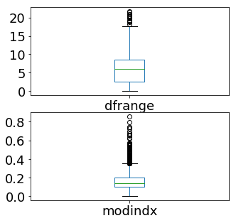
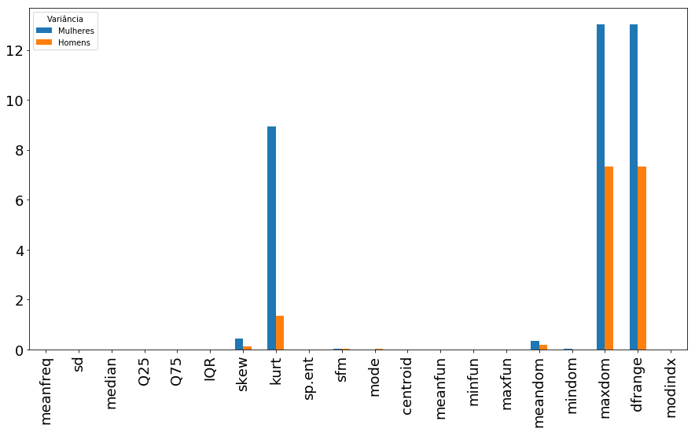

### Introdução.
Este notebook investiga a base de dados de propriedades acústicas disponíveis no site [http://www.primaryobjects.com/2016/06/22/identifying-the-gender-of-a-voice-using-machine-learning/](http://www.primaryobjects.com/2016/06/22/identifying-the-gender-of-a-voice-using-machine-learning/)

Objetivo da investigação é determinar as chances de algum algoritmo para detecção de gênero, seja por estatística tradicional ou por meio técnicas machine learning, possibilitando a implantação em dispositivos embarcados de baixo custo.

# Propriedades acústicas medidas

  

As seguintes propriedades acústicas de cada voz são medidas:

  

- **meanfreq** : frequência média (em kHz) sobre as amostras compostas no sinal de arquivo de voz;

- **sd** : desvio padrão da frequência, sobre as amostras compostas no sinal de arquivo de voz;

- **mediana** : frequência mediana (em kHz) sobre as amostras compostas no sinal de arquivo de voz;

- **Q25** : primeiro quartil (em kHz) sobre as amostras compostas no sinal de arquivo de voz;

- **Q75** : terceiro quartil (em kHz) sobre as amostras compostas no sinal de arquivo de voz;

- **IQR** : intervalo interquartil (em kHz)sobre as amostras compostas no sinal de arquivo de voz;

- **skew** : média de assimetria da distribuição das frequências de vocal predominante;

- **kurt** : curtose distribuição espectral da voz, domínio da frequência;

- **sp.ent** : entropia espectral, pureza da distribuição da voz em relação ao nível de ruído;

- **sfm** : nivelamento espectral, estima a planaridade de um espectro de frequência;

- **modo** : frequência de modo, ou seja, frequência dominante da voz;

- **centrod** : frequência central máxima visto no domínio da frequência;

- **meanfun** : média da frequência fundamental medida através do sinal acústico (Tonalidade base da voz);

- **minfun** : frequência fundamental mínima medida no sinal acústico (Tonalidade base da voz);

- **maxfun** : frequência fundamental máxima medida através do sinal acústico (Tonalidade base da voz);

- **meandom** : média da frequência dominante medida através do sinal acústico (média total das notas musicais mais graves da voz em relação ao sinal gravado);

- **mindom** : mínimo de frequência dominante medido através do sinal acústico;

- **maxdom** : máxima da frequência dominante medida através do sinal acústico;

- **dfrange** : faixa de frequência dominante medida através do sinal acústico;

- **modindx** : índice de modulação. Calculado como a diferença absoluta acumulada entre medições adjacentes de frequências fundamentais divididas pela faixa de frequência.

- **label** : rótulo de identificador da amostra em relação ao sexo, adicionado durante a gravação "male" ou "female".

## Análise em python da base de propriedades acústicas.


```python
%matplotlib inline
```


```python
# Importa as bibliotecas
import pandas
import matplotlib.pyplot as plt
import numpy 
#from pandas.tools.plotting import scatter_matrix
from  pandas.plotting  import scatter_matrix
import seaborn as sb
```


```python
# Carrega os dados
url = ".\\baseDados\\voice.csv"
colunas = ["meanfreq","sd","median","Q25","Q75","IQR","skew","kurt","sp.ent","sfm","mode","centroid","meanfun","minfun","maxfun","meandom","mindom","maxdom","dfrange","modindx","label"]
dataset = pandas.read_csv(url, names=colunas, sep = ",")
```


```python
# PANDAS: Verificando alguns dados
exemplos = dataset.head(2)
print(exemplos)
```

       meanfreq        sd    median       Q25       Q75       IQR       skew  \
    0  0.059781  0.064241  0.032027  0.015071  0.090193  0.075122  12.863462   
    1  0.066009  0.067310  0.040229  0.019414  0.092666  0.073252  22.423285   
    
             kurt    sp.ent       sfm  ...  centroid   meanfun    minfun  \
    0  274.402906  0.893369  0.491918  ...  0.059781  0.084279  0.015702   
    1  634.613855  0.892193  0.513724  ...  0.066009  0.107937  0.015826   
    
         maxfun   meandom    mindom    maxdom   dfrange   modindx  label  
    0  0.275862  0.007812  0.007812  0.007812  0.000000  0.000000   male  
    1  0.250000  0.009014  0.007812  0.054688  0.046875  0.052632   male  
    
    [2 rows x 21 columns]
    


```python
dataset.head()
```


<div>
<style scoped>
    .dataframe tbody tr th:only-of-type {
        vertical-align: middle;
    }

    .dataframe tbody tr th {
        vertical-align: top;
    }

    .dataframe thead th {
        text-align: right;
    }
</style>
<table border="1" class="dataframe">
  <thead>
    <tr style="text-align: right;">
      <th></th>
      <th>meanfreq</th>
      <th>sd</th>
      <th>median</th>
      <th>Q25</th>
      <th>Q75</th>
      <th>IQR</th>
      <th>skew</th>
      <th>kurt</th>
      <th>sp.ent</th>
      <th>sfm</th>
      <th>...</th>
      <th>centroid</th>
      <th>meanfun</th>
      <th>minfun</th>
      <th>maxfun</th>
      <th>meandom</th>
      <th>mindom</th>
      <th>maxdom</th>
      <th>dfrange</th>
      <th>modindx</th>
      <th>label</th>
    </tr>
  </thead>
  <tbody>
    <tr>
      <td>0</td>
      <td>0.059781</td>
      <td>0.064241</td>
      <td>0.032027</td>
      <td>0.015071</td>
      <td>0.090193</td>
      <td>0.075122</td>
      <td>12.863462</td>
      <td>274.402906</td>
      <td>0.893369</td>
      <td>0.491918</td>
      <td>...</td>
      <td>0.059781</td>
      <td>0.084279</td>
      <td>0.015702</td>
      <td>0.275862</td>
      <td>0.007812</td>
      <td>0.007812</td>
      <td>0.007812</td>
      <td>0.000000</td>
      <td>0.000000</td>
      <td>male</td>
    </tr>
    <tr>
      <td>1</td>
      <td>0.066009</td>
      <td>0.067310</td>
      <td>0.040229</td>
      <td>0.019414</td>
      <td>0.092666</td>
      <td>0.073252</td>
      <td>22.423285</td>
      <td>634.613855</td>
      <td>0.892193</td>
      <td>0.513724</td>
      <td>...</td>
      <td>0.066009</td>
      <td>0.107937</td>
      <td>0.015826</td>
      <td>0.250000</td>
      <td>0.009014</td>
      <td>0.007812</td>
      <td>0.054688</td>
      <td>0.046875</td>
      <td>0.052632</td>
      <td>male</td>
    </tr>
    <tr>
      <td>2</td>
      <td>0.077316</td>
      <td>0.083829</td>
      <td>0.036718</td>
      <td>0.008701</td>
      <td>0.131908</td>
      <td>0.123207</td>
      <td>30.757155</td>
      <td>1024.927705</td>
      <td>0.846389</td>
      <td>0.478905</td>
      <td>...</td>
      <td>0.077316</td>
      <td>0.098706</td>
      <td>0.015656</td>
      <td>0.271186</td>
      <td>0.007990</td>
      <td>0.007812</td>
      <td>0.015625</td>
      <td>0.007812</td>
      <td>0.046512</td>
      <td>male</td>
    </tr>
    <tr>
      <td>3</td>
      <td>0.151228</td>
      <td>0.072111</td>
      <td>0.158011</td>
      <td>0.096582</td>
      <td>0.207955</td>
      <td>0.111374</td>
      <td>1.232831</td>
      <td>4.177296</td>
      <td>0.963322</td>
      <td>0.727232</td>
      <td>...</td>
      <td>0.151228</td>
      <td>0.088965</td>
      <td>0.017798</td>
      <td>0.250000</td>
      <td>0.201497</td>
      <td>0.007812</td>
      <td>0.562500</td>
      <td>0.554688</td>
      <td>0.247119</td>
      <td>male</td>
    </tr>
    <tr>
      <td>4</td>
      <td>0.135120</td>
      <td>0.079146</td>
      <td>0.124656</td>
      <td>0.078720</td>
      <td>0.206045</td>
      <td>0.127325</td>
      <td>1.101174</td>
      <td>4.333713</td>
      <td>0.971955</td>
      <td>0.783568</td>
      <td>...</td>
      <td>0.135120</td>
      <td>0.106398</td>
      <td>0.016931</td>
      <td>0.266667</td>
      <td>0.712812</td>
      <td>0.007812</td>
      <td>5.484375</td>
      <td>5.476562</td>
      <td>0.208274</td>
      <td>male</td>
    </tr>
  </tbody>
</table>
<p>5 rows × 21 columns</p>
</div>


```python
dataset.tail()
exemplos = dataset.tail(2)
print(exemplos)
```

          meanfreq        sd    median       Q25       Q75       IQR      skew  \
    3166  0.143659  0.090628  0.184976  0.043508  0.219943  0.176435  1.591065   
    3167  0.165509  0.092884  0.183044  0.070072  0.250827  0.180756  1.705029   
    
              kurt    sp.ent       sfm  ...  centroid   meanfun    minfun  \
    3166  5.388298  0.950436  0.675470  ...  0.143659  0.172375  0.034483   
    3167  5.769115  0.938829  0.601529  ...  0.165509  0.185607  0.062257   
    
            maxfun   meandom    mindom    maxdom   dfrange   modindx   label  
    3166  0.250000  0.791360  0.007812  3.593750  3.585938  0.311002  female  
    3167  0.271186  0.227022  0.007812  0.554688  0.546875  0.350000  female  
    
    [2 rows x 21 columns]
    

# Verificando valores nulos.


```python
dfnull = dataset.isnull()
```


```python
dfnull.isnull().sum()
```


    meanfreq    0
    sd          0
    median      0
    Q25         0
    Q75         0
    IQR         0
    skew        0
    kurt        0
    sp.ent      0
    sfm         0
    mode        0
    centroid    0
    meanfun     0
    minfun      0
    maxfun      0
    meandom     0
    mindom      0
    maxdom      0
    dfrange     0
    modindx     0
    label       0
    dtype: int64


## Gerando gráfico com valores nulos.


```python
#!pip install missingno
#!pip3 install missingno


import missingno as msno
msno.matrix(dataset,figsize=(12,5))
```


    <matplotlib.axes._subplots.AxesSubplot at 0x13921670>


###  A tabela sem elementos nulos tem  a mesma dimensão da tabela original, portanto a base não possui valores nulos.

## Verifica os tipos de dados de cada atributo.


```python
tipos = dataset.dtypes
print(tipos)
```

    meanfreq    float64
    sd          float64
    median      float64
    Q25         float64
    Q75         float64
    IQR         float64
    skew        float64
    kurt        float64
    sp.ent      float64
    sfm         float64
    mode        float64
    centroid    float64
    meanfun     float64
    minfun      float64
    maxfun      float64
    meandom     float64
    mindom      float64
    maxdom      float64
    dfrange     float64
    modindx     float64
    label        object
    dtype: object
    

## Variáveis Categóricas


```python
contagem = dataset.groupby('label').size()
print(contagem)

```

    label
    female    1584
    male      1584
    dtype: int64
    


```python
sb.countplot('label',data=dataset)
plt.rcParams['figure.figsize'] = (10,5)
plt.show()
```


```python
## Separação dos dados pela classe label, vozes de homens e mulheres.
dfHomens = dataset[dataset["label"] == "male"]
dfMulheres = dataset[dataset["label"] == "female"]
```

### Conferindo segmentações das vozes masculinas.


```python
dfHomens.head(2)
```


<div>
<style scoped>
    .dataframe tbody tr th:only-of-type {
        vertical-align: middle;
    }

    .dataframe tbody tr th {
        vertical-align: top;
    }

    .dataframe thead th {
        text-align: right;
    }
</style>
<table border="1" class="dataframe">
  <thead>
    <tr style="text-align: right;">
      <th></th>
      <th>meanfreq</th>
      <th>sd</th>
      <th>median</th>
      <th>Q25</th>
      <th>Q75</th>
      <th>IQR</th>
      <th>skew</th>
      <th>kurt</th>
      <th>sp.ent</th>
      <th>sfm</th>
      <th>...</th>
      <th>centroid</th>
      <th>meanfun</th>
      <th>minfun</th>
      <th>maxfun</th>
      <th>meandom</th>
      <th>mindom</th>
      <th>maxdom</th>
      <th>dfrange</th>
      <th>modindx</th>
      <th>label</th>
    </tr>
  </thead>
  <tbody>
    <tr>
      <td>0</td>
      <td>0.059781</td>
      <td>0.064241</td>
      <td>0.032027</td>
      <td>0.015071</td>
      <td>0.090193</td>
      <td>0.075122</td>
      <td>12.863462</td>
      <td>274.402906</td>
      <td>0.893369</td>
      <td>0.491918</td>
      <td>...</td>
      <td>0.059781</td>
      <td>0.084279</td>
      <td>0.015702</td>
      <td>0.275862</td>
      <td>0.007812</td>
      <td>0.007812</td>
      <td>0.007812</td>
      <td>0.000000</td>
      <td>0.000000</td>
      <td>male</td>
    </tr>
    <tr>
      <td>1</td>
      <td>0.066009</td>
      <td>0.067310</td>
      <td>0.040229</td>
      <td>0.019414</td>
      <td>0.092666</td>
      <td>0.073252</td>
      <td>22.423285</td>
      <td>634.613855</td>
      <td>0.892193</td>
      <td>0.513724</td>
      <td>...</td>
      <td>0.066009</td>
      <td>0.107937</td>
      <td>0.015826</td>
      <td>0.250000</td>
      <td>0.009014</td>
      <td>0.007812</td>
      <td>0.054688</td>
      <td>0.046875</td>
      <td>0.052632</td>
      <td>male</td>
    </tr>
  </tbody>
</table>
<p>2 rows × 21 columns</p>
</div>


```python
dfHomens.tail(2)
```


<div>
<style scoped>
    .dataframe tbody tr th:only-of-type {
        vertical-align: middle;
    }

    .dataframe tbody tr th {
        vertical-align: top;
    }

    .dataframe thead th {
        text-align: right;
    }
</style>
<table border="1" class="dataframe">
  <thead>
    <tr style="text-align: right;">
      <th></th>
      <th>meanfreq</th>
      <th>sd</th>
      <th>median</th>
      <th>Q25</th>
      <th>Q75</th>
      <th>IQR</th>
      <th>skew</th>
      <th>kurt</th>
      <th>sp.ent</th>
      <th>sfm</th>
      <th>...</th>
      <th>centroid</th>
      <th>meanfun</th>
      <th>minfun</th>
      <th>maxfun</th>
      <th>meandom</th>
      <th>mindom</th>
      <th>maxdom</th>
      <th>dfrange</th>
      <th>modindx</th>
      <th>label</th>
    </tr>
  </thead>
  <tbody>
    <tr>
      <td>1582</td>
      <td>0.162350</td>
      <td>0.060335</td>
      <td>0.140085</td>
      <td>0.112611</td>
      <td>0.224204</td>
      <td>0.111593</td>
      <td>3.506742</td>
      <td>20.298964</td>
      <td>0.907180</td>
      <td>0.412580</td>
      <td>...</td>
      <td>0.162350</td>
      <td>0.110352</td>
      <td>0.019231</td>
      <td>0.27027</td>
      <td>0.420532</td>
      <td>0.087891</td>
      <td>0.771484</td>
      <td>0.683594</td>
      <td>0.600000</td>
      <td>male</td>
    </tr>
    <tr>
      <td>1583</td>
      <td>0.158781</td>
      <td>0.059852</td>
      <td>0.147013</td>
      <td>0.107879</td>
      <td>0.216797</td>
      <td>0.108918</td>
      <td>3.648593</td>
      <td>20.799925</td>
      <td>0.898225</td>
      <td>0.401169</td>
      <td>...</td>
      <td>0.158781</td>
      <td>0.115299</td>
      <td>0.079365</td>
      <td>0.25000</td>
      <td>0.460938</td>
      <td>0.087891</td>
      <td>0.786133</td>
      <td>0.698242</td>
      <td>0.552115</td>
      <td>male</td>
    </tr>
  </tbody>
</table>
<p>2 rows × 21 columns</p>
</div>


### Conferindo segmentações das vozes femininas.


```python
dfMulheres.head(2)
```


<div>
<style scoped>
    .dataframe tbody tr th:only-of-type {
        vertical-align: middle;
    }

    .dataframe tbody tr th {
        vertical-align: top;
    }

    .dataframe thead th {
        text-align: right;
    }
</style>
<table border="1" class="dataframe">
  <thead>
    <tr style="text-align: right;">
      <th></th>
      <th>meanfreq</th>
      <th>sd</th>
      <th>median</th>
      <th>Q25</th>
      <th>Q75</th>
      <th>IQR</th>
      <th>skew</th>
      <th>kurt</th>
      <th>sp.ent</th>
      <th>sfm</th>
      <th>...</th>
      <th>centroid</th>
      <th>meanfun</th>
      <th>minfun</th>
      <th>maxfun</th>
      <th>meandom</th>
      <th>mindom</th>
      <th>maxdom</th>
      <th>dfrange</th>
      <th>modindx</th>
      <th>label</th>
    </tr>
  </thead>
  <tbody>
    <tr>
      <td>1584</td>
      <td>0.158108</td>
      <td>0.082782</td>
      <td>0.191191</td>
      <td>0.062350</td>
      <td>0.224552</td>
      <td>0.162202</td>
      <td>2.801344</td>
      <td>19.929617</td>
      <td>0.952161</td>
      <td>0.679223</td>
      <td>...</td>
      <td>0.158108</td>
      <td>0.185042</td>
      <td>0.023022</td>
      <td>0.275862</td>
      <td>0.272964</td>
      <td>0.046875</td>
      <td>0.742188</td>
      <td>0.695312</td>
      <td>0.339888</td>
      <td>female</td>
    </tr>
    <tr>
      <td>1585</td>
      <td>0.182855</td>
      <td>0.067789</td>
      <td>0.200639</td>
      <td>0.175489</td>
      <td>0.226068</td>
      <td>0.050579</td>
      <td>3.001890</td>
      <td>19.865482</td>
      <td>0.910458</td>
      <td>0.506099</td>
      <td>...</td>
      <td>0.182855</td>
      <td>0.159590</td>
      <td>0.018713</td>
      <td>0.266667</td>
      <td>0.258970</td>
      <td>0.054688</td>
      <td>0.804688</td>
      <td>0.750000</td>
      <td>0.269231</td>
      <td>female</td>
    </tr>
  </tbody>
</table>
<p>2 rows × 21 columns</p>
</div>


```python
dfMulheres.tail(2)
```


<div>
<style scoped>
    .dataframe tbody tr th:only-of-type {
        vertical-align: middle;
    }

    .dataframe tbody tr th {
        vertical-align: top;
    }

    .dataframe thead th {
        text-align: right;
    }
</style>
<table border="1" class="dataframe">
  <thead>
    <tr style="text-align: right;">
      <th></th>
      <th>meanfreq</th>
      <th>sd</th>
      <th>median</th>
      <th>Q25</th>
      <th>Q75</th>
      <th>IQR</th>
      <th>skew</th>
      <th>kurt</th>
      <th>sp.ent</th>
      <th>sfm</th>
      <th>...</th>
      <th>centroid</th>
      <th>meanfun</th>
      <th>minfun</th>
      <th>maxfun</th>
      <th>meandom</th>
      <th>mindom</th>
      <th>maxdom</th>
      <th>dfrange</th>
      <th>modindx</th>
      <th>label</th>
    </tr>
  </thead>
  <tbody>
    <tr>
      <td>3166</td>
      <td>0.143659</td>
      <td>0.090628</td>
      <td>0.184976</td>
      <td>0.043508</td>
      <td>0.219943</td>
      <td>0.176435</td>
      <td>1.591065</td>
      <td>5.388298</td>
      <td>0.950436</td>
      <td>0.675470</td>
      <td>...</td>
      <td>0.143659</td>
      <td>0.172375</td>
      <td>0.034483</td>
      <td>0.250000</td>
      <td>0.791360</td>
      <td>0.007812</td>
      <td>3.593750</td>
      <td>3.585938</td>
      <td>0.311002</td>
      <td>female</td>
    </tr>
    <tr>
      <td>3167</td>
      <td>0.165509</td>
      <td>0.092884</td>
      <td>0.183044</td>
      <td>0.070072</td>
      <td>0.250827</td>
      <td>0.180756</td>
      <td>1.705029</td>
      <td>5.769115</td>
      <td>0.938829</td>
      <td>0.601529</td>
      <td>...</td>
      <td>0.165509</td>
      <td>0.185607</td>
      <td>0.062257</td>
      <td>0.271186</td>
      <td>0.227022</td>
      <td>0.007812</td>
      <td>0.554688</td>
      <td>0.546875</td>
      <td>0.350000</td>
      <td>female</td>
    </tr>
  </tbody>
</table>
<p>2 rows × 21 columns</p>
</div>


### BOXPLOT:  vozes femininas - Verificando discrepâncias


```python
print(colunas)
plt.rcParams['figure.figsize'] = (10,12)
dfMulheres[colunas[0:6]].plot(kind='box', subplots=True, layout=(3,2), sharex=False, sharey=False,fontsize=18)
plt.show()
```

    ['meanfreq', 'sd', 'median', 'Q25', 'Q75', 'IQR', 'skew', 'kurt', 'sp.ent', 'sfm', 'mode', 'centroid', 'meanfun', 'minfun', 'maxfun', 'meandom', 'mindom', 'maxdom', 'dfrange', 'modindx', 'label']
    


```python
plt.rcParams['figure.figsize'] = (12,12)
dfMulheres[colunas[6:12]].plot(kind='box', subplots=True, layout=(3,2), sharex=False, sharey=False,fontsize=18)
plt.show()
```


```python
plt.rcParams['figure.figsize'] = (12,12)
dfMulheres[colunas[12:18]].plot(kind='box', subplots=True, layout=(3,2), sharex=False, sharey=False,fontsize=18)
plt.show()

```


```python
plt.rcParams['figure.figsize'] = (5,5)
dfMulheres[colunas[18:20]].plot(kind='box', subplots=True, layout=(2,1), sharex=False, sharey=False,fontsize=18)
plt.show()
```





### BOXPLOT: vozes masculinas - Verificando discrepâncias


```python
print(colunas)
plt.rcParams['figure.figsize'] = (12,12)
dfHomens[colunas[0:6]].plot(kind='box', subplots=True, layout=(3,2), sharex=False, sharey=False,fontsize=18)
plt.show()

```

    ['meanfreq', 'sd', 'median', 'Q25', 'Q75', 'IQR', 'skew', 'kurt', 'sp.ent', 'sfm', 'mode', 'centroid', 'meanfun', 'minfun', 'maxfun', 'meandom', 'mindom', 'maxdom', 'dfrange', 'modindx', 'label']
    


```python
print(colunas)
plt.rcParams['figure.figsize'] = (12,12)
dfHomens[colunas[6:12]].plot(kind='box', subplots=True, layout=(3,2), sharex=False, sharey=False,fontsize=18)
plt.show()

```

    ['meanfreq', 'sd', 'median', 'Q25', 'Q75', 'IQR', 'skew', 'kurt', 'sp.ent', 'sfm', 'mode', 'centroid', 'meanfun', 'minfun', 'maxfun', 'meandom', 'mindom', 'maxdom', 'dfrange', 'modindx', 'label']
    


```python
print(colunas)
plt.rcParams['figure.figsize'] = (10,12)
dfHomens[colunas[12:18]].plot(kind='box', subplots=True, layout=(3,2), sharex=False, sharey=False,fontsize=18)
plt.show()


```

    ['meanfreq', 'sd', 'median', 'Q25', 'Q75', 'IQR', 'skew', 'kurt', 'sp.ent', 'sfm', 'mode', 'centroid', 'meanfun', 'minfun', 'maxfun', 'meandom', 'mindom', 'maxdom', 'dfrange', 'modindx', 'label']
    


```python
print(colunas)
plt.rcParams['figure.figsize'] = (5,5)
dfHomens[colunas[18:20]].plot(kind='box', subplots=True, layout=(2,1), sharex=False, sharey=False,fontsize=18)
plt.show()

```

    ['meanfreq', 'sd', 'median', 'Q25', 'Q75', 'IQR', 'skew', 'kurt', 'sp.ent', 'sfm', 'mode', 'centroid', 'meanfun', 'minfun', 'maxfun', 'meandom', 'mindom', 'maxdom', 'dfrange', 'modindx', 'label']
    


### Método de interquartil.

Definição 
A gama interquartil (IQR), também chamado o midspread ou meio de 50%, ou tecnicamente H-propagação , é uma medida da dispersão estatística, sendo igual à diferença entre os percentis 75 e 25 de, ou entre os quartis superiores e inferiores, IQR = Q 3 - Q 1.
Em outras palavras, o IQR é o primeiro quartil subtraído do terceiro quartil; esses quartis podem ser vistos claramente em um gráfico de caixa nos dados.
É uma medida da dispersão semelhante ao desvio ou variância padrão, mas é muito mais robusta contra valores extremos.

### Aplicando nos dados  de vozes femininas, Técnica do Interquartil


```python
dfgrafico_test = dfMulheres
NV=6
for z in range(0,NV):
    for y in colunas:
        if y == "label":
            continue
        Q1 = dfgrafico_test[y].quantile(0.25)
        Q3 = dfgrafico_test[y].quantile(0.75)
        IQR = Q3 - Q1
        df_sem_Outliersx = dfgrafico_test[y][~((dfgrafico_test[y] < (Q1 - 1.5 * IQR)) | (dfgrafico_test[y]> (Q3 + 1.5 * IQR)))] 
        dfgrafico_test[y] = df_sem_Outliersx

    

```

    c:\users\jorge\appdata\local\programs\python\python37-32\lib\site-packages\ipykernel_launcher.py:11: SettingWithCopyWarning: 
    A value is trying to be set on a copy of a slice from a DataFrame.
    Try using .loc[row_indexer,col_indexer] = value instead
    
    See the caveats in the documentation: http://pandas.pydata.org/pandas-docs/stable/user_guide/indexing.html#returning-a-view-versus-a-copy
      # This is added back by InteractiveShellApp.init_path()
    

### Imprimindo os dados discrepantes removidos nos dados  de vozes femininas


```python
msno.matrix(dfgrafico_test,figsize=(12,5))
```


    <matplotlib.axes._subplots.AxesSubplot at 0x13fa09d0>


```python
dfgrafico_test = dfMulheres
for z in range(0,NV):
    for y in colunas:
        if y == "label":
            continue
        Q1 = dfMulheres[y].quantile(0.25)
        Q3 = dfMulheres[y].quantile(0.75)
        IQR = Q3 - Q1
        df_sem_Outliersx = dfMulheres[y][~((dfMulheres[y] < (Q1 - 1.5 * IQR)) | (dfMulheres[y]> (Q3 + 1.5 * IQR)))] 
        dfMulheres[y] = df_sem_Outliersx
        dfMulheres=dfMulheres.fillna(dfMulheres.mean())

```

    c:\users\jorge\appdata\local\programs\python\python37-32\lib\site-packages\ipykernel_launcher.py:10: SettingWithCopyWarning: 
    A value is trying to be set on a copy of a slice from a DataFrame.
    Try using .loc[row_indexer,col_indexer] = value instead
    
    See the caveats in the documentation: http://pandas.pydata.org/pandas-docs/stable/user_guide/indexing.html#returning-a-view-versus-a-copy
      # Remove the CWD from sys.path while we load stuff.
    


```python
### Imprime dados normalizados de vozes femininas
```


```python
msno.matrix(dfMulheres,figsize=(12,5))
```


    <matplotlib.axes._subplots.AxesSubplot at 0x13df77f0>


### Aplicando nos dados  de vozes masculinas, Técnica do Interquartil


```python
dfgrafico_test = dfHomens
NV=6
for z in range(0,NV):
    for y in colunas:
        if y == "label":
            continue
        Q1 = dfgrafico_test[y].quantile(0.25)
        Q3 = dfgrafico_test[y].quantile(0.75)
        IQR = Q3 - Q1
        df_sem_Outliersx = dfgrafico_test[y][~((dfgrafico_test[y] < (Q1 - 1.5 * IQR)) | (dfgrafico_test[y]> (Q3 + 1.5 * IQR)))] 
        dfgrafico_test[y] = df_sem_Outliersx

```

    c:\users\jorge\appdata\local\programs\python\python37-32\lib\site-packages\ipykernel_launcher.py:11: SettingWithCopyWarning: 
    A value is trying to be set on a copy of a slice from a DataFrame.
    Try using .loc[row_indexer,col_indexer] = value instead
    
    See the caveats in the documentation: http://pandas.pydata.org/pandas-docs/stable/user_guide/indexing.html#returning-a-view-versus-a-copy
      # This is added back by InteractiveShellApp.init_path()
    

### ImprimIndo os dados discrepantes removidos nos dados  de vozes masculinas


```python
msno.matrix(dfgrafico_test,figsize=(12,5))
```


    <matplotlib.axes._subplots.AxesSubplot at 0x12794590>


```python
dfgrafico_test = dfHomens
for z in range(0,NV):
    for y in colunas:
        if y == "label":
            continue
        Q1 = dfHomens[y].quantile(0.25)
        Q3 = dfHomens[y].quantile(0.75)
        IQR = Q3 - Q1
        df_sem_Outliersx = dfHomens[y][~((dfHomens[y] < (Q1 - 1.5 * IQR)) | (dfHomens[y]> (Q3 + 1.5 * IQR)))] 
        dfHomens[y] = df_sem_Outliersx
        dfHomens=dfHomens.fillna(dfHomens.mean())

```

    c:\users\jorge\appdata\local\programs\python\python37-32\lib\site-packages\ipykernel_launcher.py:10: SettingWithCopyWarning: 
    A value is trying to be set on a copy of a slice from a DataFrame.
    Try using .loc[row_indexer,col_indexer] = value instead
    
    See the caveats in the documentation: http://pandas.pydata.org/pandas-docs/stable/user_guide/indexing.html#returning-a-view-versus-a-copy
      # Remove the CWD from sys.path while we load stuff.
    

### Imprimindo os dados normalizados de vozes masculinas


```python
msno.matrix(dfHomens,figsize=(12,5))
```


    <matplotlib.axes._subplots.AxesSubplot at 0x12823d50>


### BOXPLOT:  vozes femininas


```python
print(colunas)
plt.rcParams['figure.figsize'] = (12,12)
dfMulheres[colunas[0:6]].plot(kind='box', subplots=True, layout=(3,2), sharex=False, sharey=False,fontsize=18)
plt.show()

```

    ['meanfreq', 'sd', 'median', 'Q25', 'Q75', 'IQR', 'skew', 'kurt', 'sp.ent', 'sfm', 'mode', 'centroid', 'meanfun', 'minfun', 'maxfun', 'meandom', 'mindom', 'maxdom', 'dfrange', 'modindx', 'label']
    


```python
plt.rcParams['figure.figsize'] = (10,12)
dfMulheres[colunas[6:12]].plot(kind='box', subplots=True, layout=(3,2), sharex=False, sharey=False,fontsize=18)
plt.show()

```


```python
plt.rcParams['figure.figsize'] = (10,12)
dfMulheres[colunas[12:18]].plot(kind='box', subplots=True, layout=(3,2), sharex=False, sharey=False,fontsize=18)
plt.show()
```


```python
print(colunas)
plt.rcParams['figure.figsize'] = (5,5)
dfMulheres[colunas[18:20]].plot(kind='box', subplots=True, layout=(2,1), sharex=False, sharey=False,fontsize=17)
plt.show()
```

    ['meanfreq', 'sd', 'median', 'Q25', 'Q75', 'IQR', 'skew', 'kurt', 'sp.ent', 'sfm', 'mode', 'centroid', 'meanfun', 'minfun', 'maxfun', 'meandom', 'mindom', 'maxdom', 'dfrange', 'modindx', 'label']
    


### BOXPLOT:  vozes masculinas


```python
print(colunas)
plt.rcParams['figure.figsize'] = (12,12)
dfHomens[colunas[0:6]].plot(kind='box', subplots=True, layout=(3,2), sharex=False, sharey=False,fontsize=18)
plt.show()
```

    ['meanfreq', 'sd', 'median', 'Q25', 'Q75', 'IQR', 'skew', 'kurt', 'sp.ent', 'sfm', 'mode', 'centroid', 'meanfun', 'minfun', 'maxfun', 'meandom', 'mindom', 'maxdom', 'dfrange', 'modindx', 'label']
    


```python
plt.rcParams['figure.figsize'] = (10,12)
dfHomens[colunas[6:12]].plot(kind='box', subplots=True, layout=(3,2), sharex=False, sharey=False,fontsize=18)
plt.show()

```


```python
plt.rcParams['figure.figsize'] = (10,12)
dfHomens[colunas[12:18]].plot(kind='box', subplots=True, layout=(3,2), sharex=False, sharey=False,fontsize=18)
plt.show()
```


```python
print(colunas)
plt.rcParams['figure.figsize'] = (5,5)
dfHomens[colunas[18:20]].plot(kind='box', subplots=True, layout=(2,1), sharex=False, sharey=False,fontsize=17)
plt.show()

```

    ['meanfreq', 'sd', 'median', 'Q25', 'Q75', 'IQR', 'skew', 'kurt', 'sp.ent', 'sfm', 'mode', 'centroid', 'meanfun', 'minfun', 'maxfun', 'meandom', 'mindom', 'maxdom', 'dfrange', 'modindx', 'label']
    


### Juntando  os dados das vozes masculinas com femininas


```python
frames = [dfHomens,dfMulheres]
dfresult = pandas.concat(frames)
sb.countplot('label',data=dfresult)
plt.rcParams['figure.figsize'] = (5,5)
plt.show()
```


### Salvando o arquivo para modelos e para Rstudio


```python
dfresult.to_csv(".\\baseDados\\voice_fix.csv", header=False, index=False)
dfresult.to_csv(".\\baseDados\\Rvoice_fix.csv", header=True, index=False)

```


## Fim do pré-processamento
---
---
---
---
---

# Analise exploratória


```python
# Carrega os dados limpos
url = ".\\baseDados\\voice_fix.csv"
colunas = ["meanfreq","sd","median","Q25","Q75","IQR","skew","kurt","sp.ent","sfm","mode","centroid","meanfun","minfun","maxfun","meandom","mindom","maxdom","dfrange","modindx","label"]
dataset = pandas.read_csv(url, names=colunas, sep = ",")

```


```python
dataset.head()
```


<div>
<style scoped>
    .dataframe tbody tr th:only-of-type {
        vertical-align: middle;
    }

    .dataframe tbody tr th {
        vertical-align: top;
    }

    .dataframe thead th {
        text-align: right;
    }
</style>
<table border="1" class="dataframe">
  <thead>
    <tr style="text-align: right;">
      <th></th>
      <th>meanfreq</th>
      <th>sd</th>
      <th>median</th>
      <th>Q25</th>
      <th>Q75</th>
      <th>IQR</th>
      <th>skew</th>
      <th>kurt</th>
      <th>sp.ent</th>
      <th>sfm</th>
      <th>...</th>
      <th>centroid</th>
      <th>meanfun</th>
      <th>minfun</th>
      <th>maxfun</th>
      <th>meandom</th>
      <th>mindom</th>
      <th>maxdom</th>
      <th>dfrange</th>
      <th>modindx</th>
      <th>label</th>
    </tr>
  </thead>
  <tbody>
    <tr>
      <td>0</td>
      <td>0.172557</td>
      <td>0.064241</td>
      <td>0.176893</td>
      <td>0.121089</td>
      <td>0.227842</td>
      <td>0.109055</td>
      <td>1.906048</td>
      <td>6.450221</td>
      <td>0.893369</td>
      <td>0.491918</td>
      <td>...</td>
      <td>0.172557</td>
      <td>0.084279</td>
      <td>0.015702</td>
      <td>0.275862</td>
      <td>0.007812</td>
      <td>0.007812</td>
      <td>0.007812</td>
      <td>0.000000</td>
      <td>0.132999</td>
      <td>male</td>
    </tr>
    <tr>
      <td>1</td>
      <td>0.172557</td>
      <td>0.067310</td>
      <td>0.176893</td>
      <td>0.121089</td>
      <td>0.227842</td>
      <td>0.109055</td>
      <td>1.906048</td>
      <td>6.450221</td>
      <td>0.892193</td>
      <td>0.513724</td>
      <td>...</td>
      <td>0.172557</td>
      <td>0.107937</td>
      <td>0.015826</td>
      <td>0.273863</td>
      <td>0.009014</td>
      <td>0.007812</td>
      <td>0.054688</td>
      <td>0.046875</td>
      <td>0.124688</td>
      <td>male</td>
    </tr>
    <tr>
      <td>2</td>
      <td>0.172557</td>
      <td>0.063549</td>
      <td>0.176893</td>
      <td>0.121089</td>
      <td>0.227842</td>
      <td>0.123207</td>
      <td>1.906048</td>
      <td>6.450221</td>
      <td>0.918553</td>
      <td>0.478905</td>
      <td>...</td>
      <td>0.172557</td>
      <td>0.098706</td>
      <td>0.015656</td>
      <td>0.271186</td>
      <td>0.007990</td>
      <td>0.007812</td>
      <td>0.015625</td>
      <td>0.007812</td>
      <td>0.124688</td>
      <td>male</td>
    </tr>
    <tr>
      <td>3</td>
      <td>0.151228</td>
      <td>0.061216</td>
      <td>0.158011</td>
      <td>0.096582</td>
      <td>0.207955</td>
      <td>0.111374</td>
      <td>1.232831</td>
      <td>4.177296</td>
      <td>0.963322</td>
      <td>0.727232</td>
      <td>...</td>
      <td>0.151228</td>
      <td>0.088965</td>
      <td>0.017798</td>
      <td>0.273863</td>
      <td>0.201497</td>
      <td>0.007812</td>
      <td>0.562500</td>
      <td>0.554688</td>
      <td>0.130223</td>
      <td>male</td>
    </tr>
    <tr>
      <td>4</td>
      <td>0.135120</td>
      <td>0.062769</td>
      <td>0.124656</td>
      <td>0.078720</td>
      <td>0.206045</td>
      <td>0.127325</td>
      <td>1.101174</td>
      <td>4.333713</td>
      <td>0.971955</td>
      <td>0.783568</td>
      <td>...</td>
      <td>0.135120</td>
      <td>0.106398</td>
      <td>0.016931</td>
      <td>0.275166</td>
      <td>0.712812</td>
      <td>0.007812</td>
      <td>5.484375</td>
      <td>5.476562</td>
      <td>0.124688</td>
      <td>male</td>
    </tr>
  </tbody>
</table>
<p>5 rows × 21 columns</p>
</div>


```python
sb.countplot('label',data=dataset)
plt.rcParams['figure.figsize'] = (5,5)
plt.show()
```


# Estatística descritiva


```python
dataset.describe()
```


<div>
<style scoped>
    .dataframe tbody tr th:only-of-type {
        vertical-align: middle;
    }

    .dataframe tbody tr th {
        vertical-align: top;
    }

    .dataframe thead th {
        text-align: right;
    }
</style>
<table border="1" class="dataframe">
  <thead>
    <tr style="text-align: right;">
      <th></th>
      <th>meanfreq</th>
      <th>sd</th>
      <th>median</th>
      <th>Q25</th>
      <th>Q75</th>
      <th>IQR</th>
      <th>skew</th>
      <th>kurt</th>
      <th>sp.ent</th>
      <th>sfm</th>
      <th>mode</th>
      <th>centroid</th>
      <th>meanfun</th>
      <th>minfun</th>
      <th>maxfun</th>
      <th>meandom</th>
      <th>mindom</th>
      <th>maxdom</th>
      <th>dfrange</th>
      <th>modindx</th>
    </tr>
  </thead>
  <tbody>
    <tr>
      <td>count</td>
      <td>3168.000000</td>
      <td>3168.000000</td>
      <td>3168.000000</td>
      <td>3168.000000</td>
      <td>3168.000000</td>
      <td>3168.000000</td>
      <td>3168.000000</td>
      <td>3168.000000</td>
      <td>3168.000000</td>
      <td>3168.000000</td>
      <td>3168.000000</td>
      <td>3168.000000</td>
      <td>3168.000000</td>
      <td>3168.000000</td>
      <td>3168.000000</td>
      <td>3168.000000</td>
      <td>3168.000000</td>
      <td>3168.000000</td>
      <td>3168.000000</td>
      <td>3168.000000</td>
    </tr>
    <tr>
      <td>mean</td>
      <td>0.184297</td>
      <td>0.054831</td>
      <td>0.188770</td>
      <td>0.151886</td>
      <td>0.225699</td>
      <td>0.074269</td>
      <td>2.068316</td>
      <td>7.398229</td>
      <td>0.895832</td>
      <td>0.408216</td>
      <td>0.176409</td>
      <td>0.184297</td>
      <td>0.142831</td>
      <td>0.035703</td>
      <td>0.275547</td>
      <td>0.823085</td>
      <td>0.040827</td>
      <td>4.922102</td>
      <td>4.869515</td>
      <td>0.123837</td>
    </tr>
    <tr>
      <td>std</td>
      <td>0.025580</td>
      <td>0.013947</td>
      <td>0.031509</td>
      <td>0.036212</td>
      <td>0.021551</td>
      <td>0.036409</td>
      <td>0.635557</td>
      <td>2.746346</td>
      <td>0.044618</td>
      <td>0.177521</td>
      <td>0.066646</td>
      <td>0.025580</td>
      <td>0.031741</td>
      <td>0.015904</td>
      <td>0.002264</td>
      <td>0.516909</td>
      <td>0.056160</td>
      <td>3.262845</td>
      <td>3.261824</td>
      <td>0.023245</td>
    </tr>
    <tr>
      <td>min</td>
      <td>0.110311</td>
      <td>0.018363</td>
      <td>0.080672</td>
      <td>0.067763</td>
      <td>0.157750</td>
      <td>0.014558</td>
      <td>0.692271</td>
      <td>2.209673</td>
      <td>0.738651</td>
      <td>0.036876</td>
      <td>0.000000</td>
      <td>0.110311</td>
      <td>0.070249</td>
      <td>0.009775</td>
      <td>0.269663</td>
      <td>0.007812</td>
      <td>0.004883</td>
      <td>0.007812</td>
      <td>0.000000</td>
      <td>0.061080</td>
    </tr>
    <tr>
      <td>25%</td>
      <td>0.168020</td>
      <td>0.041967</td>
      <td>0.172628</td>
      <td>0.121645</td>
      <td>0.209410</td>
      <td>0.040331</td>
      <td>1.661839</td>
      <td>5.710629</td>
      <td>0.862922</td>
      <td>0.258041</td>
      <td>0.147974</td>
      <td>0.168020</td>
      <td>0.116917</td>
      <td>0.018223</td>
      <td>0.273863</td>
      <td>0.419828</td>
      <td>0.007812</td>
      <td>2.070312</td>
      <td>2.044922</td>
      <td>0.111675</td>
    </tr>
    <tr>
      <td>50%</td>
      <td>0.186479</td>
      <td>0.059525</td>
      <td>0.191252</td>
      <td>0.149349</td>
      <td>0.226274</td>
      <td>0.075076</td>
      <td>1.906048</td>
      <td>6.450221</td>
      <td>0.902573</td>
      <td>0.396335</td>
      <td>0.195616</td>
      <td>0.186479</td>
      <td>0.140499</td>
      <td>0.043340</td>
      <td>0.275166</td>
      <td>0.759524</td>
      <td>0.023438</td>
      <td>4.953125</td>
      <td>4.921875</td>
      <td>0.125874</td>
    </tr>
    <tr>
      <td>75%</td>
      <td>0.199146</td>
      <td>0.062449</td>
      <td>0.210618</td>
      <td>0.181927</td>
      <td>0.243660</td>
      <td>0.109055</td>
      <td>2.428321</td>
      <td>9.157991</td>
      <td>0.928713</td>
      <td>0.533676</td>
      <td>0.219315</td>
      <td>0.199146</td>
      <td>0.169675</td>
      <td>0.047856</td>
      <td>0.277457</td>
      <td>1.167568</td>
      <td>0.023438</td>
      <td>6.984375</td>
      <td>6.906250</td>
      <td>0.135265</td>
    </tr>
    <tr>
      <td>max</td>
      <td>0.251124</td>
      <td>0.096062</td>
      <td>0.261224</td>
      <td>0.231776</td>
      <td>0.273469</td>
      <td>0.131996</td>
      <td>4.124850</td>
      <td>16.052840</td>
      <td>0.981997</td>
      <td>0.842936</td>
      <td>0.280000</td>
      <td>0.251124</td>
      <td>0.217257</td>
      <td>0.091743</td>
      <td>0.279114</td>
      <td>2.591580</td>
      <td>0.281250</td>
      <td>17.343750</td>
      <td>17.320312</td>
      <td>0.185338</td>
    </tr>
  </tbody>
</table>
</div>


```python
pandas.set_option('display.width', 100)
pandas.set_option('precision', 3)
resultado = dataset.describe()
print(resultado)
```

           meanfreq        sd    median       Q25       Q75       IQR      skew      kurt    sp.ent  \
    count  3168.000  3168.000  3168.000  3168.000  3168.000  3168.000  3168.000  3168.000  3168.000   
    mean      0.184     0.055     0.189     0.152     0.226     0.074     2.068     7.398     0.896   
    std       0.026     0.014     0.032     0.036     0.022     0.036     0.636     2.746     0.045   
    min       0.110     0.018     0.081     0.068     0.158     0.015     0.692     2.210     0.739   
    25%       0.168     0.042     0.173     0.122     0.209     0.040     1.662     5.711     0.863   
    50%       0.186     0.060     0.191     0.149     0.226     0.075     1.906     6.450     0.903   
    75%       0.199     0.062     0.211     0.182     0.244     0.109     2.428     9.158     0.929   
    max       0.251     0.096     0.261     0.232     0.273     0.132     4.125    16.053     0.982   
    
                sfm      mode  centroid   meanfun    minfun    maxfun   meandom    mindom    maxdom  \
    count  3168.000  3168.000  3168.000  3168.000  3168.000  3168.000  3168.000  3168.000  3168.000   
    mean      0.408     0.176     0.184     0.143     0.036     0.276     0.823     0.041     4.922   
    std       0.178     0.067     0.026     0.032     0.016     0.002     0.517     0.056     3.263   
    min       0.037     0.000     0.110     0.070     0.010     0.270     0.008     0.005     0.008   
    25%       0.258     0.148     0.168     0.117     0.018     0.274     0.420     0.008     2.070   
    50%       0.396     0.196     0.186     0.140     0.043     0.275     0.760     0.023     4.953   
    75%       0.534     0.219     0.199     0.170     0.048     0.277     1.168     0.023     6.984   
    max       0.843     0.280     0.251     0.217     0.092     0.279     2.592     0.281    17.344   
    
            dfrange   modindx  
    count  3168.000  3168.000  
    mean      4.870     0.124  
    std       3.262     0.023  
    min       0.000     0.061  
    25%       2.045     0.112  
    50%       4.922     0.126  
    75%       6.906     0.135  
    max      17.320     0.185  
    

### Rotacionando a tabela descritiva


```python
dataset.describe().transpose()
```


<div>
<style scoped>
    .dataframe tbody tr th:only-of-type {
        vertical-align: middle;
    }

    .dataframe tbody tr th {
        vertical-align: top;
    }

    .dataframe thead th {
        text-align: right;
    }
</style>
<table border="1" class="dataframe">
  <thead>
    <tr style="text-align: right;">
      <th></th>
      <th>count</th>
      <th>mean</th>
      <th>std</th>
      <th>min</th>
      <th>25%</th>
      <th>50%</th>
      <th>75%</th>
      <th>max</th>
    </tr>
  </thead>
  <tbody>
    <tr>
      <td>meanfreq</td>
      <td>3168.0</td>
      <td>0.184</td>
      <td>0.026</td>
      <td>0.110</td>
      <td>0.168</td>
      <td>0.186</td>
      <td>0.199</td>
      <td>0.251</td>
    </tr>
    <tr>
      <td>sd</td>
      <td>3168.0</td>
      <td>0.055</td>
      <td>0.014</td>
      <td>0.018</td>
      <td>0.042</td>
      <td>0.060</td>
      <td>0.062</td>
      <td>0.096</td>
    </tr>
    <tr>
      <td>median</td>
      <td>3168.0</td>
      <td>0.189</td>
      <td>0.032</td>
      <td>0.081</td>
      <td>0.173</td>
      <td>0.191</td>
      <td>0.211</td>
      <td>0.261</td>
    </tr>
    <tr>
      <td>Q25</td>
      <td>3168.0</td>
      <td>0.152</td>
      <td>0.036</td>
      <td>0.068</td>
      <td>0.122</td>
      <td>0.149</td>
      <td>0.182</td>
      <td>0.232</td>
    </tr>
    <tr>
      <td>Q75</td>
      <td>3168.0</td>
      <td>0.226</td>
      <td>0.022</td>
      <td>0.158</td>
      <td>0.209</td>
      <td>0.226</td>
      <td>0.244</td>
      <td>0.273</td>
    </tr>
    <tr>
      <td>IQR</td>
      <td>3168.0</td>
      <td>0.074</td>
      <td>0.036</td>
      <td>0.015</td>
      <td>0.040</td>
      <td>0.075</td>
      <td>0.109</td>
      <td>0.132</td>
    </tr>
    <tr>
      <td>skew</td>
      <td>3168.0</td>
      <td>2.068</td>
      <td>0.636</td>
      <td>0.692</td>
      <td>1.662</td>
      <td>1.906</td>
      <td>2.428</td>
      <td>4.125</td>
    </tr>
    <tr>
      <td>kurt</td>
      <td>3168.0</td>
      <td>7.398</td>
      <td>2.746</td>
      <td>2.210</td>
      <td>5.711</td>
      <td>6.450</td>
      <td>9.158</td>
      <td>16.053</td>
    </tr>
    <tr>
      <td>sp.ent</td>
      <td>3168.0</td>
      <td>0.896</td>
      <td>0.045</td>
      <td>0.739</td>
      <td>0.863</td>
      <td>0.903</td>
      <td>0.929</td>
      <td>0.982</td>
    </tr>
    <tr>
      <td>sfm</td>
      <td>3168.0</td>
      <td>0.408</td>
      <td>0.178</td>
      <td>0.037</td>
      <td>0.258</td>
      <td>0.396</td>
      <td>0.534</td>
      <td>0.843</td>
    </tr>
    <tr>
      <td>mode</td>
      <td>3168.0</td>
      <td>0.176</td>
      <td>0.067</td>
      <td>0.000</td>
      <td>0.148</td>
      <td>0.196</td>
      <td>0.219</td>
      <td>0.280</td>
    </tr>
    <tr>
      <td>centroid</td>
      <td>3168.0</td>
      <td>0.184</td>
      <td>0.026</td>
      <td>0.110</td>
      <td>0.168</td>
      <td>0.186</td>
      <td>0.199</td>
      <td>0.251</td>
    </tr>
    <tr>
      <td>meanfun</td>
      <td>3168.0</td>
      <td>0.143</td>
      <td>0.032</td>
      <td>0.070</td>
      <td>0.117</td>
      <td>0.140</td>
      <td>0.170</td>
      <td>0.217</td>
    </tr>
    <tr>
      <td>minfun</td>
      <td>3168.0</td>
      <td>0.036</td>
      <td>0.016</td>
      <td>0.010</td>
      <td>0.018</td>
      <td>0.043</td>
      <td>0.048</td>
      <td>0.092</td>
    </tr>
    <tr>
      <td>maxfun</td>
      <td>3168.0</td>
      <td>0.276</td>
      <td>0.002</td>
      <td>0.270</td>
      <td>0.274</td>
      <td>0.275</td>
      <td>0.277</td>
      <td>0.279</td>
    </tr>
    <tr>
      <td>meandom</td>
      <td>3168.0</td>
      <td>0.823</td>
      <td>0.517</td>
      <td>0.008</td>
      <td>0.420</td>
      <td>0.760</td>
      <td>1.168</td>
      <td>2.592</td>
    </tr>
    <tr>
      <td>mindom</td>
      <td>3168.0</td>
      <td>0.041</td>
      <td>0.056</td>
      <td>0.005</td>
      <td>0.008</td>
      <td>0.023</td>
      <td>0.023</td>
      <td>0.281</td>
    </tr>
    <tr>
      <td>maxdom</td>
      <td>3168.0</td>
      <td>4.922</td>
      <td>3.263</td>
      <td>0.008</td>
      <td>2.070</td>
      <td>4.953</td>
      <td>6.984</td>
      <td>17.344</td>
    </tr>
    <tr>
      <td>dfrange</td>
      <td>3168.0</td>
      <td>4.870</td>
      <td>3.262</td>
      <td>0.000</td>
      <td>2.045</td>
      <td>4.922</td>
      <td>6.906</td>
      <td>17.320</td>
    </tr>
    <tr>
      <td>modindx</td>
      <td>3168.0</td>
      <td>0.124</td>
      <td>0.023</td>
      <td>0.061</td>
      <td>0.112</td>
      <td>0.126</td>
      <td>0.135</td>
      <td>0.185</td>
    </tr>
  </tbody>
</table>
</div>


```python
print(dataset.describe().transpose())
```

               count   mean    std    min    25%    50%    75%     max
    meanfreq  3168.0  0.184  0.026  0.110  0.168  0.186  0.199   0.251
    sd        3168.0  0.055  0.014  0.018  0.042  0.060  0.062   0.096
    median    3168.0  0.189  0.032  0.081  0.173  0.191  0.211   0.261
    Q25       3168.0  0.152  0.036  0.068  0.122  0.149  0.182   0.232
    Q75       3168.0  0.226  0.022  0.158  0.209  0.226  0.244   0.273
    IQR       3168.0  0.074  0.036  0.015  0.040  0.075  0.109   0.132
    skew      3168.0  2.068  0.636  0.692  1.662  1.906  2.428   4.125
    kurt      3168.0  7.398  2.746  2.210  5.711  6.450  9.158  16.053
    sp.ent    3168.0  0.896  0.045  0.739  0.863  0.903  0.929   0.982
    sfm       3168.0  0.408  0.178  0.037  0.258  0.396  0.534   0.843
    mode      3168.0  0.176  0.067  0.000  0.148  0.196  0.219   0.280
    centroid  3168.0  0.184  0.026  0.110  0.168  0.186  0.199   0.251
    meanfun   3168.0  0.143  0.032  0.070  0.117  0.140  0.170   0.217
    minfun    3168.0  0.036  0.016  0.010  0.018  0.043  0.048   0.092
    maxfun    3168.0  0.276  0.002  0.270  0.274  0.275  0.277   0.279
    meandom   3168.0  0.823  0.517  0.008  0.420  0.760  1.168   2.592
    mindom    3168.0  0.041  0.056  0.005  0.008  0.023  0.023   0.281
    maxdom    3168.0  4.922  3.263  0.008  2.070  4.953  6.984  17.344
    dfrange   3168.0  4.870  3.262  0.000  2.045  4.922  6.906  17.320
    modindx   3168.0  0.124  0.023  0.061  0.112  0.126  0.135   0.185
    

### Nos dados existe apenas um variável *label* que é  Qualitativa Nominal sendo que demais são quantitativas contínuas


```python

dataset.dtypes
A = str(tipos)
A = A.replace('float64',"Quantitativa Contínua")
A = A.replace('object',"Qualitativa Nominal")

print(A)

```

    meanfreq    Quantitativa Contínua
    sd          Quantitativa Contínua
    median      Quantitativa Contínua
    Q25         Quantitativa Contínua
    Q75         Quantitativa Contínua
    IQR         Quantitativa Contínua
    skew        Quantitativa Contínua
    kurt        Quantitativa Contínua
    sp.ent      Quantitativa Contínua
    sfm         Quantitativa Contínua
    mode        Quantitativa Contínua
    centroid    Quantitativa Contínua
    meanfun     Quantitativa Contínua
    minfun      Quantitativa Contínua
    maxfun      Quantitativa Contínua
    meandom     Quantitativa Contínua
    mindom      Quantitativa Contínua
    maxdom      Quantitativa Contínua
    dfrange     Quantitativa Contínua
    modindx     Quantitativa Contínua
    label        Qualitativa Nominal
    dtype: Qualitativa Nominal
    

## MEDIDAS DE POSIÇÃO: Moda, Média, Mediana, Percentis, Quartis.

#### MEDIDAS DE POSIÇÃO, já  estão calculados na tabela *describe* Media , Percentis, Quartis 
##### Mediana e a mesma medias da coluna  **50%** da tabela.

A média é uma medida de tendência central que indica o valor onde estão concentrados os dados de um conjunto de valores, representando um valor significativo para o mesmo.

A mediana é o valor que separa a metade superior da metade inferior de uma distribuição de dados, ou o valor no centro da distribuição.

A moda é simples. Nada mais é que o valor que mais se repete dentro de um conjunto.

## Calculando a moda.

### Moda


```python
Modadic = {}
Medianaadic = {}
for x in colunas:
    if x == "label":
        continue
    Modadic[x]=dataset[x].mode()[0]
    Medianaadic[x]=dataset[x].median()

    
    
```


```python
### Calculado a moda  e armazenando em dicionário.
```


```python
print(Modadic)
print(Medianaadic)

```

    {'meanfreq': 0.19472718236502165, 'sd': 0.061608105708484566, 'median': 0.20054250178697985, 'Q25': 0.1819274845526179, 'Q75': 0.22784220505424035, 'IQR': 0.041269320645700366, 'skew': 1.9060477321644864, 'kurt': 6.450221192869066, 'sp.ent': 0.9184162126645676, 'sfm': 0.0849343635514977, 'mode': 0.20183441212714168, 'centroid': 0.19472718236502165, 'meanfun': 0.11577965623313086, 'minfun': 0.0469208211143695, 'maxfun': 0.2738630053699619, 'meandom': 0.0078125, 'mindom': 0.0234375, 'maxdom': 0.0078125, 'dfrange': 0.0, 'modindx': 0.13393144660271078}
    {'meanfreq': 0.18647868939908246, 'sd': 0.0595253461221969, 'median': 0.19125166792965048, 'Q25': 0.149349342481418, 'Q75': 0.226274112408729, 'IQR': 0.07507567046154351, 'skew': 1.9060477321644864, 'kurt': 6.450221192869066, 'sp.ent': 0.902573495041479, 'sfm': 0.396335156832049, 'mode': 0.195616438356164, 'centroid': 0.18647868939908246, 'meanfun': 0.14049944322543, 'minfun': 0.043340334680360554, 'maxfun': 0.2751664350544543, 'meandom': 0.7595238095238095, 'mindom': 0.0234375, 'maxdom': 4.953125, 'dfrange': 4.921875, 'modindx': 0.12587436494113735}
    


```python
### Transformando  os resultados em data frame.

```


```python
dfModa = pandas.DataFrame.from_dict(Modadic, orient="index").reset_index()
dfModa.columns = ["quantitativas","moda"]
dfModa
```


<div>
<style scoped>
    .dataframe tbody tr th:only-of-type {
        vertical-align: middle;
    }

    .dataframe tbody tr th {
        vertical-align: top;
    }

    .dataframe thead th {
        text-align: right;
    }
</style>
<table border="1" class="dataframe">
  <thead>
    <tr style="text-align: right;">
      <th></th>
      <th>quantitativas</th>
      <th>moda</th>
    </tr>
  </thead>
  <tbody>
    <tr>
      <td>0</td>
      <td>meanfreq</td>
      <td>0.195</td>
    </tr>
    <tr>
      <td>1</td>
      <td>sd</td>
      <td>0.062</td>
    </tr>
    <tr>
      <td>2</td>
      <td>median</td>
      <td>0.201</td>
    </tr>
    <tr>
      <td>3</td>
      <td>Q25</td>
      <td>0.182</td>
    </tr>
    <tr>
      <td>4</td>
      <td>Q75</td>
      <td>0.228</td>
    </tr>
    <tr>
      <td>5</td>
      <td>IQR</td>
      <td>0.041</td>
    </tr>
    <tr>
      <td>6</td>
      <td>skew</td>
      <td>1.906</td>
    </tr>
    <tr>
      <td>7</td>
      <td>kurt</td>
      <td>6.450</td>
    </tr>
    <tr>
      <td>8</td>
      <td>sp.ent</td>
      <td>0.918</td>
    </tr>
    <tr>
      <td>9</td>
      <td>sfm</td>
      <td>0.085</td>
    </tr>
    <tr>
      <td>10</td>
      <td>mode</td>
      <td>0.202</td>
    </tr>
    <tr>
      <td>11</td>
      <td>centroid</td>
      <td>0.195</td>
    </tr>
    <tr>
      <td>12</td>
      <td>meanfun</td>
      <td>0.116</td>
    </tr>
    <tr>
      <td>13</td>
      <td>minfun</td>
      <td>0.047</td>
    </tr>
    <tr>
      <td>14</td>
      <td>maxfun</td>
      <td>0.274</td>
    </tr>
    <tr>
      <td>15</td>
      <td>meandom</td>
      <td>0.008</td>
    </tr>
    <tr>
      <td>16</td>
      <td>mindom</td>
      <td>0.023</td>
    </tr>
    <tr>
      <td>17</td>
      <td>maxdom</td>
      <td>0.008</td>
    </tr>
    <tr>
      <td>18</td>
      <td>dfrange</td>
      <td>0.000</td>
    </tr>
    <tr>
      <td>19</td>
      <td>modindx</td>
      <td>0.134</td>
    </tr>
  </tbody>
</table>
</div>


```python
dfmediana = pandas.DataFrame.from_dict(Medianaadic, orient="index").reset_index()
dfmediana.columns = ["quantitativas","mediana"]
dfmediana.head()
```


<div>
<style scoped>
    .dataframe tbody tr th:only-of-type {
        vertical-align: middle;
    }

    .dataframe tbody tr th {
        vertical-align: top;
    }

    .dataframe thead th {
        text-align: right;
    }
</style>
<table border="1" class="dataframe">
  <thead>
    <tr style="text-align: right;">
      <th></th>
      <th>quantitativas</th>
      <th>mediana</th>
    </tr>
  </thead>
  <tbody>
    <tr>
      <td>0</td>
      <td>meanfreq</td>
      <td>0.186</td>
    </tr>
    <tr>
      <td>1</td>
      <td>sd</td>
      <td>0.060</td>
    </tr>
    <tr>
      <td>2</td>
      <td>median</td>
      <td>0.191</td>
    </tr>
    <tr>
      <td>3</td>
      <td>Q25</td>
      <td>0.149</td>
    </tr>
    <tr>
      <td>4</td>
      <td>Q75</td>
      <td>0.226</td>
    </tr>
  </tbody>
</table>
</div>


```python
### usado para unir os dataframes.
df50porcento = pandas.DataFrame.from_dict(Medianaadic, orient="index").reset_index()
df50porcento.columns = ["quantitativas","50%"]
df50porcento.head()

```


<div>
<style scoped>
    .dataframe tbody tr th:only-of-type {
        vertical-align: middle;
    }

    .dataframe tbody tr th {
        vertical-align: top;
    }

    .dataframe thead th {
        text-align: right;
    }
</style>
<table border="1" class="dataframe">
  <thead>
    <tr style="text-align: right;">
      <th></th>
      <th>quantitativas</th>
      <th>50%</th>
    </tr>
  </thead>
  <tbody>
    <tr>
      <td>0</td>
      <td>meanfreq</td>
      <td>0.186</td>
    </tr>
    <tr>
      <td>1</td>
      <td>sd</td>
      <td>0.060</td>
    </tr>
    <tr>
      <td>2</td>
      <td>median</td>
      <td>0.191</td>
    </tr>
    <tr>
      <td>3</td>
      <td>Q25</td>
      <td>0.149</td>
    </tr>
    <tr>
      <td>4</td>
      <td>Q75</td>
      <td>0.226</td>
    </tr>
  </tbody>
</table>
</div>


```python

dfmediaModa=pandas.merge(dfModa,dfmediana,how='left',on='quantitativas')
dfmediaModa=pandas.merge(dfmediaModa,df50porcento,how='left',on='quantitativas')
```


```python
print(dfmediaModa)
```

       quantitativas   moda  mediana    50%
    0       meanfreq  0.195    0.186  0.186
    1             sd  0.062    0.060  0.060
    2         median  0.201    0.191  0.191
    3            Q25  0.182    0.149  0.149
    4            Q75  0.228    0.226  0.226
    5            IQR  0.041    0.075  0.075
    6           skew  1.906    1.906  1.906
    7           kurt  6.450    6.450  6.450
    8         sp.ent  0.918    0.903  0.903
    9            sfm  0.085    0.396  0.396
    10          mode  0.202    0.196  0.196
    11      centroid  0.195    0.186  0.186
    12       meanfun  0.116    0.140  0.140
    13        minfun  0.047    0.043  0.043
    14        maxfun  0.274    0.275  0.275
    15       meandom  0.008    0.760  0.760
    16        mindom  0.023    0.023  0.023
    17        maxdom  0.008    4.953  4.953
    18       dfrange  0.000    4.922  4.922
    19       modindx  0.134    0.126  0.126
    

MEDIDAS DE DISPERSÃO: Amplitude, Intervalo-Interquartil, Variância, Desvio Padrão, Coeficiente de Variação.
Finalidade: encontrar um valor que resuma a variabilidade de um conjunto de dados
A amplitude nada mais é do que a diferença entre o maior e o menor valor de um conjunto de dados. A variância é uma medida que expressa quanto os dados de um conjunto estão afastados de seu valor esperado. O desvio padrão também é uma medida de dispersão, que indica quanto os dados estão afastados da média.

O coeficiente de variação é usado para expressar a variabilidade dos dados estatísticos excluindo a influência da ordem de grandeza da variável.

## Amplitude.


```python
print(dataset['meanfreq'].max() - dataset['meanfreq'].min())
```

    0.14081306990041098
    

## Variância.


```python
print(dataset['meanfreq'].var())
```

    0.0006543292219937714
    

O cálculo do coeficiente de variação é feito através da fórmula:

 cv/


Onde,
 s ? é o desvio padrão
X ? ? é a média dos dados
CV ? é o coeficiente de variação


## Coeficiente de Variação.


```python
print(   (dataset['meanfreq'].std()/dataset['meanfreq'].mean()) *  100      )
```

    13.879693499114708
    

## Intervalo-Interquartil.
É a diferença entre o terceiro quartil e o primeiro
quartil, ou seja,
d= Q3-Q1


```python
print(dataset['meanfreq'].quantile(q=0.75))
```

    0.1991460508962063
    


```python
print(dataset['meanfreq'].quantile(q=0.25))

```

    0.16801958856648527
    


```python
print(dataset['meanfreq'].quantile(q=0.75) - dataset['meanfreq'].quantile(q=0.25))
```

    0.031126462329721022
    

### Operando todos os cálculos: Amplitude, Variância, Coeficiente de Variação e Intervalo-Interquartil.


```python

Amplitudedic = {}
Varianciadic = {}
CoeficienteVardic = {}
IntervaloInterquartildic = {}
for x in colunas:
    if x == "label":
        continue
    Amplitudedic[x]=dataset[x].max() - dataset[x].min()
    Varianciadic[x] = dataset[x].var()
    CoeficienteVardic[x] = (dataset[x].std()/dataset[x].mean()) *  100
    IntervaloInterquartildic[x] = dataset[x].quantile(q=0.75) - dataset[x].quantile(q=0.25)
    

```

### Transformando os resultados em dataframe.


```python
dfAmplitude = pandas.DataFrame.from_dict(Amplitudedic, orient="index").reset_index()
dfAmplitude.columns = ["quantitativas","Amplitude"]
dfAmplitude.head()
```


<div>
<style scoped>
    .dataframe tbody tr th:only-of-type {
        vertical-align: middle;
    }

    .dataframe tbody tr th {
        vertical-align: top;
    }

    .dataframe thead th {
        text-align: right;
    }
</style>
<table border="1" class="dataframe">
  <thead>
    <tr style="text-align: right;">
      <th></th>
      <th>quantitativas</th>
      <th>Amplitude</th>
    </tr>
  </thead>
  <tbody>
    <tr>
      <td>0</td>
      <td>meanfreq</td>
      <td>0.141</td>
    </tr>
    <tr>
      <td>1</td>
      <td>sd</td>
      <td>0.078</td>
    </tr>
    <tr>
      <td>2</td>
      <td>median</td>
      <td>0.181</td>
    </tr>
    <tr>
      <td>3</td>
      <td>Q25</td>
      <td>0.164</td>
    </tr>
    <tr>
      <td>4</td>
      <td>Q75</td>
      <td>0.116</td>
    </tr>
  </tbody>
</table>
</div>


```python
dfVariancia = pandas.DataFrame.from_dict(Varianciadic, orient="index").reset_index()
dfVariancia.columns = ["quantitativas","Variancia"]
dfVariancia.head()
```


<div>
<style scoped>
    .dataframe tbody tr th:only-of-type {
        vertical-align: middle;
    }

    .dataframe tbody tr th {
        vertical-align: top;
    }

    .dataframe thead th {
        text-align: right;
    }
</style>
<table border="1" class="dataframe">
  <thead>
    <tr style="text-align: right;">
      <th></th>
      <th>quantitativas</th>
      <th>Variancia</th>
    </tr>
  </thead>
  <tbody>
    <tr>
      <td>0</td>
      <td>meanfreq</td>
      <td>6.543e-04</td>
    </tr>
    <tr>
      <td>1</td>
      <td>sd</td>
      <td>1.945e-04</td>
    </tr>
    <tr>
      <td>2</td>
      <td>median</td>
      <td>9.928e-04</td>
    </tr>
    <tr>
      <td>3</td>
      <td>Q25</td>
      <td>1.311e-03</td>
    </tr>
    <tr>
      <td>4</td>
      <td>Q75</td>
      <td>4.645e-04</td>
    </tr>
  </tbody>
</table>
</div>


```python
dfCoeficiente = pandas.DataFrame.from_dict(CoeficienteVardic, orient="index").reset_index()
dfCoeficiente.columns = ["quantitativas","Coef_Var_%"]
dfCoeficiente.head()
```


<div>
<style scoped>
    .dataframe tbody tr th:only-of-type {
        vertical-align: middle;
    }

    .dataframe tbody tr th {
        vertical-align: top;
    }

    .dataframe thead th {
        text-align: right;
    }
</style>
<table border="1" class="dataframe">
  <thead>
    <tr style="text-align: right;">
      <th></th>
      <th>quantitativas</th>
      <th>Coef_Var_%</th>
    </tr>
  </thead>
  <tbody>
    <tr>
      <td>0</td>
      <td>meanfreq</td>
      <td>13.880</td>
    </tr>
    <tr>
      <td>1</td>
      <td>sd</td>
      <td>25.437</td>
    </tr>
    <tr>
      <td>2</td>
      <td>median</td>
      <td>16.692</td>
    </tr>
    <tr>
      <td>3</td>
      <td>Q25</td>
      <td>23.842</td>
    </tr>
    <tr>
      <td>4</td>
      <td>Q75</td>
      <td>9.549</td>
    </tr>
  </tbody>
</table>
</div>


```python
IntervaloInterquartil = pandas.DataFrame.from_dict(IntervaloInterquartildic, orient="index").reset_index()
IntervaloInterquartil.columns = ["quantitativas","Intervalo_Interquartil"]
IntervaloInterquartil.head()
```


<div>
<style scoped>
    .dataframe tbody tr th:only-of-type {
        vertical-align: middle;
    }

    .dataframe tbody tr th {
        vertical-align: top;
    }

    .dataframe thead th {
        text-align: right;
    }
</style>
<table border="1" class="dataframe">
  <thead>
    <tr style="text-align: right;">
      <th></th>
      <th>quantitativas</th>
      <th>Intervalo_Interquartil</th>
    </tr>
  </thead>
  <tbody>
    <tr>
      <td>0</td>
      <td>meanfreq</td>
      <td>0.031</td>
    </tr>
    <tr>
      <td>1</td>
      <td>sd</td>
      <td>0.020</td>
    </tr>
    <tr>
      <td>2</td>
      <td>median</td>
      <td>0.038</td>
    </tr>
    <tr>
      <td>3</td>
      <td>Q25</td>
      <td>0.060</td>
    </tr>
    <tr>
      <td>4</td>
      <td>Q75</td>
      <td>0.034</td>
    </tr>
  </tbody>
</table>
</div>


## Mesclando os resultados.


```python
dfresultado_frame=pandas.merge(dfAmplitude,dfVariancia,how='right',on='quantitativas')
dfresultado_frame=pandas.merge(dfresultado_frame,dfCoeficiente,how='right',on='quantitativas')
dfresultado_frame=pandas.merge(dfresultado_frame,IntervaloInterquartil,how='right',on='quantitativas')
print(dfresultado_frame)
dfresultado_frame

```

       quantitativas  Amplitude  Variancia  Coef_Var_%  Intervalo_Interquartil
    0       meanfreq      0.141  6.543e-04      13.880                   0.031
    1             sd      0.078  1.945e-04      25.437                   0.020
    2         median      0.181  9.928e-04      16.692                   0.038
    3            Q25      0.164  1.311e-03      23.842                   0.060
    4            Q75      0.116  4.645e-04       9.549                   0.034
    5            IQR      0.117  1.326e-03      49.023                   0.069
    6           skew      3.433  4.039e-01      30.728                   0.766
    7           kurt     13.843  7.542e+00      37.122                   3.447
    8         sp.ent      0.243  1.991e-03       4.981                   0.066
    9            sfm      0.806  3.151e-02      43.487                   0.276
    10          mode      0.280  4.442e-03      37.779                   0.071
    11      centroid      0.141  6.543e-04      13.880                   0.031
    12       meanfun      0.147  1.007e-03      22.223                   0.053
    13        minfun      0.082  2.529e-04      44.544                   0.030
    14        maxfun      0.009  5.125e-06       0.822                   0.004
    15       meandom      2.584  2.672e-01      62.801                   0.748
    16        mindom      0.276  3.154e-03     137.557                   0.016
    17        maxdom     17.336  1.065e+01      66.290                   4.914
    18       dfrange     17.320  1.064e+01      66.985                   4.861
    19       modindx      0.124  5.403e-04      18.771                   0.024
    


<div>
<style scoped>
    .dataframe tbody tr th:only-of-type {
        vertical-align: middle;
    }

    .dataframe tbody tr th {
        vertical-align: top;
    }

    .dataframe thead th {
        text-align: right;
    }
</style>
<table border="1" class="dataframe">
  <thead>
    <tr style="text-align: right;">
      <th></th>
      <th>quantitativas</th>
      <th>Amplitude</th>
      <th>Variancia</th>
      <th>Coef_Var_%</th>
      <th>Intervalo_Interquartil</th>
    </tr>
  </thead>
  <tbody>
    <tr>
      <td>0</td>
      <td>meanfreq</td>
      <td>0.141</td>
      <td>6.543e-04</td>
      <td>13.880</td>
      <td>0.031</td>
    </tr>
    <tr>
      <td>1</td>
      <td>sd</td>
      <td>0.078</td>
      <td>1.945e-04</td>
      <td>25.437</td>
      <td>0.020</td>
    </tr>
    <tr>
      <td>2</td>
      <td>median</td>
      <td>0.181</td>
      <td>9.928e-04</td>
      <td>16.692</td>
      <td>0.038</td>
    </tr>
    <tr>
      <td>3</td>
      <td>Q25</td>
      <td>0.164</td>
      <td>1.311e-03</td>
      <td>23.842</td>
      <td>0.060</td>
    </tr>
    <tr>
      <td>4</td>
      <td>Q75</td>
      <td>0.116</td>
      <td>4.645e-04</td>
      <td>9.549</td>
      <td>0.034</td>
    </tr>
    <tr>
      <td>5</td>
      <td>IQR</td>
      <td>0.117</td>
      <td>1.326e-03</td>
      <td>49.023</td>
      <td>0.069</td>
    </tr>
    <tr>
      <td>6</td>
      <td>skew</td>
      <td>3.433</td>
      <td>4.039e-01</td>
      <td>30.728</td>
      <td>0.766</td>
    </tr>
    <tr>
      <td>7</td>
      <td>kurt</td>
      <td>13.843</td>
      <td>7.542e+00</td>
      <td>37.122</td>
      <td>3.447</td>
    </tr>
    <tr>
      <td>8</td>
      <td>sp.ent</td>
      <td>0.243</td>
      <td>1.991e-03</td>
      <td>4.981</td>
      <td>0.066</td>
    </tr>
    <tr>
      <td>9</td>
      <td>sfm</td>
      <td>0.806</td>
      <td>3.151e-02</td>
      <td>43.487</td>
      <td>0.276</td>
    </tr>
    <tr>
      <td>10</td>
      <td>mode</td>
      <td>0.280</td>
      <td>4.442e-03</td>
      <td>37.779</td>
      <td>0.071</td>
    </tr>
    <tr>
      <td>11</td>
      <td>centroid</td>
      <td>0.141</td>
      <td>6.543e-04</td>
      <td>13.880</td>
      <td>0.031</td>
    </tr>
    <tr>
      <td>12</td>
      <td>meanfun</td>
      <td>0.147</td>
      <td>1.007e-03</td>
      <td>22.223</td>
      <td>0.053</td>
    </tr>
    <tr>
      <td>13</td>
      <td>minfun</td>
      <td>0.082</td>
      <td>2.529e-04</td>
      <td>44.544</td>
      <td>0.030</td>
    </tr>
    <tr>
      <td>14</td>
      <td>maxfun</td>
      <td>0.009</td>
      <td>5.125e-06</td>
      <td>0.822</td>
      <td>0.004</td>
    </tr>
    <tr>
      <td>15</td>
      <td>meandom</td>
      <td>2.584</td>
      <td>2.672e-01</td>
      <td>62.801</td>
      <td>0.748</td>
    </tr>
    <tr>
      <td>16</td>
      <td>mindom</td>
      <td>0.276</td>
      <td>3.154e-03</td>
      <td>137.557</td>
      <td>0.016</td>
    </tr>
    <tr>
      <td>17</td>
      <td>maxdom</td>
      <td>17.336</td>
      <td>1.065e+01</td>
      <td>66.290</td>
      <td>4.914</td>
    </tr>
    <tr>
      <td>18</td>
      <td>dfrange</td>
      <td>17.320</td>
      <td>1.064e+01</td>
      <td>66.985</td>
      <td>4.861</td>
    </tr>
    <tr>
      <td>19</td>
      <td>modindx</td>
      <td>0.124</td>
      <td>5.403e-04</td>
      <td>18.771</td>
      <td>0.024</td>
    </tr>
  </tbody>
</table>
</div>


## Mesclando os resultados com tabela de resumo estatístico.


```python
dados_estatisticos = dataset.describe().transpose()
dados_estatisticos=pandas.merge(dfmediaModa,dados_estatisticos,how='right',on='50%')
print(dados_estatisticos)
dados_estatisticos


dados_estatisticos=pandas.merge(dados_estatisticos,dfresultado_frame,how='right',on='quantitativas')
#dados_estatisticos[[quantitativas]]
#dados_estatisticos = dados_estatisticos.drop_duplicates()
print(dados_estatisticos)
#dados_estatisticos = dados_estatisticos[["quantitativas"]]
#print(dados_estatisticos)
dados_estatisticos
```

       quantitativas   moda  mediana    50%   count   mean    std    min    25%    75%     max
    0       meanfreq  0.195    0.186  0.186  3168.0  0.184  0.026  0.110  0.168  0.199   0.251
    1       centroid  0.195    0.186  0.186  3168.0  0.184  0.026  0.110  0.168  0.199   0.251
    2       meanfreq  0.195    0.186  0.186  3168.0  0.184  0.026  0.110  0.168  0.199   0.251
    3       centroid  0.195    0.186  0.186  3168.0  0.184  0.026  0.110  0.168  0.199   0.251
    4             sd  0.062    0.060  0.060  3168.0  0.055  0.014  0.018  0.042  0.062   0.096
    5         median  0.201    0.191  0.191  3168.0  0.189  0.032  0.081  0.173  0.211   0.261
    6            Q25  0.182    0.149  0.149  3168.0  0.152  0.036  0.068  0.122  0.182   0.232
    7            Q75  0.228    0.226  0.226  3168.0  0.226  0.022  0.158  0.209  0.244   0.273
    8            IQR  0.041    0.075  0.075  3168.0  0.074  0.036  0.015  0.040  0.109   0.132
    9           skew  1.906    1.906  1.906  3168.0  2.068  0.636  0.692  1.662  2.428   4.125
    10          kurt  6.450    6.450  6.450  3168.0  7.398  2.746  2.210  5.711  9.158  16.053
    11        sp.ent  0.918    0.903  0.903  3168.0  0.896  0.045  0.739  0.863  0.929   0.982
    12           sfm  0.085    0.396  0.396  3168.0  0.408  0.178  0.037  0.258  0.534   0.843
    13          mode  0.202    0.196  0.196  3168.0  0.176  0.067  0.000  0.148  0.219   0.280
    14       meanfun  0.116    0.140  0.140  3168.0  0.143  0.032  0.070  0.117  0.170   0.217
    15        minfun  0.047    0.043  0.043  3168.0  0.036  0.016  0.010  0.018  0.048   0.092
    16        maxfun  0.274    0.275  0.275  3168.0  0.276  0.002  0.270  0.274  0.277   0.279
    17       meandom  0.008    0.760  0.760  3168.0  0.823  0.517  0.008  0.420  1.168   2.592
    18        mindom  0.023    0.023  0.023  3168.0  0.041  0.056  0.005  0.008  0.023   0.281
    19        maxdom  0.008    4.953  4.953  3168.0  4.922  3.263  0.008  2.070  6.984  17.344
    20       dfrange  0.000    4.922  4.922  3168.0  4.870  3.262  0.000  2.045  6.906  17.320
    21       modindx  0.134    0.126  0.126  3168.0  0.124  0.023  0.061  0.112  0.135   0.185
       quantitativas   moda  mediana    50%   count   mean    std    min    25%    75%     max  \
    0       meanfreq  0.195    0.186  0.186  3168.0  0.184  0.026  0.110  0.168  0.199   0.251   
    1       meanfreq  0.195    0.186  0.186  3168.0  0.184  0.026  0.110  0.168  0.199   0.251   
    2       centroid  0.195    0.186  0.186  3168.0  0.184  0.026  0.110  0.168  0.199   0.251   
    3       centroid  0.195    0.186  0.186  3168.0  0.184  0.026  0.110  0.168  0.199   0.251   
    4             sd  0.062    0.060  0.060  3168.0  0.055  0.014  0.018  0.042  0.062   0.096   
    5         median  0.201    0.191  0.191  3168.0  0.189  0.032  0.081  0.173  0.211   0.261   
    6            Q25  0.182    0.149  0.149  3168.0  0.152  0.036  0.068  0.122  0.182   0.232   
    7            Q75  0.228    0.226  0.226  3168.0  0.226  0.022  0.158  0.209  0.244   0.273   
    8            IQR  0.041    0.075  0.075  3168.0  0.074  0.036  0.015  0.040  0.109   0.132   
    9           skew  1.906    1.906  1.906  3168.0  2.068  0.636  0.692  1.662  2.428   4.125   
    10          kurt  6.450    6.450  6.450  3168.0  7.398  2.746  2.210  5.711  9.158  16.053   
    11        sp.ent  0.918    0.903  0.903  3168.0  0.896  0.045  0.739  0.863  0.929   0.982   
    12           sfm  0.085    0.396  0.396  3168.0  0.408  0.178  0.037  0.258  0.534   0.843   
    13          mode  0.202    0.196  0.196  3168.0  0.176  0.067  0.000  0.148  0.219   0.280   
    14       meanfun  0.116    0.140  0.140  3168.0  0.143  0.032  0.070  0.117  0.170   0.217   
    15        minfun  0.047    0.043  0.043  3168.0  0.036  0.016  0.010  0.018  0.048   0.092   
    16        maxfun  0.274    0.275  0.275  3168.0  0.276  0.002  0.270  0.274  0.277   0.279   
    17       meandom  0.008    0.760  0.760  3168.0  0.823  0.517  0.008  0.420  1.168   2.592   
    18        mindom  0.023    0.023  0.023  3168.0  0.041  0.056  0.005  0.008  0.023   0.281   
    19        maxdom  0.008    4.953  4.953  3168.0  4.922  3.263  0.008  2.070  6.984  17.344   
    20       dfrange  0.000    4.922  4.922  3168.0  4.870  3.262  0.000  2.045  6.906  17.320   
    21       modindx  0.134    0.126  0.126  3168.0  0.124  0.023  0.061  0.112  0.135   0.185   
    
        Amplitude  Variancia  Coef_Var_%  Intervalo_Interquartil  
    0       0.141  6.543e-04      13.880                   0.031  
    1       0.141  6.543e-04      13.880                   0.031  
    2       0.141  6.543e-04      13.880                   0.031  
    3       0.141  6.543e-04      13.880                   0.031  
    4       0.078  1.945e-04      25.437                   0.020  
    5       0.181  9.928e-04      16.692                   0.038  
    6       0.164  1.311e-03      23.842                   0.060  
    7       0.116  4.645e-04       9.549                   0.034  
    8       0.117  1.326e-03      49.023                   0.069  
    9       3.433  4.039e-01      30.728                   0.766  
    10     13.843  7.542e+00      37.122                   3.447  
    11      0.243  1.991e-03       4.981                   0.066  
    12      0.806  3.151e-02      43.487                   0.276  
    13      0.280  4.442e-03      37.779                   0.071  
    14      0.147  1.007e-03      22.223                   0.053  
    15      0.082  2.529e-04      44.544                   0.030  
    16      0.009  5.125e-06       0.822                   0.004  
    17      2.584  2.672e-01      62.801                   0.748  
    18      0.276  3.154e-03     137.557                   0.016  
    19     17.336  1.065e+01      66.290                   4.914  
    20     17.320  1.064e+01      66.985                   4.861  
    21      0.124  5.403e-04      18.771                   0.024  
    


<div>
<style scoped>
    .dataframe tbody tr th:only-of-type {
        vertical-align: middle;
    }

    .dataframe tbody tr th {
        vertical-align: top;
    }

    .dataframe thead th {
        text-align: right;
    }
</style>
<table border="1" class="dataframe">
  <thead>
    <tr style="text-align: right;">
      <th></th>
      <th>quantitativas</th>
      <th>moda</th>
      <th>mediana</th>
      <th>50%</th>
      <th>count</th>
      <th>mean</th>
      <th>std</th>
      <th>min</th>
      <th>25%</th>
      <th>75%</th>
      <th>max</th>
      <th>Amplitude</th>
      <th>Variancia</th>
      <th>Coef_Var_%</th>
      <th>Intervalo_Interquartil</th>
    </tr>
  </thead>
  <tbody>
    <tr>
      <td>0</td>
      <td>meanfreq</td>
      <td>0.195</td>
      <td>0.186</td>
      <td>0.186</td>
      <td>3168.0</td>
      <td>0.184</td>
      <td>0.026</td>
      <td>0.110</td>
      <td>0.168</td>
      <td>0.199</td>
      <td>0.251</td>
      <td>0.141</td>
      <td>6.543e-04</td>
      <td>13.880</td>
      <td>0.031</td>
    </tr>
    <tr>
      <td>1</td>
      <td>meanfreq</td>
      <td>0.195</td>
      <td>0.186</td>
      <td>0.186</td>
      <td>3168.0</td>
      <td>0.184</td>
      <td>0.026</td>
      <td>0.110</td>
      <td>0.168</td>
      <td>0.199</td>
      <td>0.251</td>
      <td>0.141</td>
      <td>6.543e-04</td>
      <td>13.880</td>
      <td>0.031</td>
    </tr>
    <tr>
      <td>2</td>
      <td>centroid</td>
      <td>0.195</td>
      <td>0.186</td>
      <td>0.186</td>
      <td>3168.0</td>
      <td>0.184</td>
      <td>0.026</td>
      <td>0.110</td>
      <td>0.168</td>
      <td>0.199</td>
      <td>0.251</td>
      <td>0.141</td>
      <td>6.543e-04</td>
      <td>13.880</td>
      <td>0.031</td>
    </tr>
    <tr>
      <td>3</td>
      <td>centroid</td>
      <td>0.195</td>
      <td>0.186</td>
      <td>0.186</td>
      <td>3168.0</td>
      <td>0.184</td>
      <td>0.026</td>
      <td>0.110</td>
      <td>0.168</td>
      <td>0.199</td>
      <td>0.251</td>
      <td>0.141</td>
      <td>6.543e-04</td>
      <td>13.880</td>
      <td>0.031</td>
    </tr>
    <tr>
      <td>4</td>
      <td>sd</td>
      <td>0.062</td>
      <td>0.060</td>
      <td>0.060</td>
      <td>3168.0</td>
      <td>0.055</td>
      <td>0.014</td>
      <td>0.018</td>
      <td>0.042</td>
      <td>0.062</td>
      <td>0.096</td>
      <td>0.078</td>
      <td>1.945e-04</td>
      <td>25.437</td>
      <td>0.020</td>
    </tr>
    <tr>
      <td>5</td>
      <td>median</td>
      <td>0.201</td>
      <td>0.191</td>
      <td>0.191</td>
      <td>3168.0</td>
      <td>0.189</td>
      <td>0.032</td>
      <td>0.081</td>
      <td>0.173</td>
      <td>0.211</td>
      <td>0.261</td>
      <td>0.181</td>
      <td>9.928e-04</td>
      <td>16.692</td>
      <td>0.038</td>
    </tr>
    <tr>
      <td>6</td>
      <td>Q25</td>
      <td>0.182</td>
      <td>0.149</td>
      <td>0.149</td>
      <td>3168.0</td>
      <td>0.152</td>
      <td>0.036</td>
      <td>0.068</td>
      <td>0.122</td>
      <td>0.182</td>
      <td>0.232</td>
      <td>0.164</td>
      <td>1.311e-03</td>
      <td>23.842</td>
      <td>0.060</td>
    </tr>
    <tr>
      <td>7</td>
      <td>Q75</td>
      <td>0.228</td>
      <td>0.226</td>
      <td>0.226</td>
      <td>3168.0</td>
      <td>0.226</td>
      <td>0.022</td>
      <td>0.158</td>
      <td>0.209</td>
      <td>0.244</td>
      <td>0.273</td>
      <td>0.116</td>
      <td>4.645e-04</td>
      <td>9.549</td>
      <td>0.034</td>
    </tr>
    <tr>
      <td>8</td>
      <td>IQR</td>
      <td>0.041</td>
      <td>0.075</td>
      <td>0.075</td>
      <td>3168.0</td>
      <td>0.074</td>
      <td>0.036</td>
      <td>0.015</td>
      <td>0.040</td>
      <td>0.109</td>
      <td>0.132</td>
      <td>0.117</td>
      <td>1.326e-03</td>
      <td>49.023</td>
      <td>0.069</td>
    </tr>
    <tr>
      <td>9</td>
      <td>skew</td>
      <td>1.906</td>
      <td>1.906</td>
      <td>1.906</td>
      <td>3168.0</td>
      <td>2.068</td>
      <td>0.636</td>
      <td>0.692</td>
      <td>1.662</td>
      <td>2.428</td>
      <td>4.125</td>
      <td>3.433</td>
      <td>4.039e-01</td>
      <td>30.728</td>
      <td>0.766</td>
    </tr>
    <tr>
      <td>10</td>
      <td>kurt</td>
      <td>6.450</td>
      <td>6.450</td>
      <td>6.450</td>
      <td>3168.0</td>
      <td>7.398</td>
      <td>2.746</td>
      <td>2.210</td>
      <td>5.711</td>
      <td>9.158</td>
      <td>16.053</td>
      <td>13.843</td>
      <td>7.542e+00</td>
      <td>37.122</td>
      <td>3.447</td>
    </tr>
    <tr>
      <td>11</td>
      <td>sp.ent</td>
      <td>0.918</td>
      <td>0.903</td>
      <td>0.903</td>
      <td>3168.0</td>
      <td>0.896</td>
      <td>0.045</td>
      <td>0.739</td>
      <td>0.863</td>
      <td>0.929</td>
      <td>0.982</td>
      <td>0.243</td>
      <td>1.991e-03</td>
      <td>4.981</td>
      <td>0.066</td>
    </tr>
    <tr>
      <td>12</td>
      <td>sfm</td>
      <td>0.085</td>
      <td>0.396</td>
      <td>0.396</td>
      <td>3168.0</td>
      <td>0.408</td>
      <td>0.178</td>
      <td>0.037</td>
      <td>0.258</td>
      <td>0.534</td>
      <td>0.843</td>
      <td>0.806</td>
      <td>3.151e-02</td>
      <td>43.487</td>
      <td>0.276</td>
    </tr>
    <tr>
      <td>13</td>
      <td>mode</td>
      <td>0.202</td>
      <td>0.196</td>
      <td>0.196</td>
      <td>3168.0</td>
      <td>0.176</td>
      <td>0.067</td>
      <td>0.000</td>
      <td>0.148</td>
      <td>0.219</td>
      <td>0.280</td>
      <td>0.280</td>
      <td>4.442e-03</td>
      <td>37.779</td>
      <td>0.071</td>
    </tr>
    <tr>
      <td>14</td>
      <td>meanfun</td>
      <td>0.116</td>
      <td>0.140</td>
      <td>0.140</td>
      <td>3168.0</td>
      <td>0.143</td>
      <td>0.032</td>
      <td>0.070</td>
      <td>0.117</td>
      <td>0.170</td>
      <td>0.217</td>
      <td>0.147</td>
      <td>1.007e-03</td>
      <td>22.223</td>
      <td>0.053</td>
    </tr>
    <tr>
      <td>15</td>
      <td>minfun</td>
      <td>0.047</td>
      <td>0.043</td>
      <td>0.043</td>
      <td>3168.0</td>
      <td>0.036</td>
      <td>0.016</td>
      <td>0.010</td>
      <td>0.018</td>
      <td>0.048</td>
      <td>0.092</td>
      <td>0.082</td>
      <td>2.529e-04</td>
      <td>44.544</td>
      <td>0.030</td>
    </tr>
    <tr>
      <td>16</td>
      <td>maxfun</td>
      <td>0.274</td>
      <td>0.275</td>
      <td>0.275</td>
      <td>3168.0</td>
      <td>0.276</td>
      <td>0.002</td>
      <td>0.270</td>
      <td>0.274</td>
      <td>0.277</td>
      <td>0.279</td>
      <td>0.009</td>
      <td>5.125e-06</td>
      <td>0.822</td>
      <td>0.004</td>
    </tr>
    <tr>
      <td>17</td>
      <td>meandom</td>
      <td>0.008</td>
      <td>0.760</td>
      <td>0.760</td>
      <td>3168.0</td>
      <td>0.823</td>
      <td>0.517</td>
      <td>0.008</td>
      <td>0.420</td>
      <td>1.168</td>
      <td>2.592</td>
      <td>2.584</td>
      <td>2.672e-01</td>
      <td>62.801</td>
      <td>0.748</td>
    </tr>
    <tr>
      <td>18</td>
      <td>mindom</td>
      <td>0.023</td>
      <td>0.023</td>
      <td>0.023</td>
      <td>3168.0</td>
      <td>0.041</td>
      <td>0.056</td>
      <td>0.005</td>
      <td>0.008</td>
      <td>0.023</td>
      <td>0.281</td>
      <td>0.276</td>
      <td>3.154e-03</td>
      <td>137.557</td>
      <td>0.016</td>
    </tr>
    <tr>
      <td>19</td>
      <td>maxdom</td>
      <td>0.008</td>
      <td>4.953</td>
      <td>4.953</td>
      <td>3168.0</td>
      <td>4.922</td>
      <td>3.263</td>
      <td>0.008</td>
      <td>2.070</td>
      <td>6.984</td>
      <td>17.344</td>
      <td>17.336</td>
      <td>1.065e+01</td>
      <td>66.290</td>
      <td>4.914</td>
    </tr>
    <tr>
      <td>20</td>
      <td>dfrange</td>
      <td>0.000</td>
      <td>4.922</td>
      <td>4.922</td>
      <td>3168.0</td>
      <td>4.870</td>
      <td>3.262</td>
      <td>0.000</td>
      <td>2.045</td>
      <td>6.906</td>
      <td>17.320</td>
      <td>17.320</td>
      <td>1.064e+01</td>
      <td>66.985</td>
      <td>4.861</td>
    </tr>
    <tr>
      <td>21</td>
      <td>modindx</td>
      <td>0.134</td>
      <td>0.126</td>
      <td>0.126</td>
      <td>3168.0</td>
      <td>0.124</td>
      <td>0.023</td>
      <td>0.061</td>
      <td>0.112</td>
      <td>0.135</td>
      <td>0.185</td>
      <td>0.124</td>
      <td>5.403e-04</td>
      <td>18.771</td>
      <td>0.024</td>
    </tr>
  </tbody>
</table>
</div>


---
---
---
---
---
---

# ORGANIZAÇÃO E APRESENTAÇÃO DOS DADOS
Tabela de frequência: relaciona categorias (ou classes) de valores, juntamente  a com contagem (ou frequências) do número de valores se enquadram em cada categoria ou classe.
## Variáveis qualitativas:
#### Temos apenas uma classe qualitativa a variável *label* fazendo a análise:
Tamanho do dataset.


```python
print(dataset.shape)
```

    (3168, 21)
    

Agrupar pela variável label.


```python
contagem = dataset.groupby('label').size()
print(contagem)
```

    label
    female    1584
    male      1584
    dtype: int64
    

 #### Calculando a frequência relativa. fr =fi / n ou seja contagem por classe sobre total somada dos valores de cada classe.


```python

total=3168
freqFRsexodic={}
freqFRsexodic['female']=   contagem[['female']][0] / total
freqFRsexodic['male']=    contagem[['male']][0] / total
freqFRsexodic['Total']=   (  contagem[['female']][0] / total ) + (  contagem[['male']][0] / total)
```


```python
freqFRsexodic
```


    {'female': 0.5, 'male': 0.5, 'Total': 1.0}


 #### Calculando a  Frequência relativa percentual da categoria. fri% = fri * 100


```python
freqFRpcsexodic={}
freqFRpcsexodic['female']=   freqFRsexodic['female'] * 100
freqFRpcsexodic['male']=    freqFRsexodic['male']  * 100
freqFRpcsexodic['Total']=  freqFRsexodic['Total']  * 100
```


```python
freqsexodic={}
freqsexodic['female']=contagem[['female']][0]
freqsexodic['male']=contagem[['male']][0]
freqsexodic['Total']=total
```

### Montado o dataframe com os resultados.


```python
dffrequenciaSexo = pandas.DataFrame.from_dict(freqsexodic, orient="index").reset_index()
dffrequenciaSexo.columns = ["qualitativas","contagem"]

```


```python

dffrequenciaSexoFR = pandas.DataFrame.from_dict(freqFRsexodic, orient="index").reset_index()
dffrequenciaSexoFR.columns = ["qualitativas","freqRelativa"]
```


```python
dffrequenciaSexoFRpc = pandas.DataFrame.from_dict(freqFRpcsexodic, orient="index").reset_index()
dffrequenciaSexoFRpc.columns = ["qualitativas","freqRelativa%"]
```


```python
dftabelaFreqQualitativas=pandas.merge(dffrequenciaSexo,dffrequenciaSexoFR,how='right',on='qualitativas')
dftabelaFreqQualitativas=pandas.merge(dftabelaFreqQualitativas,dffrequenciaSexoFRpc,how='right',on='qualitativas')
```


```python
dftabelaFreqQualitativas
```


<div>
<style scoped>
    .dataframe tbody tr th:only-of-type {
        vertical-align: middle;
    }

    .dataframe tbody tr th {
        vertical-align: top;
    }

    .dataframe thead th {
        text-align: right;
    }
</style>
<table border="1" class="dataframe">
  <thead>
    <tr style="text-align: right;">
      <th></th>
      <th>qualitativas</th>
      <th>contagem</th>
      <th>freqRelativa</th>
      <th>freqRelativa%</th>
    </tr>
  </thead>
  <tbody>
    <tr>
      <td>0</td>
      <td>female</td>
      <td>1584</td>
      <td>0.5</td>
      <td>50.0</td>
    </tr>
    <tr>
      <td>1</td>
      <td>male</td>
      <td>1584</td>
      <td>0.5</td>
      <td>50.0</td>
    </tr>
    <tr>
      <td>2</td>
      <td>Total</td>
      <td>3168</td>
      <td>1.0</td>
      <td>100.0</td>
    </tr>
  </tbody>
</table>
</div>


```python
print(dftabelaFreqQualitativas)
```

      qualitativas  contagem  freqRelativa  freqRelativa%
    0       female      1584           0.5           50.0
    1         male      1584           0.5           50.0
    2        Total      3168           1.0          100.0
    

---
---
---
---
---


# Comparativo dos dados.


```python
# Importa as bibliotecas
import pandas as pd
import matplotlib.pyplot as plt
import numpy as np
#from pandas.tools.plotting import scatter_matrix
from  pandas.plotting  import scatter_matrix
import seaborn as sb
```


```python
# Carrega os dados limpos
url = ".\\baseDados\\voice_fix.csv"
colunas = ["meanfreq","sd","median","Q25","Q75","IQR","skew","kurt","sp.ent","sfm","mode","centroid","meanfun","minfun","maxfun","meandom","mindom","maxdom","dfrange","modindx","label"]
dataset = pandas.read_csv(url, names=colunas, sep = ",")
```


```python
dataset.head()
```


<div>
<style scoped>
    .dataframe tbody tr th:only-of-type {
        vertical-align: middle;
    }

    .dataframe tbody tr th {
        vertical-align: top;
    }

    .dataframe thead th {
        text-align: right;
    }
</style>
<table border="1" class="dataframe">
  <thead>
    <tr style="text-align: right;">
      <th></th>
      <th>meanfreq</th>
      <th>sd</th>
      <th>median</th>
      <th>Q25</th>
      <th>Q75</th>
      <th>IQR</th>
      <th>skew</th>
      <th>kurt</th>
      <th>sp.ent</th>
      <th>sfm</th>
      <th>...</th>
      <th>centroid</th>
      <th>meanfun</th>
      <th>minfun</th>
      <th>maxfun</th>
      <th>meandom</th>
      <th>mindom</th>
      <th>maxdom</th>
      <th>dfrange</th>
      <th>modindx</th>
      <th>label</th>
    </tr>
  </thead>
  <tbody>
    <tr>
      <td>0</td>
      <td>0.173</td>
      <td>0.064</td>
      <td>0.177</td>
      <td>0.121</td>
      <td>0.228</td>
      <td>0.109</td>
      <td>1.906</td>
      <td>6.450</td>
      <td>0.893</td>
      <td>0.492</td>
      <td>...</td>
      <td>0.173</td>
      <td>0.084</td>
      <td>0.016</td>
      <td>0.276</td>
      <td>0.008</td>
      <td>0.008</td>
      <td>0.008</td>
      <td>0.000</td>
      <td>0.133</td>
      <td>male</td>
    </tr>
    <tr>
      <td>1</td>
      <td>0.173</td>
      <td>0.067</td>
      <td>0.177</td>
      <td>0.121</td>
      <td>0.228</td>
      <td>0.109</td>
      <td>1.906</td>
      <td>6.450</td>
      <td>0.892</td>
      <td>0.514</td>
      <td>...</td>
      <td>0.173</td>
      <td>0.108</td>
      <td>0.016</td>
      <td>0.274</td>
      <td>0.009</td>
      <td>0.008</td>
      <td>0.055</td>
      <td>0.047</td>
      <td>0.125</td>
      <td>male</td>
    </tr>
    <tr>
      <td>2</td>
      <td>0.173</td>
      <td>0.064</td>
      <td>0.177</td>
      <td>0.121</td>
      <td>0.228</td>
      <td>0.123</td>
      <td>1.906</td>
      <td>6.450</td>
      <td>0.919</td>
      <td>0.479</td>
      <td>...</td>
      <td>0.173</td>
      <td>0.099</td>
      <td>0.016</td>
      <td>0.271</td>
      <td>0.008</td>
      <td>0.008</td>
      <td>0.016</td>
      <td>0.008</td>
      <td>0.125</td>
      <td>male</td>
    </tr>
    <tr>
      <td>3</td>
      <td>0.151</td>
      <td>0.061</td>
      <td>0.158</td>
      <td>0.097</td>
      <td>0.208</td>
      <td>0.111</td>
      <td>1.233</td>
      <td>4.177</td>
      <td>0.963</td>
      <td>0.727</td>
      <td>...</td>
      <td>0.151</td>
      <td>0.089</td>
      <td>0.018</td>
      <td>0.274</td>
      <td>0.201</td>
      <td>0.008</td>
      <td>0.562</td>
      <td>0.555</td>
      <td>0.130</td>
      <td>male</td>
    </tr>
    <tr>
      <td>4</td>
      <td>0.135</td>
      <td>0.063</td>
      <td>0.125</td>
      <td>0.079</td>
      <td>0.206</td>
      <td>0.127</td>
      <td>1.101</td>
      <td>4.334</td>
      <td>0.972</td>
      <td>0.784</td>
      <td>...</td>
      <td>0.135</td>
      <td>0.106</td>
      <td>0.017</td>
      <td>0.275</td>
      <td>0.713</td>
      <td>0.008</td>
      <td>5.484</td>
      <td>5.477</td>
      <td>0.125</td>
      <td>male</td>
    </tr>
  </tbody>
</table>
<p>5 rows × 21 columns</p>
</div>


```python

dfHomens = dataset[dataset["label"] == "male"]
dfMuheres = dataset[dataset["label"] == "female"]
```


```python
dfHomens.head()
```


<div>
<style scoped>
    .dataframe tbody tr th:only-of-type {
        vertical-align: middle;
    }

    .dataframe tbody tr th {
        vertical-align: top;
    }

    .dataframe thead th {
        text-align: right;
    }
</style>
<table border="1" class="dataframe">
  <thead>
    <tr style="text-align: right;">
      <th></th>
      <th>meanfreq</th>
      <th>sd</th>
      <th>median</th>
      <th>Q25</th>
      <th>Q75</th>
      <th>IQR</th>
      <th>skew</th>
      <th>kurt</th>
      <th>sp.ent</th>
      <th>sfm</th>
      <th>...</th>
      <th>centroid</th>
      <th>meanfun</th>
      <th>minfun</th>
      <th>maxfun</th>
      <th>meandom</th>
      <th>mindom</th>
      <th>maxdom</th>
      <th>dfrange</th>
      <th>modindx</th>
      <th>label</th>
    </tr>
  </thead>
  <tbody>
    <tr>
      <td>0</td>
      <td>0.173</td>
      <td>0.064</td>
      <td>0.177</td>
      <td>0.121</td>
      <td>0.228</td>
      <td>0.109</td>
      <td>1.906</td>
      <td>6.450</td>
      <td>0.893</td>
      <td>0.492</td>
      <td>...</td>
      <td>0.173</td>
      <td>0.084</td>
      <td>0.016</td>
      <td>0.276</td>
      <td>0.008</td>
      <td>0.008</td>
      <td>0.008</td>
      <td>0.000</td>
      <td>0.133</td>
      <td>male</td>
    </tr>
    <tr>
      <td>1</td>
      <td>0.173</td>
      <td>0.067</td>
      <td>0.177</td>
      <td>0.121</td>
      <td>0.228</td>
      <td>0.109</td>
      <td>1.906</td>
      <td>6.450</td>
      <td>0.892</td>
      <td>0.514</td>
      <td>...</td>
      <td>0.173</td>
      <td>0.108</td>
      <td>0.016</td>
      <td>0.274</td>
      <td>0.009</td>
      <td>0.008</td>
      <td>0.055</td>
      <td>0.047</td>
      <td>0.125</td>
      <td>male</td>
    </tr>
    <tr>
      <td>2</td>
      <td>0.173</td>
      <td>0.064</td>
      <td>0.177</td>
      <td>0.121</td>
      <td>0.228</td>
      <td>0.123</td>
      <td>1.906</td>
      <td>6.450</td>
      <td>0.919</td>
      <td>0.479</td>
      <td>...</td>
      <td>0.173</td>
      <td>0.099</td>
      <td>0.016</td>
      <td>0.271</td>
      <td>0.008</td>
      <td>0.008</td>
      <td>0.016</td>
      <td>0.008</td>
      <td>0.125</td>
      <td>male</td>
    </tr>
    <tr>
      <td>3</td>
      <td>0.151</td>
      <td>0.061</td>
      <td>0.158</td>
      <td>0.097</td>
      <td>0.208</td>
      <td>0.111</td>
      <td>1.233</td>
      <td>4.177</td>
      <td>0.963</td>
      <td>0.727</td>
      <td>...</td>
      <td>0.151</td>
      <td>0.089</td>
      <td>0.018</td>
      <td>0.274</td>
      <td>0.201</td>
      <td>0.008</td>
      <td>0.562</td>
      <td>0.555</td>
      <td>0.130</td>
      <td>male</td>
    </tr>
    <tr>
      <td>4</td>
      <td>0.135</td>
      <td>0.063</td>
      <td>0.125</td>
      <td>0.079</td>
      <td>0.206</td>
      <td>0.127</td>
      <td>1.101</td>
      <td>4.334</td>
      <td>0.972</td>
      <td>0.784</td>
      <td>...</td>
      <td>0.135</td>
      <td>0.106</td>
      <td>0.017</td>
      <td>0.275</td>
      <td>0.713</td>
      <td>0.008</td>
      <td>5.484</td>
      <td>5.477</td>
      <td>0.125</td>
      <td>male</td>
    </tr>
  </tbody>
</table>
<p>5 rows × 21 columns</p>
</div>


```python
dfMuheres.head()
```


<div>
<style scoped>
    .dataframe tbody tr th:only-of-type {
        vertical-align: middle;
    }

    .dataframe tbody tr th {
        vertical-align: top;
    }

    .dataframe thead th {
        text-align: right;
    }
</style>
<table border="1" class="dataframe">
  <thead>
    <tr style="text-align: right;">
      <th></th>
      <th>meanfreq</th>
      <th>sd</th>
      <th>median</th>
      <th>Q25</th>
      <th>Q75</th>
      <th>IQR</th>
      <th>skew</th>
      <th>kurt</th>
      <th>sp.ent</th>
      <th>sfm</th>
      <th>...</th>
      <th>centroid</th>
      <th>meanfun</th>
      <th>minfun</th>
      <th>maxfun</th>
      <th>meandom</th>
      <th>mindom</th>
      <th>maxdom</th>
      <th>dfrange</th>
      <th>modindx</th>
      <th>label</th>
    </tr>
  </thead>
  <tbody>
    <tr>
      <td>1584</td>
      <td>0.158</td>
      <td>0.083</td>
      <td>0.191</td>
      <td>0.182</td>
      <td>0.225</td>
      <td>0.041</td>
      <td>2.801</td>
      <td>9.346</td>
      <td>0.952</td>
      <td>0.679</td>
      <td>...</td>
      <td>0.158</td>
      <td>0.185</td>
      <td>0.023</td>
      <td>0.276</td>
      <td>0.273</td>
      <td>0.047</td>
      <td>0.742</td>
      <td>0.695</td>
      <td>0.134</td>
      <td>female</td>
    </tr>
    <tr>
      <td>1585</td>
      <td>0.183</td>
      <td>0.068</td>
      <td>0.201</td>
      <td>0.175</td>
      <td>0.226</td>
      <td>0.051</td>
      <td>3.002</td>
      <td>9.346</td>
      <td>0.910</td>
      <td>0.506</td>
      <td>...</td>
      <td>0.183</td>
      <td>0.160</td>
      <td>0.019</td>
      <td>0.276</td>
      <td>0.259</td>
      <td>0.055</td>
      <td>0.805</td>
      <td>0.750</td>
      <td>0.130</td>
      <td>female</td>
    </tr>
    <tr>
      <td>1586</td>
      <td>0.200</td>
      <td>0.062</td>
      <td>0.211</td>
      <td>0.184</td>
      <td>0.236</td>
      <td>0.051</td>
      <td>2.544</td>
      <td>14.922</td>
      <td>0.904</td>
      <td>0.425</td>
      <td>...</td>
      <td>0.200</td>
      <td>0.156</td>
      <td>0.016</td>
      <td>0.276</td>
      <td>0.250</td>
      <td>0.055</td>
      <td>0.898</td>
      <td>0.844</td>
      <td>0.134</td>
      <td>female</td>
    </tr>
    <tr>
      <td>1587</td>
      <td>0.195</td>
      <td>0.072</td>
      <td>0.205</td>
      <td>0.181</td>
      <td>0.256</td>
      <td>0.040</td>
      <td>2.392</td>
      <td>10.061</td>
      <td>0.907</td>
      <td>0.524</td>
      <td>...</td>
      <td>0.195</td>
      <td>0.183</td>
      <td>0.025</td>
      <td>0.276</td>
      <td>0.270</td>
      <td>0.055</td>
      <td>0.703</td>
      <td>0.648</td>
      <td>0.134</td>
      <td>female</td>
    </tr>
    <tr>
      <td>1588</td>
      <td>0.209</td>
      <td>0.058</td>
      <td>0.220</td>
      <td>0.190</td>
      <td>0.250</td>
      <td>0.059</td>
      <td>1.708</td>
      <td>5.671</td>
      <td>0.880</td>
      <td>0.344</td>
      <td>...</td>
      <td>0.209</td>
      <td>0.162</td>
      <td>0.017</td>
      <td>0.276</td>
      <td>0.261</td>
      <td>0.055</td>
      <td>0.812</td>
      <td>0.758</td>
      <td>0.130</td>
      <td>female</td>
    </tr>
  </tbody>
</table>
<p>5 rows × 21 columns</p>
</div>


# Gráfico comparativo com valores máximos.


```python

DadosMax = []
for x in colunas:
    if x in ["label"]:
        continue
    if x in ["label","meanfreq","sd","median","Q25","Q75","IQR"]:
        continue
    if x in ["sp.ent","sfm","mode","centroid","meanfun","minfun","maxfun","meandom","mindom","modindx"]:
        continue
   # if x in ["skew","kurt","maxdom","dfrange"]:
   #     continue
        
        
    Linha =[]
    Linha.append(dfMuheres[x].max())
    Linha.append(dfHomens[x].max())
    DadosMax.append(Linha)
    
df = pd.DataFrame(DadosMax, 
                  index=["skew","kurt","maxdom","dfrange"],
                  columns=pd.Index(['Mulheres', 'Homens'], 
                 name='Valores Maximos')).round(2)


df.plot(kind='bar',figsize=(15,8),fontsize=18)


```


    <matplotlib.axes._subplots.AxesSubplot at 0x12345e30>


```python
DadosMax = []
for x in colunas:
    if x in ["label"]:
        continue
    if x in ["label","meanfreq","sd","median","Q25","Q75","IQR"]:
        continue
   # if x in ["sp.ent","sfm","mode","centroid","meanfun","minfun","maxfun","meandom","mindom","modindx"]:
    #    continue
    if x in ["skew","kurt","maxdom","dfrange"]:
        continue
        
        
    Linha =[]
    Linha.append(dfMuheres[x].max())
    Linha.append(dfHomens[x].max())
    DadosMax.append(Linha)
    
df = pd.DataFrame(DadosMax, 
                  index=["sp.ent","sfm","mode","centroid","meanfun","minfun","maxfun","meandom","mindom","modindx"],
                  columns=pd.Index(['Mulheres', 'Homens'], 
                 name='Valores Maximos')).round(2)


df.plot(kind='bar',figsize=(15,8),fontsize=18)
```


    <matplotlib.axes._subplots.AxesSubplot at 0x123a40b0>


```python
DadosMax = []
for x in colunas:
    if x in ["label"]:
        continue
    if x in ["label","meanfreq","sd","median","Q25","Q75","IQR"]:
        continue
    if x in ["sp.ent","sfm","mode","centroid","meanfun","minfun","maxfun","meandom","mindom","modindx"]:
        continue
    #if x in ["skew","kurt","maxdom","dfrange"]:
     #   continue
        
        
    Linha =[]
    Linha.append(dfMuheres[x].max())
    Linha.append(dfHomens[x].max())
    DadosMax.append(Linha)
    
df = pd.DataFrame(DadosMax, 
                  index=["skew","kurt","maxdom","dfrange"],
                  columns=pd.Index(['Mulheres', 'Homens'], 
                 name='Valores Maximos')).round(2)


df.plot(kind='bar',figsize=(15,8),fontsize=18)
```


    <matplotlib.axes._subplots.AxesSubplot at 0x123344d0>


```python

DadosMax = []
for x in colunas:
    if x in ["label"]:
        continue
    #if x in ["meanfreq","sd","median","Q25","Q75","IQR"]:
   #     continue
    if x in ["sp.ent","sfm","mode","centroid","meanfun","minfun","maxfun","meandom","mindom","modindx"]:
        continue
    if x in ["skew","kurt","maxdom","dfrange"]:
        continue
        
        
    Linha =[]
    Linha.append(dfMuheres[x].max())
    Linha.append(dfHomens[x].max())
    DadosMax.append(Linha)
    
df = pd.DataFrame(DadosMax, 
                  index=["meanfreq","sd","median","Q25","Q75","IQR"],
                  columns=pd.Index(['Mulheres', 'Homens'], 
                 name='Valores Maximos')).round(2)


df.plot(kind='bar',figsize=(15,8),fontsize=18)
```


    <matplotlib.axes._subplots.AxesSubplot at 0x13dd37f0>


```python
DadosMin = []
for x in colunas:
    if x == "label":
        continue
        
        
        
    if x in ["label"]:
        continue
   # if x in ["IQR","median","Q25","Q75","meanfreq","sd"]:
   #     continue
    if x in ["dfrange","sp.ent","sfm","mode","centroid","meanfun","minfun","maxfun","meandom","mindom","modindx","maxdom"]:
        continue
    if x in ["skew","kurt"]:
        continue
        
        
        
    Linha =[]
    Linha.append(dfMuheres[x].min())
    Linha.append(dfHomens[x].min())
    DadosMin.append(Linha)
    
    
    
df = pd.DataFrame(DadosMin, 
                  index=["IQR","median","Q25","Q75","meanfreq","sd"],
                  columns=pd.Index(['Mulheres', 'Homens'], 
                 name='Valores Mínimos')).round(2)


df.plot(kind='bar',figsize=(15,8),fontsize=18)
```


    <matplotlib.axes._subplots.AxesSubplot at 0x1400a110>


---
---
---
---
---


# Gráfico comparativo com valores mínimos.


```python
DadosMin = []
for x in colunas:
    if x == "label":
        continue
        
        
        
    if x in ["label"]:
        continue
    if x in ["IQR","median","Q25","Q75","meanfreq","sd"]:
        continue
    if x in ["dfrange","sp.ent","sfm","mode","centroid","meanfun","minfun","maxfun","meandom","mindom","modindx","maxdom"]:
        continue
   # if x in ["skew","kurt","maxdom","dfrange"]:
       # continue
        
        
        
    Linha =[]
    Linha.append(dfMuheres[x].min())
    Linha.append(dfHomens[x].min())
    DadosMin.append(Linha)
    
    
    
df = pd.DataFrame(DadosMin, 
                  index=["skew","kurt"],
                  columns=pd.Index(['Mulheres', 'Homens'], 
                 name='Valores Mínimos')).round(2)


df.plot(kind='bar',figsize=(15,8),fontsize=18)
    


```


    <matplotlib.axes._subplots.AxesSubplot at 0x13ec3510>


```python
DadosMin = []
for x in colunas:
    if x == "label":
        continue
        
        
        
    if x in ["label"]:
        continue
    if x in ["IQR","median","Q25","Q75","meanfreq","sd"]:
        continue
   # if x in ["dfrange","sp.ent","sfm","mode","centroid","meanfun","minfun","maxfun","meandom","mindom","modindx","maxdom"]:
    #    continue
    if x in ["skew","kurt","maxfun","meandom","mindom","modindx"]:
        continue
        
        
        
    Linha =[]
    Linha.append(dfMuheres[x].min())
    Linha.append(dfHomens[x].min())
    DadosMin.append(Linha)
    
    
    
df = pd.DataFrame(DadosMin, 
                  index=["dfrange","sp.ent","sfm","mode","centroid","meanfun","minfun","maxdom"],
                  columns=pd.Index(['Mulheres', 'Homens'], 
                 name='Valores Mínimos')).round(2)


df.plot(kind='bar',figsize=(15,8),fontsize=18)
```


    <matplotlib.axes._subplots.AxesSubplot at 0x13e656f0>


# Gráfico comparativo com valores média.


```python

DadosMedia = []
for x in colunas:
    if x == "label":
        continue
    if x in ["meanfreq","sd","median","Q25","Q75","IQR","mode","centroid","meanfun","minfun","maxfun"]:
        continue
        
    Linha =[]

    Linha.append(dfMuheres[x].mean())
    Linha.append(dfHomens[x].mean())
    DadosMedia.append(Linha)


```


```python

df = pd.DataFrame(DadosMedia, 
                  index=["skew","kurt","sp.ent","sfm","meandom","mindom","maxdom","dfrange","modindx"],
                  columns=pd.Index(['Mulheres', 'Homens'], 
                 name='Média')).round(2)


df.plot(kind='bar',figsize=(15,8),fontsize=18)
```


    <matplotlib.axes._subplots.AxesSubplot at 0x13fca830>


# Gráfico comparativo com valores mediana.


```python

DadosMediana = []
for x in colunas:
    if x == "label":
        continue
    Linha =[]
    Linha.append(dfMuheres[x].quantile(q=0.50))
    Linha.append(dfHomens[x].quantile(q=0.50))
    DadosMediana.append(Linha)


```


```python
df = pd.DataFrame(DadosMediana, 
                  index=["meanfreq","sd","median","Q25","Q75","IQR","skew","kurt","sp.ent","sfm","mode","centroid","meanfun","minfun","maxfun","meandom","mindom","maxdom","dfrange","modindx"],
                  columns=pd.Index(['Mulheres', 'Homens'], 
                 name='Mediana')).round(2)


df.plot(kind='bar',figsize=(15,8),fontsize=18)

```


    <matplotlib.axes._subplots.AxesSubplot at 0x13fc0450>


# Gráfico comparativo com valores Desvio padrão.


```python
Dadosdp = []
for x in colunas:
    if x == "label":
        continue
    Linha =[]
    Linha.append(dfMuheres[x].std())
    Linha.append(dfHomens[x].std())
    Dadosdp.append(Linha)

```


```python

df = pd.DataFrame(Dadosdp, 
                  index=["meanfreq","sd","median","Q25","Q75","IQR","skew","kurt","sp.ent","sfm","mode","centroid","meanfun","minfun","maxfun","meandom","mindom","maxdom","dfrange","modindx"],
                  columns=pd.Index([ 'Mulheres', 'Homens'], 
                 name='Desvio padrão')).round(2)


df.plot(kind='bar',figsize=(15,8),fontsize=18)
```


    <matplotlib.axes._subplots.AxesSubplot at 0x13db3870>


# Gráfico comparativo com valores Variância.


```python
Dadosvr = []
for x in colunas:
    if x == "label":
        continue
    Linha =[]
    Linha.append(dfMuheres[x].var())
    Linha.append(dfHomens[x].var())
    Dadosvr.append(Linha)

```


```python
df = pd.DataFrame(Dadosvr, 
                  index=["meanfreq","sd","median","Q25","Q75","IQR","skew","kurt","sp.ent","sfm","mode","centroid","meanfun","minfun","maxfun","meandom","mindom","maxdom","dfrange","modindx"],
                  columns=pd.Index([ 'Mulheres', 'Homens'], 
                 name='Variância')).round(2)


df.plot(kind='bar',figsize=(15,8),fontsize=18)

```


    <matplotlib.axes._subplots.AxesSubplot at 0x128ba110>





# Gráfico comparativo com valores Amplitude.


```python

Dados = []
for x in colunas:
    if x == "label":
        continue
    Linha =[]
    

    M=dfMuheres[x].max() - dfMuheres[x].min()
    H=dfHomens[x].max() - dfHomens[x].min()
    
    

    Linha.append(M)
    Linha.append(H)
    Dados.append(Linha)

```


```python
df = pd.DataFrame(Dados, 
                  index=["meanfreq","sd","median","Q25","Q75","IQR","skew","kurt","sp.ent","sfm","mode","centroid","meanfun","minfun","maxfun","meandom","mindom","maxdom","dfrange","modindx"],
                  columns=pd.Index([ 'Mulheres', 'Homens'], 
                 name='Amplitude')).round(2)


df.plot(kind='bar',figsize=(15,8),fontsize=18)
```


    <matplotlib.axes._subplots.AxesSubplot at 0x13eb1970>


# Gráfico comparativo com valores Moda.


```python
Dados = []
for x in colunas:
    if x == "label":
        continue
    Linha =[]
    Linha.append(dfMuheres[x].mode()[0])
    Linha.append(dfHomens[x].mode()[0])
    Dados.append(Linha)
```


```python
df = pd.DataFrame(Dados, 
                  index=["meanfreq","sd","median","Q25","Q75","IQR","skew","kurt","sp.ent","sfm","mode","centroid","meanfun","minfun","maxfun","meandom","mindom","maxdom","dfrange","modindx"],
                  columns=pd.Index([ 'Mulheres', 'Homens'], 
                 name='MODA')).round(2)


df.plot(kind='bar',figsize=(15,8),fontsize=18)

```


    <matplotlib.axes._subplots.AxesSubplot at 0x146252b0>


# Gráfico comparativo com valores Coeficiente de variação.


```python
Dados = []
for x in colunas:
    if x == "label":
        continue
    Linha =[]
    Linha.append((dfMuheres[x].std()/dfMuheres[x].mean()) *  100)
    Linha.append((dfHomens[x].std()/dfHomens[x].mean()) *  100)
    Dados.append(Linha)
    
    

```


```python
df = pd.DataFrame(Dados, 
                  index=["meanfreq","sd","median","Q25","Q75","IQR","skew","kurt","sp.ent","sfm","mode","centroid","meanfun","minfun","maxfun","meandom","mindom","maxdom","dfrange","modindx"],
                  columns=pd.Index([ 'Mulheres', 'Homens'], 
                 name='Coeficiente de variação')).round(2)


df.plot(kind='bar',figsize=(15,8),fontsize=18)
```


    <matplotlib.axes._subplots.AxesSubplot at 0x12672230>


```python
sns=sb
```


```python
#-----------------------------------------------------------------------
#sns.set(style="ticks")
#df = dataset
#sns.pairplot(df, hue="label")
#-----------------------------------------------------------------------------
```


```python
#--------------------------------------------------------------
#flatui = [ "#34495e", "#9b59b6", "#95a5a6", "#e74c3c","#3498db", "#2ecc71"]
#sns.palplot(sns.color_palette("Paired"))
#sns.palplot(sns.color_palette(flatui))
#g = sns.PairGrid(dataset, vars=['meanfreq', 'sd', 'median', 'meanfun'],   hue='label', palette=flatui)
#g.map(plt.scatter, alpha=0.5)
#g.add_legend();
#-----------------------------------------------

```


```python
#-----------------------------------------------------------------------
sns.set(style="ticks")
df = dataset
sns.pairplot(df, vars=['sd', 'median','IQR', 'meanfun'], hue="label")
#-----------------------------------------------------------------------------

```


    <seaborn.axisgrid.PairGrid at 0x12665990>


```python
#-----------------------------------------------------------------------
sns.set(style="ticks")
df = dataset
sns.pairplot(df, vars=['IQR', 'meanfun','centroid', 'modindx'], hue="label")
#-----------------------------------------------------------------------------
```


    <seaborn.axisgrid.PairGrid at 0x128ba0f0>


# Fim da análise exploraria.

---
---
---
---


```python

```
