# Avaliação do Modelo de Árvore de Classificação e Regressão ( CART ).
### Introdução.
Este Jupyter Notebook investiga a base de dados de  propriedades acústicas disponíveis no site  http://www.primaryobjects.com/2016/06/22/identifying-the-gender-of-a-voice-using-machine-learning/   
Objetivo da investigação é determinar as chances de algum algoritmo para detecção de gênero, seja por estatística tradicional ou por meio técnicas machine learning e redes neurais, possibilitando a implantação em dispositivos embarcados de baixo custo de memória e processamento restrito. 

# Propriedades acústicas medidas

As seguintes propriedades acústicas de cada voz são medidas:

- **meanfreq**  : frequência média (em kHz) sobre as amostras compostas no sinal de arquivo de voz;
- **sd**  : desvio padrão da frequência, sobre as amostras compostas no sinal de arquivo de voz;
- **mediana**  : frequência mediana (em kHz) sobre as amostras compostas no sinal de arquivo de voz;
- **Q25**  : primeiro quantil (em kHz) sobre as amostras compostas no sinal de arquivo de voz;
- **Q75**  : terceiro quantil (em kHz) sobre as amostras compostas no sinal de arquivo de voz;
- **IQR**  : intervalo interquartil (em kHz)sobre as amostras compostas no sinal de arquivo de voz;
- **skew**  : média de assimetria da distribuição das frequências de vocal perdominante;
- **kurt**  : curtose distribuição espectral da voz, domínio da frequência;
- **sp.ent**  : entropia espectral, pureza da distribuição da voz em relação ao nível de ruído; 
- **sfm**  : nivelamento espectral,  estima a planaridade de um espectro de frequência;
- **modo**  : frequência de modo, ou seja, frequência dominante da voz;
- **centrod**  : frequência central máxima visto no domínio da frequência;
- **meanfun**  : média da frequência fundamental medida através do sinal acústico (Tonalidade base da voz);
- **minfun**  : frequência fundamental mínima medida no sinal acústico  (Tonalidade base da voz);
- **maxfun**  : frequência fundamental máxima medida através do sinal acústico (Tonalidade base da voz);
- **meandom**  : média da frequência dominante medida através do sinal acústico  (média total das notas  musicais mais graves da voz em relação ao sinal gravado);
- **mindom**  : mínimo de frequência dominante medido através do sinal acústico;
- **maxdom**  : máxima da frequência dominante medida através do sinal acústico;
- **dfrange**  : faixa de frequência dominante medida através do sinal acústico;
- **modindx**  : índice de modulação. Calculado como a diferença absoluta acumulada entre medições adjacentes de frequências fundamentais divididas pela faixa de frequência.
- **label**  : rotulo de identificador da amostra em relação ao sexo, adicionado durante a gravação "male" ou "female".


#  Resumo da análise anterior com base tratada em python:  base de propriedades acústicas.


```python
%matplotlib inline
```


```python
# Importa as bibliotecas
import pandas
import matplotlib.pyplot as plt
import numpy 
#from pandas.tools.plotting import scatter_matrix
from  pandas.plotting  import scatter_matrix
import seaborn as sb
from sklearn.model_selection import train_test_split,cross_val_score
from sklearn.preprocessing import Normalizer
#Logistic Regression
from sklearn.linear_model import LogisticRegression
from sklearn.metrics import roc_auc_score , roc_curve, auc ,accuracy_score,recall_score, precision_score
import statsmodels.api as sm
from sklearn.metrics import confusion_matrix
# Load libraries
import pandas as pd
from sklearn.tree import DecisionTreeClassifier # Import Decision Tree Classifier
from sklearn import metrics #Import scikit-learn metrics module for accuracy calculation

```


```python
url = ".\\baseDados\\voice_fix.csv"
colunas = ["meanfreq","sd","median","Q25","Q75","IQR","skew","kurt","sp.ent","sfm","mode","centroid","meanfun","minfun","maxfun","meandom","mindom","maxdom","dfrange","modindx","label"]
dataset = pandas.read_csv(url,  sep = ",")
```


```python
dataset[["meanfreq","sd","median"]].head(2)
```


<div>
<style scoped>
    .dataframe tbody tr th:only-of-type {
        vertical-align: middle;
    }

    .dataframe tbody tr th {
        vertical-align: top;
    }

    .dataframe thead th {
        text-align: right;
    }
</style>
<table border="1" class="dataframe">
  <thead>
    <tr style="text-align: right;">
      <th></th>
      <th>meanfreq</th>
      <th>sd</th>
      <th>median</th>
    </tr>
  </thead>
  <tbody>
    <tr>
      <td>0</td>
      <td>0.183506</td>
      <td>0.064241</td>
      <td>0.190591</td>
    </tr>
    <tr>
      <td>1</td>
      <td>0.183506</td>
      <td>0.067310</td>
      <td>0.190591</td>
    </tr>
  </tbody>
</table>
</div>


## 1) Refazendo boxplot.
O BOXPLOT representa os dados através de um retângulo
construído com os quartis e fornece informação sobre valores
extremos. 


```python
plt.rcParams['figure.figsize'] = (10,10)
dataset[colunas[0:6]].plot(kind='box', subplots=True, layout=(3,3), sharex=False, sharey=False)
plt.show()
```


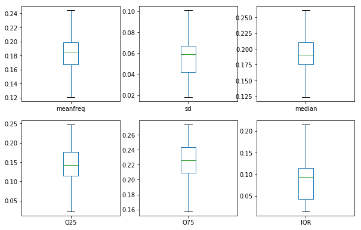


```python
plt.rcParams['figure.figsize'] = (10,10)
dataset[colunas[6:6 * 2]].plot(kind='box', subplots=True, layout=(3,3), sharex=False, sharey=False)
plt.show()
```


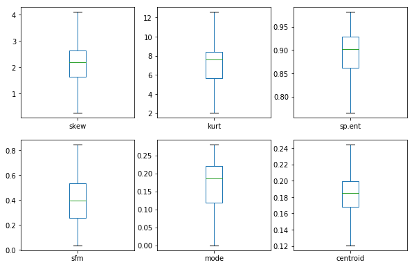


```python
plt.rcParams['figure.figsize'] = (10,10)
dataset[colunas[6 *2 :6 * 3]].plot(kind='box', subplots=True, layout=(3,3), sharex=False, sharey=False)
plt.show()
```


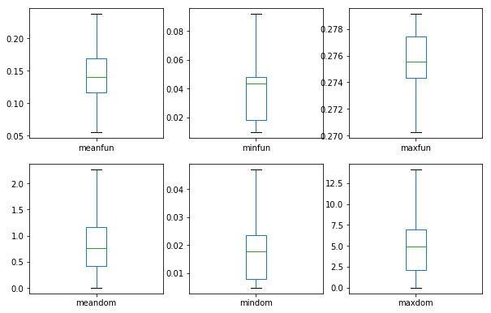


```python
plt.rcParams['figure.figsize'] = (10,10)
dataset[colunas[6 *3 :6 * 4]].plot(kind='box', subplots=True, layout=(3,3), sharex=False, sharey=False)
plt.show()
```


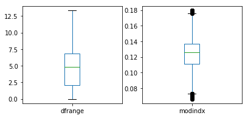


## Fim do resumo: análise exploraria.

---


---


---
# Procedimentos de avaliação de modelo
Train/Test Split
K-Fold Cross Validation

##  2)  Preparando a base para usar no modelo de Árvore de Classificação e Regressão.


```python
print(dataset.head().transpose())
```

                        0           1           2          3          4
    Unnamed: 0          0           1           2          3          4
    meanfreq     0.183506    0.183506    0.183506   0.151228    0.13512
    sd          0.0642413     0.06731   0.0838294  0.0721106  0.0791461
    median       0.190591    0.190591    0.190591   0.158011   0.124656
    Q25          0.142287    0.142482    0.142287  0.0965817  0.0787202
    Q75          0.225624    0.225624    0.225624   0.207955   0.206045
    IQR          0.075122   0.0732523    0.123207   0.111374   0.127325
    skew          2.19606     2.19606     2.19606    1.23283    1.10117
    kurt          8.44236     8.44236     8.44236     4.1773    4.33371
    sp.ent       0.893369    0.892193    0.846389   0.963322   0.971955
    sfm          0.491918    0.513724    0.478905   0.727232   0.783568
    mode                0           0           0  0.0838782   0.104261
    centroid     0.183506    0.183506    0.183506   0.151228    0.13512
    meanfun     0.0842791    0.107937   0.0987063  0.0889648   0.106398
    minfun      0.0157017   0.0158259   0.0156556  0.0177976  0.0169312
    maxfun       0.275862    0.274345    0.271186   0.274345   0.275533
    meandom     0.0078125  0.00901442  0.00799006   0.201497   0.712812
    mindom      0.0078125   0.0078125   0.0078125  0.0078125  0.0078125
    maxdom      0.0078125   0.0546875    0.015625     0.5625    5.48438
    dfrange             0    0.046875   0.0078125   0.554688    5.47656
    modindx      0.133737    0.124252    0.124252    0.12905   0.126195
    label            male        male        male       male       male
    

##  3)  Removendo indexador salvo durante a análise da base.


```python
df_pre=dataset.drop(columns=['Unnamed: 0'])
```


```python
dataset=df_pre
print(dataset.head().transpose())
```

                      0           1           2          3          4
    meanfreq   0.183506    0.183506    0.183506   0.151228    0.13512
    sd        0.0642413     0.06731   0.0838294  0.0721106  0.0791461
    median     0.190591    0.190591    0.190591   0.158011   0.124656
    Q25        0.142287    0.142482    0.142287  0.0965817  0.0787202
    Q75        0.225624    0.225624    0.225624   0.207955   0.206045
    IQR        0.075122   0.0732523    0.123207   0.111374   0.127325
    skew        2.19606     2.19606     2.19606    1.23283    1.10117
    kurt        8.44236     8.44236     8.44236     4.1773    4.33371
    sp.ent     0.893369    0.892193    0.846389   0.963322   0.971955
    sfm        0.491918    0.513724    0.478905   0.727232   0.783568
    mode              0           0           0  0.0838782   0.104261
    centroid   0.183506    0.183506    0.183506   0.151228    0.13512
    meanfun   0.0842791    0.107937   0.0987063  0.0889648   0.106398
    minfun    0.0157017   0.0158259   0.0156556  0.0177976  0.0169312
    maxfun     0.275862    0.274345    0.271186   0.274345   0.275533
    meandom   0.0078125  0.00901442  0.00799006   0.201497   0.712812
    mindom    0.0078125   0.0078125   0.0078125  0.0078125  0.0078125
    maxdom    0.0078125   0.0546875    0.015625     0.5625    5.48438
    dfrange           0    0.046875   0.0078125   0.554688    5.47656
    modindx    0.133737    0.124252    0.124252    0.12905   0.126195
    label          male        male        male       male       male
    

##  4)  Substituindo female=1, male=0 e troca por o rótulo label=sexo.


```python
df_pre['label'] = df_pre['label'].replace({'female': 1, 'male': 0})
```


```python
dataset = df_pre
```


```python
df =dataset.rename(columns={'label': 'sexo'})
print(df.head().transpose())
```

                     0         1         2         3         4
    meanfreq  0.183506  0.183506  0.183506  0.151228  0.135120
    sd        0.064241  0.067310  0.083829  0.072111  0.079146
    median    0.190591  0.190591  0.190591  0.158011  0.124656
    Q25       0.142287  0.142482  0.142287  0.096582  0.078720
    Q75       0.225624  0.225624  0.225624  0.207955  0.206045
    IQR       0.075122  0.073252  0.123207  0.111374  0.127325
    skew      2.196061  2.196061  2.196061  1.232831  1.101174
    kurt      8.442361  8.442361  8.442361  4.177296  4.333713
    sp.ent    0.893369  0.892193  0.846389  0.963322  0.971955
    sfm       0.491918  0.513724  0.478905  0.727232  0.783568
    mode      0.000000  0.000000  0.000000  0.083878  0.104261
    centroid  0.183506  0.183506  0.183506  0.151228  0.135120
    meanfun   0.084279  0.107937  0.098706  0.088965  0.106398
    minfun    0.015702  0.015826  0.015656  0.017798  0.016931
    maxfun    0.275862  0.274345  0.271186  0.274345  0.275533
    meandom   0.007812  0.009014  0.007990  0.201497  0.712812
    mindom    0.007812  0.007812  0.007812  0.007812  0.007812
    maxdom    0.007812  0.054688  0.015625  0.562500  5.484375
    dfrange   0.000000  0.046875  0.007812  0.554688  5.476562
    modindx   0.133737  0.124252  0.124252  0.129050  0.126195
    sexo      0.000000  0.000000  0.000000  0.000000  0.000000
    

#  5)   Dataset: Train/Test Split para o modelo de Árvore de Classificação e Regressão.
Esse método divide o conjunto de dados em duas partes: um conjunto de treinamento e um conjunto de testes. O conjunto de treinamento é usado para treinar o modelo. Também podemos medir a precisão do modelo no conjunto de treinamento, mas não devemos avaliar modelos com base somente nessa métrica.


##   6)   Separando as variáveis independentes da variável resposta.


```python
X_entrada = df.drop(columns=['sexo'])
Y_entrada = df['sexo']
```

##   7)  Mostra variáveis independentes.


```python
print(X_entrada.head().transpose())
```

                     0         1         2         3         4
    meanfreq  0.183506  0.183506  0.183506  0.151228  0.135120
    sd        0.064241  0.067310  0.083829  0.072111  0.079146
    median    0.190591  0.190591  0.190591  0.158011  0.124656
    Q25       0.142287  0.142482  0.142287  0.096582  0.078720
    Q75       0.225624  0.225624  0.225624  0.207955  0.206045
    IQR       0.075122  0.073252  0.123207  0.111374  0.127325
    skew      2.196061  2.196061  2.196061  1.232831  1.101174
    kurt      8.442361  8.442361  8.442361  4.177296  4.333713
    sp.ent    0.893369  0.892193  0.846389  0.963322  0.971955
    sfm       0.491918  0.513724  0.478905  0.727232  0.783568
    mode      0.000000  0.000000  0.000000  0.083878  0.104261
    centroid  0.183506  0.183506  0.183506  0.151228  0.135120
    meanfun   0.084279  0.107937  0.098706  0.088965  0.106398
    minfun    0.015702  0.015826  0.015656  0.017798  0.016931
    maxfun    0.275862  0.274345  0.271186  0.274345  0.275533
    meandom   0.007812  0.009014  0.007990  0.201497  0.712812
    mindom    0.007812  0.007812  0.007812  0.007812  0.007812
    maxdom    0.007812  0.054688  0.015625  0.562500  5.484375
    dfrange   0.000000  0.046875  0.007812  0.554688  5.476562
    modindx   0.133737  0.124252  0.124252  0.129050  0.126195
    


```python
feature_cols=X_entrada.columns
feature_cols
```


    Index(['meanfreq', 'sd', 'median', 'Q25', 'Q75', 'IQR', 'skew', 'kurt',
           'sp.ent', 'sfm', 'mode', 'centroid', 'meanfun', 'minfun', 'maxfun',
           'meandom', 'mindom', 'maxdom', 'dfrange', 'modindx'],
          dtype='object')


```python
Y_entrada.head()
```


    0    0
    1    0
    2    0
    3    0
    4    0
    Name: sexo, dtype: int64


##  8)  Divisão de 30% teste e 70%  para o treino.


```python
X_train,X_test,y_train,y_test=train_test_split(X_entrada,Y_entrada,test_size=0.30,random_state=0)
```


```python
X_train.shape,X_test.shape , y_train.shape, y_test.shape


dictabela = {}
dictabela['Registros para treino'] = X_train.shape[0]
dictabela['Registros para teste'] = X_test.shape[0]


```


```python
dftreinoteste = pandas.DataFrame.from_dict(dictabela, orient="index").reset_index()
```


```python
dftreinoteste =dftreinoteste.rename(columns={'index': 'divisão do dados'})
dftreinoteste =dftreinoteste.rename(columns={0: 'total'})
dftreinoteste

```


<div>
<style scoped>
    .dataframe tbody tr th:only-of-type {
        vertical-align: middle;
    }

    .dataframe tbody tr th {
        vertical-align: top;
    }

    .dataframe thead th {
        text-align: right;
    }
</style>
<table border="1" class="dataframe">
  <thead>
    <tr style="text-align: right;">
      <th></th>
      <th>divisão do dados</th>
      <th>total</th>
    </tr>
  </thead>
  <tbody>
    <tr>
      <td>0</td>
      <td>Registros para treino</td>
      <td>2217</td>
    </tr>
    <tr>
      <td>1</td>
      <td>Registros para teste</td>
      <td>951</td>
    </tr>
  </tbody>
</table>
</div>


##  9)  Normalização dos dados por questão de escala.


```python
# Instantiate 
norm = Normalizer()

# Fit
norm.fit(X_train)

# Transform both training and testing sets
X_train_norm = norm.transform(X_train)
X_test_norm = norm.transform(X_test)
```


```python
X_train_norm.shape , X_test_norm.shape
```


    ((2217, 20), (951, 20))


---


#  10)  Declarando o modelo Index de Gini.

O coeficiente de Gini se calcula como uma razão das áreas no diagrama da curva de Lorenz. Se a área entre a linha de perfeita igualdade e a curva de Lorenz é A, e a área abaixo da curva de Lorenz é B, então o coeficiente de Gini é igual a A/(A+B).

Esta razão se expressa como percentagem ou como equivalente numérico dessa percentagem, que é sempre um número entre 0 e 1. O coeficiente de Gini pode ser calculado com a Fórmula de Brown, que é mais prática:

$${\displaystyle G=1-\sum _{k=0}^{k=n-1}(X_{k+1}-X_{k})(Y_{k+1}+Y_{k})}{\displaystyle G=1-\sum _{k=0}^{k=n-1}(X_{k+1}-X_{k})(Y_{k+1}+Y_{k})}$$

onde:

G = coeficiente de Gini
X = proporção acumulada da variável "população"
Y = proporção acumulada da variável "renda"


```python
# Create Decision Tree
classifier = DecisionTreeClassifier()
```

##  11)  Declarando o modelo para Validação cruzada.


```python
classifierComp = DecisionTreeClassifier()
```

#  Treinamento e teste dos modelos.

##  12)   Principal: modelo.


```python
classifier.fit(X_train,y_train)
```


    DecisionTreeClassifier(class_weight=None, criterion='gini', max_depth=None,
                           max_features=None, max_leaf_nodes=None,
                           min_impurity_decrease=0.0, min_impurity_split=None,
                           min_samples_leaf=1, min_samples_split=2,
                           min_weight_fraction_leaf=0.0, presort=False,
                           random_state=None, splitter='best')


```python
y_pred=classifier.predict(X_test)
```

##    13)  Treinamento do modelo Comparativo em validação cruzada.


```python
accuracy_cross = cross_val_score(classifierComp, X_entrada,Y_entrada, cv = 10, scoring='accuracy').mean()

```

---

# Modelo de avaliação de métricas.

##  16)  Classificação

###  Matriz de confusão.
Uma matriz de confusão pode ser definida livremente como uma tabela que descreve o desempenho de um modelo de classificação em um conjunto de dados de teste para os quais os valores verdadeiros são conhecidos.


```python
cm=confusion_matrix(y_test,y_pred)

```


```python
confusion_matrix_lda = pandas.DataFrame(cm, index = ['Negativos','Positivos'], columns = ['Previsão dos negativos','Previsão dos positivos'] )
confusion_matrix_lda['Total'] = 1
confusion_matrix_lda['Total'][0] = cm[0][0] + cm[0][1]
confusion_matrix_lda['Total'][1] = cm[1][0] + cm[1][1]
```


```python
confusion_matrix_lda
```


<div>
<style scoped>
    .dataframe tbody tr th:only-of-type {
        vertical-align: middle;
    }

    .dataframe tbody tr th {
        vertical-align: top;
    }

    .dataframe thead th {
        text-align: right;
    }
</style>
<table border="1" class="dataframe">
  <thead>
    <tr style="text-align: right;">
      <th></th>
      <th>Previsão dos negativos</th>
      <th>Previsão dos positivos</th>
      <th>Total</th>
    </tr>
  </thead>
  <tbody>
    <tr>
      <td>Negativos</td>
      <td>480</td>
      <td>14</td>
      <td>494</td>
    </tr>
    <tr>
      <td>Positivos</td>
      <td>32</td>
      <td>425</td>
      <td>457</td>
    </tr>
  </tbody>
</table>
</div>


```python
print(confusion_matrix_lda)
```

               Previsão dos negativos  Previsão dos positivos  Total
    Negativos                     480                      14    494
    Positivos                      32                     425    457
    


```python
#Plot the confusion matrix
plt.rcParams['figure.figsize'] = (10,5)
sb.set(font_scale=1.5)
sb.heatmap(cm, annot=True, fmt='g')
plt.show()
```


---

### True Positives:TP
Este valor indica a quantidade de registros que foram classificados como positivos corretamente, ou seja, a resposta do classificador foi que o comentário era positivo e o comentário realmente era positivo.


```python
TP = confusion_matrix_lda['Previsão dos positivos'][1]
dfTP = pandas.DataFrame(TP, index = ['Negativos verdadeiros'], columns = ['Quantidade acertos'] )
```


```python
dfTP
```


<div>
<style scoped>
    .dataframe tbody tr th:only-of-type {
        vertical-align: middle;
    }

    .dataframe tbody tr th {
        vertical-align: top;
    }

    .dataframe thead th {
        text-align: right;
    }
</style>
<table border="1" class="dataframe">
  <thead>
    <tr style="text-align: right;">
      <th></th>
      <th>Quantidade acertos</th>
    </tr>
  </thead>
  <tbody>
    <tr>
      <td>Negativos verdadeiros</td>
      <td>425</td>
    </tr>
  </tbody>
</table>
</div>


```python
print(dfTP)
```

                           Quantidade acertos
    Negativos verdadeiros                 425
    

---

### True Negatives:TN
Este valor indica a quantidade de registros que foram classificados como negativos de maneira correta, ou seja, a resposta do classificador foi que o comentário era negativo e o comentário realmente era negativo.


```python
TN = confusion_matrix_lda['Previsão dos negativos'][0]
dfTN = pandas.DataFrame(TN, index = ['Falso Negativo'], columns = ['Quantidade acertos'] )
```


```python
dfTN
```


<div>
<style scoped>
    .dataframe tbody tr th:only-of-type {
        vertical-align: middle;
    }

    .dataframe tbody tr th {
        vertical-align: top;
    }

    .dataframe thead th {
        text-align: right;
    }
</style>
<table border="1" class="dataframe">
  <thead>
    <tr style="text-align: right;">
      <th></th>
      <th>Quantidade acertos</th>
    </tr>
  </thead>
  <tbody>
    <tr>
      <td>Falso Negativo</td>
      <td>480</td>
    </tr>
  </tbody>
</table>
</div>


```python
print(dfTN)
```

                    Quantidade acertos
    Falso Negativo                 480
    

---

### Falso Positivos - False Positives:FP
Este valor indica a quantidade de registros que foram classificados como comentários positivos de maneira incorreta, ou seja, a resposta do classificador foi que o comentário era positivo, mas o comentário era negativo.


```python
FP = confusion_matrix_lda['Previsão dos positivos'][0]
dfFP = pandas.DataFrame(FP, index = ['Falso Positivo'], columns = ['Quantidade acertos'] )
```


```python
dfFP
```


<div>
<style scoped>
    .dataframe tbody tr th:only-of-type {
        vertical-align: middle;
    }

    .dataframe tbody tr th {
        vertical-align: top;
    }

    .dataframe thead th {
        text-align: right;
    }
</style>
<table border="1" class="dataframe">
  <thead>
    <tr style="text-align: right;">
      <th></th>
      <th>Quantidade acertos</th>
    </tr>
  </thead>
  <tbody>
    <tr>
      <td>Falso Positivo</td>
      <td>14</td>
    </tr>
  </tbody>
</table>
</div>


```python
print(dfFP)
```

                    Quantidade acertos
    Falso Positivo                  14
    

---

### False Negatives:FN
Este valor indica a quantidade de registros que foram classificados como comentários negativos de maneira incorreta, ou seja, a resposta do classificador foi que o comentário era negativo, mas o comentário era positivo.


```python
FN = confusion_matrix_lda['Previsão dos negativos'][1]
dfFN = pandas.DataFrame(FN, index = ['Negativos verdadeiros'], columns = ['Quantidade acertos'] )
```


```python
dfFN
```


<div>
<style scoped>
    .dataframe tbody tr th:only-of-type {
        vertical-align: middle;
    }

    .dataframe tbody tr th {
        vertical-align: top;
    }

    .dataframe thead th {
        text-align: right;
    }
</style>
<table border="1" class="dataframe">
  <thead>
    <tr style="text-align: right;">
      <th></th>
      <th>Quantidade acertos</th>
    </tr>
  </thead>
  <tbody>
    <tr>
      <td>Negativos verdadeiros</td>
      <td>32</td>
    </tr>
  </tbody>
</table>
</div>


```python
print(dfFN)
```

                           Quantidade acertos
    Negativos verdadeiros                  32
    

---

### Especificidade (Specificity)
Especificidade é a proporção de previsões negativas corretas para o total não de previsões negativas. Isso determina o grau de especificidade do classificador na previsão de instâncias positivas.

Specificity = (Numero de previsões negativas correta) / (Total do Numero Negativas prevista)

TN = / TN + FP


```python
Specificity = TN / float(TN + FP)
dfSpecificity = pandas.DataFrame(Specificity, index = ['Specificity'], columns = ['resultado'] )
```


```python
dfSpecificity
```


<div>
<style scoped>
    .dataframe tbody tr th:only-of-type {
        vertical-align: middle;
    }

    .dataframe tbody tr th {
        vertical-align: top;
    }

    .dataframe thead th {
        text-align: right;
    }
</style>
<table border="1" class="dataframe">
  <thead>
    <tr style="text-align: right;">
      <th></th>
      <th>resultado</th>
    </tr>
  </thead>
  <tbody>
    <tr>
      <td>Specificity</td>
      <td>0.97166</td>
    </tr>
  </tbody>
</table>
</div>


```python
print(dfSpecificity)
```

                 resultado
    Specificity    0.97166
    

---

### Precisão Geral (Accuracy)
A precisão da classificação é a proporção de previsões corretas para o total não  de previsões. 

Accuracy = (numero de predições corretas / numero de predições)

$$ Accuracy = \frac{TP + TN}{TP + TN + FP + FN}$$


```python
#trés maneiras de fazer o caluclo
print((TP + TN) / float(TP + TN + FP + FN))
print(accuracy_score(y_test, y_pred))
print("Accuracy ", classifier.score(X_test, y_test)*100)
Accuracy= classifier.score(X_test, y_test)
```

    0.9516298633017876
    0.9516298633017876
    Accuracy  95.16298633017875
    


```python
dfAccuracy = pandas.DataFrame(Accuracy, index = ['Accuracy'], columns = ['resultado'] )
dfAccuracy
```


<div>
<style scoped>
    .dataframe tbody tr th:only-of-type {
        vertical-align: middle;
    }

    .dataframe tbody tr th {
        vertical-align: top;
    }

    .dataframe thead th {
        text-align: right;
    }
</style>
<table border="1" class="dataframe">
  <thead>
    <tr style="text-align: right;">
      <th></th>
      <th>resultado</th>
    </tr>
  </thead>
  <tbody>
    <tr>
      <td>Accuracy</td>
      <td>0.95163</td>
    </tr>
  </tbody>
</table>
</div>


```python
print(dfAccuracy)
```

              resultado
    Accuracy    0.95163
    

---

### Sensibilidade ou recordação Recall


Sensibilidade ou recordação é a razão de previsões positivas corretas para o total não de previsões positivas, ou, mais simplesmente, quão sensível o classificador é para detectar instâncias positivas. Isso também é chamado de True Positive Rate

Recall = (Numero de positivas previstas corretamente) /( total de Predições positivas)

$$Recall = \frac{TP}{TP +FN}$$


```python
print(TP / float(TP + FN))
print(recall_score(y_test, y_pred))
Recall= recall_score(y_test, y_pred)
```

    0.9299781181619255
    0.9299781181619255
    


```python
dfRecall = pandas.DataFrame(Recall, index = ['Sensibilidade-Recall'], columns = ['resultado'] )
dfRecall
```


<div>
<style scoped>
    .dataframe tbody tr th:only-of-type {
        vertical-align: middle;
    }

    .dataframe tbody tr th {
        vertical-align: top;
    }

    .dataframe thead th {
        text-align: right;
    }
</style>
<table border="1" class="dataframe">
  <thead>
    <tr style="text-align: right;">
      <th></th>
      <th>resultado</th>
    </tr>
  </thead>
  <tbody>
    <tr>
      <td>Sensibilidade-Recall</td>
      <td>0.929978</td>
    </tr>
  </tbody>
</table>
</div>


```python
print(dfRecall)
```

                          resultado
    Sensibilidade-Recall   0.929978
    

---

## Taxa positiva falsa (False Positive Rate)
A *false positive rate*, é a proporção de previsões negativas que foram determinadas como positivas para o número total de previsões negativas ou quando o valor real é negativo, com que frequência a previsão é incorreta.

FalsePositveRate = Números de falsos positivos / Total de predições negativas


$$FalsePositveRate = \frac{FP}{ TN + FP}$$


```python
print(FP / float(TN + FP))
FalsePositveRate = FP / float(TN + FP)
```

    0.02834008097165992
    


```python
dfFalsePositveRate = pandas.DataFrame(FalsePositveRate, index = ['Taxa de Falso Positvo'], columns = ['resultado'] )
dfFalsePositveRate
```


<div>
<style scoped>
    .dataframe tbody tr th:only-of-type {
        vertical-align: middle;
    }

    .dataframe tbody tr th {
        vertical-align: top;
    }

    .dataframe thead th {
        text-align: right;
    }
</style>
<table border="1" class="dataframe">
  <thead>
    <tr style="text-align: right;">
      <th></th>
      <th>resultado</th>
    </tr>
  </thead>
  <tbody>
    <tr>
      <td>Taxa de Falso Positvo</td>
      <td>0.02834</td>
    </tr>
  </tbody>
</table>
</div>


```python
print(dfFalsePositveRate)
```

                           resultado
    Taxa de Falso Positvo    0.02834
    

---
### Precisão (Precision)
A precisão é a proporção de previsões corretas para o total  de não previsões preditas corretas. Isso mede a precisão do classificador ao prever instâncias positivas.

Precision = Número de positivas verdadeiras / Numero total de predicados positivos

$$Precision = \frac{TP} {TP + FP}$$


```python
print(TP / float(TP + FP))
print(precision_score(y_test, y_pred))
Precision = precision_score(y_test, y_pred)
```

    0.9681093394077449
    0.9681093394077449
    


```python
dfPrecision = pandas.DataFrame(Precision, index = ['Precisão'], columns = ['resultado'] )
dfPrecision
```


<div>
<style scoped>
    .dataframe tbody tr th:only-of-type {
        vertical-align: middle;
    }

    .dataframe tbody tr th {
        vertical-align: top;
    }

    .dataframe thead th {
        text-align: right;
    }
</style>
<table border="1" class="dataframe">
  <thead>
    <tr style="text-align: right;">
      <th></th>
      <th>resultado</th>
    </tr>
  </thead>
  <tbody>
    <tr>
      <td>Precisão</td>
      <td>0.968109</td>
    </tr>
  </tbody>
</table>
</div>


```python
print(dfPrecision)
```

              resultado
    Precisão   0.968109
    

---

### F1 Score
O F1 Score é uma média harmônica entre precisão (que, apesar de ter o mesmo nome, não é a mesma citada acima) e recall. Veja abaixo as definições destes dois termos.

Ela é muito boa quando você possui um dataset com classes desproporcionais, e o seu modelo não emite probabilidades. Em geral, quanto maior o F1 score, melhor.


$$F1Score = \frac{2 \times Precisão \times Recall }{Precisão + Recall}$$


```python
F1Score = 2 * Precision *  Recall /  Precision + Recall
```


```python
print(F1Score)

```

    2.7899343544857764
    


```python
dfF1Score = pandas.DataFrame(F1Score, index = ['F1 Score'], columns = ['resultado'] )
dfF1Score
```


<div>
<style scoped>
    .dataframe tbody tr th:only-of-type {
        vertical-align: middle;
    }

    .dataframe tbody tr th {
        vertical-align: top;
    }

    .dataframe thead th {
        text-align: right;
    }
</style>
<table border="1" class="dataframe">
  <thead>
    <tr style="text-align: right;">
      <th></th>
      <th>resultado</th>
    </tr>
  </thead>
  <tbody>
    <tr>
      <td>F1 Score</td>
      <td>2.789934</td>
    </tr>
  </tbody>
</table>
</div>


```python
print(dfF1Score)
```

              resultado
    F1 Score   2.789934
    

---
### Curva ROC
Uma curva ROC é uma forma comumente usada para visualizar o desempenho de um classificador binário, significando um classificador com duas classes de saída possíveis. A curva plota a Taxa Positiva Real (Recall) contra a Taxa Falsa Positiva (também interpretada como Especificidade 1).


```python
def plot_roc_curve(fpr, tpr):
    plt.plot(fpr, tpr, color='red', label='ROC')
    plt.plot([0, 1], [0, 1], color='darkblue', linestyle='--')
    plt.xlabel('Taxa de falsos positivos')
    plt.ylabel('Taxa de verdadeiros positivos')
    plt.title('Curva ROC:Receiver Operating Characteristic (ROC) Curve')
    plt.legend()
    plt.show()
```

#### Calcula a propabildade de previsão.


```python
y_pred_prob = classifier.predict_proba(X_test)[:, 1]
```


```python
fpr, tpr, thresholds = roc_curve(y_test, y_pred_prob)
```


```python
plot_roc_curve(fpr, tpr)
```


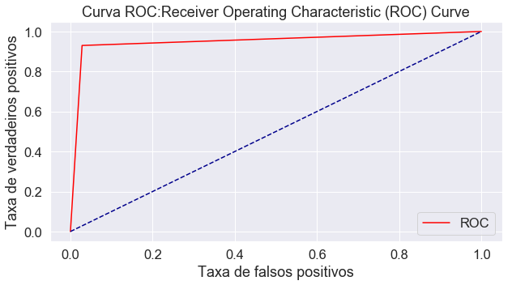


---

### AUC (área sob a curva) da Curva ROC
AUC ou Area Under the Curve é a porcentagem do gráfico do ROC que está abaixo da curva. AUC é útil como um único número de resumo do desempenho do classificador.


```python
print(roc_auc_score(y_test, y_pred_prob))
Auc=roc_auc_score(y_test, y_pred_prob)
```

    0.9508190185951327
    


```python
dfAuc = pandas.DataFrame(Auc, index = ['AUC'], columns = ['resultado'] )
dfAuc
```


<div>
<style scoped>
    .dataframe tbody tr th:only-of-type {
        vertical-align: middle;
    }

    .dataframe tbody tr th {
        vertical-align: top;
    }

    .dataframe thead th {
        text-align: right;
    }
</style>
<table border="1" class="dataframe">
  <thead>
    <tr style="text-align: right;">
      <th></th>
      <th>resultado</th>
    </tr>
  </thead>
  <tbody>
    <tr>
      <td>AUC</td>
      <td>0.950819</td>
    </tr>
  </tbody>
</table>
</div>


```python
print(dfAuc)
```

         resultado
    AUC   0.950819
    

---
### Histograma das Probabilidades da Previsão.
Após o treinamento, o modelo expõe um atributo chamado predict_prob, que retorna a probabilidade de os dados do teste estarem em uma determinada classe de resposta. A partir disso, obteremos as probabilidades de prever um resultado par determinr a genrero pela voz.


```python
plt.hist(y_pred_prob, bins=8, linewidth=1.2)
plt.xlim(0, 1)
plt.title('Histograma das Probabilidade da Previsão')
plt.xlabel('Previsão de probabilidade de ser voz feminina')
plt.ylabel('Frequência')
```


    Text(0, 0.5, 'Frequência')


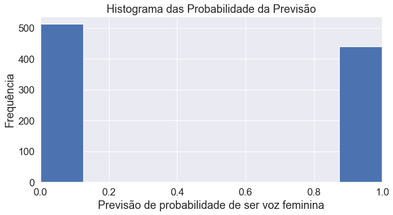


---
### Precisão Geral (Accuracy_cross) por validação cruzada.
Precissão do modelo sobre tecnicar de Validação cruzada media dos resultados.


```python
accuracy_cross

```


    0.9517534431971978


```python
dfaccuracy_cross = pandas.DataFrame(accuracy_cross, index = ['Acurácia por validação cruzada'], columns = ['resultado'] )
dfaccuracy_cross
```


<div>
<style scoped>
    .dataframe tbody tr th:only-of-type {
        vertical-align: middle;
    }

    .dataframe tbody tr th {
        vertical-align: top;
    }

    .dataframe thead th {
        text-align: right;
    }
</style>
<table border="1" class="dataframe">
  <thead>
    <tr style="text-align: right;">
      <th></th>
      <th>resultado</th>
    </tr>
  </thead>
  <tbody>
    <tr>
      <td>Acurácia por validação cruzada</td>
      <td>0.951753</td>
    </tr>
  </tbody>
</table>
</div>


```python
print(dfaccuracy_cross)
```

                                    resultado
    Acurácia por validação cruzada   0.951753
    

---
### Taxa entre as Accuracy e Accuracy_cross.
Taxa Perda de acurácia da validação cruzada em relação acurácia.

$$ RateLossAAC = \frac{Accuracy - Accuracy_cross }{Accuracy \times AccuracyCross} \times 100$$


```python
print((Accuracy - accuracy_cross)/ Accuracy * accuracy_cross * 100) 
RateLossAAC = (Accuracy - accuracy_cross)/ Accuracy * accuracy_cross * 100
```

    -0.012359594365665357
    


```python
dfRateLossAAC = pandas.DataFrame(RateLossAAC, index = ['Taxas perdas em acurácia e acurácia por validação cruzada'], columns = ['resultado'] )
dfRateLossAAC
```


<div>
<style scoped>
    .dataframe tbody tr th:only-of-type {
        vertical-align: middle;
    }

    .dataframe tbody tr th {
        vertical-align: top;
    }

    .dataframe thead th {
        text-align: right;
    }
</style>
<table border="1" class="dataframe">
  <thead>
    <tr style="text-align: right;">
      <th></th>
      <th>resultado</th>
    </tr>
  </thead>
  <tbody>
    <tr>
      <td>Taxas perdas em acurácia e acurácia por validação cruzada</td>
      <td>-0.01236</td>
    </tr>
  </tbody>
</table>
</div>


```python
print(dfRateLossAAC)
```

                                                        resultado
    Taxas perdas em acurácia e acurácia por validaç...   -0.01236
    


```python

```


```python
from sklearn.tree import export_graphviz
from sklearn.externals.six import StringIO  
from IPython.display import Image  
import pydotplus

dot_data = StringIO()
export_graphviz(classifier, out_file=dot_data,  
                filled=True, rounded=True,
                special_characters=True,feature_names = feature_cols,class_names=['0','1'])
graph = pydotplus.graph_from_dot_data(dot_data.getvalue())  
graph.write_png('vozes.png')
Image(graph.create_png())
```

    c:\users\jorge\appdata\local\programs\python\python37-32\lib\site-packages\sklearn\externals\six.py:31: DeprecationWarning: The module is deprecated in version 0.21 and will be removed in version 0.23 since we've dropped support for Python 2.7. Please rely on the official version of six (https://pypi.org/project/six/).
      "(https://pypi.org/project/six/).", DeprecationWarning)
    


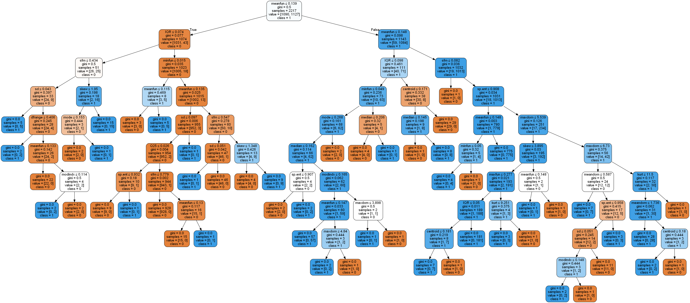


---
## Entropia como critério.
A entropia caracteriza a (im)pureza dos dados:
em um conjunto de dados, é uma medida da falta de homogeneidade dos dados de
entrada em relação a sua classificação. 


##  19)  Divisão de 30% teste e 70%  para o treino.


```python

dictabela = {}
dictabela['Registros para treino'] = X_train.shape[0]
dictabela['Registros para teste'] = X_test.shape[0]
```


```python
dftreinoteste = pandas.DataFrame.from_dict(dictabela, orient="index").reset_index()
```


```python
dftreinoteste =dftreinoteste.rename(columns={'index': 'divisão do dados'})
dftreinoteste =dftreinoteste.rename(columns={0: 'total'})
dftreinoteste
```


<div>
<style scoped>
    .dataframe tbody tr th:only-of-type {
        vertical-align: middle;
    }

    .dataframe tbody tr th {
        vertical-align: top;
    }

    .dataframe thead th {
        text-align: right;
    }
</style>
<table border="1" class="dataframe">
  <thead>
    <tr style="text-align: right;">
      <th></th>
      <th>divisão do dados</th>
      <th>total</th>
    </tr>
  </thead>
  <tbody>
    <tr>
      <td>0</td>
      <td>Registros para treino</td>
      <td>2217</td>
    </tr>
    <tr>
      <td>1</td>
      <td>Registros para teste</td>
      <td>951</td>
    </tr>
  </tbody>
</table>
</div>


```python
print(X_train_norm.shape , X_test_norm.shape)
```

    (2217, 20) (951, 20)
    

---
---
##  21)   Declarando o Modelo de Árvore de Classificação e Regressão com critério de entropy.


```python
# Create Decision Tree classifer object
Rclassifier = DecisionTreeClassifier(criterion="entropy", max_depth=3)
```

##  22)  Declarando o modelo para Validação cruzada.


```python
# Create Decision Tree classifer object
RclassifierComp = DecisionTreeClassifier(criterion="entropy", max_depth=3)
```

## 23)Treinando o modelo com critério *entropy*.

### Principal dos modelos.


```python
Rclassifier.fit(X_train,y_train)
```


    DecisionTreeClassifier(class_weight=None, criterion='entropy', max_depth=3,
                           max_features=None, max_leaf_nodes=None,
                           min_impurity_decrease=0.0, min_impurity_split=None,
                           min_samples_leaf=1, min_samples_split=2,
                           min_weight_fraction_leaf=0.0, presort=False,
                           random_state=None, splitter='best')


```python
yr_pred=Rclassifier.predict(X_test)
```

##  Declarando o modelo para Validação cruzada.


```python
Raccuracy_cross = cross_val_score(RclassifierComp, X_entrada,Y_entrada, cv = 10, scoring='accuracy').mean()
```

---
# Modelo:Avaliação de métricas.

### Matriz de confusão.


```python
rcm=confusion_matrix(y_test,yr_pred)
```


```python
rconfusion_matrix_lda = pandas.DataFrame(rcm, index = ['Negativos','Positivos'], columns = ['Previsão dos negativos','Previsão dos positivos'] )
rconfusion_matrix_lda['Total'] = 1
rconfusion_matrix_lda['Total'][0] = rcm[0][0] + rcm[0][1]
rconfusion_matrix_lda['Total'][1] = rcm[1][0] + rcm[1][1]
```


```python
rconfusion_matrix_lda
```


<div>
<style scoped>
    .dataframe tbody tr th:only-of-type {
        vertical-align: middle;
    }

    .dataframe tbody tr th {
        vertical-align: top;
    }

    .dataframe thead th {
        text-align: right;
    }
</style>
<table border="1" class="dataframe">
  <thead>
    <tr style="text-align: right;">
      <th></th>
      <th>Previsão dos negativos</th>
      <th>Previsão dos positivos</th>
      <th>Total</th>
    </tr>
  </thead>
  <tbody>
    <tr>
      <td>Negativos</td>
      <td>484</td>
      <td>10</td>
      <td>494</td>
    </tr>
    <tr>
      <td>Positivos</td>
      <td>22</td>
      <td>435</td>
      <td>457</td>
    </tr>
  </tbody>
</table>
</div>


```python
print(rconfusion_matrix_lda)
```

               Previsão dos negativos  Previsão dos positivos  Total
    Negativos                     484                      10    494
    Positivos                      22                     435    457
    


```python
#Plot the confusion matrix
plt.rcParams['figure.figsize'] = (10,5)
sb.set(font_scale=1.5)
sb.heatmap(rcm, annot=True, fmt='g')
plt.show()
```


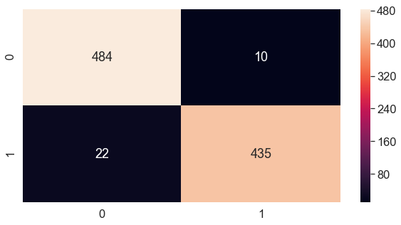


---

### Precisão Geral (Accuracy)
A precisão da classificação é a proporção de previsões corretas para o total não  de previsões. 

Accuracy = (numero de predições corretas / numero de predições)

$$ Accuracy = \frac{TP + TN}{TP + TN + FP + FN}$$


```python
RAccuracy= Rclassifier.score(X_test, y_test)
```


```python
dfRAccuracy = pandas.DataFrame(RAccuracy, index = ['Accuracy'], columns = ['resultado'] )
dfRAccuracy
```


<div>
<style scoped>
    .dataframe tbody tr th:only-of-type {
        vertical-align: middle;
    }

    .dataframe tbody tr th {
        vertical-align: top;
    }

    .dataframe thead th {
        text-align: right;
    }
</style>
<table border="1" class="dataframe">
  <thead>
    <tr style="text-align: right;">
      <th></th>
      <th>resultado</th>
    </tr>
  </thead>
  <tbody>
    <tr>
      <td>Accuracy</td>
      <td>0.966351</td>
    </tr>
  </tbody>
</table>
</div>


```python
print(dfRAccuracy)
```

              resultado
    Accuracy   0.966351
    

### Curva ROC


```python
yr_pred_prob = Rclassifier.predict_proba(X_test)[:, 1]
```


```python
rfpr, rtpr, rthresholds = roc_curve(y_test, yr_pred_prob)
```


```python
plot_roc_curve(rfpr, rtpr)
```


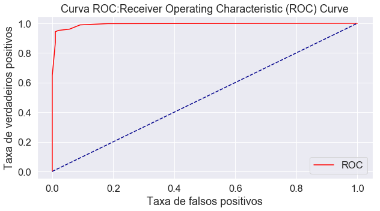


### AUC (área sob a curva) da Curva ROC.


```python
print(roc_auc_score(y_test, yr_pred_prob))
rAuc=roc_auc_score(y_test, yr_pred_prob)
```

    0.9930788720665491
    


```python
dfrAuc = pandas.DataFrame(rAuc, index = ['AUC'], columns = ['resultado'] )
dfrAuc
```


<div>
<style scoped>
    .dataframe tbody tr th:only-of-type {
        vertical-align: middle;
    }

    .dataframe tbody tr th {
        vertical-align: top;
    }

    .dataframe thead th {
        text-align: right;
    }
</style>
<table border="1" class="dataframe">
  <thead>
    <tr style="text-align: right;">
      <th></th>
      <th>resultado</th>
    </tr>
  </thead>
  <tbody>
    <tr>
      <td>AUC</td>
      <td>0.993079</td>
    </tr>
  </tbody>
</table>
</div>


```python
print(dfrAuc)
```

         resultado
    AUC   0.993079
    

---
### Precisão Geral (Accuracy_cross) por validação cruzada.
Precissão do modelo sobre tecnicar de Validação cruzada media dos resultados.


```python
print(Raccuracy_cross)
```

    0.9533197993790303
    


```python
dfRaccuracy_cross = pandas.DataFrame(Raccuracy_cross, index = ['Acurácia por validação cruzada'], columns = ['resultado'] )
dfRaccuracy_cross
```


<div>
<style scoped>
    .dataframe tbody tr th:only-of-type {
        vertical-align: middle;
    }

    .dataframe tbody tr th {
        vertical-align: top;
    }

    .dataframe thead th {
        text-align: right;
    }
</style>
<table border="1" class="dataframe">
  <thead>
    <tr style="text-align: right;">
      <th></th>
      <th>resultado</th>
    </tr>
  </thead>
  <tbody>
    <tr>
      <td>Acurácia por validação cruzada</td>
      <td>0.95332</td>
    </tr>
  </tbody>
</table>
</div>


```python
print(dfRaccuracy_cross)
```

                                    resultado
    Acurácia por validação cruzada    0.95332
    

---
### Taxa entre as Accuracy e Accuracy_cross.
Taxa Perda de acurácia da validação cruzada em relação acurácia.

$$ RateLossAAC = \frac{Accuracy - Accuracy_cross }{Accuracy \times AccuracyCross} \times 100$$


```python
print((RAccuracy - Raccuracy_cross)/ RAccuracy * Raccuracy_cross * 100) 
RRateLossAAC = (RAccuracy - Raccuracy_cross)/ RAccuracy * Raccuracy_cross * 100
```

    1.285567910312283
    


```python
dfRRateLossAAC = pandas.DataFrame(RRateLossAAC, index = ['Taxas perdas em acurácia e acurácia por validação cruzada'], columns = ['resultado'] )
dfRRateLossAAC
```


<div>
<style scoped>
    .dataframe tbody tr th:only-of-type {
        vertical-align: middle;
    }

    .dataframe tbody tr th {
        vertical-align: top;
    }

    .dataframe thead th {
        text-align: right;
    }
</style>
<table border="1" class="dataframe">
  <thead>
    <tr style="text-align: right;">
      <th></th>
      <th>resultado</th>
    </tr>
  </thead>
  <tbody>
    <tr>
      <td>Taxas perdas em acurácia e acurácia por validação cruzada</td>
      <td>1.285568</td>
    </tr>
  </tbody>
</table>
</div>


```python
print(dfRRateLossAAC)
```

                                                        resultado
    Taxas perdas em acurácia e acurácia por validaç...   1.285568
    


```python

```


```python
from sklearn.externals.six import StringIO  
from IPython.display import Image  
from sklearn.tree import export_graphviz
import pydotplus
dot_data = StringIO()
export_graphviz(Rclassifier, out_file=dot_data,  
                filled=True, rounded=True,
                special_characters=True, feature_names = feature_cols,class_names=['0','1'])
graph = pydotplus.graph_from_dot_data(dot_data.getvalue())  
graph.write_png('vozes2x.png')
Image(graph.create_png())
```


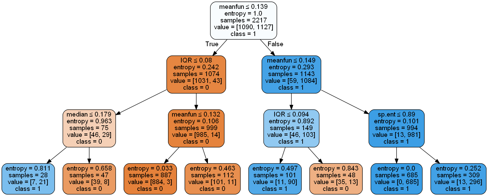


---


## Gráficos comparativos.

### Acurácia entre modelos de Árvore de Classificação e Regressão co, todos dados, treinado por validação cruzada, treinado com redução de dimensionabilidade.


```python
df = pandas.DataFrame(([Accuracy,accuracy_cross,RAccuracy,Raccuracy_cross],[]), 
                  index=['Accuracy Score',''],
                  columns=pandas.Index(['M3 CART: Gini','M3 CART e validação cruzada: Gini','M4 CART: Entropia','M4 CART e validação cruzada: Entropia'], 
                 name='Valores Maximos')).round(2)
df.plot(kind='bar',figsize=(15,8))
```


    <matplotlib.axes._subplots.AxesSubplot at 0x1516d1d0>


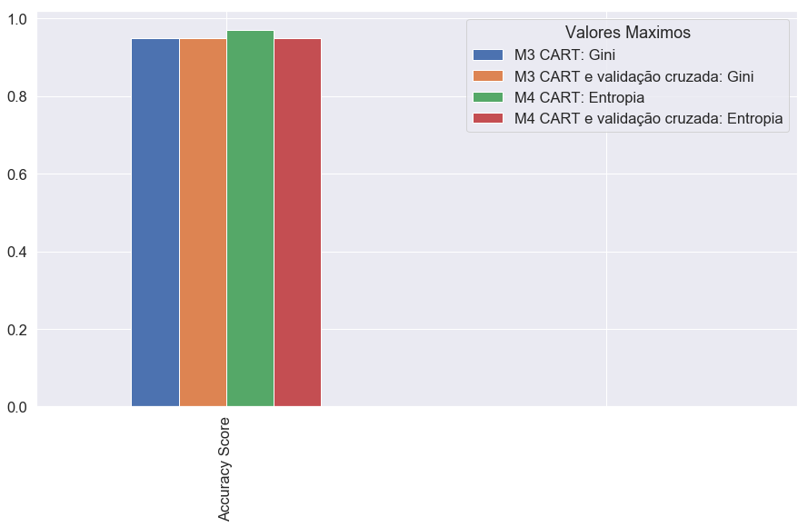


### Acurácia e área da curva da ROC entre modelos de regressão logística e  regressão logística com redução de dimensionabilidade.


```python
df = pandas.DataFrame(([Auc,rAuc,],[Accuracy,RAccuracy],[]), 
                  index=['AUC','Accuracy',''],
                  columns=pandas.Index(['M3 CART: Gini','M3 CART: Entropy'], 
                 name='Valores Maximos')).round(2)
df.plot(kind='bar',figsize=(15,8))
```


    <matplotlib.axes._subplots.AxesSubplot at 0x14e7ea50>


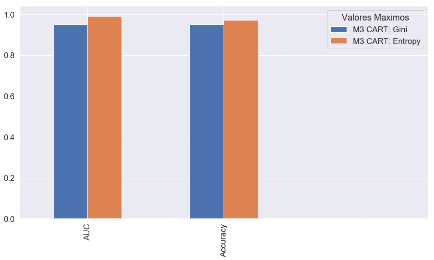


# Fim da avaliação do modelo.


```python
dic_logist={}
```


```python
dic_logist['RAccuracy']=RAccuracy
dic_logist['Accuracy']=Accuracy

dic_logist['accuracy_cross']=accuracy_cross
dic_logist['Raccuracy_cross']=Raccuracy_cross

dic_logist['Auc']=Auc
dic_logist['rAuc']=rAuc

dic_logist['rfpr']=rfpr
dic_logist['rtpr']=rtpr


dic_logist['fpr']=fpr
dic_logist['tpr']=tpr
```


```python
import pickle
```


```python
filename = 'cart.jss'
outfile = open(filename,'wb')
pickle.dump(dic_logist,outfile)
outfile.close()
```


```python
infile = open(filename,'rb')
test_dict = pickle.load(infile)
infile.close()
```


```python
print(test_dict)
```

    {'RAccuracy': 0.9663512092534174, 'Accuracy': 0.9516298633017876, 'accuracy_cross': 0.9517534431971978, 'Raccuracy_cross': 0.9533197993790303, 'Auc': 0.9508190185951327, 'rAuc': 0.9930788720665491, 'rfpr': array([0.        , 0.        , 0.01012146, 0.01012146, 0.02024291,
           0.05668016, 0.09109312, 0.18218623, 1.        ]), 'rtpr': array([0.        , 0.64770241, 0.87089716, 0.94310722, 0.95185996,
           0.96061269, 0.98905908, 0.99781182, 1.        ]), 'fpr': array([0.        , 0.02834008, 1.        ]), 'tpr': array([0.        , 0.92997812, 1.        ])}
    


```python
print(type(test_dict))
```

    <class 'dict'>
    


```python

```


```python

```


# Análise exploratória.

## [Análise exploratória on-line](https://github.com/joctal/tcc/blob/master/TCC_ANALISE_Descritiva/README.md)

### TCC_ANALISE_Descritiva.ipynb (arquivo jupyter)
###  TCC_ANALISE_Descritiva.pdf   (resultados em pdf)
###  TCC_ANALISE_Descritiva.html   (resultados em html com as imagens)
###  R_TCC_ANALISE_EXPLORATORIA.Rmd  (análise feita em Rstudio)
###  R_TCC_ANALISE_EXPLORATORIA.pdf (resultados sem tratamento em R)

---

# Análise do modelo:  regressão logística.

## [Análise  regressão logística on-line](https://github.com/joctal/tcc/blob/master/TCC_analise_modelo_regressao_logistica/README.md)

### TCC_analise_modelo_regressao_logistica.ipynb (arquivo jupyter)
### TCC_analise_modelo_regressao_logistica.pdf   (resultados em pdf)
### TCC_analise_modelo_regressao_logistica.html   (resultados em html com as imagens)


# Análise do modelo:   Árvore de Classificação e Regressão ( CART ).

## [Árvore de Classificação e Regressão on-line](https://github.com/joctal/tcc/blob/master/TCC_CART/README.md)

### TCC_CART.ipynb (arquivo jupyter)
### TCC_CART.pdf   (resultados em pdf)
### TCC_CART.html   (resultados em html com as imagens)


