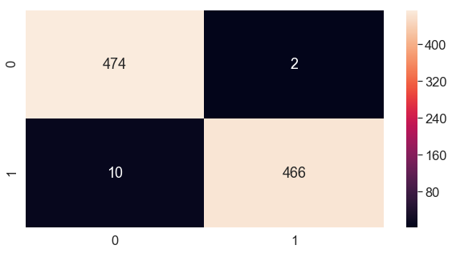
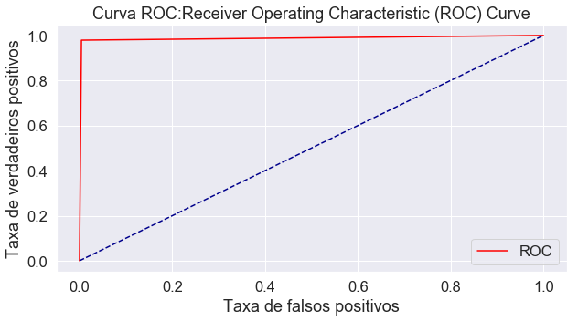
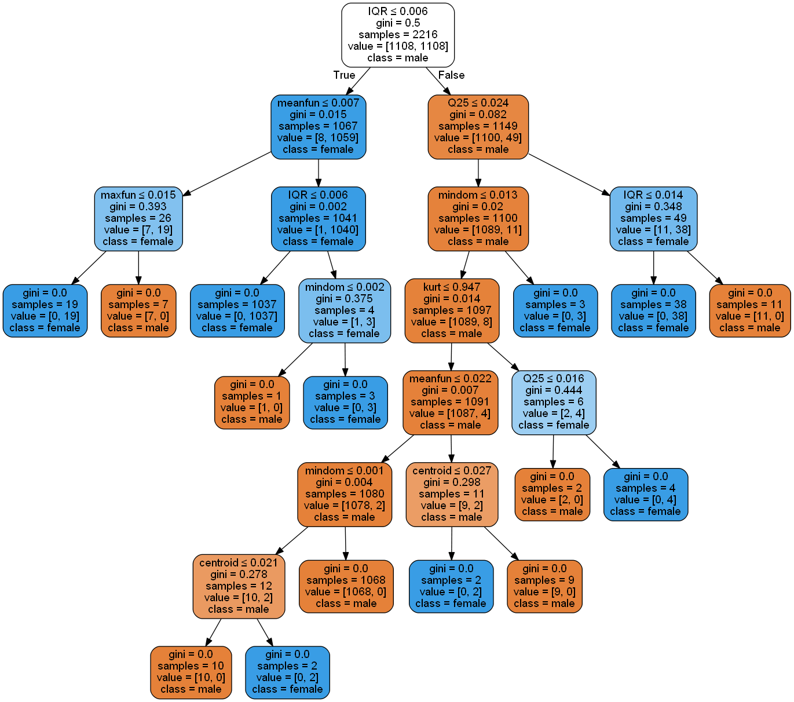

# MODELO 2 - Avaliação do Modelo de Árvore de Classificação ( CART ).

### Introdução.
##### Este  Notebook é destina a avaliação do modelo de Árvore de Classificação

---

---

---


```python
%matplotlib inline
```


```python
# Importa as bibliotecas
import pandas
import matplotlib.pyplot as plt
import numpy 
#from pandas.tools.plotting import scatter_matrix
from  pandas.plotting  import scatter_matrix
import seaborn as sb
from sklearn.model_selection import train_test_split,cross_val_score
from sklearn.preprocessing import Normalizer
#Logistic Regression
from sklearn.linear_model import LogisticRegression
from sklearn.metrics import roc_auc_score , roc_curve, auc ,accuracy_score,recall_score, precision_score
import statsmodels.api as sm
from sklearn.metrics import confusion_matrix
# Load libraries
import pandas as pd
from sklearn.tree import DecisionTreeClassifier # Import Decision Tree Classifier
from sklearn import metrics #Import scikit-learn metrics module for accuracy calculation

```

#  1) Carregando dados de treino e teste para avalição do modelo


```python
try:
    import cPickle as pickle
except ModuleNotFoundError:
    import pickle
```


```python
output = ".\\baseDados\\voice_treino_test.pk"
```


```python
dic_base_treino_file = pickle.load(open( output, "rb" ))
```


```python
y_train = dic_base_treino_file['y_train'] 
y_test = dic_base_treino_file['y_test'] 
X_train = dic_base_treino_file['X_train_norm']  
X_test = dic_base_treino_file['X_test_norm']
feature_cols =  dic_base_treino_file['feature_cols']

print(feature_cols)

```

    Index(['meanfreq', 'sd', 'median', 'Q25', 'Q75', 'IQR', 'skew', 'kurt',
           'sp.ent', 'sfm', 'mode', 'centroid', 'meanfun', 'minfun', 'maxfun',
           'meandom', 'mindom', 'maxdom', 'dfrange', 'modindx', 'int'],
          dtype='object')
    


```python
dfContador =pandas.DataFrame(list(y_train), columns = ['genero'])
contagem = dfContador.groupby('genero').size()
print(contagem)
```

    genero
    0    1108
    1    1108
    dtype: int64
    


```python
dfContador =pandas.DataFrame(list(y_test), columns = ['genero'])
contagem = dfContador.groupby('genero').size()
print(contagem)
```

    genero
    0    476
    1    476
    dtype: int64
    

---


#  2)  Declarando o modelo Index de Gini.

O coeficiente de Gini se calcula como uma razão das áreas no diagrama da curva de Lorenz. Se a área entre a linha de perfeita igualdade e a curva de Lorenz é A, e a área abaixo da curva de Lorenz é B, então o coeficiente de Gini é igual a A/(A+B).

Esta razão se expressa como percentagem ou como equivalente numérico dessa percentagem, que é sempre um número entre 0 e 1. O coeficiente de Gini pode ser calculado com a Fórmula de Brown, que é mais prática:

$${\displaystyle G=1-\sum _{k=0}^{k=n-1}(X_{k+1}-X_{k})(Y_{k+1}+Y_{k})}{\displaystyle G=1-\sum _{k=0}^{k=n-1}(X_{k+1}-X_{k})(Y_{k+1}+Y_{k})}$$

onde:

G = coeficiente de Gini
X = proporção acumulada da variável "população"
Y = proporção acumulada da variável "renda"


```python
# Create Decision Tree
classifier = DecisionTreeClassifier()
```

#  3) Treinamento e teste do modelo.


```python
classifier.fit(X_train,y_train)
```


    DecisionTreeClassifier(class_weight=None, criterion='gini', max_depth=None,
                           max_features=None, max_leaf_nodes=None,
                           min_impurity_decrease=0.0, min_impurity_split=None,
                           min_samples_leaf=1, min_samples_split=2,
                           min_weight_fraction_leaf=0.0, presort=False,
                           random_state=None, splitter='best')


```python
y_pred=classifier.predict(X_test)
```

---

# 4) Modelo de avaliação de métricas.

###  Matriz de confusão.
Uma matriz de confusão pode ser definida livremente como uma tabela que descreve o desempenho de um modelo de classificação em um conjunto de dados de teste para os quais os valores verdadeiros são conhecidos.


```python
cm=confusion_matrix(y_test,y_pred)

```


```python
confusion_matrix_lda = pandas.DataFrame(cm, index = ['Negativos','Positivos'], columns = ['Previsão dos negativos','Previsão dos positivos'] )
confusion_matrix_lda['Total'] = 1
confusion_matrix_lda['Total'][0] = cm[0][0] + cm[0][1]
confusion_matrix_lda['Total'][1] = cm[1][0] + cm[1][1]
```


```python
confusion_matrix_lda
```


<div>
<style scoped>
    .dataframe tbody tr th:only-of-type {
        vertical-align: middle;
    }

    .dataframe tbody tr th {
        vertical-align: top;
    }

    .dataframe thead th {
        text-align: right;
    }
</style>
<table border="1" class="dataframe">
  <thead>
    <tr style="text-align: right;">
      <th></th>
      <th>Previsão dos negativos</th>
      <th>Previsão dos positivos</th>
      <th>Total</th>
    </tr>
  </thead>
  <tbody>
    <tr>
      <td>Negativos</td>
      <td>473</td>
      <td>3</td>
      <td>476</td>
    </tr>
    <tr>
      <td>Positivos</td>
      <td>9</td>
      <td>467</td>
      <td>476</td>
    </tr>
  </tbody>
</table>
</div>


```python
print(confusion_matrix_lda)
```

               Previsão dos negativos  Previsão dos positivos  Total
    Negativos                     473                       3    476
    Positivos                       9                     467    476
    


```python
#Plot the confusion matrix
plt.rcParams['figure.figsize'] = (10,5)
sb.set(font_scale=1.5)
sb.heatmap(cm, annot=True, fmt='g')
plt.show()
```





---

### True Positives:TP
Este valor indica a quantidade de registros que foram classificados como positivos corretamente, ou seja, a resposta do classificador foi que o comentário era positivo e o comentário realmente era positivo.


```python
TP = confusion_matrix_lda['Previsão dos positivos'][1]
dfTP = pandas.DataFrame(TP, index = ['Positivos verdadeiros'], columns = ['Quantidade acertos'] )
```


```python
dfTP
```


<div>
<style scoped>
    .dataframe tbody tr th:only-of-type {
        vertical-align: middle;
    }

    .dataframe tbody tr th {
        vertical-align: top;
    }

    .dataframe thead th {
        text-align: right;
    }
</style>
<table border="1" class="dataframe">
  <thead>
    <tr style="text-align: right;">
      <th></th>
      <th>Quantidade acertos</th>
    </tr>
  </thead>
  <tbody>
    <tr>
      <td>Positivos verdadeiros</td>
      <td>467</td>
    </tr>
  </tbody>
</table>
</div>


```python
print(dfTP)
```

                           Quantidade acertos
    Positivos verdadeiros                 467
    

---

### True Negatives:TN
Este valor indica a quantidade de registros que foram classificados como negativos de maneira correta, ou seja, a resposta do classificador foi que o comentário era negativo e o comentário realmente era negativo.


```python
TN = confusion_matrix_lda['Previsão dos negativos'][0]
dfTN = pandas.DataFrame(TN, index = ['Negativo verdadeiro'], columns = ['Quantidade acertos'] )
```


```python
dfTN
```


<div>
<style scoped>
    .dataframe tbody tr th:only-of-type {
        vertical-align: middle;
    }

    .dataframe tbody tr th {
        vertical-align: top;
    }

    .dataframe thead th {
        text-align: right;
    }
</style>
<table border="1" class="dataframe">
  <thead>
    <tr style="text-align: right;">
      <th></th>
      <th>Quantidade acertos</th>
    </tr>
  </thead>
  <tbody>
    <tr>
      <td>Negativo verdadeiro</td>
      <td>473</td>
    </tr>
  </tbody>
</table>
</div>


```python
print(dfTN)
```

                         Quantidade acertos
    Negativo verdadeiro                 473
    

---

### Falso Positivos - False Positives:FP
Este valor indica a quantidade de registros que foram classificados como comentários positivos de maneira incorreta, ou seja, a resposta do classificador foi que o comentário era positivo, mas o comentário era negativo.


```python
FP = confusion_matrix_lda['Previsão dos positivos'][0]
dfFP = pandas.DataFrame(FP, index = ['Falso Positivo'], columns = ['Quantidade acertos'] )
```


```python
dfFP
```


<div>
<style scoped>
    .dataframe tbody tr th:only-of-type {
        vertical-align: middle;
    }

    .dataframe tbody tr th {
        vertical-align: top;
    }

    .dataframe thead th {
        text-align: right;
    }
</style>
<table border="1" class="dataframe">
  <thead>
    <tr style="text-align: right;">
      <th></th>
      <th>Quantidade acertos</th>
    </tr>
  </thead>
  <tbody>
    <tr>
      <td>Falso Positivo</td>
      <td>3</td>
    </tr>
  </tbody>
</table>
</div>


```python
print(dfFP)
```

                    Quantidade acertos
    Falso Positivo                   3
    

---

### False Negatives:FN
Este valor indica a quantidade de registros que foram classificados como comentários negativos de maneira incorreta, ou seja, a resposta do classificador foi que o comentário era negativo, mas o comentário era positivo.


```python
FN = confusion_matrix_lda['Previsão dos negativos'][1]
dfFN = pandas.DataFrame(FN, index = ['Falso Negativos'], columns = ['Quantidade acertos'] )
```


```python
dfFN
```


<div>
<style scoped>
    .dataframe tbody tr th:only-of-type {
        vertical-align: middle;
    }

    .dataframe tbody tr th {
        vertical-align: top;
    }

    .dataframe thead th {
        text-align: right;
    }
</style>
<table border="1" class="dataframe">
  <thead>
    <tr style="text-align: right;">
      <th></th>
      <th>Quantidade acertos</th>
    </tr>
  </thead>
  <tbody>
    <tr>
      <td>Falso Negativos</td>
      <td>9</td>
    </tr>
  </tbody>
</table>
</div>


```python
print(dfFN)
```

                     Quantidade acertos
    Falso Negativos                   9
    

---

### Especificidade (Specificity)
Especificidade é a proporção de previsões negativas corretas para o total não de previsões negativas. Isso determina o grau de especificidade do classificador na previsão de instâncias positivas.

Specificity = (Numero de previsões negativas correta) / (Total do Numero Negativas prevista)

TN = / TN + FP


```python
Specificity = TN / float(TN + FP)
dfSpecificity = pandas.DataFrame(Specificity, index = ['Specificity'], columns = ['resultado'] )
```


```python
dfSpecificity
```


<div>
<style scoped>
    .dataframe tbody tr th:only-of-type {
        vertical-align: middle;
    }

    .dataframe tbody tr th {
        vertical-align: top;
    }

    .dataframe thead th {
        text-align: right;
    }
</style>
<table border="1" class="dataframe">
  <thead>
    <tr style="text-align: right;">
      <th></th>
      <th>resultado</th>
    </tr>
  </thead>
  <tbody>
    <tr>
      <td>Specificity</td>
      <td>0.993697</td>
    </tr>
  </tbody>
</table>
</div>


```python
print(dfSpecificity)
```

                 resultado
    Specificity   0.993697
    

---

### Precisão Geral (Accuracy)
A precisão da classificação é a proporção de previsões corretas para o total não  de previsões. 

Accuracy = (numero de predições corretas / numero de predições)

$$ Accuracy = \frac{TP + TN}{TP + TN + FP + FN}$$


```python
#trés maneiras de fazer o caluclo
print((TP + TN) / float(TP + TN + FP + FN))
print(accuracy_score(y_test, y_pred))
print("Accuracy ", classifier.score(X_test, y_test)*100)
Accuracy= classifier.score(X_test, y_test)
```

    0.9873949579831933
    0.9873949579831933
    Accuracy  98.73949579831933
    


```python
dfAccuracy = pandas.DataFrame(Accuracy, index = ['Accuracy'], columns = ['resultado'] )
dfAccuracy
```


<div>
<style scoped>
    .dataframe tbody tr th:only-of-type {
        vertical-align: middle;
    }

    .dataframe tbody tr th {
        vertical-align: top;
    }

    .dataframe thead th {
        text-align: right;
    }
</style>
<table border="1" class="dataframe">
  <thead>
    <tr style="text-align: right;">
      <th></th>
      <th>resultado</th>
    </tr>
  </thead>
  <tbody>
    <tr>
      <td>Accuracy</td>
      <td>0.987395</td>
    </tr>
  </tbody>
</table>
</div>


```python
print(dfAccuracy)
```

              resultado
    Accuracy   0.987395
    

---

### Sensibilidade ou recordação Recall


Sensibilidade ou recordação é a razão de previsões positivas corretas para o total não de previsões positivas, ou, mais simplesmente, quão sensível o classificador é para detectar instâncias positivas. Isso também é chamado de True Positive Rate

Recall = (Numero de positivas previstas corretamente) /( total de Predições positivas)

$$Recall = \frac{TP}{TP +FN}$$


```python
print(TP / float(TP + FN))
print(recall_score(y_test, y_pred))
Recall= recall_score(y_test, y_pred)
```

    0.9810924369747899
    0.9810924369747899
    


```python
dfRecall = pandas.DataFrame(Recall, index = ['Sensibilidade-Recall'], columns = ['resultado'] )
dfRecall
```


<div>
<style scoped>
    .dataframe tbody tr th:only-of-type {
        vertical-align: middle;
    }

    .dataframe tbody tr th {
        vertical-align: top;
    }

    .dataframe thead th {
        text-align: right;
    }
</style>
<table border="1" class="dataframe">
  <thead>
    <tr style="text-align: right;">
      <th></th>
      <th>resultado</th>
    </tr>
  </thead>
  <tbody>
    <tr>
      <td>Sensibilidade-Recall</td>
      <td>0.981092</td>
    </tr>
  </tbody>
</table>
</div>


```python
print(dfRecall)
```

                          resultado
    Sensibilidade-Recall   0.981092
    

---

## Taxa positiva falsa (False Positive Rate)
A *false positive rate*, é a proporção de previsões negativas que foram determinadas como positivas para o número total de previsões negativas ou quando o valor real é negativo, com que frequência a previsão é incorreta.

FalsePositveRate = Números de falsos positivos / Total de predições negativas


$$FalsePositveRate = \frac{FP}{ TN + FP}$$


```python
print(FP / float(TN + FP))
FalsePositveRate = FP / float(TN + FP)
```

    0.0063025210084033615
    


```python
dfFalsePositveRate = pandas.DataFrame(FalsePositveRate, index = ['Taxa de Falso Positvo'], columns = ['resultado'] )
dfFalsePositveRate
```


<div>
<style scoped>
    .dataframe tbody tr th:only-of-type {
        vertical-align: middle;
    }

    .dataframe tbody tr th {
        vertical-align: top;
    }

    .dataframe thead th {
        text-align: right;
    }
</style>
<table border="1" class="dataframe">
  <thead>
    <tr style="text-align: right;">
      <th></th>
      <th>resultado</th>
    </tr>
  </thead>
  <tbody>
    <tr>
      <td>Taxa de Falso Positvo</td>
      <td>0.006303</td>
    </tr>
  </tbody>
</table>
</div>


```python
print(dfFalsePositveRate)
```

                           resultado
    Taxa de Falso Positvo   0.006303
    

---
### Precisão (Precision)
A precisão é a proporção de previsões corretas para o total  de não previsões preditas corretas. Isso mede a precisão do classificador ao prever instâncias positivas.

Precision = Número de positivas verdadeiras / Numero total de predicados positivos

$$Precision = \frac{TP} {TP + FP}$$


```python
print(TP / float(TP + FP))
print(precision_score(y_test, y_pred))
Precision = precision_score(y_test, y_pred)
```

    0.9936170212765958
    0.9936170212765958
    


```python
dfPrecision = pandas.DataFrame(Precision, index = ['Precisão'], columns = ['resultado'] )
dfPrecision
```


<div>
<style scoped>
    .dataframe tbody tr th:only-of-type {
        vertical-align: middle;
    }

    .dataframe tbody tr th {
        vertical-align: top;
    }

    .dataframe thead th {
        text-align: right;
    }
</style>
<table border="1" class="dataframe">
  <thead>
    <tr style="text-align: right;">
      <th></th>
      <th>resultado</th>
    </tr>
  </thead>
  <tbody>
    <tr>
      <td>Precisão</td>
      <td>0.993617</td>
    </tr>
  </tbody>
</table>
</div>


```python
print(dfPrecision)
```

              resultado
    Precisão   0.993617
    

---

### F1 Score
O F1 Score é uma média harmônica entre precisão (que, apesar de ter o mesmo nome, não é a mesma citada acima) e recall. Veja abaixo as definições destes dois termos.

Ela é muito boa quando você possui um dataset com classes desproporcionais, e o seu modelo não emite probabilidades. Em geral, quanto maior o F1 score, melhor.


$$F1Score = \frac{2 \times Precisão \times Recall }{Precisão + Recall}$$


```python
F1Score = 2 * Precision *  Recall /  Precision + Recall
```


```python
print(F1Score)

```

    2.9432773109243695
    


```python
dfF1Score = pandas.DataFrame(F1Score, index = ['F1 Score'], columns = ['resultado'] )
dfF1Score
```


<div>
<style scoped>
    .dataframe tbody tr th:only-of-type {
        vertical-align: middle;
    }

    .dataframe tbody tr th {
        vertical-align: top;
    }

    .dataframe thead th {
        text-align: right;
    }
</style>
<table border="1" class="dataframe">
  <thead>
    <tr style="text-align: right;">
      <th></th>
      <th>resultado</th>
    </tr>
  </thead>
  <tbody>
    <tr>
      <td>F1 Score</td>
      <td>2.943277</td>
    </tr>
  </tbody>
</table>
</div>


```python
print(dfF1Score)
```

              resultado
    F1 Score   2.943277
    

---
###  Curva ROC
Uma curva ROC é uma forma comumente usada para visualizar o desempenho de um classificador binário, significando um classificador com duas classes de saída possíveis. A curva plota a Taxa Positiva Real (Recall) contra a Taxa Falsa Positiva (também interpretada como Especificidade 1).


```python
def plot_roc_curve(fpr, tpr):
    plt.plot(fpr, tpr, color='red', label='ROC')
    plt.plot([0, 1], [0, 1], color='darkblue', linestyle='--')
    plt.xlabel('Taxa de falsos positivos')
    plt.ylabel('Taxa de verdadeiros positivos')
    plt.title('Curva ROC:Receiver Operating Characteristic (ROC) Curve')
    plt.legend()
    plt.show()
```

#### Calcula a propabildade de previsão.


```python
y_pred_prob = classifier.predict_proba(X_test)[:, 1]
```


```python
fpr, tpr, thresholds = roc_curve(y_test, y_pred_prob)
```


```python
plot_roc_curve(fpr, tpr)
```





---

###  AUC (área sob a curva) da Curva ROC
AUC ou Area Under the Curve é a porcentagem do gráfico do ROC que está abaixo da curva. AUC é útil como um único número de resumo do desempenho do classificador.


```python
print(roc_auc_score(y_test, y_pred_prob))
Auc=roc_auc_score(y_test, y_pred_prob)
```

    0.9873949579831933
    


```python
dfAuc = pandas.DataFrame(Auc, index = ['AUC'], columns = ['resultado'] )
dfAuc
```


<div>
<style scoped>
    .dataframe tbody tr th:only-of-type {
        vertical-align: middle;
    }

    .dataframe tbody tr th {
        vertical-align: top;
    }

    .dataframe thead th {
        text-align: right;
    }
</style>
<table border="1" class="dataframe">
  <thead>
    <tr style="text-align: right;">
      <th></th>
      <th>resultado</th>
    </tr>
  </thead>
  <tbody>
    <tr>
      <td>AUC</td>
      <td>0.987395</td>
    </tr>
  </tbody>
</table>
</div>


```python
print(dfAuc)
```

         resultado
    AUC   0.987395
    

# 6) Arvóre do modelo


```python
from sklearn.tree import export_graphviz
from sklearn.externals.six import StringIO  
from IPython.display import Image  
import pydotplus


dot_data = StringIO()
export_graphviz(classifier, out_file=dot_data,  
                filled=True, rounded=True,
                special_characters=True,feature_names = feature_cols,class_names=['male','female'])
graph = pydotplus.graph_from_dot_data(dot_data.getvalue())  
graph.write_png('vozes.png')
Image(graph.create_png())
```

    c:\users\jorge\appdata\local\programs\python\python37-32\lib\site-packages\sklearn\externals\six.py:31: DeprecationWarning: The module is deprecated in version 0.21 and will be removed in version 0.23 since we've dropped support for Python 2.7. Please rely on the official version of six (https://pypi.org/project/six/).
      "(https://pypi.org/project/six/).", DeprecationWarning)
    





# 7 Salvando dados para usar no gráfico comparativo.


```python
dic_logist={}
```


```python
dic_logist['Accuracy']=Accuracy
dic_logist['Auc']=Auc
dic_logist['y_pred_prob']=y_pred_prob
dic_logist['y_test']=y_test
```


```python
import pickle
```


```python
filename = '.\\baseDados\\cart.jss'
outfile = open(filename,'wb')
pickle.dump(dic_logist,outfile)
outfile.close()
```


```python
infile = open(filename,'rb')
test_dict = pickle.load(infile)
infile.close()
```


```python
print(test_dict)
```

    {'Accuracy': 0.9873949579831933, 'Auc': 0.9873949579831933, 'y_pred_prob': array([1., 1., 1., 1., 1., 1., 1., 1., 1., 1., 1., 1., 0., 1., 1., 1., 1.,
           1., 1., 1., 1., 1., 1., 1., 1., 1., 1., 1., 1., 1., 1., 1., 1., 1.,
           1., 1., 1., 1., 1., 1., 1., 1., 1., 1., 1., 1., 1., 1., 1., 1., 1.,
           1., 1., 1., 1., 1., 0., 1., 1., 1., 1., 1., 1., 1., 1., 1., 1., 1.,
           1., 1., 1., 1., 1., 1., 1., 1., 1., 1., 1., 1., 1., 1., 1., 1., 1.,
           1., 1., 1., 1., 1., 1., 1., 1., 1., 1., 1., 1., 1., 1., 1., 1., 1.,
           1., 1., 1., 1., 1., 1., 1., 1., 1., 1., 1., 1., 1., 1., 0., 1., 1.,
           1., 1., 1., 1., 1., 1., 1., 1., 1., 1., 1., 1., 1., 1., 1., 1., 1.,
           1., 1., 1., 1., 1., 1., 1., 1., 1., 1., 1., 1., 1., 1., 1., 1., 1.,
           1., 1., 1., 1., 1., 1., 1., 1., 1., 1., 1., 1., 1., 1., 1., 1., 1.,
           1., 1., 1., 1., 1., 1., 1., 1., 1., 1., 1., 1., 1., 1., 1., 1., 1.,
           1., 1., 1., 1., 1., 1., 1., 1., 1., 1., 1., 1., 1., 1., 1., 1., 1.,
           1., 1., 1., 1., 1., 1., 1., 1., 1., 1., 1., 1., 1., 1., 1., 1., 0.,
           1., 1., 1., 1., 1., 1., 1., 1., 1., 1., 1., 1., 1., 1., 1., 1., 1.,
           1., 1., 1., 1., 1., 1., 1., 1., 1., 1., 1., 1., 1., 1., 1., 1., 1.,
           1., 1., 1., 1., 1., 1., 1., 1., 1., 1., 1., 1., 1., 1., 1., 1., 1.,
           1., 1., 1., 1., 1., 1., 1., 0., 1., 1., 1., 1., 1., 1., 1., 1., 1.,
           1., 1., 1., 1., 1., 1., 1., 1., 1., 1., 1., 1., 1., 1., 1., 1., 1.,
           1., 1., 1., 1., 1., 1., 1., 1., 1., 1., 1., 1., 1., 1., 1., 1., 1.,
           1., 1., 1., 1., 1., 1., 1., 1., 1., 1., 1., 1., 1., 1., 1., 1., 1.,
           1., 1., 1., 1., 1., 1., 1., 1., 1., 1., 1., 1., 1., 1., 1., 1., 1.,
           1., 1., 1., 1., 1., 1., 1., 1., 1., 1., 1., 1., 1., 1., 1., 1., 1.,
           1., 0., 1., 1., 1., 1., 1., 1., 1., 1., 1., 1., 1., 1., 1., 1., 1.,
           1., 1., 1., 1., 1., 1., 1., 1., 1., 1., 1., 1., 1., 1., 1., 1., 1.,
           1., 1., 1., 1., 1., 1., 1., 1., 1., 1., 1., 1., 1., 1., 1., 1., 1.,
           1., 1., 1., 1., 1., 1., 1., 1., 1., 1., 1., 1., 1., 1., 1., 1., 1.,
           1., 1., 1., 0., 0., 1., 1., 0., 1., 1., 1., 1., 1., 1., 1., 1., 1.,
           1., 1., 1., 1., 1., 1., 1., 1., 1., 1., 1., 1., 1., 1., 1., 1., 1.,
           0., 0., 0., 0., 0., 0., 0., 0., 0., 0., 0., 0., 0., 0., 0., 0., 0.,
           0., 0., 0., 0., 0., 0., 0., 0., 0., 0., 0., 0., 0., 0., 0., 0., 0.,
           0., 0., 0., 0., 0., 0., 0., 0., 0., 0., 0., 0., 0., 0., 0., 0., 0.,
           0., 0., 0., 0., 0., 0., 0., 0., 0., 0., 0., 0., 0., 0., 0., 0., 0.,
           0., 0., 0., 0., 0., 0., 0., 0., 0., 0., 0., 0., 0., 0., 0., 0., 0.,
           0., 0., 0., 0., 0., 0., 0., 0., 0., 0., 0., 0., 0., 0., 0., 0., 0.,
           0., 0., 0., 0., 0., 0., 0., 0., 0., 0., 0., 0., 0., 0., 0., 0., 0.,
           0., 0., 0., 0., 0., 0., 0., 0., 0., 0., 0., 0., 0., 0., 0., 0., 0.,
           0., 0., 0., 0., 0., 0., 0., 0., 0., 0., 0., 0., 0., 0., 0., 0., 0.,
           0., 0., 0., 0., 0., 0., 0., 0., 0., 0., 0., 0., 0., 0., 0., 0., 0.,
           0., 0., 0., 0., 0., 0., 0., 0., 0., 0., 0., 0., 0., 0., 0., 0., 0.,
           0., 0., 0., 0., 0., 0., 0., 0., 0., 0., 0., 0., 0., 0., 0., 0., 0.,
           0., 0., 0., 0., 0., 0., 0., 0., 0., 0., 0., 0., 0., 0., 0., 0., 0.,
           0., 0., 0., 0., 0., 0., 0., 0., 0., 0., 0., 0., 0., 0., 0., 0., 0.,
           0., 0., 0., 0., 0., 0., 0., 0., 0., 0., 0., 0., 0., 0., 0., 0., 0.,
           0., 0., 0., 0., 0., 0., 0., 0., 0., 0., 0., 0., 0., 0., 0., 0., 0.,
           0., 0., 0., 0., 0., 0., 0., 0., 0., 0., 0., 0., 0., 0., 0., 0., 0.,
           0., 0., 0., 0., 0., 0., 0., 0., 0., 0., 0., 0., 0., 0., 0., 0., 0.,
           0., 0., 0., 0., 0., 0., 0., 0., 0., 0., 0., 0., 0., 0., 1., 0., 0.,
           0., 0., 0., 0., 0., 0., 0., 0., 0., 0., 0., 0., 0., 0., 0., 0., 0.,
           0., 0., 0., 0., 0., 0., 0., 0., 0., 0., 0., 0., 0., 0., 0., 0., 0.,
           0., 0., 0., 0., 0., 0., 0., 0., 0., 0., 0., 0., 0., 0., 1., 0., 0.,
           0., 0., 1., 0., 0., 0., 0., 0., 0., 0., 0., 0., 0., 0., 0., 0., 0.,
           0., 0., 0., 0., 0., 0., 0., 0., 0., 0., 0., 0., 0., 0., 0., 0., 0.,
           0., 0., 0., 0., 0., 0., 0., 0., 0., 0., 0., 0., 0., 0., 0., 0., 0.,
           0., 0., 0., 0., 0., 0., 0., 0., 0., 0., 0., 0., 0., 0., 0., 0., 0.,
           0., 0., 0., 0., 0., 0., 0., 0., 0., 0., 0., 0., 0., 0., 0., 0., 0.,
           0., 0., 0., 0., 0., 0., 0., 0., 0., 0., 0., 0., 0., 0., 0., 0., 0.]), 'y_test': 2528    1
    2616    1
    2477    1
    2251    1
    2840    1
           ..
    1365    0
    842     0
    1199    0
    790     0
    247     0
    Name: genero, Length: 952, dtype: int64}
    


```python
print(type(test_dict))
```

    <class 'dict'>
    

# Fim da avaliação do modelo.
