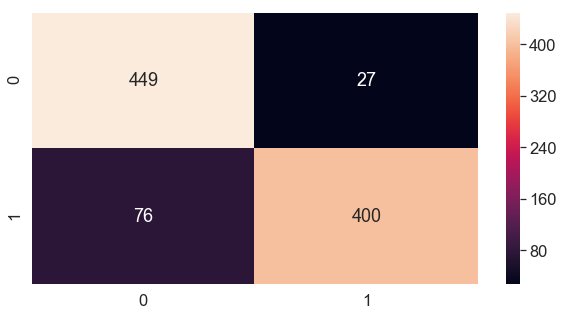
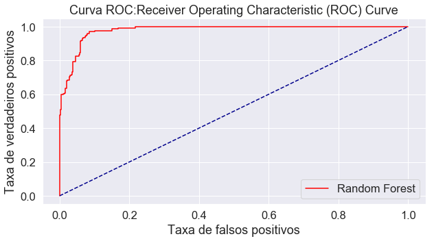
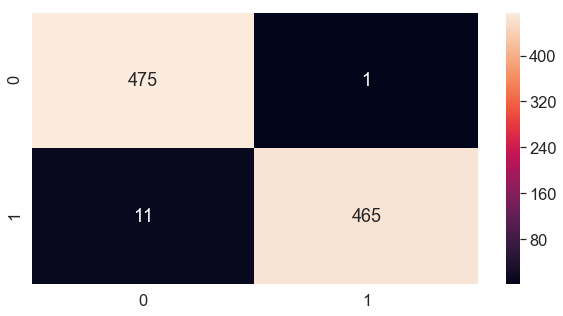
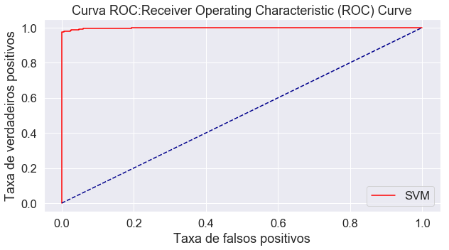
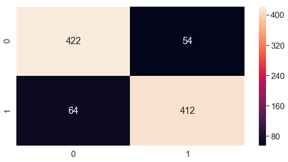
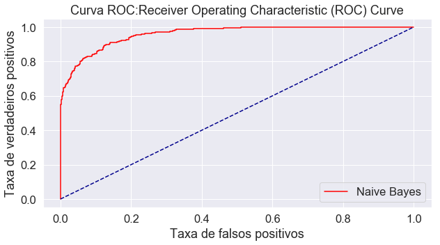
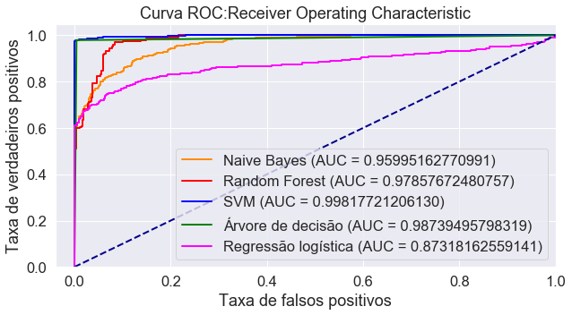
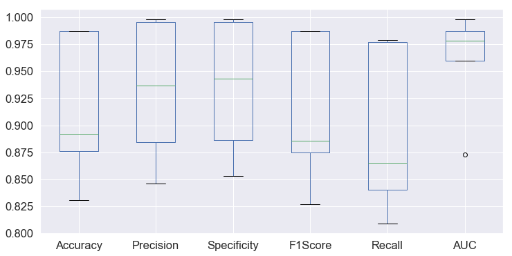

# MODELO 3 - Avaliação dos Modelos de marchine learning.


---

---

---


```python
%matplotlib inline
```


```python
# Importa as bibliotecas
import pandas
import matplotlib.pyplot as plt
import numpy 
#from pandas.tools.plotting import scatter_matrix
from  pandas.plotting  import scatter_matrix
import seaborn as sb
from sklearn.model_selection import train_test_split,cross_val_score
from sklearn.preprocessing import Normalizer
#Logistic Regression
from sklearn.linear_model import LogisticRegression
from sklearn.metrics import roc_auc_score , roc_curve, auc ,accuracy_score,recall_score, precision_score,f1_score
import statsmodels.api as sm
from sklearn.metrics import confusion_matrix
# Load libraries
import pandas as pd
from sklearn.tree import DecisionTreeClassifier # Import Decision Tree Classifier
from sklearn import metrics #Import scikit-learn metrics module for accuracy calculation

```

#  1) Carregando os dados de treino e teste para avalição do modelo


```python
try:
    import cPickle as pickle
except ModuleNotFoundError:
    import pickle
```


```python
output = ".\\baseDados\\voice_treino_test.pk"
```


```python
dic_base_treino_file = pickle.load(open( output, "rb" ))
```


```python
y_train = dic_base_treino_file['y_train'] 
y_test = dic_base_treino_file['y_test'] 
X_train = dic_base_treino_file['X_train_norm']  
X_test = dic_base_treino_file['X_test_norm']
feature_cols =  dic_base_treino_file['feature_cols']

print(feature_cols)

```

    Index(['meanfreq', 'sd', 'median', 'Q25', 'Q75', 'IQR', 'skew', 'kurt',
           'sp.ent', 'sfm', 'mode', 'centroid', 'meanfun', 'minfun', 'maxfun',
           'meandom', 'mindom', 'maxdom', 'dfrange', 'modindx', 'int'],
          dtype='object')
    


```python
dfContador =pandas.DataFrame(list(y_train), columns = ['genero'])
contagem = dfContador.groupby('genero').size()
print(contagem)
```

    genero
    0    1108
    1    1108
    dtype: int64
    


```python
dfContador =pandas.DataFrame(list(y_test), columns = ['genero'])
contagem = dfContador.groupby('genero').size()
print(contagem)
```

    genero
    0    476
    1    476
    dtype: int64
    

---
---
---
---

---

# 2) carregando o modelo Random Forest


```python
from sklearn.ensemble import RandomForestClassifier
rf_model = RandomForestClassifier(random_state=1,n_estimators=100,min_impurity_decrease=0.05)


```

## Treinamento e teste do modelo:  Random Forest.


```python
rf_model.fit(X_train, y_train.ravel())
```


    RandomForestClassifier(bootstrap=True, class_weight=None, criterion='gini',
                           max_depth=None, max_features='auto', max_leaf_nodes=None,
                           min_impurity_decrease=0.05, min_impurity_split=None,
                           min_samples_leaf=1, min_samples_split=2,
                           min_weight_fraction_leaf=0.0, n_estimators=100,
                           n_jobs=None, oob_score=False, random_state=1, verbose=0,
                           warm_start=False)


```python
rf_pred=rf_model.predict(X_test)
```

---

##  Modelo de avaliação de métricas.

### Precisão Geral (Accuracy)


```python
#get accuracy
rf_accuracy_testdata = metrics.accuracy_score(y_test, rf_pred)

```


```python
#print accuracy
print ("Accuracy: {0:.4f}".format(rf_accuracy_testdata))
RF_Accuracy = metrics.accuracy_score(y_test, rf_pred)
print(RF_Accuracy)
```

    Accuracy: 0.8918
    0.8918067226890757
    

### Matriz de confusão: Random Forest


```python
import plot as plot
cm=confusion_matrix(y_test,rf_pred)
#Plot the confusion matrix
plt.rcParams['figure.figsize'] = (10,5)
sb.set(font_scale=1.5)
sb.heatmap(cm, annot=True, fmt='g')
plt.show()


```





### Metricas Report: Random Forest


```python
print ("{0}".format(metrics.classification_report(y_test, rf_pred, labels=[0, 1])))

```

                  precision    recall  f1-score   support
    
               0       0.86      0.94      0.90       476
               1       0.94      0.84      0.89       476
    
        accuracy                           0.89       952
       macro avg       0.90      0.89      0.89       952
    weighted avg       0.90      0.89      0.89       952
    
    


```python
cm=confusion_matrix(y_test,rf_pred)
confusion_matrix_lda = pandas.DataFrame(cm, index = ['Negativos','Positivos'], columns = ['Previsão dos negativos','Previsão dos positivos'] )
confusion_matrix_lda['Total'] = 1
confusion_matrix_lda['Total'][0] = cm[0][0] + cm[0][1]
confusion_matrix_lda['Total'][1] = cm[1][0] + cm[1][1]
```


```python
confusion_matrix_lda
```


<div>
<style scoped>
    .dataframe tbody tr th:only-of-type {
        vertical-align: middle;
    }

    .dataframe tbody tr th {
        vertical-align: top;
    }

    .dataframe thead th {
        text-align: right;
    }
</style>
<table border="1" class="dataframe">
  <thead>
    <tr style="text-align: right;">
      <th></th>
      <th>Previsão dos negativos</th>
      <th>Previsão dos positivos</th>
      <th>Total</th>
    </tr>
  </thead>
  <tbody>
    <tr>
      <td>Negativos</td>
      <td>449</td>
      <td>27</td>
      <td>476</td>
    </tr>
    <tr>
      <td>Positivos</td>
      <td>76</td>
      <td>400</td>
      <td>476</td>
    </tr>
  </tbody>
</table>
</div>


```python
print(confusion_matrix_lda)
```

               Previsão dos negativos  Previsão dos positivos  Total
    Negativos                     449                      27    476
    Positivos                      76                     400    476
    


```python
TP = confusion_matrix_lda['Previsão dos positivos'][1]
dfTP = pandas.DataFrame(TP, index = ['Positivos verdadeiros'], columns = ['Quantidade acertos'] )
```


```python
TN = confusion_matrix_lda['Previsão dos negativos'][0]
dfTN = pandas.DataFrame(TN, index = ['Verdadeiro Negativo'], columns = ['Quantidade acertos'] )
```


```python
FP = confusion_matrix_lda['Previsão dos positivos'][0]
dfFP = pandas.DataFrame(FP, index = ['Falso Positivo'], columns = ['Quantidade acertos'] )
```


```python
FN = confusion_matrix_lda['Previsão dos negativos'][1]
dfFN = pandas.DataFrame(FN, index = ['Negativos Falsos'], columns = ['Quantidade acertos'] )
```


```python
rfSpecificity = TN / float(TN + FP)
dfSpecificity = pandas.DataFrame(rfSpecificity, index = ['Specificity'], columns = ['resultado'] )
```


```python
dfSpecificity
```


<div>
<style scoped>
    .dataframe tbody tr th:only-of-type {
        vertical-align: middle;
    }

    .dataframe tbody tr th {
        vertical-align: top;
    }

    .dataframe thead th {
        text-align: right;
    }
</style>
<table border="1" class="dataframe">
  <thead>
    <tr style="text-align: right;">
      <th></th>
      <th>resultado</th>
    </tr>
  </thead>
  <tbody>
    <tr>
      <td>Specificity</td>
      <td>0.943277</td>
    </tr>
  </tbody>
</table>
</div>


```python
rfRecall= recall_score(y_test, rf_pred)
print(rfRecall)
```

    0.8403361344537815
    


```python
print(TP / float(TP + FP))
print(precision_score(y_test, rf_pred))
rfPrecision = precision_score(y_test, rf_pred)
```

    0.936768149882904
    0.936768149882904
    


```python
rfF1Score = 2 * rfPrecision *  rfRecall /  float(rfPrecision + rfRecall)
print(rfF1Score)

```

    0.8859357696566998
    


```python

```


```python

```

---
###  Curva ROC: Random Forest
Uma curva ROC é uma forma comumente usada para visualizar o desempenho de um classificador binário, significando um classificador com duas classes de saída possíveis. A curva plota a Taxa Positiva Real (Recall) contra a Taxa Falsa Positiva (também interpretada como Especificidade 1).


```python
rf_pred_prob = rf_model.predict_proba(X_test)[:, 1]
```


```python
rf_fpr, rf_tpr, thresholds = roc_curve(y_test, rf_pred_prob)
```


```python
def plot_roc_curve(fpr, tpr,nome='ROC'):
    plt.plot(fpr, tpr, color='red', label=nome)
    plt.plot([0, 1], [0, 1], color='darkblue', linestyle='--')
    plt.xlabel('Taxa de falsos positivos')
    plt.ylabel('Taxa de verdadeiros positivos')
    plt.title('Curva ROC:Receiver Operating Characteristic (ROC) Curve')
    plt.legend()
    plt.show()
```


```python
plot_roc_curve(rf_fpr, rf_tpr,'Random Forest')
```





---

###  AUC (área sob a curva) da Curva ROC : Random Forest
AUC ou Area Under the Curve é a porcentagem do gráfico do ROC que está abaixo da curva. AUC é útil como um único número de resumo do desempenho do classificador.


```python
print(roc_auc_score(y_test, rf_pred_prob))
RF_Auc=roc_auc_score(y_test, rf_pred_prob)
```

    0.9785767248075701
    


```python
dfAuc = pandas.DataFrame(RF_Auc, index = ['AUC'], columns = ['resultado'] )
dfAuc
```


<div>
<style scoped>
    .dataframe tbody tr th:only-of-type {
        vertical-align: middle;
    }

    .dataframe tbody tr th {
        vertical-align: top;
    }

    .dataframe thead th {
        text-align: right;
    }
</style>
<table border="1" class="dataframe">
  <thead>
    <tr style="text-align: right;">
      <th></th>
      <th>resultado</th>
    </tr>
  </thead>
  <tbody>
    <tr>
      <td>AUC</td>
      <td>0.978577</td>
    </tr>
  </tbody>
</table>
</div>


```python
print(dfAuc)
```

         resultado
    AUC   0.978577
    

---
---
---
---
---

# Carregando o modelo  Máquina de vetores de suporte SVM


```python
from sklearn.svm import SVC
svm_model = SVC(kernel='linear', C=45, random_state=2 ,probability=True,coef0=0.3)

#kernel='linear'
```

### Treinamento e teste do modelo: SVM.


```python

svm_model.fit(X_train, y_train)

```


    SVC(C=45, cache_size=200, class_weight=None, coef0=0.3,
        decision_function_shape='ovr', degree=3, gamma='auto_deprecated',
        kernel='linear', max_iter=-1, probability=True, random_state=2,
        shrinking=True, tol=0.001, verbose=False)


```python
svm_pred = svm_model.predict(X_train)

```

---

##  Modelo de avaliação de métricas.

### Precisão Geral (Accuracy): SVM


```python
print(f"accuracy score: {accuracy_score(y_train, svm_pred):.4f}\n")
svm_accuracy_testdata = accuracy_score(y_train, svm_pred)
```

    accuracy score: 0.9887
    
    

### Matriz de confusão: SVM


```python
cm=confusion_matrix(y_train, svm_model.predict(X_train))
```


```python
confusion_matrix_lda = pandas.DataFrame(cm, index = ['Negativos','Positivos'], columns = ['Previsão dos negativos','Previsão dos positivos'] )
confusion_matrix_lda['Total'] = 1
confusion_matrix_lda['Total'][0] = cm[0][0] + cm[0][1]
confusion_matrix_lda['Total'][1] = cm[1][0] + cm[1][1]
```


```python
confusion_matrix_lda
```


<div>
<style scoped>
    .dataframe tbody tr th:only-of-type {
        vertical-align: middle;
    }

    .dataframe tbody tr th {
        vertical-align: top;
    }

    .dataframe thead th {
        text-align: right;
    }
</style>
<table border="1" class="dataframe">
  <thead>
    <tr style="text-align: right;">
      <th></th>
      <th>Previsão dos negativos</th>
      <th>Previsão dos positivos</th>
      <th>Total</th>
    </tr>
  </thead>
  <tbody>
    <tr>
      <td>Negativos</td>
      <td>1105</td>
      <td>3</td>
      <td>1108</td>
    </tr>
    <tr>
      <td>Positivos</td>
      <td>22</td>
      <td>1086</td>
      <td>1108</td>
    </tr>
  </tbody>
</table>
</div>


```python
TP = confusion_matrix_lda['Previsão dos positivos'][1]
dfTP = pandas.DataFrame(TP, index = ['Positivos verdadeiros'], columns = ['Quantidade acertos'] )
TP
```


    1086


```python
TN = confusion_matrix_lda['Previsão dos negativos'][0]
dfTN = pandas.DataFrame(TN, index = ['Verdadeiro Negativo'], columns = ['Quantidade acertos'] )
TN
```


    1105


```python
FP = confusion_matrix_lda['Previsão dos positivos'][0]
dfFP = pandas.DataFrame(FP, index = ['Falso Positivo'], columns = ['Quantidade acertos'] )
FP
```


    3


```python
FN = confusion_matrix_lda['Previsão dos negativos'][1]
dfFN = pandas.DataFrame(FN, index = ['Negativos Falsos'], columns = ['Quantidade acertos'] )
FN
```


    22


```python
print(f"accuracy score: {accuracy_score(y_train, svm_pred):.4f}\n")
svmAccuracy = accuracy_score(y_train, svm_pred)
```

    accuracy score: 0.9887
    
    


```python
import plot as plot
cm=confusion_matrix(y_train, svm_model.predict(X_train))
#Plot the confusion matrix
plt.rcParams['figure.figsize'] = (10,5)
sb.set(font_scale=1.5)
sb.heatmap(cm, annot=True, fmt='g')
plt.show()
```





### Metricas Report: svm


```python
print(f"Classification Report: \n \tPrecision: {precision_score(y_train, svm_pred)}\n\tRecall Score: {recall_score(y_train,svm_pred)}\n\tF1 score: {f1_score(y_train, svm_pred)}\n")

```

    Classification Report: 
     	Precision: 0.9972451790633609
    	Recall Score: 0.98014440433213
    	F1 score: 0.9886208466090123
    
    


```python
svmPrecision = precision_score(y_train, svm_pred)
```


```python
svmRecall = recall_score(y_train, svm_pred)
```


```python
svmF1_score = f1_score(y_train, svm_pred)
```


```python
svmSpecificity = TN / float(TN + FP)
dfSpecificity = pandas.DataFrame(svmSpecificity, index = ['Specificity'], columns = ['resultado'] )
svmSpecificity
```


    0.9972924187725631


---
###  Curva ROC: SVM


```python
svm_pred_prob = svm_model.predict_proba(X_test)[:, 1]

```


```python
svm_fpr, svm_tpr, thresholds = roc_curve(y_test, svm_pred_prob)
```


```python
plot_roc_curve(svm_fpr, svm_tpr,'SVM')
```





---

###  AUC (área sob a curva) da Curva ROC : SVM
AUC ou Area Under the Curve é a porcentagem do gráfico do ROC que está abaixo da curva. AUC é útil como um único número de resumo do desempenho do classificador.


```python
print(roc_auc_score(y_test, svm_pred_prob))
SVM_Auc=roc_auc_score(y_test, svm_pred_prob)
```

    0.9981772120612952
    

---
---
---
---
---

# Carregando o modelo  Máquina de Naive Bayes


```python
from sklearn.naive_bayes import GaussianNB
nb_model = GaussianNB()


```

### Treinamento e teste do modelo: NB.


```python
nb_model.fit(X_train, y_train)
```


    GaussianNB(priors=None, var_smoothing=1e-09)


```python
nb_pred = nb_model.predict(X_train)
```

##  Modelo de avaliação de métricas. NB.

### Precisão Geral (Accuracy): NB.


```python
#get accuracy
print(f"accuracy score: {accuracy_score(y_train, nb_pred):.4f}\n")
nb_accuracy_testdata = accuracy_score(y_train, nb_pred)
```

    accuracy score: 0.9057
    
    

### Matriz de confusão: NB.


```python
cm=confusion_matrix(y_train, nb_model.predict(X_train))
confusion_matrix_lda = pandas.DataFrame(cm, index = ['Negativos','Positivos'], columns = ['Previsão dos negativos','Previsão dos positivos'] )
confusion_matrix_lda['Total'] = 1
confusion_matrix_lda['Total'][0] = cm[0][0] + cm[0][1]
confusion_matrix_lda['Total'][1] = cm[1][0] + cm[1][1]
confusion_matrix_lda
```


<div>
<style scoped>
    .dataframe tbody tr th:only-of-type {
        vertical-align: middle;
    }

    .dataframe tbody tr th {
        vertical-align: top;
    }

    .dataframe thead th {
        text-align: right;
    }
</style>
<table border="1" class="dataframe">
  <thead>
    <tr style="text-align: right;">
      <th></th>
      <th>Previsão dos negativos</th>
      <th>Previsão dos positivos</th>
      <th>Total</th>
    </tr>
  </thead>
  <tbody>
    <tr>
      <td>Negativos</td>
      <td>1011</td>
      <td>97</td>
      <td>1108</td>
    </tr>
    <tr>
      <td>Positivos</td>
      <td>112</td>
      <td>996</td>
      <td>1108</td>
    </tr>
  </tbody>
</table>
</div>


```python
import plot as plot
cm=confusion_matrix(y_train, nb_model.predict(X_train))
#Plot the confusion matrix
plt.rcParams['figure.figsize'] = (10,5)
sb.set(font_scale=1.5)
sb.heatmap(cm, annot=True, fmt='g')
plt.show()
```





### Metricas Report: NB.


```python
print(f"Classification Report: \n \tPrecision: {precision_score(y_train, nb_pred)}\n\tRecall Score: {recall_score(y_train,nb_pred)}\n\tF1 score: {f1_score(y_train, nb_pred)}\n")

```

    Classification Report: 
     	Precision: 0.9112534309240622
    	Recall Score: 0.8989169675090253
    	F1 score: 0.9050431621990005
    
    


```python
TP = confusion_matrix_lda['Previsão dos positivos'][1]
dfTP = pandas.DataFrame(TP, index = ['Positivos verdadeiros'], columns = ['Quantidade acertos'] )
TP
```


    996


```python
TN = confusion_matrix_lda['Previsão dos negativos'][0]
dfTN = pandas.DataFrame(TN, index = ['Verdadeiro Negativo'], columns = ['Quantidade acertos'] )
TN
```


    1011


```python
FP = confusion_matrix_lda['Previsão dos positivos'][0]
dfFP = pandas.DataFrame(FP, index = ['Falso Positivo'], columns = ['Quantidade acertos'] )
FP
```


    97


```python
FN = confusion_matrix_lda['Previsão dos negativos'][1]
dfFN = pandas.DataFrame(FN, index = ['Negativos Falsos'], columns = ['Quantidade acertos'] )
FN
```


    112


```python
print(f"accuracy score: {accuracy_score(y_train, nb_pred):.4f}\n")
nbAccuracy = accuracy_score(y_train, nb_pred)
```

    accuracy score: 0.9057
    
    


```python
nbPrecision = precision_score(y_train, nb_pred)
```


```python
nbRecall = recall_score(y_train, nb_pred)
```


```python
nbF1_score = f1_score(y_train, nb_pred)
```


```python
nbSpecificity = TN / float(TN + FP)
dfSpecificity = pandas.DataFrame(nbSpecificity, index = ['Specificity'], columns = ['resultado'] )
nbSpecificity
```


    0.9124548736462094


---
###  Curva ROC: NB.


```python
nb_pred_prob = nb_model.predict_proba(X_test)[:, 1]
```


```python
nb_fpr, nb_tpr, thresholds = roc_curve(y_test, nb_pred_prob)
```


```python
plot_roc_curve(nb_fpr, nb_tpr,'Naive Bayes')
```





###  AUC (área sob a curva) da Curva ROC : NB.


```python
print(roc_auc_score(y_test, nb_pred_prob))
NB_Auc=roc_auc_score(y_test, nb_pred_prob)
```

    0.9599516277099075
    

---
---
---
---
---
---
---

# Comparativo entre os modelos


```python
import matplotlib.pyplot as plt
from sklearn.metrics import roc_curve, auc
import seaborn as sns
#sns.set('talk', 'whitegrid', 'dark', font_scale=1.5, font='Ricty',   rc={"lines.linewidth": 2, 'grid.linestyle': '--'})


```

### Carregar  o modelo de Árvore Decisão


```python
filename = '.\\baseDados\\cart.jss'
infile = open(filename,'rb')
cart_dict = pickle.load(infile)
infile.close()
CART_auc= cart_dict['Auc']
CART_pred_prob= cart_dict['y_pred_prob']
```


```python
#print(cart_dict)
```


```python
#print(cart_dict)
cart_fpr, cart_tpr, thresholds = roc_curve(y_test, CART_pred_prob)
```

### Carregar  o modelo de Regressão logística


```python
filenamerl = '.\\baseDados\\regressaologitica.jss'
infile = open(filenamerl,'rb')
rlog_dict = pickle.load(infile)
infile.close()
#print(rlog_dict)
rlog_auc= rlog_dict['Auc']
rlog_pred_prob= rlog_dict['y_pred_prob']
```


```python
rlog_fpr, rlog_tpr, thresholds = roc_curve(y_test, rlog_pred_prob)
```

## Mostra o gráfico comparativo


```python
lw = 2
plt.figure()
plt.rcParams['figure.figsize'] = (12,6)


plt.plot(nb_fpr, nb_tpr, color='darkorange',  lw=lw, label='Naive Bayes (AUC = %0.14f)' % NB_Auc)
plt.plot(rf_fpr, rf_tpr , color='red',  lw=lw, label='Random Forest (AUC = %0.14f)' % RF_Auc)
plt.plot(svm_fpr, svm_tpr , color='blue',  lw=lw, label='SVM (AUC = %0.14f)' % SVM_Auc)
plt.plot(cart_fpr, cart_tpr , color='green',  lw=lw, label='Árvore de decisão (AUC = %0.14f)' % CART_auc)
plt.plot(rlog_fpr, rlog_tpr , color='magenta',  lw=lw, label='Regressão logística (AUC = %0.14f)' % rlog_auc)


#------------ linha central-----------------------------
plt.plot([0, 1], [0, 1], color='darkblue',lw=lw, linestyle='--')
plt.xlabel('Taxa de falsos positivos')
plt.ylabel('Taxa de verdadeiros positivos')
plt.title('Curva ROC:Receiver Operating Characteristic')


sb.set(font_scale=1.5)
plt.legend()
plt.xlim([-0.04, 1.0])
plt.ylim([0.0, 1.05])


plt.show()
plt.savefig('roc_auc.png')
plt.close()
```





```python
plt.subplots_adjust(left=0.1, right=0.9, top=0.9, bottom=0.1)
```


    <Figure size 864x432 with 0 Axes>


# Comparando as métricas dos modelos Acurácia, Precisão e AUC.


```python
#print(cart_dict)


```


```python
dfresultado=pd.DataFrame.from_dict(dict([('Regressão Logística',[rlog_dict['Accuracy'], 
                                                     rlog_dict['Precision'], 
                                                     rlog_dict['Specificity'],
                                                     rlog_dict['F1Score'],
                                                     rlog_dict['Recall'],
                                                     rlog_dict['Auc']]),
                            ('Arvore de decisão',[cart_dict['Accuracy'], 
                                                     cart_dict['Precision'], 
                                                     cart_dict['Specificity'],
                                                     cart_dict['F1Score'],
                                                     cart_dict['Recall'],
                                                     cart_dict['Auc']]),
                            ('Random Forest', [RF_Accuracy, rfPrecision, rfSpecificity,rfF1Score,rfRecall,RF_Auc]),
                            ('SVM', [svmAccuracy, svmPrecision, svmSpecificity,svmF1_score,svmRecall,SVM_Auc]),
                            ('Naive Bayes', [nb_accuracy_testdata, nbPrecision, nbSpecificity,nbF1_score,nbRecall,NB_Auc])]),                   
                            orient='index', columns=['Accuracy', 'Precision', 'Specificity', 'F1Score', 'Recall','AUC'])
```


```python
dfresultado
```


<div>
<style scoped>
    .dataframe tbody tr th:only-of-type {
        vertical-align: middle;
    }

    .dataframe tbody tr th {
        vertical-align: top;
    }

    .dataframe thead th {
        text-align: right;
    }
</style>
<table border="1" class="dataframe">
  <thead>
    <tr style="text-align: right;">
      <th></th>
      <th>Accuracy</th>
      <th>Precision</th>
      <th>Specificity</th>
      <th>F1Score</th>
      <th>Recall</th>
      <th>AUC</th>
    </tr>
  </thead>
  <tbody>
    <tr>
      <td>Regressão Logística</td>
      <td>0.830882</td>
      <td>0.846154</td>
      <td>0.852941</td>
      <td>0.827068</td>
      <td>0.808824</td>
      <td>0.873182</td>
    </tr>
    <tr>
      <td>Arvore de decisão</td>
      <td>0.987395</td>
      <td>0.995726</td>
      <td>0.995798</td>
      <td>0.987288</td>
      <td>0.978992</td>
      <td>0.987395</td>
    </tr>
    <tr>
      <td>Random Forest</td>
      <td>0.891807</td>
      <td>0.936768</td>
      <td>0.943277</td>
      <td>0.885936</td>
      <td>0.840336</td>
      <td>0.978577</td>
    </tr>
    <tr>
      <td>SVM</td>
      <td>0.988718</td>
      <td>0.997245</td>
      <td>0.997292</td>
      <td>0.988621</td>
      <td>0.980144</td>
      <td>0.998177</td>
    </tr>
    <tr>
      <td>Naive Bayes</td>
      <td>0.905686</td>
      <td>0.911253</td>
      <td>0.912455</td>
      <td>0.905043</td>
      <td>0.898917</td>
      <td>0.959952</td>
    </tr>
  </tbody>
</table>
</div>


```python
dfresultado.describe()
```


<div>
<style scoped>
    .dataframe tbody tr th:only-of-type {
        vertical-align: middle;
    }

    .dataframe tbody tr th {
        vertical-align: top;
    }

    .dataframe thead th {
        text-align: right;
    }
</style>
<table border="1" class="dataframe">
  <thead>
    <tr style="text-align: right;">
      <th></th>
      <th>Accuracy</th>
      <th>Precision</th>
      <th>Specificity</th>
      <th>F1Score</th>
      <th>Recall</th>
      <th>AUC</th>
    </tr>
  </thead>
  <tbody>
    <tr>
      <td>count</td>
      <td>5.000000</td>
      <td>5.000000</td>
      <td>5.000000</td>
      <td>5.000000</td>
      <td>5.000000</td>
      <td>5.000000</td>
    </tr>
    <tr>
      <td>mean</td>
      <td>0.920898</td>
      <td>0.937429</td>
      <td>0.940353</td>
      <td>0.918791</td>
      <td>0.901443</td>
      <td>0.959456</td>
    </tr>
    <tr>
      <td>std</td>
      <td>0.067457</td>
      <td>0.063232</td>
      <td>0.060712</td>
      <td>0.069372</td>
      <td>0.078305</td>
      <td>0.050222</td>
    </tr>
    <tr>
      <td>min</td>
      <td>0.830882</td>
      <td>0.846154</td>
      <td>0.852941</td>
      <td>0.827068</td>
      <td>0.808824</td>
      <td>0.873182</td>
    </tr>
    <tr>
      <td>25%</td>
      <td>0.891807</td>
      <td>0.911253</td>
      <td>0.912455</td>
      <td>0.885936</td>
      <td>0.840336</td>
      <td>0.959952</td>
    </tr>
    <tr>
      <td>50%</td>
      <td>0.905686</td>
      <td>0.936768</td>
      <td>0.943277</td>
      <td>0.905043</td>
      <td>0.898917</td>
      <td>0.978577</td>
    </tr>
    <tr>
      <td>75%</td>
      <td>0.987395</td>
      <td>0.995726</td>
      <td>0.995798</td>
      <td>0.987288</td>
      <td>0.978992</td>
      <td>0.987395</td>
    </tr>
    <tr>
      <td>max</td>
      <td>0.988718</td>
      <td>0.997245</td>
      <td>0.997292</td>
      <td>0.988621</td>
      <td>0.980144</td>
      <td>0.998177</td>
    </tr>
  </tbody>
</table>
</div>


```python
boxplot = dfresultado.boxplot()
```





```python
Amplitudedic = {}
Varianciadic = {}
CoeficienteVardic = {}
juntar = {}
IntervaloInterquartildic = {}
colunas=['Accuracy', 'Precision', 'Specificity', 'F1Score', 'Recall','AUC']
for x in colunas:
    juntar[x] = dfresultado[x].std()/1
    Amplitudedic[x]=dfresultado[x].max() - dfresultado[x].min()
    Varianciadic[x] = dfresultado[x].var()
    CoeficienteVardic[x] = (dfresultado[x].std()/dfresultado[x].mean()) *  100
    IntervaloInterquartildic[x] = dfresultado[x].quantile(q=0.75) - dfresultado[x].quantile(q=0.25)
```


```python
dfAmplitude = pandas.DataFrame.from_dict(Amplitudedic, orient="index").reset_index()
dfAmplitude.columns = ["quantitativas","Amplitude"]
dfAmplitude.head()


```


<div>
<style scoped>
    .dataframe tbody tr th:only-of-type {
        vertical-align: middle;
    }

    .dataframe tbody tr th {
        vertical-align: top;
    }

    .dataframe thead th {
        text-align: right;
    }
</style>
<table border="1" class="dataframe">
  <thead>
    <tr style="text-align: right;">
      <th></th>
      <th>quantitativas</th>
      <th>Amplitude</th>
    </tr>
  </thead>
  <tbody>
    <tr>
      <td>0</td>
      <td>Accuracy</td>
      <td>0.157836</td>
    </tr>
    <tr>
      <td>1</td>
      <td>Precision</td>
      <td>0.151091</td>
    </tr>
    <tr>
      <td>2</td>
      <td>Specificity</td>
      <td>0.144351</td>
    </tr>
    <tr>
      <td>3</td>
      <td>F1Score</td>
      <td>0.161553</td>
    </tr>
    <tr>
      <td>4</td>
      <td>Recall</td>
      <td>0.171321</td>
    </tr>
  </tbody>
</table>
</div>


```python

dfstd = pandas.DataFrame.from_dict(juntar, orient="index").reset_index()
dfstd.columns = ["quantitativas","std"]
dfstd.head()
```


<div>
<style scoped>
    .dataframe tbody tr th:only-of-type {
        vertical-align: middle;
    }

    .dataframe tbody tr th {
        vertical-align: top;
    }

    .dataframe thead th {
        text-align: right;
    }
</style>
<table border="1" class="dataframe">
  <thead>
    <tr style="text-align: right;">
      <th></th>
      <th>quantitativas</th>
      <th>std</th>
    </tr>
  </thead>
  <tbody>
    <tr>
      <td>0</td>
      <td>Accuracy</td>
      <td>0.067457</td>
    </tr>
    <tr>
      <td>1</td>
      <td>Precision</td>
      <td>0.063232</td>
    </tr>
    <tr>
      <td>2</td>
      <td>Specificity</td>
      <td>0.060712</td>
    </tr>
    <tr>
      <td>3</td>
      <td>F1Score</td>
      <td>0.069372</td>
    </tr>
    <tr>
      <td>4</td>
      <td>Recall</td>
      <td>0.078305</td>
    </tr>
  </tbody>
</table>
</div>


```python
dfVariancia = pandas.DataFrame.from_dict(Varianciadic, orient="index").reset_index()
dfVariancia.columns = ["quantitativas","Variancia"]
dfVariancia.head()
```


<div>
<style scoped>
    .dataframe tbody tr th:only-of-type {
        vertical-align: middle;
    }

    .dataframe tbody tr th {
        vertical-align: top;
    }

    .dataframe thead th {
        text-align: right;
    }
</style>
<table border="1" class="dataframe">
  <thead>
    <tr style="text-align: right;">
      <th></th>
      <th>quantitativas</th>
      <th>Variancia</th>
    </tr>
  </thead>
  <tbody>
    <tr>
      <td>0</td>
      <td>Accuracy</td>
      <td>0.004550</td>
    </tr>
    <tr>
      <td>1</td>
      <td>Precision</td>
      <td>0.003998</td>
    </tr>
    <tr>
      <td>2</td>
      <td>Specificity</td>
      <td>0.003686</td>
    </tr>
    <tr>
      <td>3</td>
      <td>F1Score</td>
      <td>0.004812</td>
    </tr>
    <tr>
      <td>4</td>
      <td>Recall</td>
      <td>0.006132</td>
    </tr>
  </tbody>
</table>
</div>


```python
dfCoeficiente = pandas.DataFrame.from_dict(CoeficienteVardic, orient="index").reset_index()
dfCoeficiente.columns = ["quantitativas","Coef_Var_%"]
dfCoeficiente.head()
```


<div>
<style scoped>
    .dataframe tbody tr th:only-of-type {
        vertical-align: middle;
    }

    .dataframe tbody tr th {
        vertical-align: top;
    }

    .dataframe thead th {
        text-align: right;
    }
</style>
<table border="1" class="dataframe">
  <thead>
    <tr style="text-align: right;">
      <th></th>
      <th>quantitativas</th>
      <th>Coef_Var_%</th>
    </tr>
  </thead>
  <tbody>
    <tr>
      <td>0</td>
      <td>Accuracy</td>
      <td>7.325174</td>
    </tr>
    <tr>
      <td>1</td>
      <td>Precision</td>
      <td>6.745293</td>
    </tr>
    <tr>
      <td>2</td>
      <td>Specificity</td>
      <td>6.456339</td>
    </tr>
    <tr>
      <td>3</td>
      <td>F1Score</td>
      <td>7.550318</td>
    </tr>
    <tr>
      <td>4</td>
      <td>Recall</td>
      <td>8.686597</td>
    </tr>
  </tbody>
</table>
</div>


```python
IntervaloInterquartil = pandas.DataFrame.from_dict(IntervaloInterquartildic, orient="index").reset_index()
IntervaloInterquartil.columns = ["quantitativas","Intervalo_Interquartil"]
IntervaloInterquartil.head()
```


<div>
<style scoped>
    .dataframe tbody tr th:only-of-type {
        vertical-align: middle;
    }

    .dataframe tbody tr th {
        vertical-align: top;
    }

    .dataframe thead th {
        text-align: right;
    }
</style>
<table border="1" class="dataframe">
  <thead>
    <tr style="text-align: right;">
      <th></th>
      <th>quantitativas</th>
      <th>Intervalo_Interquartil</th>
    </tr>
  </thead>
  <tbody>
    <tr>
      <td>0</td>
      <td>Accuracy</td>
      <td>0.095588</td>
    </tr>
    <tr>
      <td>1</td>
      <td>Precision</td>
      <td>0.084473</td>
    </tr>
    <tr>
      <td>2</td>
      <td>Specificity</td>
      <td>0.083343</td>
    </tr>
    <tr>
      <td>3</td>
      <td>F1Score</td>
      <td>0.101352</td>
    </tr>
    <tr>
      <td>4</td>
      <td>Recall</td>
      <td>0.138655</td>
    </tr>
  </tbody>
</table>
</div>


```python
dfresultado_frame=pandas.merge(dfAmplitude,dfVariancia,how='right',on='quantitativas')
dfresultado_frame=pandas.merge(dfresultado_frame,dfCoeficiente,how='right',on='quantitativas')
dfresultado_frame=pandas.merge(dfresultado_frame,IntervaloInterquartil,how='right',on='quantitativas')
dfresultado_frame=pandas.merge(dfresultado_frame,dfstd,how='right',on='quantitativas')
dfresultado_frame
```


<div>
<style scoped>
    .dataframe tbody tr th:only-of-type {
        vertical-align: middle;
    }

    .dataframe tbody tr th {
        vertical-align: top;
    }

    .dataframe thead th {
        text-align: right;
    }
</style>
<table border="1" class="dataframe">
  <thead>
    <tr style="text-align: right;">
      <th></th>
      <th>quantitativas</th>
      <th>Amplitude</th>
      <th>Variancia</th>
      <th>Coef_Var_%</th>
      <th>Intervalo_Interquartil</th>
      <th>std</th>
    </tr>
  </thead>
  <tbody>
    <tr>
      <td>0</td>
      <td>Accuracy</td>
      <td>0.157836</td>
      <td>0.004550</td>
      <td>7.325174</td>
      <td>0.095588</td>
      <td>0.067457</td>
    </tr>
    <tr>
      <td>1</td>
      <td>Precision</td>
      <td>0.151091</td>
      <td>0.003998</td>
      <td>6.745293</td>
      <td>0.084473</td>
      <td>0.063232</td>
    </tr>
    <tr>
      <td>2</td>
      <td>Specificity</td>
      <td>0.144351</td>
      <td>0.003686</td>
      <td>6.456339</td>
      <td>0.083343</td>
      <td>0.060712</td>
    </tr>
    <tr>
      <td>3</td>
      <td>F1Score</td>
      <td>0.161553</td>
      <td>0.004812</td>
      <td>7.550318</td>
      <td>0.101352</td>
      <td>0.069372</td>
    </tr>
    <tr>
      <td>4</td>
      <td>Recall</td>
      <td>0.171321</td>
      <td>0.006132</td>
      <td>8.686597</td>
      <td>0.138655</td>
      <td>0.078305</td>
    </tr>
    <tr>
      <td>5</td>
      <td>AUC</td>
      <td>0.124996</td>
      <td>0.002522</td>
      <td>5.234431</td>
      <td>0.027443</td>
      <td>0.050222</td>
    </tr>
  </tbody>
</table>
</div>


---
---
---
---
---
---

# Fim da avaliação do modelo.
