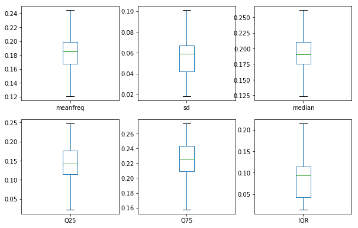
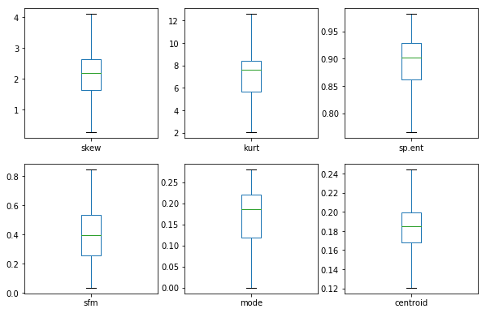
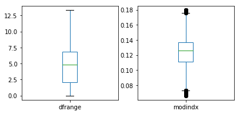
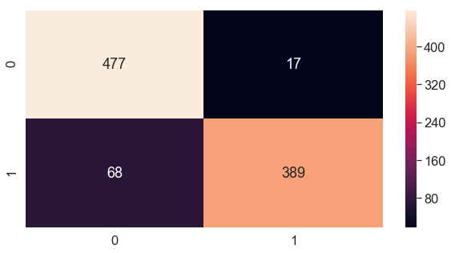
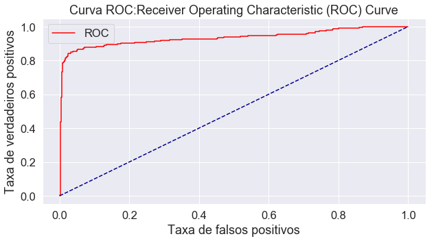
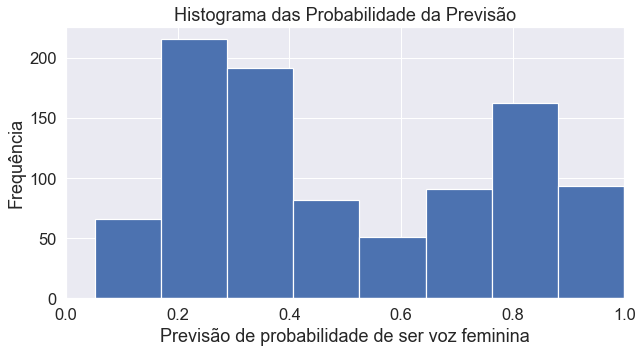
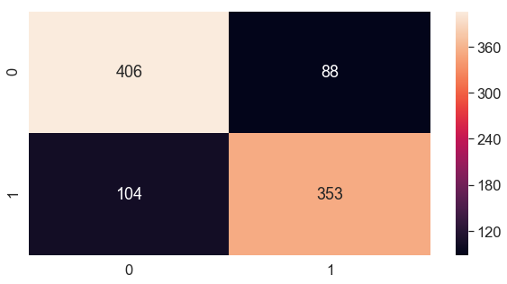
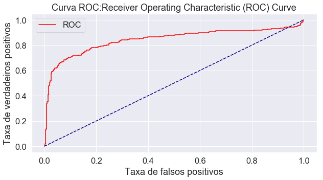
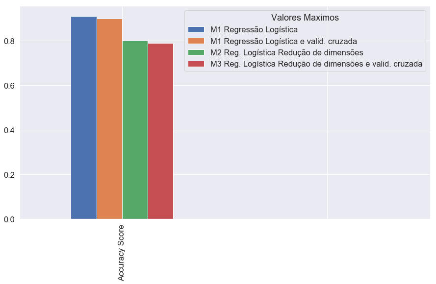
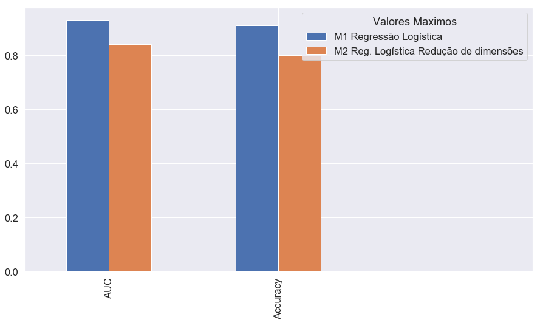

# Avaliação do Modelo de Classificação.
### Introdução.
Este Jupyter Notebook investiga a base de dados de  propriedades acústicas disponíveis no site  http://www.primaryobjects.com/2016/06/22/identifying-the-gender-of-a-voice-using-machine-learning/   
Objetivo da investigação é determinar as chances de algum algoritmo para detecção de gênero, seja por estatística tradicional ou por meio técnicas machine learning e redes neurais, possibilitando a implantação em dispositivos embarcados de baixo custo de memória e processamento restrito. 

# Propriedades acústicas medidas

As seguintes propriedades acústicas de cada voz são medidas:

- **meanfreq**  : frequência média (em kHz) sobre as amostras compostas no sinal de arquivo de voz;
- **sd**  : desvio padrão da frequência, sobre as amostras compostas no sinal de arquivo de voz;
- **mediana**  : frequência mediana (em kHz) sobre as amostras compostas no sinal de arquivo de voz;
- **Q25**  : primeiro quantil (em kHz) sobre as amostras compostas no sinal de arquivo de voz;
- **Q75**  : terceiro quantil (em kHz) sobre as amostras compostas no sinal de arquivo de voz;
- **IQR**  : intervalo interquartil (em kHz)sobre as amostras compostas no sinal de arquivo de voz;
- **skew**  : média de assimetria da distribuição das frequências de vocal perdominante;
- **kurt**  : curtose distribuição espectral da voz, domínio da frequência;
- **sp.ent**  : entropia espectral, pureza da distribuição da voz em relação ao nível de ruído; 
- **sfm**  : nivelamento espectral,  estima a planaridade de um espectro de frequência;
- **modo**  : frequência de modo, ou seja, frequência dominante da voz;
- **centrod**  : frequência central máxima visto no domínio da frequência;
- **meanfun**  : média da frequência fundamental medida através do sinal acústico (Tonalidade base da voz);
- **minfun**  : frequência fundamental mínima medida no sinal acústico  (Tonalidade base da voz);
- **maxfun**  : frequência fundamental máxima medida através do sinal acústico (Tonalidade base da voz);
- **meandom**  : média da frequência dominante medida através do sinal acústico  (média total das notas  musicais mais graves da voz em relação ao sinal gravado);
- **mindom**  : mínimo de frequência dominante medido através do sinal acústico;
- **maxdom**  : máxima da frequência dominante medida através do sinal acústico;
- **dfrange**  : faixa de frequência dominante medida através do sinal acústico;
- **modindx**  : índice de modulação. Calculado como a diferença absoluta acumulada entre medições adjacentes de frequências fundamentais divididas pela faixa de frequência.
- **label**  : rotulo de identificador da amostra em relação ao sexo, adicionado durante a gravação "male" ou "female".


#  Resumo da análise anterior com base tratada em python da base de propriedades acústicas.


```python
%matplotlib inline
```


```python
# Importa as bibliotecas
import pandas
import matplotlib.pyplot as plt
import numpy 
#from pandas.tools.plotting import scatter_matrix
from  pandas.plotting  import scatter_matrix
import seaborn as sb
from sklearn.model_selection import train_test_split,cross_val_score
from sklearn.preprocessing import Normalizer
#Logistic Regression
from sklearn.linear_model import LogisticRegression
from sklearn.metrics import roc_auc_score , roc_curve, auc ,accuracy_score,recall_score, precision_score
import statsmodels.api as sm
from sklearn.metrics import confusion_matrix


```


```python
url = ".\\baseDados\\voice_fix.csv"
colunas = ["meanfreq","sd","median","Q25","Q75","IQR","skew","kurt","sp.ent","sfm","mode","centroid","meanfun","minfun","maxfun","meandom","mindom","maxdom","dfrange","modindx","label"]
dataset = pandas.read_csv(url,  sep = ",")
```


```python
dataset[["meanfreq","sd","median"]].head(2)
```


<div>
<style scoped>
    .dataframe tbody tr th:only-of-type {
        vertical-align: middle;
    }

    .dataframe tbody tr th {
        vertical-align: top;
    }

    .dataframe thead th {
        text-align: right;
    }
</style>
<table border="1" class="dataframe">
  <thead>
    <tr style="text-align: right;">
      <th></th>
      <th>meanfreq</th>
      <th>sd</th>
      <th>median</th>
    </tr>
  </thead>
  <tbody>
    <tr>
      <td>0</td>
      <td>0.183506</td>
      <td>0.064241</td>
      <td>0.190591</td>
    </tr>
    <tr>
      <td>1</td>
      <td>0.183506</td>
      <td>0.067310</td>
      <td>0.190591</td>
    </tr>
  </tbody>
</table>
</div>


## 1) Refazendo boxplot.
O BOXPLOT representa os dados através de um retângulo
construído com os quartis e fornece informação sobre valores
extremos. 


```python
plt.rcParams['figure.figsize'] = (10,10)
dataset[colunas[0:6]].plot(kind='box', subplots=True, layout=(3,3), sharex=False, sharey=False)
plt.show()
```





```python
plt.rcParams['figure.figsize'] = (10,10)
dataset[colunas[6:6 * 2]].plot(kind='box', subplots=True, layout=(3,3), sharex=False, sharey=False)
plt.show()
```





```python
plt.rcParams['figure.figsize'] = (10,10)
dataset[colunas[6 *2 :6 * 3]].plot(kind='box', subplots=True, layout=(3,3), sharex=False, sharey=False)
plt.show()
```


```python
plt.rcParams['figure.figsize'] = (10,10)
dataset[colunas[6 *3 :6 * 4]].plot(kind='box', subplots=True, layout=(3,3), sharex=False, sharey=False)
plt.show()
```





## Fim do resumo análise exploraria.


```python
from sklearn.model_selection import train_test_split
from sklearn.preprocessing import Normalizer
#Logistic Regression
from sklearn.linear_model import LogisticRegression
from sklearn.metrics import roc_auc_score , roc_curve, auc

```


```python
url = ".\\baseDados\\voice_fix.csv"
colunas = ["meanfreq","sd","median","Q25","Q75","IQR","skew","kurt","sp.ent","sfm","mode","centroid","meanfun","minfun","maxfun","meandom","mindom","maxdom","dfrange","modindx","label"]
dataset = pandas.read_csv(url,  sep = ",")
```

---


---


---
# Procedimentos de avaliação de modelo
Train/Test Split
K-Fold Cross Validation

##  2)  Preparando a base para usar no modelo de regressão logística.


```python
print(dataset.head().transpose())
```

                        0           1           2          3          4
    Unnamed: 0          0           1           2          3          4
    meanfreq     0.183506    0.183506    0.183506   0.151228    0.13512
    sd          0.0642413     0.06731   0.0838294  0.0721106  0.0791461
    median       0.190591    0.190591    0.190591   0.158011   0.124656
    Q25          0.142287    0.142482    0.142287  0.0965817  0.0787202
    Q75          0.225624    0.225624    0.225624   0.207955   0.206045
    IQR          0.075122   0.0732523    0.123207   0.111374   0.127325
    skew          2.19606     2.19606     2.19606    1.23283    1.10117
    kurt          8.44236     8.44236     8.44236     4.1773    4.33371
    sp.ent       0.893369    0.892193    0.846389   0.963322   0.971955
    sfm          0.491918    0.513724    0.478905   0.727232   0.783568
    mode                0           0           0  0.0838782   0.104261
    centroid     0.183506    0.183506    0.183506   0.151228    0.13512
    meanfun     0.0842791    0.107937   0.0987063  0.0889648   0.106398
    minfun      0.0157017   0.0158259   0.0156556  0.0177976  0.0169312
    maxfun       0.275862    0.274345    0.271186   0.274345   0.275533
    meandom     0.0078125  0.00901442  0.00799006   0.201497   0.712812
    mindom      0.0078125   0.0078125   0.0078125  0.0078125  0.0078125
    maxdom      0.0078125   0.0546875    0.015625     0.5625    5.48438
    dfrange             0    0.046875   0.0078125   0.554688    5.47656
    modindx      0.133737    0.124252    0.124252    0.12905   0.126195
    label            male        male        male       male       male
    

##  3)  Removendo indexador salvo durante a análise da base.


```python
df_pre=dataset.drop(columns=['Unnamed: 0'])
```


```python
dataset=df_pre
print(dataset.head().transpose())
```

                      0           1           2          3          4
    meanfreq   0.183506    0.183506    0.183506   0.151228    0.13512
    sd        0.0642413     0.06731   0.0838294  0.0721106  0.0791461
    median     0.190591    0.190591    0.190591   0.158011   0.124656
    Q25        0.142287    0.142482    0.142287  0.0965817  0.0787202
    Q75        0.225624    0.225624    0.225624   0.207955   0.206045
    IQR        0.075122   0.0732523    0.123207   0.111374   0.127325
    skew        2.19606     2.19606     2.19606    1.23283    1.10117
    kurt        8.44236     8.44236     8.44236     4.1773    4.33371
    sp.ent     0.893369    0.892193    0.846389   0.963322   0.971955
    sfm        0.491918    0.513724    0.478905   0.727232   0.783568
    mode              0           0           0  0.0838782   0.104261
    centroid   0.183506    0.183506    0.183506   0.151228    0.13512
    meanfun   0.0842791    0.107937   0.0987063  0.0889648   0.106398
    minfun    0.0157017   0.0158259   0.0156556  0.0177976  0.0169312
    maxfun     0.275862    0.274345    0.271186   0.274345   0.275533
    meandom   0.0078125  0.00901442  0.00799006   0.201497   0.712812
    mindom    0.0078125   0.0078125   0.0078125  0.0078125  0.0078125
    maxdom    0.0078125   0.0546875    0.015625     0.5625    5.48438
    dfrange           0    0.046875   0.0078125   0.554688    5.47656
    modindx    0.133737    0.124252    0.124252    0.12905   0.126195
    label          male        male        male       male       male
    

##  4)  Substituindo female=1, male=0 e troca por o rótulo label=sexo.


```python
df_pre['label'] = df_pre['label'].replace({'female': 1, 'male': 0})
```


```python
dataset = df_pre
```


```python
df =dataset.rename(columns={'label': 'sexo'})
print(df.head().transpose())
```

                     0         1         2         3         4
    meanfreq  0.183506  0.183506  0.183506  0.151228  0.135120
    sd        0.064241  0.067310  0.083829  0.072111  0.079146
    median    0.190591  0.190591  0.190591  0.158011  0.124656
    Q25       0.142287  0.142482  0.142287  0.096582  0.078720
    Q75       0.225624  0.225624  0.225624  0.207955  0.206045
    IQR       0.075122  0.073252  0.123207  0.111374  0.127325
    skew      2.196061  2.196061  2.196061  1.232831  1.101174
    kurt      8.442361  8.442361  8.442361  4.177296  4.333713
    sp.ent    0.893369  0.892193  0.846389  0.963322  0.971955
    sfm       0.491918  0.513724  0.478905  0.727232  0.783568
    mode      0.000000  0.000000  0.000000  0.083878  0.104261
    centroid  0.183506  0.183506  0.183506  0.151228  0.135120
    meanfun   0.084279  0.107937  0.098706  0.088965  0.106398
    minfun    0.015702  0.015826  0.015656  0.017798  0.016931
    maxfun    0.275862  0.274345  0.271186  0.274345  0.275533
    meandom   0.007812  0.009014  0.007990  0.201497  0.712812
    mindom    0.007812  0.007812  0.007812  0.007812  0.007812
    maxdom    0.007812  0.054688  0.015625  0.562500  5.484375
    dfrange   0.000000  0.046875  0.007812  0.554688  5.476562
    modindx   0.133737  0.124252  0.124252  0.129050  0.126195
    sexo      0.000000  0.000000  0.000000  0.000000  0.000000
    

#  5)   Dataset: Train/Test Split para do modelo de regressão logística.
Esse método divide o conjunto de dados em duas partes: um conjunto de treinamento e um conjunto de testes. O conjunto de treinamento é usado para treinar o modelo. Também podemos medir a precisão do modelo no conjunto de treinamento, mas não devemos avaliar modelos com base somente nessa métrica.

Logistic Regression coefficients na formula:
 y=  1 * b0 + b1*X1 + b2*X2+ b3*Xn

 ##   6)  Criando explicitamente  y-intercept: b0. 


```python
df['int']=1
print(df.head().transpose())
```

                     0         1         2         3         4
    meanfreq  0.183506  0.183506  0.183506  0.151228  0.135120
    sd        0.064241  0.067310  0.083829  0.072111  0.079146
    median    0.190591  0.190591  0.190591  0.158011  0.124656
    Q25       0.142287  0.142482  0.142287  0.096582  0.078720
    Q75       0.225624  0.225624  0.225624  0.207955  0.206045
    IQR       0.075122  0.073252  0.123207  0.111374  0.127325
    skew      2.196061  2.196061  2.196061  1.232831  1.101174
    kurt      8.442361  8.442361  8.442361  4.177296  4.333713
    sp.ent    0.893369  0.892193  0.846389  0.963322  0.971955
    sfm       0.491918  0.513724  0.478905  0.727232  0.783568
    mode      0.000000  0.000000  0.000000  0.083878  0.104261
    centroid  0.183506  0.183506  0.183506  0.151228  0.135120
    meanfun   0.084279  0.107937  0.098706  0.088965  0.106398
    minfun    0.015702  0.015826  0.015656  0.017798  0.016931
    maxfun    0.275862  0.274345  0.271186  0.274345  0.275533
    meandom   0.007812  0.009014  0.007990  0.201497  0.712812
    mindom    0.007812  0.007812  0.007812  0.007812  0.007812
    maxdom    0.007812  0.054688  0.015625  0.562500  5.484375
    dfrange   0.000000  0.046875  0.007812  0.554688  5.476562
    modindx   0.133737  0.124252  0.124252  0.129050  0.126195
    sexo      0.000000  0.000000  0.000000  0.000000  0.000000
    int       1.000000  1.000000  1.000000  1.000000  1.000000
    

##   7)   Separando as variáveis independentes da variável resposta.


```python
X_entrada = df.drop(columns=['sexo'])
Y_entrada = df['sexo']
```


```python
print(X_entrada.head().transpose())
```

                     0         1         2         3         4
    meanfreq  0.183506  0.183506  0.183506  0.151228  0.135120
    sd        0.064241  0.067310  0.083829  0.072111  0.079146
    median    0.190591  0.190591  0.190591  0.158011  0.124656
    Q25       0.142287  0.142482  0.142287  0.096582  0.078720
    Q75       0.225624  0.225624  0.225624  0.207955  0.206045
    IQR       0.075122  0.073252  0.123207  0.111374  0.127325
    skew      2.196061  2.196061  2.196061  1.232831  1.101174
    kurt      8.442361  8.442361  8.442361  4.177296  4.333713
    sp.ent    0.893369  0.892193  0.846389  0.963322  0.971955
    sfm       0.491918  0.513724  0.478905  0.727232  0.783568
    mode      0.000000  0.000000  0.000000  0.083878  0.104261
    centroid  0.183506  0.183506  0.183506  0.151228  0.135120
    meanfun   0.084279  0.107937  0.098706  0.088965  0.106398
    minfun    0.015702  0.015826  0.015656  0.017798  0.016931
    maxfun    0.275862  0.274345  0.271186  0.274345  0.275533
    meandom   0.007812  0.009014  0.007990  0.201497  0.712812
    mindom    0.007812  0.007812  0.007812  0.007812  0.007812
    maxdom    0.007812  0.054688  0.015625  0.562500  5.484375
    dfrange   0.000000  0.046875  0.007812  0.554688  5.476562
    modindx   0.133737  0.124252  0.124252  0.129050  0.126195
    int       1.000000  1.000000  1.000000  1.000000  1.000000
    


```python
Y_entrada.head()
```


    0    0
    1    0
    2    0
    3    0
    4    0
    Name: sexo, dtype: int64


##  8)  Divisão de 30% teste e 70%  para o treino.


```python
X_train,X_test,y_train,y_test=train_test_split(X_entrada,Y_entrada,test_size=0.30,random_state=0)
```


```python
X_train.shape,X_test.shape , y_train.shape, y_test.shape


dictabela = {}
dictabela['Registros para treino'] = X_train.shape[0]
dictabela['Registros para teste'] = X_test.shape[0]


```


```python
dftreinoteste = pandas.DataFrame.from_dict(dictabela, orient="index").reset_index()
```


```python
dftreinoteste =dftreinoteste.rename(columns={'index': 'divisão do dados'})
dftreinoteste =dftreinoteste.rename(columns={0: 'total'})
dftreinoteste

```


<div>
<style scoped>
    .dataframe tbody tr th:only-of-type {
        vertical-align: middle;
    }

    .dataframe tbody tr th {
        vertical-align: top;
    }

    .dataframe thead th {
        text-align: right;
    }
</style>
<table border="1" class="dataframe">
  <thead>
    <tr style="text-align: right;">
      <th></th>
      <th>divisão do dados</th>
      <th>total</th>
    </tr>
  </thead>
  <tbody>
    <tr>
      <td>0</td>
      <td>Registros para treino</td>
      <td>2217</td>
    </tr>
    <tr>
      <td>1</td>
      <td>Registros para teste</td>
      <td>951</td>
    </tr>
  </tbody>
</table>
</div>


##  9)  Normalização dos dados por questão de escala.


```python
# Instantiate 
norm = Normalizer()

# Fit
norm.fit(X_train)

# Transform both training and testing sets
X_train_norm = norm.transform(X_train)
X_test_norm = norm.transform(X_test)
```


```python
X_train_norm.shape , X_test_norm.shape
```


    ((2217, 21), (951, 21))


---


#  10)  Declarando o modelo.


```python
#logistic Regression
classifier = LogisticRegression(C=1, multi_class='ovr', penalty='l2', solver='liblinear')
```

##  11)  Declarando o modelo para Validação cruzada.


```python
#logistic Regression
classifierComp = LogisticRegression(C=1, multi_class='ovr', penalty='l2', solver='liblinear')
```

##  12)   Declarando o modelo para análise por estatística.


```python
model = sm.Logit(y_train,X_train)
```

# Treinamento e teste dos modelos.

##  13)   Principal: modelo.


```python
classifier.fit(X_train,y_train)
```


    LogisticRegression(C=1, class_weight=None, dual=False, fit_intercept=True,
                       intercept_scaling=1, l1_ratio=None, max_iter=100,
                       multi_class='ovr', n_jobs=None, penalty='l2',
                       random_state=None, solver='liblinear', tol=0.0001, verbose=0,
                       warm_start=False)


```python
y_pred=classifier.predict(X_test)
```

##   14)   Modelo para levantamento estatístico.


```python
result = model.fit()
```

    Optimization terminated successfully.
             Current function value: 0.094926
             Iterations 10
    

##    15)  Treinamento do modelo Comparativo em validação cruzada.


```python
accuracy_cross = cross_val_score(classifierComp, X_entrada,Y_entrada, cv = 10, scoring='accuracy').mean()

```

---

# Modelo de avaliação de métricas.

##  16)  Classificação

###  Matriz de confusão.
Uma matriz de confusão pode ser definida livremente como uma tabela que descreve o desempenho de um modelo de classificação em um conjunto de dados de teste para os quais os valores verdadeiros são conhecidos.


```python
cm=confusion_matrix(y_test,y_pred)

```


```python
confusion_matrix_lda = pandas.DataFrame(cm, index = ['Negativos','Positivos'], columns = ['Previsão dos negativos','Previsão dos positivos'] )
confusion_matrix_lda['Total'] = 1
confusion_matrix_lda['Total'][0] = cm[0][0] + cm[0][1]
confusion_matrix_lda['Total'][1] = cm[1][0] + cm[1][1]
```


```python
confusion_matrix_lda
```


<div>
<style scoped>
    .dataframe tbody tr th:only-of-type {
        vertical-align: middle;
    }

    .dataframe tbody tr th {
        vertical-align: top;
    }

    .dataframe thead th {
        text-align: right;
    }
</style>
<table border="1" class="dataframe">
  <thead>
    <tr style="text-align: right;">
      <th></th>
      <th>Previsão dos negativos</th>
      <th>Previsão dos positivos</th>
      <th>Total</th>
    </tr>
  </thead>
  <tbody>
    <tr>
      <td>Negativos</td>
      <td>477</td>
      <td>17</td>
      <td>494</td>
    </tr>
    <tr>
      <td>Positivos</td>
      <td>68</td>
      <td>389</td>
      <td>457</td>
    </tr>
  </tbody>
</table>
</div>


```python
print(confusion_matrix_lda)
```

               Previsão dos negativos  Previsão dos positivos  Total
    Negativos                     477                      17    494
    Positivos                      68                     389    457
    


```python
#Plot the confusion matrix
plt.rcParams['figure.figsize'] = (10,5)
sb.set(font_scale=1.5)
sb.heatmap(cm, annot=True, fmt='g')
plt.show()
```





---

### True Positives:TP
Este valor indica a quantidade de registros que foram classificados como positivos corretamente, ou seja, a resposta do classificador foi que o comentário era positivo e o comentário realmente era positivo.


```python
TP = confusion_matrix_lda['Previsão dos positivos'][1]
dfTP = pandas.DataFrame(TP, index = ['Positivos verdadeiros'], columns = ['Quantidade acertos'] )
```


```python
dfTP
```


<div>
<style scoped>
    .dataframe tbody tr th:only-of-type {
        vertical-align: middle;
    }

    .dataframe tbody tr th {
        vertical-align: top;
    }

    .dataframe thead th {
        text-align: right;
    }
</style>
<table border="1" class="dataframe">
  <thead>
    <tr style="text-align: right;">
      <th></th>
      <th>Quantidade acertos</th>
    </tr>
  </thead>
  <tbody>
    <tr>
      <td>Positivos verdadeiros</td>
      <td>389</td>
    </tr>
  </tbody>
</table>
</div>


```python
print(dfTP)
```

                           Quantidade acertos
    Positivos verdadeiros                 389
    

---

### True Negatives:TN
Este valor indica a quantidade de registros que foram classificados como negativos de maneira correta, ou seja, a resposta do classificador foi que o comentário era negativo e o comentário realmente era negativo.


```python
TN = confusion_matrix_lda['Previsão dos negativos'][0]
dfTN = pandas.DataFrame(TN, index = ['Negativo verdadeiro'], columns = ['Quantidade acertos'] )
```


```python
dfTN
```


<div>
<style scoped>
    .dataframe tbody tr th:only-of-type {
        vertical-align: middle;
    }

    .dataframe tbody tr th {
        vertical-align: top;
    }

    .dataframe thead th {
        text-align: right;
    }
</style>
<table border="1" class="dataframe">
  <thead>
    <tr style="text-align: right;">
      <th></th>
      <th>Quantidade acertos</th>
    </tr>
  </thead>
  <tbody>
    <tr>
      <td>Negativo verdadeiro</td>
      <td>477</td>
    </tr>
  </tbody>
</table>
</div>


```python
print(dfTN)
```

                    Quantidade acertos
    Negativo verdadeiro                 477
    

---

### Falso Positivos - False Positives:FP
Este valor indica a quantidade de registros que foram classificados como comentários positivos de maneira incorreta, ou seja, a resposta do classificador foi que o comentário era positivo, mas o comentário era negativo.


```python
FP = confusion_matrix_lda['Previsão dos positivos'][0]
dfFP = pandas.DataFrame(FP, index = ['Falso Positivo'], columns = ['Quantidade acertos'] )
```


```python
dfFP
```


<div>
<style scoped>
    .dataframe tbody tr th:only-of-type {
        vertical-align: middle;
    }

    .dataframe tbody tr th {
        vertical-align: top;
    }

    .dataframe thead th {
        text-align: right;
    }
</style>
<table border="1" class="dataframe">
  <thead>
    <tr style="text-align: right;">
      <th></th>
      <th>Quantidade acertos</th>
    </tr>
  </thead>
  <tbody>
    <tr>
      <td>Falso Positivo</td>
      <td>17</td>
    </tr>
  </tbody>
</table>
</div>


```python
print(dfFP)
```

                    Quantidade acertos
    Falso Positivo                  17
    

---

### False Negatives:FN
Este valor indica a quantidade de registros que foram classificados como comentários negativos de maneira incorreta, ou seja, a resposta do classificador foi que o comentário era negativo, mas o comentário era positivo.


```python
FN = confusion_matrix_lda['Previsão dos negativos'][1]
dfFN = pandas.DataFrame(FN, index = ['Falso Negativos'], columns = ['Quantidade acertos'] )
```


```python
dfFN
```


<div>
<style scoped>
    .dataframe tbody tr th:only-of-type {
        vertical-align: middle;
    }

    .dataframe tbody tr th {
        vertical-align: top;
    }

    .dataframe thead th {
        text-align: right;
    }
</style>
<table border="1" class="dataframe">
  <thead>
    <tr style="text-align: right;">
      <th></th>
      <th>Quantidade acertos</th>
    </tr>
  </thead>
  <tbody>
    <tr>
      <td>Falso Negativos</td>
      <td>68</td>
    </tr>
  </tbody>
</table>
</div>


```python
print(dfFN)
```

                           Quantidade acertos
    Falso Negativos                  68
    

---

### Especificidade (Specificity)
Especificidade é a proporção de previsões negativas corretas para o total não de previsões negativas. Isso determina o grau de especificidade do classificador na previsão de instâncias positivas.

Specificity = (Numero de previsões negativas correta) / (Total do Numero Negativas prevista)

TN = / TN + FP


```python
Specificity = TN / float(TN + FP)
dfSpecificity = pandas.DataFrame(Specificity, index = ['Specificity'], columns = ['resultado'] )
```


```python
dfSpecificity
```


<div>
<style scoped>
    .dataframe tbody tr th:only-of-type {
        vertical-align: middle;
    }

    .dataframe tbody tr th {
        vertical-align: top;
    }

    .dataframe thead th {
        text-align: right;
    }
</style>
<table border="1" class="dataframe">
  <thead>
    <tr style="text-align: right;">
      <th></th>
      <th>resultado</th>
    </tr>
  </thead>
  <tbody>
    <tr>
      <td>Specificity</td>
      <td>0.965587</td>
    </tr>
  </tbody>
</table>
</div>


```python
print(dfSpecificity)
```

                 resultado
    Specificity   0.965587
    

---

### Precisão Geral (Accuracy)
A precisão da classificação é a proporção de previsões corretas para o total não  de previsões. 

Accuracy = (numero de predições corretas / numero de predições)

$$ Accuracy = \frac{TP + TN}{TP + TN + FP + FN}$$


```python
#trés maneiras de fazer o caluclo
print((TP + TN) / float(TP + TN + FP + FN))
print(accuracy_score(y_test, y_pred))
print("Accuracy ", classifier.score(X_test, y_test)*100)
Accuracy= classifier.score(X_test, y_test)
```

    0.9106203995793901
    0.9106203995793901
    Accuracy  91.062039957939
    


```python
dfAccuracy = pandas.DataFrame(Accuracy, index = ['Accuracy'], columns = ['resultado'] )
dfAccuracy
```


<div>
<style scoped>
    .dataframe tbody tr th:only-of-type {
        vertical-align: middle;
    }

    .dataframe tbody tr th {
        vertical-align: top;
    }

    .dataframe thead th {
        text-align: right;
    }
</style>
<table border="1" class="dataframe">
  <thead>
    <tr style="text-align: right;">
      <th></th>
      <th>resultado</th>
    </tr>
  </thead>
  <tbody>
    <tr>
      <td>Accuracy</td>
      <td>0.91062</td>
    </tr>
  </tbody>
</table>
</div>


```python
print(dfAccuracy)
```

              resultado
    Accuracy    0.91062
    

---

### Sensibilidade ou recordação Recall


Sensibilidade ou recordação é a razão de previsões positivas corretas para o total não de previsões positivas, ou, mais simplesmente, quão sensível o classificador é para detectar instâncias positivas. Isso também é chamado de True Positive Rate

Recall = (Numero de positivas previstas corretamente) /( total de Predições positivas)

$$Recall = \frac{TP}{TP +FN}$$


```python
print(TP / float(TP + FN))
print(recall_score(y_test, y_pred))
Recall= recall_score(y_test, y_pred)
```

    0.8512035010940919
    0.8512035010940919
    


```python
dfRecall = pandas.DataFrame(Recall, index = ['Sensibilidade-Recall'], columns = ['resultado'] )
dfRecall
```


<div>
<style scoped>
    .dataframe tbody tr th:only-of-type {
        vertical-align: middle;
    }

    .dataframe tbody tr th {
        vertical-align: top;
    }

    .dataframe thead th {
        text-align: right;
    }
</style>
<table border="1" class="dataframe">
  <thead>
    <tr style="text-align: right;">
      <th></th>
      <th>resultado</th>
    </tr>
  </thead>
  <tbody>
    <tr>
      <td>Sensibilidade-Recall</td>
      <td>0.851204</td>
    </tr>
  </tbody>
</table>
</div>


```python
print(dfRecall)
```

                          resultado
    Sensibilidade-Recall   0.851204
    

---

## Taxa positiva falsa (False Positive Rate)
A *false positive rate*, é a proporção de previsões negativas que foram determinadas como positivas para o número total de previsões negativas ou quando o valor real é negativo, com que frequência a previsão é incorreta.

FalsePositveRate = Números de falsos positivos / Total de predições negativas


$$FalsePositveRate = \frac{FP}{ TN + FP}$$


```python
print(FP / float(TN + FP))
FalsePositveRate = FP / float(TN + FP)
```

    0.03441295546558704
    


```python
dfFalsePositveRate = pandas.DataFrame(FalsePositveRate, index = ['Taxa de Falso Positvo'], columns = ['resultado'] )
dfFalsePositveRate
```


<div>
<style scoped>
    .dataframe tbody tr th:only-of-type {
        vertical-align: middle;
    }

    .dataframe tbody tr th {
        vertical-align: top;
    }

    .dataframe thead th {
        text-align: right;
    }
</style>
<table border="1" class="dataframe">
  <thead>
    <tr style="text-align: right;">
      <th></th>
      <th>resultado</th>
    </tr>
  </thead>
  <tbody>
    <tr>
      <td>Taxa de Falso Positvo</td>
      <td>0.034413</td>
    </tr>
  </tbody>
</table>
</div>


```python
print(dfFalsePositveRate)
```

                           resultado
    Taxa de Falso Positvo   0.034413
    

---
### Precisão (Precision)
A precisão é a proporção de previsões corretas para o total  de não previsões preditas corretas. Isso mede a precisão do classificador ao prever instâncias positivas.

Precision = Número de positivas verdadeiras / Numero total de predicados positivos

$$Precision = \frac{TP} {TP + FP}$$


```python
print(TP / float(TP + FP))
print(precision_score(y_test, y_pred))
Precision = precision_score(y_test, y_pred)
```

    0.958128078817734
    0.958128078817734
    


```python
dfPrecision = pandas.DataFrame(Precision, index = ['Precisão'], columns = ['resultado'] )
dfPrecision
```


<div>
<style scoped>
    .dataframe tbody tr th:only-of-type {
        vertical-align: middle;
    }

    .dataframe tbody tr th {
        vertical-align: top;
    }

    .dataframe thead th {
        text-align: right;
    }
</style>
<table border="1" class="dataframe">
  <thead>
    <tr style="text-align: right;">
      <th></th>
      <th>resultado</th>
    </tr>
  </thead>
  <tbody>
    <tr>
      <td>Precisão</td>
      <td>0.958128</td>
    </tr>
  </tbody>
</table>
</div>


```python
print(dfPrecision)
```

              resultado
    Precisão   0.958128
    

---

### F1 Score
O F1 Score é uma média harmônica entre precisão (que, apesar de ter o mesmo nome, não é a mesma citada acima) e recall. Veja abaixo as definições destes dois termos.

Ela é muito boa quando você possui um dataset com classes desproporcionais, e o seu modelo não emite probabilidades. Em geral, quanto maior o F1 score, melhor.


$$F1Score = \frac{2 \times Precisão \times Recall }{Precisão + Recall}$$


```python
F1Score = 2 * Precision *  Recall /  Precision + Recall
```


```python
print(F1Score)

```

    2.553610503282276
    


```python
dfF1Score = pandas.DataFrame(F1Score, index = ['F1 Score'], columns = ['resultado'] )
dfF1Score
```


<div>
<style scoped>
    .dataframe tbody tr th:only-of-type {
        vertical-align: middle;
    }

    .dataframe tbody tr th {
        vertical-align: top;
    }

    .dataframe thead th {
        text-align: right;
    }
</style>
<table border="1" class="dataframe">
  <thead>
    <tr style="text-align: right;">
      <th></th>
      <th>resultado</th>
    </tr>
  </thead>
  <tbody>
    <tr>
      <td>F1 Score</td>
      <td>2.553611</td>
    </tr>
  </tbody>
</table>
</div>


```python
print(dfF1Score)
```

              resultado
    F1 Score   2.553611
    

---
### Curva ROC
Uma curva ROC é uma forma comumente usada para visualizar o desempenho de um classificador binário, significando um classificador com duas classes de saída possíveis. A curva plota a Taxa Positiva Real (Recall) contra a Taxa Falsa Positiva (também interpretada como Especificidade 1).


```python
def plot_roc_curve(fpr, tpr):
    plt.plot(fpr, tpr, color='red', label='ROC')
    plt.plot([0, 1], [0, 1], color='darkblue', linestyle='--')
    plt.xlabel('Taxa de falsos positivos')
    plt.ylabel('Taxa de verdadeiros positivos')
    plt.title('Curva ROC:Receiver Operating Characteristic (ROC) Curve')
    plt.legend()
    plt.show()
```

#### Calcula a propabildade de previsão.


```python
y_pred_prob = classifier.predict_proba(X_test)[:, 1]
```


```python
fpr, tpr, thresholds = roc_curve(y_test, y_pred_prob)
```


```python
plot_roc_curve(fpr, tpr)
```





---

### AUC (área sob a curva) da Curva ROC
AUC ou Area Under the Curve é a porcentagem do gráfico do ROC que está abaixo da curva. AUC é útil como um único número de resumo do desempenho do classificador.


```python
print(roc_auc_score(y_test, y_pred_prob))
Auc=roc_auc_score(y_test, y_pred_prob)
```

    0.9339779764172256
    


```python
dfAuc = pandas.DataFrame(Auc, index = ['AUC'], columns = ['resultado'] )
dfAuc
```


<div>
<style scoped>
    .dataframe tbody tr th:only-of-type {
        vertical-align: middle;
    }

    .dataframe tbody tr th {
        vertical-align: top;
    }

    .dataframe thead th {
        text-align: right;
    }
</style>
<table border="1" class="dataframe">
  <thead>
    <tr style="text-align: right;">
      <th></th>
      <th>resultado</th>
    </tr>
  </thead>
  <tbody>
    <tr>
      <td>AUC</td>
      <td>0.933978</td>
    </tr>
  </tbody>
</table>
</div>


```python
print(dfAuc)
```

         resultado
    AUC   0.933978
    

---
### Histograma das Probabilidades da Previsão.
Após o treinamento, o modelo expõe um atributo chamado predict_prob, que retorna a probabilidade de os dados do teste estarem em uma determinada classe de resposta. A partir disso, obteremos as probabilidades de prever um resultado par determinr a genrero pela voz.


```python
plt.hist(y_pred_prob, bins=8, linewidth=1.2)
plt.xlim(0, 1)
plt.title('Histograma das Probabilidade da Previsão')
plt.xlabel('Previsão de probabilidade de ser voz feminina')
plt.ylabel('Frequência')
```


    Text(0, 0.5, 'Frequência')





---
### Precisão Geral (Accuracy_cross) por validação cruzada.
Precissão do modelo sobre tecnicar de Validação cruzada media dos resultados.


```python
accuracy_cross

```


    0.9000577183345275


```python
dfaccuracy_cross = pandas.DataFrame(accuracy_cross, index = ['Acurácia por validação cruzada'], columns = ['resultado'] )
dfaccuracy_cross
```


<div>
<style scoped>
    .dataframe tbody tr th:only-of-type {
        vertical-align: middle;
    }

    .dataframe tbody tr th {
        vertical-align: top;
    }

    .dataframe thead th {
        text-align: right;
    }
</style>
<table border="1" class="dataframe">
  <thead>
    <tr style="text-align: right;">
      <th></th>
      <th>resultado</th>
    </tr>
  </thead>
  <tbody>
    <tr>
      <td>Acurácia por validação cruzada</td>
      <td>0.900058</td>
    </tr>
  </tbody>
</table>
</div>


```python
print(dfaccuracy_cross)
```

                                    resultado
    Acurácia por validação cruzada   0.900058
    

---
### Taxa entre as Accuracy e Accuracy_cross.
Taxa Perda de acurácia da validação cruzada em relação acurácia.

$$ RateLossAAC = \frac{Accuracy - Accuracy_cross }{Accuracy \times AccuracyCross} \times 100$$


```python
print((Accuracy - accuracy_cross)/ Accuracy * accuracy_cross * 100) 
RateLossAAC = (Accuracy - accuracy_cross)/ Accuracy * accuracy_cross * 100
```

    1.0440160120657485
    


```python
dfRateLossAAC = pandas.DataFrame(RateLossAAC, index = ['Taxas perdas em acurácia e acurácia por validação cruzada'], columns = ['resultado'] )
dfRateLossAAC
```


<div>
<style scoped>
    .dataframe tbody tr th:only-of-type {
        vertical-align: middle;
    }

    .dataframe tbody tr th {
        vertical-align: top;
    }

    .dataframe thead th {
        text-align: right;
    }
</style>
<table border="1" class="dataframe">
  <thead>
    <tr style="text-align: right;">
      <th></th>
      <th>resultado</th>
    </tr>
  </thead>
  <tbody>
    <tr>
      <td>Taxas perdas em acurácia e acurácia por validação cruzada</td>
      <td>1.044016</td>
    </tr>
  </tbody>
</table>
</div>


```python
print(dfRateLossAAC)
```

                                                        resultado
    Taxas perdas em acurácia e acurácia por validaç...   1.044016
    

---
##   17)   Modelo regressão logística rodando no modulo estatístico para análise de redução de probabilidade.


```python
#summarize the model
print(result.summary())
```

                               Logit Regression Results                           
    ==============================================================================
    Dep. Variable:                   sexo   No. Observations:                 2217
    Model:                          Logit   Df Residuals:                     2197
    Method:                           MLE   Df Model:                           19
    Date:                Wed, 18 Sep 2019   Pseudo R-squ.:                  0.8630
    Time:                        08:17:37   Log-Likelihood:                -210.45
    converged:                       True   LL-Null:                       -1536.4
    Covariance Type:            nonrobust   LLR p-value:                     0.000
    ==============================================================================
                     coef    std err          z      P>|z|      [0.025      0.975]
    ------------------------------------------------------------------------------
    meanfreq      -9.5665   2.52e+13  -3.79e-13      1.000   -4.94e+13    4.94e+13
    sd           -35.9751     33.830     -1.063      0.288    -102.280      30.330
    median        -3.0328      9.678     -0.313      0.754     -22.001      15.936
    Q25            2.9779      9.239      0.322      0.747     -15.131      21.087
    Q75           -2.8505     11.375     -0.251      0.802     -25.145      19.444
    IQR          -44.9883     11.819     -3.806      0.000     -68.154     -21.823
    skew          -0.4747      0.307     -1.545      0.122      -1.077       0.127
    kurt          -0.0302      0.091     -0.331      0.741      -0.209       0.149
    sp.ent       -53.3118      9.634     -5.534      0.000     -72.193     -34.430
    sfm           11.8626      2.770      4.283      0.000       6.434      17.292
    mode          -3.8309      2.352     -1.629      0.103      -8.440       0.779
    centroid      -9.5665   2.52e+13  -3.79e-13      1.000   -4.94e+13    4.94e+13
    meanfun      163.9070     10.413     15.741      0.000     143.498     184.316
    minfun       -40.9616     12.938     -3.166      0.002     -66.320     -15.603
    maxfun         5.9899     35.739      0.168      0.867     -64.057      76.036
    meandom        0.6586      0.505      1.305      0.192      -0.331       1.648
    mindom        16.7958     22.877      0.734      0.463     -28.042      61.634
    maxdom         1.9232      2.383      0.807      0.420      -2.747       6.593
    dfrange       -2.1260      2.368     -0.898      0.369      -6.768       2.516
    modindx       -6.0078      6.158     -0.976      0.329     -18.077       6.062
    int           33.1116        nan        nan        nan         nan         nan
    ==============================================================================
    
    Possibly complete quasi-separation: A fraction 0.16 of observations can be
    perfectly predicted. This might indicate that there is complete
    quasi-separation. In this case some parameters will not be identified.
    

    c:\users\jorge\appdata\local\programs\python\python37-32\lib\site-packages\scipy\stats\_distn_infrastructure.py:877: RuntimeWarning: invalid value encountered in greater
      return (self.a < x) & (x < self.b)
    c:\users\jorge\appdata\local\programs\python\python37-32\lib\site-packages\scipy\stats\_distn_infrastructure.py:877: RuntimeWarning: invalid value encountered in less
      return (self.a < x) & (x < self.b)
    c:\users\jorge\appdata\local\programs\python\python37-32\lib\site-packages\scipy\stats\_distn_infrastructure.py:1831: RuntimeWarning: invalid value encountered in less_equal
      cond2 = cond0 & (x <= self.a)
    

### Coeficientes da regressão. 


```python
print(result.params)
```

    meanfreq     -9.566454
    sd          -35.975055
    median       -3.032813
    Q25           2.977875
    Q75          -2.850482
    IQR         -44.988253
    skew         -0.474746
    kurt         -0.030199
    sp.ent      -53.311758
    sfm          11.862621
    mode         -3.830922
    centroid     -9.566454
    meanfun     163.906966
    minfun      -40.961576
    maxfun        5.989897
    meandom       0.658639
    mindom       16.795812
    maxdom        1.923217
    dfrange      -2.125986
    modindx      -6.007787
    int          33.111592
    dtype: float64
    

##   18)  Equação da Regressão Logística
### A funão de y é:


$$p = P(Y=1) = \frac{1}{1 +e^{-(B0int+B1meanfreq+B2sd+B3median+B4Q25+B5Q75+B6IQR+...+B18mindom+B19maxdom+B20dfrange	+B21modindx)}}$$

$$g(x) = B0 +B1X1 + ... BpXp$$


---

## Reduzir as variáveis:
Dado intervalo de confinça de 95% e :
 $$p-valor = 0.05$$


```python
Dados = []
for x in colunas:
    if x == "label":
        continue
    P = result.pvalues[x]
    if P >= 0.05:
        Dados.append(x)
Dados.append('int') 
print(Dados)
        

```

    ['meanfreq', 'sd', 'median', 'Q25', 'Q75', 'skew', 'kurt', 'mode', 'centroid', 'maxfun', 'meandom', 'mindom', 'maxdom', 'dfrange', 'modindx', 'int']
    


```python
df.head()
```


<div>
<style scoped>
    .dataframe tbody tr th:only-of-type {
        vertical-align: middle;
    }

    .dataframe tbody tr th {
        vertical-align: top;
    }

    .dataframe thead th {
        text-align: right;
    }
</style>
<table border="1" class="dataframe">
  <thead>
    <tr style="text-align: right;">
      <th></th>
      <th>meanfreq</th>
      <th>sd</th>
      <th>median</th>
      <th>Q25</th>
      <th>Q75</th>
      <th>IQR</th>
      <th>skew</th>
      <th>kurt</th>
      <th>sp.ent</th>
      <th>sfm</th>
      <th>...</th>
      <th>meanfun</th>
      <th>minfun</th>
      <th>maxfun</th>
      <th>meandom</th>
      <th>mindom</th>
      <th>maxdom</th>
      <th>dfrange</th>
      <th>modindx</th>
      <th>sexo</th>
      <th>int</th>
    </tr>
  </thead>
  <tbody>
    <tr>
      <td>0</td>
      <td>0.183506</td>
      <td>0.064241</td>
      <td>0.190591</td>
      <td>0.142287</td>
      <td>0.225624</td>
      <td>0.075122</td>
      <td>2.196061</td>
      <td>8.442361</td>
      <td>0.893369</td>
      <td>0.491918</td>
      <td>...</td>
      <td>0.084279</td>
      <td>0.015702</td>
      <td>0.275862</td>
      <td>0.007812</td>
      <td>0.007812</td>
      <td>0.007812</td>
      <td>0.000000</td>
      <td>0.133737</td>
      <td>0</td>
      <td>1</td>
    </tr>
    <tr>
      <td>1</td>
      <td>0.183506</td>
      <td>0.067310</td>
      <td>0.190591</td>
      <td>0.142482</td>
      <td>0.225624</td>
      <td>0.073252</td>
      <td>2.196061</td>
      <td>8.442361</td>
      <td>0.892193</td>
      <td>0.513724</td>
      <td>...</td>
      <td>0.107937</td>
      <td>0.015826</td>
      <td>0.274345</td>
      <td>0.009014</td>
      <td>0.007812</td>
      <td>0.054688</td>
      <td>0.046875</td>
      <td>0.124252</td>
      <td>0</td>
      <td>1</td>
    </tr>
    <tr>
      <td>2</td>
      <td>0.183506</td>
      <td>0.083829</td>
      <td>0.190591</td>
      <td>0.142287</td>
      <td>0.225624</td>
      <td>0.123207</td>
      <td>2.196061</td>
      <td>8.442361</td>
      <td>0.846389</td>
      <td>0.478905</td>
      <td>...</td>
      <td>0.098706</td>
      <td>0.015656</td>
      <td>0.271186</td>
      <td>0.007990</td>
      <td>0.007812</td>
      <td>0.015625</td>
      <td>0.007812</td>
      <td>0.124252</td>
      <td>0</td>
      <td>1</td>
    </tr>
    <tr>
      <td>3</td>
      <td>0.151228</td>
      <td>0.072111</td>
      <td>0.158011</td>
      <td>0.096582</td>
      <td>0.207955</td>
      <td>0.111374</td>
      <td>1.232831</td>
      <td>4.177296</td>
      <td>0.963322</td>
      <td>0.727232</td>
      <td>...</td>
      <td>0.088965</td>
      <td>0.017798</td>
      <td>0.274345</td>
      <td>0.201497</td>
      <td>0.007812</td>
      <td>0.562500</td>
      <td>0.554688</td>
      <td>0.129050</td>
      <td>0</td>
      <td>1</td>
    </tr>
    <tr>
      <td>4</td>
      <td>0.135120</td>
      <td>0.079146</td>
      <td>0.124656</td>
      <td>0.078720</td>
      <td>0.206045</td>
      <td>0.127325</td>
      <td>1.101174</td>
      <td>4.333713</td>
      <td>0.971955</td>
      <td>0.783568</td>
      <td>...</td>
      <td>0.106398</td>
      <td>0.016931</td>
      <td>0.275533</td>
      <td>0.712812</td>
      <td>0.007812</td>
      <td>5.484375</td>
      <td>5.476562</td>
      <td>0.126195</td>
      <td>0</td>
      <td>1</td>
    </tr>
  </tbody>
</table>
<p>5 rows × 22 columns</p>
</div>


```python
Xr_entrada = df.drop(columns=['sexo'])
Xr_entrada =  df[Dados]
```


```python
Yr_entrada = df['sexo']
```


```python
Xr_entrada.head()
```


<div>
<style scoped>
    .dataframe tbody tr th:only-of-type {
        vertical-align: middle;
    }

    .dataframe tbody tr th {
        vertical-align: top;
    }

    .dataframe thead th {
        text-align: right;
    }
</style>
<table border="1" class="dataframe">
  <thead>
    <tr style="text-align: right;">
      <th></th>
      <th>meanfreq</th>
      <th>sd</th>
      <th>median</th>
      <th>Q25</th>
      <th>Q75</th>
      <th>skew</th>
      <th>kurt</th>
      <th>mode</th>
      <th>centroid</th>
      <th>maxfun</th>
      <th>meandom</th>
      <th>mindom</th>
      <th>maxdom</th>
      <th>dfrange</th>
      <th>modindx</th>
      <th>int</th>
    </tr>
  </thead>
  <tbody>
    <tr>
      <td>0</td>
      <td>0.183506</td>
      <td>0.064241</td>
      <td>0.190591</td>
      <td>0.142287</td>
      <td>0.225624</td>
      <td>2.196061</td>
      <td>8.442361</td>
      <td>0.000000</td>
      <td>0.183506</td>
      <td>0.275862</td>
      <td>0.007812</td>
      <td>0.007812</td>
      <td>0.007812</td>
      <td>0.000000</td>
      <td>0.133737</td>
      <td>1</td>
    </tr>
    <tr>
      <td>1</td>
      <td>0.183506</td>
      <td>0.067310</td>
      <td>0.190591</td>
      <td>0.142482</td>
      <td>0.225624</td>
      <td>2.196061</td>
      <td>8.442361</td>
      <td>0.000000</td>
      <td>0.183506</td>
      <td>0.274345</td>
      <td>0.009014</td>
      <td>0.007812</td>
      <td>0.054688</td>
      <td>0.046875</td>
      <td>0.124252</td>
      <td>1</td>
    </tr>
    <tr>
      <td>2</td>
      <td>0.183506</td>
      <td>0.083829</td>
      <td>0.190591</td>
      <td>0.142287</td>
      <td>0.225624</td>
      <td>2.196061</td>
      <td>8.442361</td>
      <td>0.000000</td>
      <td>0.183506</td>
      <td>0.271186</td>
      <td>0.007990</td>
      <td>0.007812</td>
      <td>0.015625</td>
      <td>0.007812</td>
      <td>0.124252</td>
      <td>1</td>
    </tr>
    <tr>
      <td>3</td>
      <td>0.151228</td>
      <td>0.072111</td>
      <td>0.158011</td>
      <td>0.096582</td>
      <td>0.207955</td>
      <td>1.232831</td>
      <td>4.177296</td>
      <td>0.083878</td>
      <td>0.151228</td>
      <td>0.274345</td>
      <td>0.201497</td>
      <td>0.007812</td>
      <td>0.562500</td>
      <td>0.554688</td>
      <td>0.129050</td>
      <td>1</td>
    </tr>
    <tr>
      <td>4</td>
      <td>0.135120</td>
      <td>0.079146</td>
      <td>0.124656</td>
      <td>0.078720</td>
      <td>0.206045</td>
      <td>1.101174</td>
      <td>4.333713</td>
      <td>0.104261</td>
      <td>0.135120</td>
      <td>0.275533</td>
      <td>0.712812</td>
      <td>0.007812</td>
      <td>5.484375</td>
      <td>5.476562</td>
      <td>0.126195</td>
      <td>1</td>
    </tr>
  </tbody>
</table>
</div>


```python
Yr_entrada
```


    0       0
    1       0
    2       0
    3       0
    4       0
           ..
    3163    1
    3164    1
    3165    1
    3166    1
    3167    1
    Name: sexo, Length: 3168, dtype: int64


##  19)  Divisão de 30% teste e 70%  para o treino.no.


```python
Xr_train,Xr_test,yr_train,yr_test=train_test_split(Xr_entrada,Yr_entrada,test_size=0.30,random_state=0)
```


```python

dictabela = {}
dictabela['Registros para treino'] = Xr_train.shape[0]
dictabela['Registros para teste'] = Xr_test.shape[0]
```


```python
dftreinotester = pandas.DataFrame.from_dict(dictabela, orient="index").reset_index()
```


```python
dftreinotester =dftreinotester.rename(columns={'index': 'divisão do dados'})
dftreinotester =dftreinotester.rename(columns={0: 'total'})
dftreinotester
```


<div>
<style scoped>
    .dataframe tbody tr th:only-of-type {
        vertical-align: middle;
    }

    .dataframe tbody tr th {
        vertical-align: top;
    }

    .dataframe thead th {
        text-align: right;
    }
</style>
<table border="1" class="dataframe">
  <thead>
    <tr style="text-align: right;">
      <th></th>
      <th>divisão do dados</th>
      <th>total</th>
    </tr>
  </thead>
  <tbody>
    <tr>
      <td>0</td>
      <td>Registros para treino</td>
      <td>2217</td>
    </tr>
    <tr>
      <td>1</td>
      <td>Registros para teste</td>
      <td>951</td>
    </tr>
  </tbody>
</table>
</div>


##  20)  Normalização dos dados por questão de escala.


```python
Xr_train
```


<div>
<style scoped>
    .dataframe tbody tr th:only-of-type {
        vertical-align: middle;
    }

    .dataframe tbody tr th {
        vertical-align: top;
    }

    .dataframe thead th {
        text-align: right;
    }
</style>
<table border="1" class="dataframe">
  <thead>
    <tr style="text-align: right;">
      <th></th>
      <th>meanfreq</th>
      <th>sd</th>
      <th>median</th>
      <th>Q25</th>
      <th>Q75</th>
      <th>skew</th>
      <th>kurt</th>
      <th>mode</th>
      <th>centroid</th>
      <th>maxfun</th>
      <th>meandom</th>
      <th>mindom</th>
      <th>maxdom</th>
      <th>dfrange</th>
      <th>modindx</th>
      <th>int</th>
    </tr>
  </thead>
  <tbody>
    <tr>
      <td>943</td>
      <td>0.200303</td>
      <td>0.061665</td>
      <td>0.229964</td>
      <td>0.135451</td>
      <td>0.256245</td>
      <td>1.619882</td>
      <td>5.194025</td>
      <td>0.256245</td>
      <td>0.200303</td>
      <td>0.279070</td>
      <td>1.690770</td>
      <td>0.023438</td>
      <td>6.515625</td>
      <td>6.492188</td>
      <td>0.179513</td>
      <td>1</td>
    </tr>
    <tr>
      <td>2486</td>
      <td>0.214223</td>
      <td>0.037987</td>
      <td>0.216717</td>
      <td>0.206465</td>
      <td>0.225556</td>
      <td>3.377777</td>
      <td>7.847583</td>
      <td>0.220960</td>
      <td>0.214223</td>
      <td>0.279070</td>
      <td>2.030966</td>
      <td>0.023438</td>
      <td>8.859375</td>
      <td>8.835938</td>
      <td>0.108594</td>
      <td>1</td>
    </tr>
    <tr>
      <td>517</td>
      <td>0.150002</td>
      <td>0.068328</td>
      <td>0.162544</td>
      <td>0.093932</td>
      <td>0.202894</td>
      <td>1.953073</td>
      <td>7.469802</td>
      <td>0.084131</td>
      <td>0.150002</td>
      <td>0.274345</td>
      <td>0.470982</td>
      <td>0.007812</td>
      <td>4.875000</td>
      <td>4.867188</td>
      <td>0.135587</td>
      <td>1</td>
    </tr>
    <tr>
      <td>778</td>
      <td>0.172459</td>
      <td>0.059078</td>
      <td>0.178675</td>
      <td>0.111729</td>
      <td>0.213958</td>
      <td>1.473990</td>
      <td>5.318155</td>
      <td>0.209887</td>
      <td>0.172459</td>
      <td>0.274345</td>
      <td>0.348145</td>
      <td>0.017774</td>
      <td>2.882812</td>
      <td>2.796875</td>
      <td>0.074115</td>
      <td>1</td>
    </tr>
    <tr>
      <td>1280</td>
      <td>0.176249</td>
      <td>0.076477</td>
      <td>0.189526</td>
      <td>0.118162</td>
      <td>0.251532</td>
      <td>2.258821</td>
      <td>9.384604</td>
      <td>0.258162</td>
      <td>0.176249</td>
      <td>0.279070</td>
      <td>0.464062</td>
      <td>0.023438</td>
      <td>3.070312</td>
      <td>3.046875</td>
      <td>0.067483</td>
      <td>1</td>
    </tr>
    <tr>
      <td>...</td>
      <td>...</td>
      <td>...</td>
      <td>...</td>
      <td>...</td>
      <td>...</td>
      <td>...</td>
      <td>...</td>
      <td>...</td>
      <td>...</td>
      <td>...</td>
      <td>...</td>
      <td>...</td>
      <td>...</td>
      <td>...</td>
      <td>...</td>
      <td>...</td>
    </tr>
    <tr>
      <td>763</td>
      <td>0.165049</td>
      <td>0.060078</td>
      <td>0.178088</td>
      <td>0.105885</td>
      <td>0.211425</td>
      <td>1.577942</td>
      <td>5.393908</td>
      <td>0.210907</td>
      <td>0.165049</td>
      <td>0.274345</td>
      <td>0.696403</td>
      <td>0.017774</td>
      <td>4.921875</td>
      <td>4.828125</td>
      <td>0.129050</td>
      <td>1</td>
    </tr>
    <tr>
      <td>835</td>
      <td>0.174274</td>
      <td>0.057816</td>
      <td>0.191211</td>
      <td>0.116053</td>
      <td>0.218474</td>
      <td>1.932602</td>
      <td>8.103753</td>
      <td>0.199316</td>
      <td>0.174274</td>
      <td>0.279070</td>
      <td>0.794705</td>
      <td>0.023438</td>
      <td>5.343750</td>
      <td>5.320312</td>
      <td>0.079036</td>
      <td>1</td>
    </tr>
    <tr>
      <td>1653</td>
      <td>0.134785</td>
      <td>0.082020</td>
      <td>0.142053</td>
      <td>0.057067</td>
      <td>0.202405</td>
      <td>1.341973</td>
      <td>5.596726</td>
      <td>0.200352</td>
      <td>0.134785</td>
      <td>0.275862</td>
      <td>0.521739</td>
      <td>0.023438</td>
      <td>3.875000</td>
      <td>3.851562</td>
      <td>0.153772</td>
      <td>1</td>
    </tr>
    <tr>
      <td>2607</td>
      <td>0.236909</td>
      <td>0.029605</td>
      <td>0.241928</td>
      <td>0.220241</td>
      <td>0.253494</td>
      <td>3.055783</td>
      <td>7.587060</td>
      <td>0.241928</td>
      <td>0.236909</td>
      <td>0.279070</td>
      <td>1.571875</td>
      <td>0.023438</td>
      <td>9.726562</td>
      <td>9.703125</td>
      <td>0.123188</td>
      <td>1</td>
    </tr>
    <tr>
      <td>2732</td>
      <td>0.186664</td>
      <td>0.033863</td>
      <td>0.191071</td>
      <td>0.166171</td>
      <td>0.202759</td>
      <td>2.271343</td>
      <td>7.793855</td>
      <td>0.199201</td>
      <td>0.186664</td>
      <td>0.279070</td>
      <td>1.740057</td>
      <td>0.023438</td>
      <td>9.281250</td>
      <td>9.257812</td>
      <td>0.135353</td>
      <td>1</td>
    </tr>
  </tbody>
</table>
<p>2217 rows × 16 columns</p>
</div>


```python
# Instantiate 
normr = Normalizer()
# Fit
normr.fit(Xr_train)
```


    Normalizer(copy=True, norm='l2')


```python
Xr_train_norm = normr.transform(Xr_train)
```


```python
Xr_test_norm = normr.transform(Xr_test)
```


```python
print(Xr_train_norm.shape , Xr_test_norm.shape)
```

    (2217, 16) (951, 16)
    

---
---

#  21)   Declarando o modelo com as variáveis reduzidas.


```python
#logistic Regression
Rclassifier = LogisticRegression(C=1, multi_class='ovr', penalty='l2', solver='liblinear')
```

##  22)  Declarando o modelo para Validação cruzada.


```python
#logistic Regression
RclassifierComp = LogisticRegression(C=1, multi_class='ovr', penalty='l2', solver='liblinear')
```

## 23)Treinando o modelo com redução das variáveis.

### Principal dos modelos.


```python
Rclassifier.fit(Xr_train,yr_train)
```


    LogisticRegression(C=1, class_weight=None, dual=False, fit_intercept=True,
                       intercept_scaling=1, l1_ratio=None, max_iter=100,
                       multi_class='ovr', n_jobs=None, penalty='l2',
                       random_state=None, solver='liblinear', tol=0.0001, verbose=0,
                       warm_start=False)


```python
yr_pred=Rclassifier.predict(Xr_test)
```

##  Declarando o modelo para Validação cruzada.


```python
Raccuracy_cross = cross_val_score(RclassifierComp, Xr_entrada,Yr_entrada, cv = 10, scoring='accuracy').mean()
```

---
# Modelo de avaliação de métricas.

### Matriz de confusão.


```python
rcm=confusion_matrix(yr_test,yr_pred)
```


```python
rconfusion_matrix_lda = pandas.DataFrame(rcm, index = ['Negativos','Positivos'], columns = ['Previsão dos negativos','Previsão dos positivos'] )
rconfusion_matrix_lda['Total'] = 1
rconfusion_matrix_lda['Total'][0] = rcm[0][0] + rcm[0][1]
rconfusion_matrix_lda['Total'][1] = rcm[1][0] + rcm[1][1]
```


```python
rconfusion_matrix_lda
```


<div>
<style scoped>
    .dataframe tbody tr th:only-of-type {
        vertical-align: middle;
    }

    .dataframe tbody tr th {
        vertical-align: top;
    }

    .dataframe thead th {
        text-align: right;
    }
</style>
<table border="1" class="dataframe">
  <thead>
    <tr style="text-align: right;">
      <th></th>
      <th>Previsão dos negativos</th>
      <th>Previsão dos positivos</th>
      <th>Total</th>
    </tr>
  </thead>
  <tbody>
    <tr>
      <td>Negativos</td>
      <td>406</td>
      <td>88</td>
      <td>494</td>
    </tr>
    <tr>
      <td>Positivos</td>
      <td>104</td>
      <td>353</td>
      <td>457</td>
    </tr>
  </tbody>
</table>
</div>


```python
print(rconfusion_matrix_lda)
```

               Previsão dos negativos  Previsão dos positivos  Total
    Negativos                     406                      88    494
    Positivos                     104                     353    457
    


```python
#Plot the confusion matrix
plt.rcParams['figure.figsize'] = (10,5)
sb.set(font_scale=1.5)
sb.heatmap(rcm, annot=True, fmt='g')
plt.show()
```





---

### Precisão Geral (Accuracy)
A precisão da classificação é a proporção de previsões corretas para o total não  de previsões. 

Accuracy = (numero de predições corretas / numero de predições)

$$ Accuracy = \frac{TP + TN}{TP + TN + FP + FN}$$


```python
RAccuracy= Rclassifier.score(Xr_test, yr_test)
```


```python
dfRAccuracy = pandas.DataFrame(RAccuracy, index = ['Accuracy'], columns = ['resultado'] )
dfRAccuracy
```


<div>
<style scoped>
    .dataframe tbody tr th:only-of-type {
        vertical-align: middle;
    }

    .dataframe tbody tr th {
        vertical-align: top;
    }

    .dataframe thead th {
        text-align: right;
    }
</style>
<table border="1" class="dataframe">
  <thead>
    <tr style="text-align: right;">
      <th></th>
      <th>resultado</th>
    </tr>
  </thead>
  <tbody>
    <tr>
      <td>Accuracy</td>
      <td>0.798107</td>
    </tr>
  </tbody>
</table>
</div>


```python
print(dfRAccuracy)
```

              resultado
    Accuracy   0.798107
    

### Curva ROC


```python
yr_pred_prob = Rclassifier.predict_proba(Xr_test)[:, 1]
```


```python
rfpr, rtpr, rthresholds = roc_curve(yr_test, yr_pred_prob)
```


```python
plot_roc_curve(rfpr, rtpr)
```





### AUC (área sob a curva) da Curva ROC.


```python
print(roc_auc_score(yr_test, yr_pred_prob))
rAuc=roc_auc_score(yr_test, yr_pred_prob)
```

    0.8422071421610751
    


```python
dfrAuc = pandas.DataFrame(rAuc, index = ['AUC'], columns = ['resultado'] )
dfrAuc
```


<div>
<style scoped>
    .dataframe tbody tr th:only-of-type {
        vertical-align: middle;
    }

    .dataframe tbody tr th {
        vertical-align: top;
    }

    .dataframe thead th {
        text-align: right;
    }
</style>
<table border="1" class="dataframe">
  <thead>
    <tr style="text-align: right;">
      <th></th>
      <th>resultado</th>
    </tr>
  </thead>
  <tbody>
    <tr>
      <td>AUC</td>
      <td>0.842207</td>
    </tr>
  </tbody>
</table>
</div>


```python
print(dfrAuc)
```

         resultado
    AUC   0.842207
    

---
### Precisão Geral (Accuracy_cross) por validação cruzada.
Precissão do modelo sobre tecnicar de Validação cruzada media dos resultados.


```python
print(Raccuracy_cross)
```

    0.7888981768967439
    


```python
dfRaccuracy_cross = pandas.DataFrame(Raccuracy_cross, index = ['Acurácia por validação cruzada'], columns = ['resultado'] )
dfRaccuracy_cross
```


<div>
<style scoped>
    .dataframe tbody tr th:only-of-type {
        vertical-align: middle;
    }

    .dataframe tbody tr th {
        vertical-align: top;
    }

    .dataframe thead th {
        text-align: right;
    }
</style>
<table border="1" class="dataframe">
  <thead>
    <tr style="text-align: right;">
      <th></th>
      <th>resultado</th>
    </tr>
  </thead>
  <tbody>
    <tr>
      <td>Acurácia por validação cruzada</td>
      <td>0.788898</td>
    </tr>
  </tbody>
</table>
</div>


```python
print(dfRaccuracy_cross)
```

                                    resultado
    Acurácia por validação cruzada   0.788898
    

---
### Taxa entre as Accuracy e Accuracy_cross.
Taxa Perda de acurácia da validação cruzada em relação acurácia.

$$ RateLossAAC = \frac{Accuracy - Accuracy_cross }{Accuracy \times AccuracyCross} \times 100$$


```python
print((RAccuracy - Raccuracy_cross)/ RAccuracy * Raccuracy_cross * 100) 
RRateLossAAC = (RAccuracy - Raccuracy_cross)/ RAccuracy * Raccuracy_cross * 100
```

    0.9102818307854695
    


```python
dfRRateLossAAC = pandas.DataFrame(RRateLossAAC, index = ['Taxas perdas em acurácia e acurácia por validação cruzada'], columns = ['resultado'] )
dfRRateLossAAC
```


<div>
<style scoped>
    .dataframe tbody tr th:only-of-type {
        vertical-align: middle;
    }

    .dataframe tbody tr th {
        vertical-align: top;
    }

    .dataframe thead th {
        text-align: right;
    }
</style>
<table border="1" class="dataframe">
  <thead>
    <tr style="text-align: right;">
      <th></th>
      <th>resultado</th>
    </tr>
  </thead>
  <tbody>
    <tr>
      <td>Taxas perdas em acurácia e acurácia por validação cruzada</td>
      <td>0.910282</td>
    </tr>
  </tbody>
</table>
</div>


```python
print(dfRRateLossAAC)
```

                                                        resultado
    Taxas perdas em acurácia e acurácia por validaç...   0.910282
    

## Gráficos comparativos.

### Acurácia entre modelos de regressão logística, todos dados, treinado por validação cruzada, treinado com redução de dimensionabilidade.


```python
df = pandas.DataFrame(([Accuracy,accuracy_cross,RAccuracy,Raccuracy_cross],[]), 
                  index=['Accuracy Score',''],
                  columns=pandas.Index(['M1 Regressão Logística','M1 Regressão Logística e valid. cruzada','M2 Reg. Logística Redução de dimensões','M3 Reg. Logística Redução de dimensões e valid. cruzada'], 
                 name='Valores Maximos')).round(2)
df.plot(kind='bar',figsize=(15,8))
```


    <matplotlib.axes._subplots.AxesSubplot at 0x15b848d0>





### Acurácia e área da curva da ROC entre modelos de regressão logística e  regressão logística com redução de dimensionabilidade.


```python
df = pandas.DataFrame(([Auc,rAuc,],[Accuracy,RAccuracy],[]), 
                  index=['AUC','Accuracy',''],
                  columns=pandas.Index(['M1 Regressão Logística','M2 Reg. Logística Redução de dimensões'], 
                 name='Valores Maximos')).round(2)
df.plot(kind='bar',figsize=(15,8))
```


    <matplotlib.axes._subplots.AxesSubplot at 0x15b84450>





# Fim da avaliação do modelo.

# Salva dados para usar no gráfico consolidado.


```python
dic_logist={}
```


```python
dic_logist['RAccuracy']=RAccuracy
dic_logist['Accuracy']=Accuracy

dic_logist['accuracy_cross']=accuracy_cross
dic_logist['Raccuracy_cross']=Raccuracy_cross

dic_logist['Auc']=Auc
dic_logist['rAuc']=rAuc

dic_logist['rfpr']=rfpr
dic_logist['rtpr']=rtpr


dic_logist['fpr']=fpr
dic_logist['tpr']=tpr


```


```python
#dic_logist
```


```python
import pickle
```


```python
filename = 'regressaologitica.jss'
outfile = open(filename,'wb')
pickle.dump(dic_logist,outfile)
outfile.close()
```


```python
infile = open(filename,'rb')
test_dict = pickle.load(infile)
infile.close()
```


```python
#print(test_dict)

```


```python
print(type(test_dict))
```

    <class 'dict'>
    


```python

```


```python

```


```python

```


# Análise exploratória.

## [Análise exploratória on-line](https://github.com/joctal/tcc/blob/master/TCC_ANALISE_Descritiva/README.md)

### TCC_ANALISE_Descritiva.ipynb (arquivo jupyter)
###  TCC_ANALISE_Descritiva.pdf   (resultados em pdf)
###  TCC_ANALISE_Descritiva.html   (resultados em html com as imagens)
###  R_TCC_ANALISE_EXPLORATORIA.Rmd  (análise feita em Rstudio)
###  R_TCC_ANALISE_EXPLORATORIA.pdf (resultados sem tratamento em R)

---

# Análise do modelo:  regressão logística.

## [Análise  regressão logística on-line](https://github.com/joctal/tcc/blob/master/TCC_analise_modelo_regressao_logistica/README.md)

### TCC_analise_modelo_regressao_logistica.ipynb (arquivo jupyter)
### TCC_analise_modelo_regressao_logistica.pdf   (resultados em pdf)
### TCC_analise_modelo_regressao_logistica.html   (resultados em html com as imagens)


# Análise do modelo:   Árvore de Classificação e Regressão ( CART ).

## [Árvore de Classificação e Regressão on-line](https://github.com/joctal/tcc/blob/master/TCC_CART/README.md)

### TCC_CART.ipynb (arquivo jupyter)
### TCC_CART.pdf   (resultados em pdf)
### TCC_CART.html   (resultados em html com as imagens)


