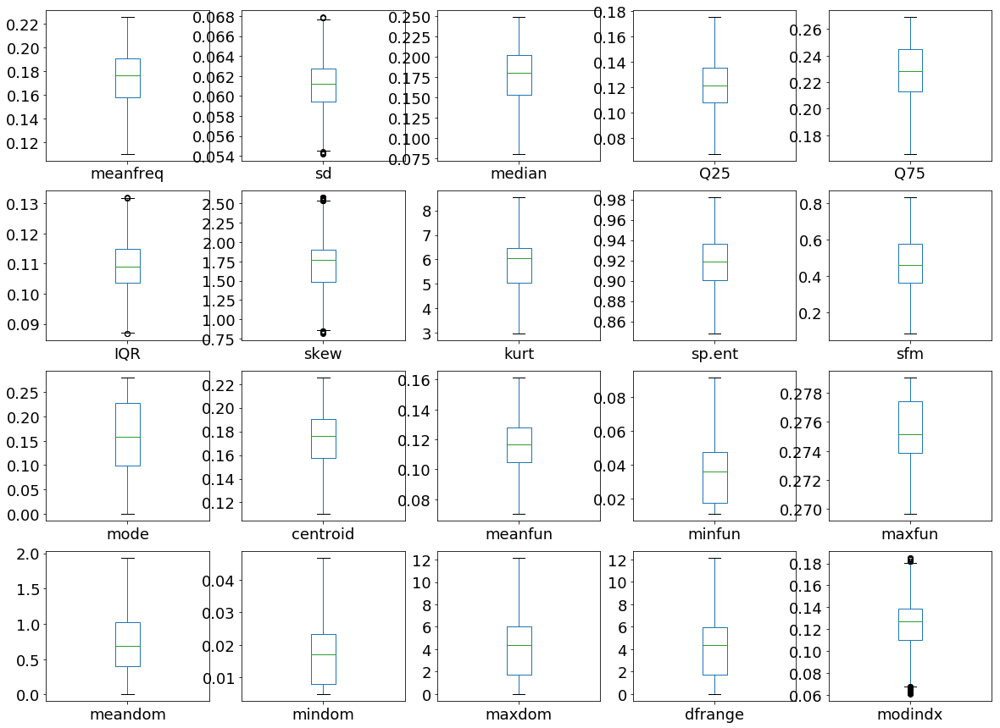
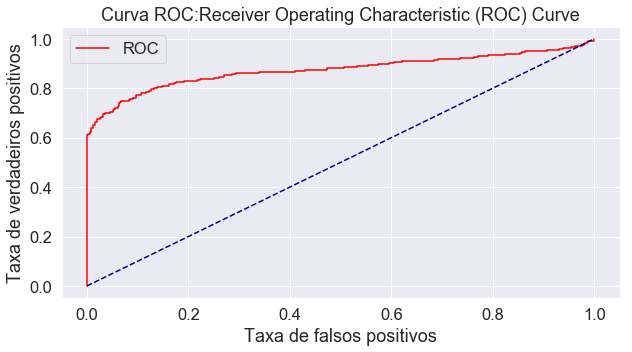

# MODELO 1 - Avaliação do Modelo de Classificação.
### Introdução.
##### Este  Notebook é destina a avaliação do modelo de regressão logística e separação dos dados  no arquivo voice_fix.csv


---
---
---
---
---


##  Resumo da análise anterior com a base tratada em python das propriedades acústicas.


```python
%matplotlib inline
```


```python
# Importa as bibliotecas
import pandas
import matplotlib.pyplot as plt
import numpy 
#from pandas.tools.plotting import scatter_matrix
from  pandas.plotting  import scatter_matrix
import seaborn as sb
from sklearn.model_selection import train_test_split,cross_val_score
from sklearn.preprocessing import Normalizer
#Logistic Regression
from sklearn.linear_model import LogisticRegression
from sklearn.metrics import roc_auc_score , roc_curve, auc ,accuracy_score,recall_score, precision_score
import statsmodels.api as sm
from sklearn.metrics import confusion_matrix


```


```python
url = "C:\\Users\\jorge\\Desktop\\TCC\\tcc_to_git\\tcc\\baseDados\\voice_fix.csv"
colunas = ["meanfreq","sd","median","Q25","Q75","IQR","skew","kurt","sp.ent","sfm","mode","centroid","meanfun","minfun","maxfun","meandom","mindom","maxdom","dfrange","modindx","label"]
dataset = pandas.read_csv(url, names=colunas , sep = ",")
```


```python
dataset[["meanfreq","sd","median"]].head(2)
```


<div>
<style scoped>
    .dataframe tbody tr th:only-of-type {
        vertical-align: middle;
    }

    .dataframe tbody tr th {
        vertical-align: top;
    }

    .dataframe thead th {
        text-align: right;
    }
</style>
<table border="1" class="dataframe">
  <thead>
    <tr style="text-align: right;">
      <th></th>
      <th>meanfreq</th>
      <th>sd</th>
      <th>median</th>
    </tr>
  </thead>
  <tbody>
    <tr>
      <td>0</td>
      <td>0.172557</td>
      <td>0.064241</td>
      <td>0.176893</td>
    </tr>
    <tr>
      <td>1</td>
      <td>0.172557</td>
      <td>0.067310</td>
      <td>0.176893</td>
    </tr>
  </tbody>
</table>
</div>


## 1) Refazendo boxplot.
O BOXPLOT representa os dados através de um retângulo
construído com os quartis e fornece informação sobre valores
extremos. 


```python
## Separação dos dados pela classe label, vozes de homens e mulheres.
dfHomens = dataset[dataset["label"] == "male"]
dfMulheres = dataset[dataset["label"] == "female"]
```

### Dataframe da classe femele


```python
plt.rcParams['figure.figsize'] = (20,15)
dfMulheres[colunas[0:20]].plot(kind='box', subplots=True, layout=(4,5), sharex=False, sharey=False,fontsize=18)
plt.show()
```


### Dataframe da classe male


```python
plt.rcParams['figure.figsize'] = (20,15)
dfHomens[colunas[0:20]].plot(kind='box', subplots=True, layout=(4,5), sharex=False, sharey=False,fontsize=18)
plt.show()
```





## Fim do resumo análise.


```python
from sklearn.model_selection import train_test_split
from sklearn.preprocessing import Normalizer
#Logistic Regression
from sklearn.linear_model import LogisticRegression
from sklearn.metrics import roc_auc_score , roc_curve, auc

```


```python
url = ".\\baseDados\\voice_fix.csv"
colunas = ["meanfreq","sd","median","Q25","Q75","IQR","skew","kurt","sp.ent","sfm","mode","centroid","meanfun","minfun","maxfun","meandom","mindom","maxdom","dfrange","modindx","label"]
dataset = pandas.read_csv(url, names=colunas , sep = ",")
```

---


---


---
# Procedimentos de avaliação de modelo
Train/Test Split
K-Fold Cross Validation

##  2)  Preparando a base para usar no modelo de regressão logística.


```python
print(dataset.head(2).transpose())
```

                      0           1
    meanfreq   0.172557    0.172557
    sd        0.0642413     0.06731
    median     0.176893    0.176893
    Q25        0.121089    0.121089
    Q75        0.227842    0.227842
    IQR        0.109055    0.109055
    skew        1.90605     1.90605
    kurt        6.45022     6.45022
    sp.ent     0.893369    0.892193
    sfm        0.491918    0.513724
    mode              0           0
    centroid   0.172557    0.172557
    meanfun   0.0842791    0.107937
    minfun    0.0157017   0.0158259
    maxfun     0.275862    0.273863
    meandom   0.0078125  0.00901442
    mindom    0.0078125   0.0078125
    maxdom    0.0078125   0.0546875
    dfrange           0    0.046875
    modindx    0.132999    0.124688
    label          male        male
    

##  3)  Atribuindo para female=1 (Mulheres), male=0 (Homens) e adicionando a coluna gênero para representar a classe como dummy.


```python
df_pre = dataset

df_pre['genero'] = df_pre['label'].replace({'female': 1, 'male': 0})
dataset = df_pre
```


```python
print(df_pre.head(2).transpose())


#dataset = df_pre
```

                      0           1
    meanfreq   0.172557    0.172557
    sd        0.0642413     0.06731
    median     0.176893    0.176893
    Q25        0.121089    0.121089
    Q75        0.227842    0.227842
    IQR        0.109055    0.109055
    skew        1.90605     1.90605
    kurt        6.45022     6.45022
    sp.ent     0.893369    0.892193
    sfm        0.491918    0.513724
    mode              0           0
    centroid   0.172557    0.172557
    meanfun   0.0842791    0.107937
    minfun    0.0157017   0.0158259
    maxfun     0.275862    0.273863
    meandom   0.0078125  0.00901442
    mindom    0.0078125   0.0078125
    maxdom    0.0078125   0.0546875
    dfrange           0    0.046875
    modindx    0.132999    0.124688
    label          male        male
    genero            0           0
    


```python
#df =dataset.rename(columns={'label': 'genero'})
print(df_pre.tail(2).transpose())
```

                   3166       3167
    meanfreq   0.143659   0.165509
    sd        0.0906283  0.0928835
    median     0.184976   0.183044
    Q25        0.181927   0.181927
    Q75        0.219943   0.250827
    IQR       0.0412693  0.0412693
    skew        1.59106    1.70503
    kurt         5.3883    5.76912
    sp.ent     0.950436   0.938829
    sfm         0.67547   0.601529
    mode       0.212202   0.201041
    centroid   0.143659   0.165509
    meanfun    0.172375   0.185607
    minfun    0.0344828  0.0622568
    maxfun     0.274763   0.271186
    meandom     0.79136   0.227022
    mindom    0.0078125  0.0078125
    maxdom      3.59375   0.554688
    dfrange     3.58594   0.546875
    modindx    0.133931   0.133931
    label        female     female
    genero            1          1
    

#  4)   Dataset: Train/Test Split para os modelos.
Esse método divide o conjunto de dados em duas partes: um conjunto de treinamento e um conjunto de testes. O conjunto de treinamento é usado para treinar o modelo. Também podemos medir a precisão do modelo no conjunto de treinamento.

Logistic Regression coefficients na formula:
 y=  1 * b0 + b1*X1 + b2*X2+ b3*Xn

 ##   5)  Criando explicitamente  y-intercept: b0. 


```python
df_pre['int']=1
print(df_pre.head().transpose())
```

                      0           1           2          3          4
    meanfreq   0.172557    0.172557    0.172557   0.151228    0.13512
    sd        0.0642413     0.06731   0.0635487  0.0612157  0.0627691
    median     0.176893    0.176893    0.176893   0.158011   0.124656
    Q25        0.121089    0.121089    0.121089  0.0965817  0.0787202
    Q75        0.227842    0.227842    0.227842   0.207955   0.206045
    IQR        0.109055    0.109055    0.123207   0.111374   0.127325
    skew        1.90605     1.90605     1.90605    1.23283    1.10117
    kurt        6.45022     6.45022     6.45022     4.1773    4.33371
    sp.ent     0.893369    0.892193    0.918553   0.963322   0.971955
    sfm        0.491918    0.513724    0.478905   0.727232   0.783568
    mode              0           0           0  0.0838782   0.104261
    centroid   0.172557    0.172557    0.172557   0.151228    0.13512
    meanfun   0.0842791    0.107937   0.0987063  0.0889648   0.106398
    minfun    0.0157017   0.0158259   0.0156556  0.0177976  0.0169312
    maxfun     0.275862    0.273863    0.271186   0.273863   0.275166
    meandom   0.0078125  0.00901442  0.00799006   0.201497   0.712812
    mindom    0.0078125   0.0078125   0.0078125  0.0078125  0.0078125
    maxdom    0.0078125   0.0546875    0.015625     0.5625    5.48438
    dfrange           0    0.046875   0.0078125   0.554688    5.47656
    modindx    0.132999    0.124688    0.124688   0.130223   0.124688
    label          male        male        male       male       male
    genero            0           0           0          0          0
    int               1           1           1          1          1
    


```python
## Separação dos dados pela classe label, vozes de homens e mulheres.
df_male = df_pre[df_pre["label"] == "male"]
df_female = df_pre[df_pre["label"] == "female"]


```


```python
print(df_male.head().transpose())
```

                      0           1           2          3          4
    meanfreq   0.172557    0.172557    0.172557   0.151228    0.13512
    sd        0.0642413     0.06731   0.0635487  0.0612157  0.0627691
    median     0.176893    0.176893    0.176893   0.158011   0.124656
    Q25        0.121089    0.121089    0.121089  0.0965817  0.0787202
    Q75        0.227842    0.227842    0.227842   0.207955   0.206045
    IQR        0.109055    0.109055    0.123207   0.111374   0.127325
    skew        1.90605     1.90605     1.90605    1.23283    1.10117
    kurt        6.45022     6.45022     6.45022     4.1773    4.33371
    sp.ent     0.893369    0.892193    0.918553   0.963322   0.971955
    sfm        0.491918    0.513724    0.478905   0.727232   0.783568
    mode              0           0           0  0.0838782   0.104261
    centroid   0.172557    0.172557    0.172557   0.151228    0.13512
    meanfun   0.0842791    0.107937   0.0987063  0.0889648   0.106398
    minfun    0.0157017   0.0158259   0.0156556  0.0177976  0.0169312
    maxfun     0.275862    0.273863    0.271186   0.273863   0.275166
    meandom   0.0078125  0.00901442  0.00799006   0.201497   0.712812
    mindom    0.0078125   0.0078125   0.0078125  0.0078125  0.0078125
    maxdom    0.0078125   0.0546875    0.015625     0.5625    5.48438
    dfrange           0    0.046875   0.0078125   0.554688    5.47656
    modindx    0.132999    0.124688    0.124688   0.130223   0.124688
    label          male        male        male       male       male
    genero            0           0           0          0          0
    int               1           1           1          1          1
    


```python
print(df_female.head().transpose())
```

                   1584       1585       1586       1587       1588
    meanfreq   0.158108   0.182855   0.199807    0.19528   0.208504
    sd        0.0827816  0.0677889  0.0619738  0.0720869  0.0575502
    median     0.191191   0.200639   0.211358   0.204656   0.220229
    Q25        0.181927   0.175489   0.184422   0.180611   0.190343
    Q75        0.224552   0.226068   0.235687   0.255954   0.249759
    IQR       0.0412693  0.0505788  0.0512645  0.0403311  0.0594155
    skew        2.80134    3.00189    2.54384    2.39233    1.70779
    kurt        9.34563    9.34563     14.922    10.0615    5.67091
    sp.ent     0.952161   0.910458   0.904432   0.907115   0.879674
    sfm        0.679223   0.506099   0.425289   0.524209   0.343548
    mode       0.201834   0.201834   0.201834   0.193435   0.201834
    centroid   0.158108   0.182855   0.199807    0.19528   0.208504
    meanfun    0.185042    0.15959   0.156465   0.182629   0.162043
    minfun    0.0230216  0.0187135  0.0161943  0.0249221  0.0168067
    maxfun     0.275862   0.275927   0.275927   0.275862   0.275927
    meandom    0.272964    0.25897   0.250446   0.269531   0.260789
    mindom     0.046875  0.0546875  0.0546875  0.0546875  0.0546875
    maxdom     0.742188   0.804688   0.898438   0.703125     0.8125
    dfrange    0.695312       0.75    0.84375   0.648438   0.757812
    modindx    0.133931   0.129735   0.133931   0.133931   0.129735
    label        female     female     female     female     female
    genero            1          1          1          1          1
    int               1          1          1          1          1
    

### Separando X e Y para dataframe_female


```python
X_entrada_female = df_female.drop(columns=['label','genero'])
Y_entrada_female = df_female['genero']

```


```python
print(X_entrada_female.head().transpose())

feature_cols=X_entrada_female.columns
feature_cols

```

                  1584      1585       1586       1587      1588
    meanfreq  0.158108  0.182855   0.199807   0.195280  0.208504
    sd        0.082782  0.067789   0.061974   0.072087  0.057550
    median    0.191191  0.200639   0.211358   0.204656  0.220229
    Q25       0.181927  0.175489   0.184422   0.180611  0.190343
    Q75       0.224552  0.226068   0.235687   0.255954  0.249759
    IQR       0.041269  0.050579   0.051265   0.040331  0.059416
    skew      2.801344  3.001890   2.543841   2.392326  1.707786
    kurt      9.345630  9.345630  14.921964  10.061489  5.670912
    sp.ent    0.952161  0.910458   0.904432   0.907115  0.879674
    sfm       0.679223  0.506099   0.425289   0.524209  0.343548
    mode      0.201834  0.201834   0.201834   0.193435  0.201834
    centroid  0.158108  0.182855   0.199807   0.195280  0.208504
    meanfun   0.185042  0.159590   0.156465   0.182629  0.162043
    minfun    0.023022  0.018713   0.016194   0.024922  0.016807
    maxfun    0.275862  0.275927   0.275927   0.275862  0.275927
    meandom   0.272964  0.258970   0.250446   0.269531  0.260789
    mindom    0.046875  0.054688   0.054688   0.054688  0.054688
    maxdom    0.742188  0.804688   0.898438   0.703125  0.812500
    dfrange   0.695312  0.750000   0.843750   0.648438  0.757812
    modindx   0.133931  0.129735   0.133931   0.133931  0.129735
    int       1.000000  1.000000   1.000000   1.000000  1.000000
    


    Index(['meanfreq', 'sd', 'median', 'Q25', 'Q75', 'IQR', 'skew', 'kurt',
           'sp.ent', 'sfm', 'mode', 'centroid', 'meanfun', 'minfun', 'maxfun',
           'meandom', 'mindom', 'maxdom', 'dfrange', 'modindx', 'int'],
          dtype='object')


```python
print(Y_entrada_female.head())
```

    1584    1
    1585    1
    1586    1
    1587    1
    1588    1
    Name: genero, dtype: int64
    

### Separando X e Y para dataframe_male


```python
X_entrada_male = df_male.drop(columns=['label','genero'])
Y_entrada_male = df_male['genero']
```


```python
print(X_entrada_male.head().transpose())
```

                     0         1         2         3         4
    meanfreq  0.172557  0.172557  0.172557  0.151228  0.135120
    sd        0.064241  0.067310  0.063549  0.061216  0.062769
    median    0.176893  0.176893  0.176893  0.158011  0.124656
    Q25       0.121089  0.121089  0.121089  0.096582  0.078720
    Q75       0.227842  0.227842  0.227842  0.207955  0.206045
    IQR       0.109055  0.109055  0.123207  0.111374  0.127325
    skew      1.906048  1.906048  1.906048  1.232831  1.101174
    kurt      6.450221  6.450221  6.450221  4.177296  4.333713
    sp.ent    0.893369  0.892193  0.918553  0.963322  0.971955
    sfm       0.491918  0.513724  0.478905  0.727232  0.783568
    mode      0.000000  0.000000  0.000000  0.083878  0.104261
    centroid  0.172557  0.172557  0.172557  0.151228  0.135120
    meanfun   0.084279  0.107937  0.098706  0.088965  0.106398
    minfun    0.015702  0.015826  0.015656  0.017798  0.016931
    maxfun    0.275862  0.273863  0.271186  0.273863  0.275166
    meandom   0.007812  0.009014  0.007990  0.201497  0.712812
    mindom    0.007812  0.007812  0.007812  0.007812  0.007812
    maxdom    0.007812  0.054688  0.015625  0.562500  5.484375
    dfrange   0.000000  0.046875  0.007812  0.554688  5.476562
    modindx   0.132999  0.124688  0.124688  0.130223  0.124688
    int       1.000000  1.000000  1.000000  1.000000  1.000000
    


```python
print(Y_entrada_male.head())
```

    0    0
    1    0
    2    0
    3    0
    4    0
    Name: genero, dtype: int64
    

##  6)  Divisão balanceada de 30% teste e 70%  para o treino.

### Feito a divisão  randômica de 30 test e 70 treino no dataframe_female


```python
X_trainF,X_testF,y_trainF,y_testF = train_test_split(X_entrada_female,Y_entrada_female,test_size=0.30,random_state=0)
```

### Feito a divisão randômica de 30 test e 70 treino no dataframe_male


```python
X_trainM, X_testM, y_trainM ,y_testM = train_test_split(X_entrada_male,Y_entrada_male,test_size=0.30,random_state=0)
```

### Concatenando os datraframes  Após ad divisão dos dados de treino e test  male e frame


```python
X_train_frames = [X_trainF, X_trainM]
```


```python
X_test_frames = [X_testF,X_testM]
```


```python
y_test_frames = [y_testF, y_testM]
```


```python
y_train_frames = [ y_trainF,  y_trainM]
```

### Convertendo os datraframes  após a divisão dos dados de: treino e test,  male e frame


```python
X_train = pandas.concat(X_train_frames)
```


```python
X_test = pandas.concat(X_test_frames)
```


```python
y_train = pandas.concat(y_train_frames)
```


```python
y_test = pandas.concat(y_test_frames )
```

### Mostratandos as dimensões dos dados


```python
X_train.shape,X_test.shape , y_train.shape, y_test.shape


dictabela = {}
dictabela['Registros para treino'] = X_train.shape[0]
dictabela['Registros para teste'] = X_test.shape[0]


```


```python
dftreinoteste = pandas.DataFrame.from_dict(dictabela, orient="index").reset_index()
```


```python
dftreinoteste =dftreinoteste.rename(columns={'index': 'divisão dos dados'})
dftreinoteste =dftreinoteste.rename(columns={0: 'total'})
dftreinoteste

```


<div>
<style scoped>
    .dataframe tbody tr th:only-of-type {
        vertical-align: middle;
    }

    .dataframe tbody tr th {
        vertical-align: top;
    }

    .dataframe thead th {
        text-align: right;
    }
</style>
<table border="1" class="dataframe">
  <thead>
    <tr style="text-align: right;">
      <th></th>
      <th>divisão dos dados</th>
      <th>total</th>
    </tr>
  </thead>
  <tbody>
    <tr>
      <td>0</td>
      <td>Registros para treino</td>
      <td>2216</td>
    </tr>
    <tr>
      <td>1</td>
      <td>Registros para teste</td>
      <td>952</td>
    </tr>
  </tbody>
</table>
</div>


```python
y_train
```


    2858    1
    2040    1
    2394    1
    3133    1
    3005    1
           ..
    763     0
    835     0
    1216    0
    559     0
    684     0
    Name: genero, Length: 2216, dtype: int64


### Total de  voz  por classe, masculinas e femininas na base de treino


```python
dfContador =pandas.DataFrame(list(y_train), columns = ['genero'])
contagem = dfContador.groupby('genero').size()
print(contagem)

```

    genero
    0    1108
    1    1108
    dtype: int64
    

### Total de  voz  por classe, masculinas e femininas na base de teste


```python
dfContador =pandas.DataFrame(list(y_test), columns = ['genero'])
contagem = dfContador.groupby('genero').size()
print(contagem)
```

    genero
    0    476
    1    476
    dtype: int64
    

---
---
---

##  7)  Normalização dos dados por questão de escala.


```python
# Instantiate 
norm = Normalizer()

# Fit
norm.fit(X_train)

# Transform both training and testing sets
X_train_norm = norm.transform(X_train)
X_test_norm = norm.transform(X_test)
```


```python
X_train_norm.shape , X_test_norm.shape
```


    ((2216, 21), (952, 21))


```python
print(X_train_norm)
```

    [[0.01070896 0.0013571  0.01063611 ... 0.4404305  0.00528321 0.04733426]
     [0.01080389 0.002876   0.01080535 ... 0.38455026 0.00730888 0.05951927]
     [0.01542367 0.00236176 0.01535375 ... 0.423673   0.00793265 0.07318508]
     ...
     [0.01959029 0.00592508 0.02281332 ... 0.490609   0.00824204 0.09827536]
     [0.01287192 0.00626938 0.011102   ... 0.49688596 0.01353424 0.10176224]
     [0.02327679 0.00906603 0.02096434 ... 0.10766927 0.02109371 0.15207357]]
    


#  8)  Salvando os dados de treino e teste em um dicionário serializado.


```python
dic_base_treino_test = {}
```


```python
dic_base_treino_test['y_train'] = y_train
```


```python
dic_base_treino_test['y_test'] = y_test
```


```python
dic_base_treino_test['X_train_norm'] = X_train_norm
```


```python
dic_base_treino_test['X_test_norm'] = X_test_norm
dic_base_treino_test['feature_cols'] =  feature_cols
```

### Salvando os dados para avaliação dos modelos


```python
try:
    import cPickle as pickle
except ModuleNotFoundError:
    import pickle
```


```python
output = ".\\baseDados\\voice_treino_test.pk"
with open(output, 'wb') as pickle_file:
    pickle.dump(dic_base_treino_test, pickle_file)

```

---
---
---
---
---

#  9) Carregando os dados para avaliação do modelo


```python
try:
    import cPickle as pickle
except ModuleNotFoundError:
    import pickle
```


```python
dic_base_treino_file = pickle.load(open( output, "rb" ))
```


```python
#print(dic_base_treino_file)
```


```python
y_train = dic_base_treino_file['y_train'] 
```


```python
 y_test = dic_base_treino_file['y_test'] 
```


```python
 X_train = dic_base_treino_file['X_train_norm']
```


```python
X_test = dic_base_treino_file['X_test_norm']
```


```python
dfContador =pandas.DataFrame(list(y_train), columns = ['genero'])
contagem = dfContador.groupby('genero').size()
print(contagem)
```

    genero
    0    1108
    1    1108
    dtype: int64
    


```python
dfContador =pandas.DataFrame(list(y_test), columns = ['genero'])
contagem = dfContador.groupby('genero').size()
print(contagem)
```

    genero
    0    476
    1    476
    dtype: int64
    

---


#  10)  Declarando o modelo.


```python
#logistic Regression
classifier = LogisticRegression(C=1, multi_class='ovr', penalty='l2', solver='liblinear')
```

#  11) Treinamento e teste do modelo.


```python
classifier.fit(X_train,y_train)
```


    LogisticRegression(C=1, class_weight=None, dual=False, fit_intercept=True,
                       intercept_scaling=1, l1_ratio=None, max_iter=100,
                       multi_class='ovr', n_jobs=None, penalty='l2',
                       random_state=None, solver='liblinear', tol=0.0001, verbose=0,
                       warm_start=False)


```python
y_pred=classifier.predict(X_test)
```

---

# 12) Modelo de avaliação de métricas.

##  16)  Classificação

###  Matriz de confusão.
Uma matriz de confusão pode ser definida livremente como uma tabela que descreve o desempenho de um modelo de classificação em um conjunto de dados de teste para os quais os valores verdadeiros são conhecidos.


```python
cm=confusion_matrix(y_test,y_pred)

```


```python
confusion_matrix_lda = pandas.DataFrame(cm, index = ['Negativos','Positivos'], columns = ['Previsão dos negativos','Previsão dos positivos'] )
confusion_matrix_lda['Total'] = 1
confusion_matrix_lda['Total'][0] = cm[0][0] + cm[0][1]
confusion_matrix_lda['Total'][1] = cm[1][0] + cm[1][1]
```


```python
confusion_matrix_lda
```


<div>
<style scoped>
    .dataframe tbody tr th:only-of-type {
        vertical-align: middle;
    }

    .dataframe tbody tr th {
        vertical-align: top;
    }

    .dataframe thead th {
        text-align: right;
    }
</style>
<table border="1" class="dataframe">
  <thead>
    <tr style="text-align: right;">
      <th></th>
      <th>Previsão dos negativos</th>
      <th>Previsão dos positivos</th>
      <th>Total</th>
    </tr>
  </thead>
  <tbody>
    <tr>
      <td>Negativos</td>
      <td>406</td>
      <td>70</td>
      <td>476</td>
    </tr>
    <tr>
      <td>Positivos</td>
      <td>91</td>
      <td>385</td>
      <td>476</td>
    </tr>
  </tbody>
</table>
</div>


```python
print(confusion_matrix_lda)
```

               Previsão dos negativos  Previsão dos positivos  Total
    Negativos                     406                      70    476
    Positivos                      91                     385    476
    


```python
#Plot the confusion matrix
plt.rcParams['figure.figsize'] = (10,5)
sb.set(font_scale=1.5)
sb.heatmap(cm, annot=True, fmt='g')
plt.show()
```


---

### True Positives:TP
Este valor indica a quantidade de registros que foram classificados como positivos corretamente.


```python
TP = confusion_matrix_lda['Previsão dos positivos'][1]
dfTP = pandas.DataFrame(TP, index = ['Positivos verdadeiros'], columns = ['Quantidade acertos'] )
```


```python
dfTP
```


<div>
<style scoped>
    .dataframe tbody tr th:only-of-type {
        vertical-align: middle;
    }

    .dataframe tbody tr th {
        vertical-align: top;
    }

    .dataframe thead th {
        text-align: right;
    }
</style>
<table border="1" class="dataframe">
  <thead>
    <tr style="text-align: right;">
      <th></th>
      <th>Quantidade acertos</th>
    </tr>
  </thead>
  <tbody>
    <tr>
      <td>Positivos verdadeiros</td>
      <td>385</td>
    </tr>
  </tbody>
</table>
</div>


```python
print(dfTP)
```

                           Quantidade acertos
    Positivos verdadeiros                 385
    

---

### True Negatives:TN
Este valor indica a quantidade de registros que foram classificados como negativos de maneira correta.


```python
TN = confusion_matrix_lda['Previsão dos negativos'][0]
dfTN = pandas.DataFrame(TN, index = ['Verdadeiro Negativo'], columns = ['Quantidade acertos'] )
```


```python
dfTN
```


<div>
<style scoped>
    .dataframe tbody tr th:only-of-type {
        vertical-align: middle;
    }

    .dataframe tbody tr th {
        vertical-align: top;
    }

    .dataframe thead th {
        text-align: right;
    }
</style>
<table border="1" class="dataframe">
  <thead>
    <tr style="text-align: right;">
      <th></th>
      <th>Quantidade acertos</th>
    </tr>
  </thead>
  <tbody>
    <tr>
      <td>Verdadeiro Negativo</td>
      <td>406</td>
    </tr>
  </tbody>
</table>
</div>


```python
print(dfTN)
```

                         Quantidade acertos
    Verdadeiro Negativo                 406
    

---

### Falso Positivos - False Positives:FP
Este valor indica a quantidade de registros que foram classificados como comentários positivos de maneira incorreta.


```python
FP = confusion_matrix_lda['Previsão dos positivos'][0]
dfFP = pandas.DataFrame(FP, index = ['Falso Positivo'], columns = ['Quantidade acertos'] )
```


```python
dfFP
```


<div>
<style scoped>
    .dataframe tbody tr th:only-of-type {
        vertical-align: middle;
    }

    .dataframe tbody tr th {
        vertical-align: top;
    }

    .dataframe thead th {
        text-align: right;
    }
</style>
<table border="1" class="dataframe">
  <thead>
    <tr style="text-align: right;">
      <th></th>
      <th>Quantidade acertos</th>
    </tr>
  </thead>
  <tbody>
    <tr>
      <td>Falso Positivo</td>
      <td>70</td>
    </tr>
  </tbody>
</table>
</div>


```python
print(dfFP)
```

                    Quantidade acertos
    Falso Positivo                  70
    

---

### False Negatives:FN
Este valor indica a quantidade de registros que foram classificados como comentários negativos de maneira incorreta.


```python
FN = confusion_matrix_lda['Previsão dos negativos'][1]
dfFN = pandas.DataFrame(FN, index = ['Negativos Falsos'], columns = ['Quantidade acertos'] )
```


```python
dfFN
```


<div>
<style scoped>
    .dataframe tbody tr th:only-of-type {
        vertical-align: middle;
    }

    .dataframe tbody tr th {
        vertical-align: top;
    }

    .dataframe thead th {
        text-align: right;
    }
</style>
<table border="1" class="dataframe">
  <thead>
    <tr style="text-align: right;">
      <th></th>
      <th>Quantidade acertos</th>
    </tr>
  </thead>
  <tbody>
    <tr>
      <td>Negativos Falsos</td>
      <td>91</td>
    </tr>
  </tbody>
</table>
</div>


```python
print(dfFN)
```

                      Quantidade acertos
    Negativos Falsos                  91
    

---

### Especificidade (Specificity)
Especificidade é a proporção de previsões negativas corretas para o total não de previsões negativas. Isso determina o grau de especificidade do classificador na previsão de instâncias positivas.

Specificity = (Numero de previsões negativas correta) / (Total do Numero Negativas prevista)

TN = / TN + FP


```python
Specificity = TN / float(TN + FP)
dfSpecificity = pandas.DataFrame(Specificity, index = ['Specificity'], columns = ['resultado'] )
```


```python
dfSpecificity
```


<div>
<style scoped>
    .dataframe tbody tr th:only-of-type {
        vertical-align: middle;
    }

    .dataframe tbody tr th {
        vertical-align: top;
    }

    .dataframe thead th {
        text-align: right;
    }
</style>
<table border="1" class="dataframe">
  <thead>
    <tr style="text-align: right;">
      <th></th>
      <th>resultado</th>
    </tr>
  </thead>
  <tbody>
    <tr>
      <td>Specificity</td>
      <td>0.852941</td>
    </tr>
  </tbody>
</table>
</div>


```python
print(dfSpecificity)
```

                 resultado
    Specificity   0.852941
    

---

### Precisão Geral (Accuracy)
A precisão da classificação é a proporção de previsões corretas para o total não  de previsões. 

Accuracy = (numero de predições corretas / numero de predições)

$$ Accuracy = \frac{TP + TN}{TP + TN + FP + FN}$$


```python
#trés maneiras de fazer o caluclo
print((TP + TN) / float(TP + TN + FP + FN))
print(accuracy_score(y_test, y_pred))
print("Accuracy ", classifier.score(X_test, y_test)*100)
Accuracy= classifier.score(X_test, y_test)
```

    0.8308823529411765
    0.8308823529411765
    Accuracy  83.08823529411765
    


```python
dfAccuracy = pandas.DataFrame(Accuracy, index = ['Accuracy'], columns = ['resultado'] )
dfAccuracy
```


<div>
<style scoped>
    .dataframe tbody tr th:only-of-type {
        vertical-align: middle;
    }

    .dataframe tbody tr th {
        vertical-align: top;
    }

    .dataframe thead th {
        text-align: right;
    }
</style>
<table border="1" class="dataframe">
  <thead>
    <tr style="text-align: right;">
      <th></th>
      <th>resultado</th>
    </tr>
  </thead>
  <tbody>
    <tr>
      <td>Accuracy</td>
      <td>0.830882</td>
    </tr>
  </tbody>
</table>
</div>


```python
print(dfAccuracy)
```

              resultado
    Accuracy   0.830882
    

---

### Sensibilidade ou recordação Recall


Sensibilidade ou recordação é a razão de previsões positivas corretas para o total não de previsões positivas, ou, mais simplesmente, quão sensível o classificador é para detectar instâncias positivas. Isso também é chamado de True Positive Rate

Recall = (Numero de positivas previstas corretamente) /( total de Predições positivas)

$$Recall = \frac{TP}{TP +FN}$$


```python
print(TP / float(TP + FN))
print(recall_score(y_test, y_pred))
Recall= recall_score(y_test, y_pred)
```

    0.8088235294117647
    0.8088235294117647
    


```python
dfRecall = pandas.DataFrame(Recall, index = ['Sensibilidade-Recall'], columns = ['resultado'] )
dfRecall
```


<div>
<style scoped>
    .dataframe tbody tr th:only-of-type {
        vertical-align: middle;
    }

    .dataframe tbody tr th {
        vertical-align: top;
    }

    .dataframe thead th {
        text-align: right;
    }
</style>
<table border="1" class="dataframe">
  <thead>
    <tr style="text-align: right;">
      <th></th>
      <th>resultado</th>
    </tr>
  </thead>
  <tbody>
    <tr>
      <td>Sensibilidade-Recall</td>
      <td>0.808824</td>
    </tr>
  </tbody>
</table>
</div>


```python
print(dfRecall)
```

                          resultado
    Sensibilidade-Recall   0.808824
    

---

## Taxa positiva falsa (False Positive Rate)
A *false positive rate*, é a proporção de previsões negativas que foram determinadas como positivas para o número total de previsões negativas ou quando o valor real é negativo, com que frequência a previsão é incorreta.

FalsePositveRate = Números de falsos positivos / Total de predições negativas


$$FalsePositveRate = \frac{FP}{ TN + FP}$$


```python
print(FP / float(TN + FP))
FalsePositveRate = FP / float(TN + FP)
```

    0.14705882352941177
    


```python
dfFalsePositveRate = pandas.DataFrame(FalsePositveRate, index = ['Taxa de Falso Positvo'], columns = ['resultado'] )
dfFalsePositveRate
```


<div>
<style scoped>
    .dataframe tbody tr th:only-of-type {
        vertical-align: middle;
    }

    .dataframe tbody tr th {
        vertical-align: top;
    }

    .dataframe thead th {
        text-align: right;
    }
</style>
<table border="1" class="dataframe">
  <thead>
    <tr style="text-align: right;">
      <th></th>
      <th>resultado</th>
    </tr>
  </thead>
  <tbody>
    <tr>
      <td>Taxa de Falso Positvo</td>
      <td>0.147059</td>
    </tr>
  </tbody>
</table>
</div>


```python
print(dfFalsePositveRate)
```

                           resultado
    Taxa de Falso Positvo   0.147059
    

---
### Precisão (Precision)
A precisão é a proporção de previsões corretas para o total  de não previsões preditas corretas. Isso mede a precisão do classificador ao prever instâncias positivas.

Precision = Número de positivas verdadeiras / Numero total de predicados positivos

$$Precision = \frac{TP} {TP + FP}$$


```python
print(TP / float(TP + FP))
print(precision_score(y_test, y_pred))
Precision = precision_score(y_test, y_pred)
```

    0.8461538461538461
    0.8461538461538461
    


```python
dfPrecision = pandas.DataFrame(Precision, index = ['Precisão'], columns = ['resultado'] )
dfPrecision
```


<div>
<style scoped>
    .dataframe tbody tr th:only-of-type {
        vertical-align: middle;
    }

    .dataframe tbody tr th {
        vertical-align: top;
    }

    .dataframe thead th {
        text-align: right;
    }
</style>
<table border="1" class="dataframe">
  <thead>
    <tr style="text-align: right;">
      <th></th>
      <th>resultado</th>
    </tr>
  </thead>
  <tbody>
    <tr>
      <td>Precisão</td>
      <td>0.846154</td>
    </tr>
  </tbody>
</table>
</div>


```python
print(dfPrecision)
```

              resultado
    Precisão   0.846154
    

---

### F1 Score
O F1 Score é uma média harmônica entre precisão (que, apesar de ter o mesmo nome, não é a mesma citada acima) e recall. Veja abaixo as definições destes dois termos.

Ela é muito boa quando você possui um dataset com classes desproporcionais, e o seu modelo não emite probabilidades. Em geral, quanto maior o F1 score, melhor.


$$F1Score = \frac{2 \times Precisão \times Recall }{Precisão + Recall}$$


```python
F1Score = 2 * Precision *  Recall /  float(Precision + Recall)
```


```python
print(F1Score)

```

    0.8270676691729324
    


```python
dfF1Score = pandas.DataFrame(F1Score, index = ['F1 Score'], columns = ['resultado'] )
dfF1Score
```


<div>
<style scoped>
    .dataframe tbody tr th:only-of-type {
        vertical-align: middle;
    }

    .dataframe tbody tr th {
        vertical-align: top;
    }

    .dataframe thead th {
        text-align: right;
    }
</style>
<table border="1" class="dataframe">
  <thead>
    <tr style="text-align: right;">
      <th></th>
      <th>resultado</th>
    </tr>
  </thead>
  <tbody>
    <tr>
      <td>F1 Score</td>
      <td>0.827068</td>
    </tr>
  </tbody>
</table>
</div>


```python
print(dfF1Score)
```

              resultado
    F1 Score   0.827068
    

---
### 13) Curva ROC
Uma curva ROC é uma forma comumente usada para visualizar o desempenho de um classificador binário, significando um classificador com duas classes de saída possíveis. A curva plota a Taxa Positiva Real (Recall) contra a Taxa Falsa Positiva (também interpretada como Especificidade 1).


```python
def plot_roc_curve(fpr, tpr):
    plt.plot(fpr, tpr, color='red', label='ROC')
    plt.plot([0, 1], [0, 1], color='darkblue', linestyle='--')
    plt.xlabel('Taxa de falsos positivos')
    plt.ylabel('Taxa de verdadeiros positivos')
    plt.title('Curva ROC:Receiver Operating Characteristic (ROC) Curve')
    plt.legend()
    plt.show()
```

#### Calcula a propabildade de previsão.


```python
y_pred_prob = classifier.predict_proba(X_test)[:, 1]
```


```python
fpr, tpr, thresholds = roc_curve(y_test, y_pred_prob)
```


```python
plot_roc_curve(fpr, tpr)
```





---

### AUC (área sob a curva) da Curva ROC
AUC ou Area Under the Curve é a porcentagem do gráfico do ROC que está abaixo da curva. AUC é útil como um único número de resumo do desempenho do classificador.


```python
print(roc_auc_score(y_test, y_pred_prob))
Auc=roc_auc_score(y_test, y_pred_prob)
```

    0.873181625591413
    


```python
dfAuc = pandas.DataFrame(Auc, index = ['AUC'], columns = ['resultado'] )
dfAuc
```


<div>
<style scoped>
    .dataframe tbody tr th:only-of-type {
        vertical-align: middle;
    }

    .dataframe tbody tr th {
        vertical-align: top;
    }

    .dataframe thead th {
        text-align: right;
    }
</style>
<table border="1" class="dataframe">
  <thead>
    <tr style="text-align: right;">
      <th></th>
      <th>resultado</th>
    </tr>
  </thead>
  <tbody>
    <tr>
      <td>AUC</td>
      <td>0.873182</td>
    </tr>
  </tbody>
</table>
</div>


```python
print(dfAuc)
```

         resultado
    AUC   0.873182
    

# Salva dados para usar no gráfico consolidado.


```python
dic_logist={}
```


```python
dic_logist['Accuracy']=Accuracy
dic_logist['Auc']=Auc
dic_logist['Recall']=Recall
dic_logist['Specificity']=Specificity
dic_logist['Precision']=Precision
dic_logist['F1Score']=F1Score
dic_logist['y_pred_prob']=y_pred_prob
dic_logist['y_test']=y_test


```


```python
dic_logist
```


    {'Accuracy': 0.8308823529411765,
     'Auc': 0.873181625591413,
     'Recall': 0.8088235294117647,
     'Specificity': 0.8529411764705882,
     'Precision': 0.8461538461538461,
     'F1Score': 0.8270676691729324,
     'y_pred_prob': array([0.52438612, 0.5837505 , 0.62765444, 0.57759981, 0.73036964,
            0.6840516 , 0.61742168, 0.34323323, 0.2921634 , 0.31829328,
            0.7619323 , 0.70412845, 0.59035486, 0.70196921, 0.68376061,
            0.64113761, 0.48194272, 0.40465338, 0.51370326, 0.34403588,
            0.69360089, 0.7712258 , 0.63985824, 0.6458357 , 0.39876009,
            0.76462389, 0.59424769, 0.66190435, 0.65796666, 0.76572534,
            0.64918765, 0.64320386, 0.47349258, 0.57051776, 0.60495435,
            0.6613162 , 0.54919796, 0.51786193, 0.67136436, 0.53443832,
            0.64283689, 0.41294953, 0.5903379 , 0.58460994, 0.30468684,
            0.74566322, 0.04631068, 0.80040733, 0.78947826, 0.73623727,
            0.59746726, 0.53664   , 0.63442447, 0.63484208, 0.75954399,
            0.66050616, 0.48023172, 0.76896377, 0.6099209 , 0.49942254,
            0.13776477, 0.71831004, 0.30089486, 0.37497357, 0.62148495,
            0.42256365, 0.3616791 , 0.77240596, 0.61331559, 0.63132555,
            0.71971194, 0.79950452, 0.60738975, 0.55831485, 0.61744568,
            0.14868378, 0.79558948, 0.79770876, 0.56464433, 0.67488201,
            0.68910211, 0.80550455, 0.54067244, 0.75850101, 0.55764726,
            0.37953444, 0.6665314 , 0.63946078, 0.65191029, 0.65327736,
            0.04909289, 0.64487437, 0.77958842, 0.67571659, 0.60745865,
            0.28310076, 0.52516048, 0.59097269, 0.62964417, 0.63031111,
            0.56205759, 0.71323688, 0.45490114, 0.58299907, 0.61072247,
            0.74323506, 0.62149232, 0.45319077, 0.57444392, 0.46519681,
            0.5682447 , 0.79679329, 0.55771264, 0.6647096 , 0.66597315,
            0.66431603, 0.53361794, 0.71713404, 0.79815228, 0.47113728,
            0.55410399, 0.64343592, 0.72995856, 0.36391484, 0.65948896,
            0.77328705, 0.64579771, 0.68759587, 0.636955  , 0.76478303,
            0.53303474, 0.75345811, 0.71681845, 0.65009036, 0.64616549,
            0.64025803, 0.58162578, 0.78176177, 0.64499201, 0.50910917,
            0.6265509 , 0.8261161 , 0.62826468, 0.65871558, 0.68779525,
            0.66097952, 0.80818718, 0.61893089, 0.67891585, 0.63364776,
            0.69329191, 0.63824496, 0.56571854, 0.63682338, 0.48827571,
            0.33413114, 0.69238181, 0.66550859, 0.37648768, 0.66619211,
            0.62459716, 0.26019962, 0.39796368, 0.57447788, 0.68507793,
            0.62710176, 0.74261126, 0.61849782, 0.65283019, 0.64058678,
            0.64447987, 0.0301876 , 0.43957631, 0.78762915, 0.57310725,
            0.565904  , 0.7058829 , 0.57485916, 0.79434797, 0.54115938,
            0.64956364, 0.64249135, 0.80005474, 0.60225009, 0.56350967,
            0.66224377, 0.72358829, 0.52658988, 0.44332718, 0.66273671,
            0.59756293, 0.67141824, 0.66997197, 0.55576597, 0.55993304,
            0.64670187, 0.64351896, 0.63610967, 0.52084232, 0.65327203,
            0.75440326, 0.66954943, 0.65683356, 0.80425079, 0.70715439,
            0.22486075, 0.78355774, 0.81883876, 0.35040709, 0.65076929,
            0.61056119, 0.23689412, 0.63244367, 0.64455426, 0.38970688,
            0.56153877, 0.76900686, 0.78785464, 0.6755661 , 0.69099818,
            0.5984447 , 0.6965107 , 0.72881905, 0.61031341, 0.56285385,
            0.60739423, 0.52919484, 0.77136102, 0.80936659, 0.43724629,
            0.84122144, 0.49334038, 0.55149601, 0.4539413 , 0.81725988,
            0.72492491, 0.58394514, 0.68999199, 0.70167207, 0.63774118,
            0.6789809 , 0.62588914, 0.45955091, 0.3813503 , 0.53438989,
            0.68012814, 0.65760189, 0.81076871, 0.36869391, 0.48916542,
            0.11642266, 0.71733645, 0.68339487, 0.38028974, 0.68933568,
            0.80276011, 0.73768543, 0.78573478, 0.51535057, 0.69350212,
            0.67612324, 0.73296099, 0.07569966, 0.68981415, 0.35074173,
            0.79451835, 0.49315556, 0.65788141, 0.77823481, 0.36359575,
            0.69240648, 0.77385905, 0.70210746, 0.79709028, 0.48203283,
            0.14622325, 0.68640168, 0.77209623, 0.37717566, 0.39461706,
            0.575057  , 0.58299738, 0.51296055, 0.8367531 , 0.55874783,
            0.51294128, 0.57861308, 0.7179382 , 0.70383507, 0.65866823,
            0.70861316, 0.84162458, 0.81548837, 0.70098391, 0.66254905,
            0.73297666, 0.19647022, 0.64950192, 0.66138021, 0.61728294,
            0.80677803, 0.76015717, 0.62673676, 0.65968726, 0.70090742,
            0.51273719, 0.75192158, 0.65867733, 0.65067535, 0.71676053,
            0.8098738 , 0.62146417, 0.60105627, 0.72715474, 0.60164015,
            0.72212928, 0.14595401, 0.60436526, 0.74249421, 0.8019226 ,
            0.30646876, 0.63721116, 0.29209936, 0.65818393, 0.60642699,
            0.72206956, 0.67409612, 0.0438893 , 0.5357952 , 0.60488859,
            0.68092925, 0.69975148, 0.61213483, 0.66014508, 0.39044702,
            0.12592302, 0.64432617, 0.57320536, 0.50569431, 0.59984795,
            0.65604177, 0.65973835, 0.47146276, 0.58415906, 0.69398376,
            0.63484832, 0.59066001, 0.41696142, 0.75987422, 0.54203638,
            0.55867003, 0.45901053, 0.4635972 , 0.19277516, 0.61974159,
            0.20545083, 0.67485458, 0.64073174, 0.74875551, 0.65004705,
            0.81398273, 0.76579426, 0.60094665, 0.64869274, 0.74842517,
            0.69173086, 0.76465069, 0.7989992 , 0.65746846, 0.55980105,
            0.59112891, 0.64757172, 0.61697875, 0.68520362, 0.79321626,
            0.38937144, 0.62560235, 0.64636732, 0.63231145, 0.65869637,
            0.23698506, 0.44316942, 0.619453  , 0.5790502 , 0.64380308,
            0.69995201, 0.74609093, 0.79519101, 0.5668682 , 0.59795437,
            0.55367232, 0.68507261, 0.71781427, 0.58035294, 0.40472502,
            0.64344015, 0.72168692, 0.73065651, 0.44560371, 0.62899971,
            0.38345547, 0.70334626, 0.65933031, 0.3963347 , 0.6402172 ,
            0.2083143 , 0.84798985, 0.60474703, 0.55209265, 0.61565933,
            0.5046731 , 0.21275525, 0.49428042, 0.59804753, 0.80465751,
            0.67607268, 0.48696536, 0.82302927, 0.79649568, 0.70732535,
            0.80187652, 0.80873962, 0.60152879, 0.70023027, 0.34053058,
            0.84690496, 0.6978758 , 0.56051121, 0.63671088, 0.63315242,
            0.81252359, 0.69592232, 0.50523132, 0.70933632, 0.63460811,
            0.79495721, 0.62611994, 0.84085152, 0.72130911, 0.50089362,
            0.68041312, 0.40532968, 0.75915604, 0.61352864, 0.81709908,
            0.42616729, 0.32063218, 0.72093783, 0.60453162, 0.55424162,
            0.5251929 , 0.54218218, 0.76678558, 0.6285544 , 0.32025774,
            0.70367217, 0.52033277, 0.63800492, 0.41466553, 0.63143433,
            0.141564  , 0.71577134, 0.11638173, 0.23414478, 0.6503724 ,
            0.45751785, 0.63415987, 0.6906632 , 0.64419466, 0.3591568 ,
            0.60142534, 0.74753163, 0.75980435, 0.79785337, 0.72626095,
            0.75147531, 0.35740227, 0.53201214, 0.29952808, 0.56077409,
            0.46921097, 0.25818775, 0.32437289, 0.37477533, 0.44481358,
            0.36750724, 0.38257658, 0.56846155, 0.37907991, 0.41393115,
            0.34505423, 0.41642043, 0.55414377, 0.38027523, 0.47579485,
            0.43654507, 0.40618768, 0.40031976, 0.41827144, 0.46166741,
            0.47650684, 0.28096064, 0.51928298, 0.33113179, 0.25901794,
            0.41716038, 0.55215961, 0.28965727, 0.4826799 , 0.20931494,
            0.46857575, 0.33375995, 0.34921961, 0.3715588 , 0.58527366,
            0.38097816, 0.42011157, 0.19759339, 0.41050688, 0.40085746,
            0.41063363, 0.50838533, 0.49823829, 0.21721865, 0.54881138,
            0.45539918, 0.54758268, 0.15058521, 0.58270852, 0.37694849,
            0.42220431, 0.34108616, 0.48901013, 0.49963223, 0.51102624,
            0.39751883, 0.3860085 , 0.55080366, 0.36917622, 0.42359468,
            0.13804487, 0.3600983 , 0.38278755, 0.25230862, 0.4101904 ,
            0.22240203, 0.41841812, 0.47545842, 0.41091666, 0.37318234,
            0.41061612, 0.37746213, 0.09840636, 0.07014338, 0.4848146 ,
            0.48154165, 0.49531118, 0.50510457, 0.34015708, 0.38225017,
            0.34925225, 0.53668448, 0.58294323, 0.20594451, 0.36561559,
            0.40965068, 0.1847152 , 0.41296837, 0.53503012, 0.37227389,
            0.52226721, 0.15919371, 0.39682649, 0.31558853, 0.35484141,
            0.46425133, 0.13757244, 0.44505632, 0.36020945, 0.374533  ,
            0.60524301, 0.36355647, 0.4212496 , 0.35574495, 0.54481755,
            0.43339135, 0.46570983, 0.28191633, 0.40779717, 0.45853647,
            0.26082533, 0.20228231, 0.40839802, 0.39762156, 0.22766124,
            0.43388756, 0.52217308, 0.26953613, 0.48664107, 0.36465241,
            0.41561329, 0.47398895, 0.39596437, 0.54398089, 0.35870394,
            0.56323074, 0.2469849 , 0.38853718, 0.56188472, 0.42792237,
            0.37003909, 0.5939515 , 0.41857412, 0.32380204, 0.41495694,
            0.50396131, 0.53980476, 0.42653055, 0.38587253, 0.56067416,
            0.37652664, 0.39587084, 0.38997128, 0.40258962, 0.39202639,
            0.35105912, 0.39060415, 0.47220604, 0.56597103, 0.31915179,
            0.4637677 , 0.40905402, 0.48715418, 0.45150605, 0.35944663,
            0.36249075, 0.38723566, 0.43672819, 0.47211816, 0.37201621,
            0.27109772, 0.4119269 , 0.42009574, 0.36951063, 0.33814188,
            0.41872676, 0.42707394, 0.43701001, 0.181411  , 0.57173332,
            0.43157443, 0.31810471, 0.30847007, 0.41221413, 0.25859201,
            0.37532401, 0.35875785, 0.40235689, 0.44329825, 0.34195806,
            0.20913391, 0.32385173, 0.46139085, 0.49179627, 0.45731679,
            0.40735731, 0.36544395, 0.25397852, 0.37825845, 0.51504582,
            0.38977257, 0.30506899, 0.42163122, 0.5303799 , 0.41752436,
            0.36947089, 0.47104507, 0.41343199, 0.39735309, 0.36940203,
            0.33271629, 0.46133832, 0.32440145, 0.492208  , 0.26420589,
            0.39015936, 0.375336  , 0.47633599, 0.22951986, 0.40830154,
            0.39627098, 0.40305021, 0.38194225, 0.32083714, 0.347224  ,
            0.47585594, 0.38159331, 0.49472693, 0.57002339, 0.3300258 ,
            0.31563931, 0.56095412, 0.50917719, 0.39490471, 0.40819801,
            0.36476573, 0.09335923, 0.53613107, 0.28352101, 0.48449728,
            0.39035145, 0.49191223, 0.34834227, 0.34138693, 0.42486787,
            0.4189023 , 0.4244897 , 0.52697973, 0.50894046, 0.44140653,
            0.4241092 , 0.27129304, 0.46732665, 0.55852505, 0.45727333,
            0.32527571, 0.46422005, 0.31759032, 0.3754397 , 0.35914291,
            0.31394048, 0.36077374, 0.35436053, 0.40317352, 0.13428626,
            0.35836878, 0.3472796 , 0.50737733, 0.3767199 , 0.37743359,
            0.4171664 , 0.37049666, 0.38862666, 0.19149767, 0.47473328,
            0.36521332, 0.46175819, 0.54924323, 0.40023187, 0.2877437 ,
            0.24469102, 0.32211753, 0.25353032, 0.43943754, 0.40400321,
            0.20495313, 0.40884063, 0.29901635, 0.42401407, 0.39447349,
            0.22971496, 0.41464048, 0.36306462, 0.40277348, 0.29952802,
            0.49184184, 0.56920471, 0.60663358, 0.2148321 , 0.41907247,
            0.38389613, 0.45218907, 0.46298439, 0.48597156, 0.50218561,
            0.47984529, 0.39030298, 0.37230339, 0.3955402 , 0.2847534 ,
            0.43753399, 0.48228478, 0.22103614, 0.39514617, 0.37473778,
            0.42057022, 0.56694172, 0.44098468, 0.5205989 , 0.31963802,
            0.39188693, 0.38032337, 0.33582593, 0.06716795, 0.60511754,
            0.36079152, 0.48414675, 0.26223075, 0.42004733, 0.43376811,
            0.37507612, 0.38160218, 0.33731278, 0.57979472, 0.49782019,
            0.33594254, 0.28419232, 0.33580906, 0.36794026, 0.41995159,
            0.3092517 , 0.33880848, 0.42433296, 0.44299037, 0.35051205,
            0.43520497, 0.32664159, 0.38050537, 0.52353602, 0.27184213,
            0.4222425 , 0.53111199, 0.42770049, 0.47144167, 0.59821565,
            0.39516707, 0.31881243, 0.41990047, 0.41539854, 0.41700803,
            0.36866381, 0.23705808, 0.38337163, 0.24222829, 0.37509083,
            0.23618403, 0.3132428 , 0.32273516, 0.25638084, 0.37443249,
            0.57836259, 0.11076362, 0.34590341, 0.43765499, 0.26999201,
            0.46742751, 0.3117194 , 0.59881438, 0.36505283, 0.5032178 ,
            0.4955237 , 0.4671873 , 0.52690541, 0.46606842, 0.28636736,
            0.34686642, 0.4203666 , 0.26607624, 0.36887268, 0.3969205 ,
            0.28544036, 0.36050364, 0.32547683, 0.27396333, 0.30353795,
            0.56641683, 0.46529638, 0.33506936, 0.47360248, 0.36476534,
            0.43682135, 0.36042741, 0.45114412, 0.39009159, 0.34231585,
            0.42128485, 0.36956226, 0.42370799, 0.4073737 , 0.53495064,
            0.42006269, 0.28822698, 0.32192593, 0.43216592, 0.41059062,
            0.54820168, 0.36802822, 0.42355622, 0.38624282, 0.35582854,
            0.33418868, 0.17911305, 0.40314662, 0.47109036, 0.40398403,
            0.35220695, 0.54167114, 0.31940285, 0.22323256, 0.51950814,
            0.40270678, 0.34975461, 0.41231472, 0.08568928, 0.31974953,
            0.41680362, 0.39890713, 0.39959401, 0.43545067, 0.60391908,
            0.34817919, 0.39406095, 0.47353939, 0.12167158, 0.34839933,
            0.56976077, 0.59401924, 0.45252952, 0.41490337, 0.36864793,
            0.51166577, 0.38835732, 0.47638675, 0.45718201, 0.42332377,
            0.41796999, 0.41253568, 0.53910553, 0.40079008, 0.4292752 ,
            0.26610815, 0.4915225 , 0.51692051, 0.35494859, 0.38876671,
            0.43106679, 0.37046744, 0.14843767, 0.35649166, 0.44564245,
            0.32548006, 0.34965259, 0.49540924, 0.41780503, 0.35279809,
            0.43544068, 0.521951  , 0.57296754, 0.57648125, 0.58051724,
            0.15491379, 0.39830392]),
     'y_test': 2528    1
     2616    1
     2477    1
     2251    1
     2840    1
            ..
     1365    0
     842     0
     1199    0
     790     0
     247     0
     Name: genero, Length: 952, dtype: int64}


```python
import pickle
```


```python
filename = '.\\baseDados\\regressaologitica.jss'
outfile = open(filename,'wb')
pickle.dump(dic_logist,outfile)
outfile.close()
```


```python
infile = open(filename,'rb')
test_dict = pickle.load(infile)
infile.close()
```


```python
#print(test_dict)

```


```python
print(type(test_dict))
```

    <class 'dict'>
    

# Fim de avaliação individual do modelo regressão logística

---
---
---
---
---
